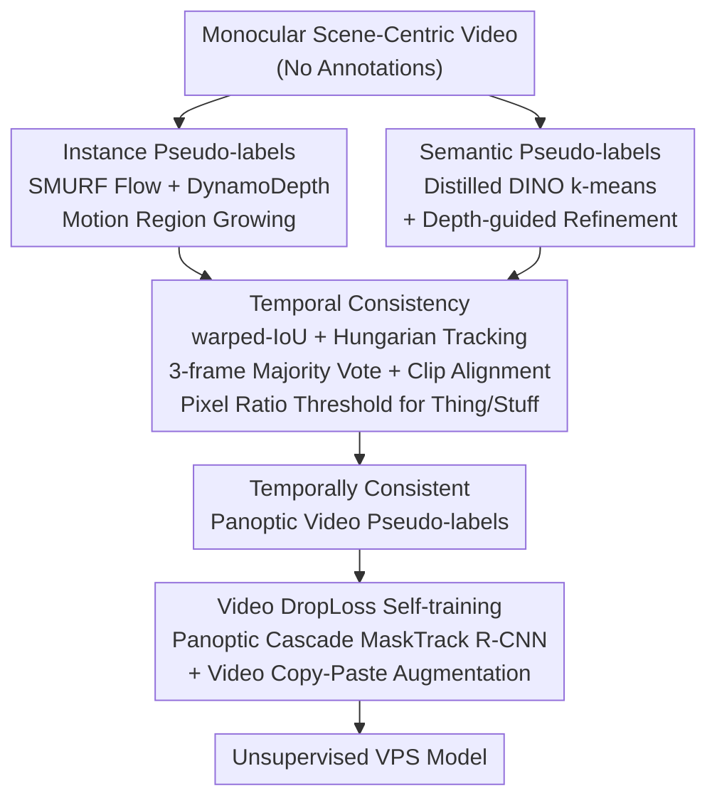

# Scene-Centric Unsupervised Video Panoptic Segmentation

**Conference**: CVPR 2026  
**arXiv**: [2606.04925](https://arxiv.org/abs/2606.04925)  
**Code**: https://github.com/visinf/videocups (Available, Project Page: https://visinf.github.io/videocups/)  
**Area**: Video Understanding / Panoptic Segmentation  
**Keywords**: Unsupervised Panoptic Segmentation, Video Panoptic Segmentation (VPS), Pseudo-labels, Self-supervised Depth and Optical Flow, Temporal Consistency

## TL;DR
This paper introduces the first **fully unsupervised Video Panoptic Segmentation (VPS)** task and proposes VideoCUPS. Starting from monocular "scene-centric" videos, the method generates **temporally consistent** panoptic pseudo-labels using self-supervised depth, motion, and visual cues. A novel **Video DropLoss** is then employed to train a VPS model on these pseudo-labels. VideoCUPS significantly outperforms four strong baselines on Cityscapes-VPS, KITTI-STEP, Waymo, and MOTS, while demonstrating robust label-efficient transfer capabilities.

## Background & Motivation

**Background**: Video Panoptic Segmentation (VPS) requires simultaneous detection, segmentation, and cross-frame tracking of all "things" (objects) while partitioning the entire video into semantically consistent "stuff" regions. Existing mainstream methods rely heavily on large-scale, human-annotated frame-by-frame panoptic labels, which are extremely costly to produce. Meanwhile, research in unsupervised scene understanding (e.g., CutLER, U2Seg, CUPS) has been largely confined to **single-image** segmentation.

**Limitations of Prior Work**: Directly applying image-level unsupervised methods frame-by-frame leads to **temporally inconsistent** results, where the same object suffers from ID switches, mask jitter, and semantic class flickering across adjacent frames. This fails to support "tracking," a core requirement of VPS. Furthermore, existing unsupervised video instance methods (e.g., VideoCutLER) only handle "things" and ignore "stuff," failing to cover the full panoptic semantic scope.

**Key Challenge**: Unsupervised signals (such as DINO feature clustering, motion grouping, and depth) are inherently **frame-wise, noisy, and agnostic to thing/stuff distinctions**. Conversely, VPS requires **temporally coherent, thing-and-stuff aligned** complete panoptic annotations. A significant gap exists between these raw signals and the structured requirements of VPS, which simple frame-wise clustering cannot bridge.

**Goal**: (1) Define the new task of unsupervised VPS and provide comparable evaluation protocols and baselines; (2) Generate a set of temporally consistent panoptic video pseudo-labels; (3) Train an accurate unsupervised VPS model using these pseudo-labels.

**Key Insight**: The authors follow the "pseudo-label + self-training" paradigm from their previous work, CUPS (Unsupervised Panoptic Image Segmentation). The key observation is that **monocular scene-centric videos naturally contain depth and motion cues**. By utilizing "motion + depth" for instance grouping, "DINO features" for semantics, and **geometry (warped-IoU) for cross-frame association**, frame-wise pseudo-labels can be stitched into temporally consistent video pseudo-labels.

**Core Idea**: Generate temporally consistent panoptic video pseudo-labels using three types of cues—self-supervised depth, optical flow, and DINO features—and then perform self-training with a Video DropLoss that is robust to pseudo-label noise, resulting in the first unsupervised VPS model.

## Method

### Overall Architecture
VideoCUPS consists of two main stages: **pseudo-label generation followed by self-training**. The input is monocular scene-centric video (e.g., autonomous driving street views) without any human annotation; the output is a VPS model capable of direct video panoptic prediction.

The pseudo-label generation follows two branches before fusion: the **instance branch** uses motion and depth-based region growing to obtain "things" masks, while the **semantic branch** employs DINO feature clustering to obtain "stuff" and semantic maps. Frame-wise results from both branches are processed by a **temporal consistency module** (tracking + smoothing + alignment + thing/stuff partitioning) to form coherent video pseudo-labels. Finally, these pseudo-labels supervise a **Panoptic Cascade MaskTrack R-CNN (DINO ResNet-50 backbone)**, trained with **Video DropLoss** and self-enhanced video copy-paste data augmentation.

### Key Designs

**1. Instance Pseudo-labels via Motion+Depth Region Growing: Extracting things using geometric cues**

The difficulty in unsupervised "things" segmentation is identifying which pixels belong to the same object without labels. VideoCUPS leverages **inherent motion and depth in monocular videos**: it uses self-supervised SMURF for optical flow and DynamoDepth for depth estimation. **Motion-based region growing** is then performed on the motion field to cluster pixels with consistent motion and continuous depth into object instances. This is based on the principle that independent foreground objects create distinct boundaries in flow and depth fields relative to the background, making geometric cues more suitable than pure appearance (which often suffers from grouping identical colored objects) for unsupervised instance separation.

**2. Semantic Pseudo-labels via DINO Clustering + Depth-guided Refinement: Supplementing stuff and categories**

The instance branch only identifies "which pixels form an object" but lacks category information and coverage for "stuff" like roads or skies. The semantic branch uses **k-means clustering on distilled DINO features** for pixel-wise semantic grouping. **Depth-guided inference** is then applied to refine the clustering; geometric priors provided by depth (e.g., coplanar surfaces, near-far layers) correct semantic misclassifications caused by DINO features at boundaries or shadows. This branch completes the semantic/stuff portions of the scene.

**3. Temporal Consistency: Stitching frame-wise pseudo-labels into coherent video panoptic annotations**

This is the critical transition from image-level to video-level pseudo-labels. It involves four coordinated actions: (i) **Instance Tracking**: Warping previous frame instances to the current frame via optical flow and using **warped-IoU + Hungarian matching** for cross-frame association and ID propagation; (ii) **Semantic Smoothing**: Applying a **3-frame majority vote** on semantic maps to suppress category flickering; (iii) **Semantic ↔ Instance Alignment**: Aligning instance masks with semantic categories within each clip to ensure stable semantic labels for each instance; (iv) **Thing/Stuff Partitioning**: Using a **pixel occupancy threshold** to distinguish "things" (countable objects) from "stuff" (background regions).

**4. Video DropLoss + Self-enhanced Video Copy-Paste: Robust self-training on noisy labels**

Pseudo-labels inevitably contain noise and uncovered regions. Direct cross-entropy supervision on the full image would force the model to learn these errors. The authors propose **Video DropLoss**, which **discards** loss in temporal regions that are unreliable or not covered by pseudo-labels, backpropagating gradients only in high-confidence, temporally consistent areas. This is combined with **self-enhanced video copy-paste data augmentation** (pasting reliable instances across frames to increase "things" diversity) to train a robust unsupervised VPS model.

### Loss & Training
- Architecture: Panoptic Cascade MaskTrack R-CNN with a DINO-pretrained ResNet-50 backbone.
- Supervision: Entirely derived from the generated temporally consistent panoptic video pseudo-labels.
- Key Loss: **Video DropLoss**—discards loss in noisy, uncovered, or temporally inconsistent regions.
- Data Augmentation: Self-enhanced video copy-paste.

## Key Experimental Results

**Evaluation Metrics** (STEP series, percentages):
- **STQ** (Segmentation and Tracking Quality): Combined quality of segmentation and tracking, $\mathrm{STQ}=\sqrt{\mathrm{AQ}\cdot \mathrm{SQ}}$.
- **AQ** (Association Quality): Quality of cross-frame association/tracking.
- **SQ** (Segmentation Quality): Quality of semantic segmentation.

Datasets: Cityscapes-VPS, KITTI-STEP, Waymo (In-domain); MOTS (Out-of-domain generalization).

### Main Results

| Method | Cityscapes STQ/AQ/SQ | KITTI-STEP STQ/AQ/SQ | Waymo STQ/AQ/SQ | MOTS STQ/AQ/SQ |
|------|------|------|------|------|
| DepthG + VideoCutLER | 9.9 / 3.4 / 28.2 | 13.2 / 8.7 / 20.1 | 7.9 / 2.6 / 23.9 | 14.5 / 6.8 / 30.7 |
| U2Seg + SORT | 11.4 / 5.6 / 23.0 | 24.0 / 21.1 / 27.2 | 10.4 / 4.8 / 22.6 | 14.9 / 7.2 / 30.8 |
| CUPS† + SORT (Monocular) | 17.8 / 10.6 / 29.9 | 32.9 / 35.4 / 30.5 | 16.6 / 9.3 / 29.8 | 14.9 / 7.8 / 28.3 |
| CUPS + SORT (**Used Stereo**) | 20.6 / 13.3 / 31.8 | 34.2 / 37.7 / 31.1 | 17.5 / 9.9 / 30.8 | 16.7 / 10.4 / 27.0 |
| **VideoCUPS (Ours, Monocular)** | **22.2 / 15.3 / 32.3** | **37.3 / 43.6 / 32.0** | **18.4 / 10.7 / 31.6** | **18.6 / 10.5 / 33.0** |
| _Supervised Ref. (Gray)_ | _42.0 / 27.0 / 65.3_ | _53.9 / 59.9 / 48.4_ | _22.3 / 12.6 / 39.4_ | _20.5 / 12.7 / 33.1_ |

Key Insight: VideoCUPS **outperforms all baselines across all 4 datasets and all 3 metrics**. Even when using only monocular video, it surpasses CUPS + SORT which uses **stereo video during training** (e.g., Cityscapes STQ 22.2 vs 20.6).

### Label-efficient Learning
Fine-tuning the VideoCUPS pre-trained model on Cityscapes-VPS with limited labels compared to DINO initialization:

| Label Ratio | Conclusion |
|----------|------|
| 10% | VideoCUPS fine-tuning reaches the STQ of a supervised model trained from scratch with 100% labels; it is **+4.6% STQ** higher than the DINO initialization baseline. |
| 100% | Still provides a gain of **+2.6% STQ / +2.3% AQ / +3.5% SQ** over DINO initialization. |

### Ablation Study

| Configuration | Impact | Description |
|------|---------|------|
| Full model | Optimal | Complete VideoCUPS |
| w/o Temporal Consistency | Significant drop in STQ/AQ | Reverts to frame-wise labels; severe ID switches |
| w/o Video DropLoss | Drop in all metrics | Model is biased by pseudo-label noise |
| w/o Depth-guided Refinement | Drop in SQ | Degraded semantic boundaries |
| w/o Video Copy-Paste | Drop in thing metrics | Insufficient object diversity |

### Key Findings
- **Geometric cues (depth + motion) are critical for unsupervised things segmentation**: Monocular signals successfully capture object boundaries, matching or exceeding stereo-based methods.
- **Temporal consistency determines VPS success**: Frame-wise unsupervised methods coupled with external trackers (e.g., SORT) perform poorly in AQ (3.4 / 5.6), while the integrated stitching strategy of VideoCUPS raises AQ significantly.
- **Strong Transfer Pre-training**: Reaching 100%-label performance with only 10% labels suggests that unsupervised pseudo-label self-training effectively learns transferable video structural priors.

## Highlights & Insights
- **First to define the unsupervised VPS task**: The work establishes the benchmark ecosystem (protocol + 4 baselines + method) for future research.
- **Monocular capability outperforming stereo**: By systematically organizing self-supervised depth, motion, and DINO cues into independent branches and stitching them, the method surpasses previous stereo-reliant work.
- **Universal utility of Video DropLoss**: Learning only from reliable regions while discarding noisy ones is a robust strategy for dense unsupervised/weakly supervised prediction tasks.

## Limitations & Future Work
- **Dependency on self-supervised depth/flow quality**: The instance branch relies on SMURF and DynamoDepth; failures in low-texture, lighting-variable, or non-rigid motion scenarios will degrade region growing results.
- **Targeted at scene-centric videos**: The methodology assumes street-view-like scenes with distinct self-motion or object motion; it may not generalize to object-centric or static videos with limited cues.
- **Gap with supervised upper bounds**: Significant room for improvement remains in semantic quality (SQ), which remains a bottleneck in unsupervised learning.

## Related Work & Insights
- **vs. CUPS (Predecessor)**: CUPS is for single images and uses stereo cues. This work extends to video using monocular input and temporal consistency, outperforming stereo-based CUPS.
- **vs. VideoCutLER / DepthG**: These focus on unsupervised video **instance** segmentation (things only). VideoCUPS provides a full panoptic (things+stuff) solution with superior temporal association.
- **vs. U2Seg + SORT**: U2Seg is frame-wise; VideoCUPS embeds temporal consistency directly into the pseudo-label generation and training phases, leading to much higher association quality.

## Rating
- Novelty: ⭐⭐⭐⭐⭐ 
- Experimental Thoroughness: ⭐⭐⭐⭐☆ 
- Writing Quality: ⭐⭐⭐⭐☆ 
- Value: ⭐⭐⭐⭐⭐ 

<!-- RELATED:START -->

## Related Papers

- [\[CVPR 2026\] SAM2Text: Towards Prompt-Free and Multi-Resolution Video Scene Text Segmentation](sam2text_towards_prompt-free_and_multi-resolution_video_scene_text_segmentation.md)
- [\[ICLR 2026\] Video Scene Segmentation with Genre and Duration Signals](../../ICLR2026/video_understanding/video_scene_segmentation_with_genre_and_duration_signals.md)
- [\[CVPR 2026\] Bootstrapping Video Semantic Segmentation Model via Distillation-assisted Test-Time Adaptation](bootstrapping_video_semantic_segmentation_model_via_distillation-assisted_test-t.md)
- [\[CVPR 2026\] Long-RVOS: A Comprehensive Benchmark for Long-term Referring Video Object Segmentation](long-rvos_a_comprehensive_benchmark_for_long-term_referring_video_object_segment.md)
- [\[ICLR 2026\] From Vicious to Virtuous Cycles: Synergistic Representation Learning for Unsupervised Video Object-Centric Learning](../../ICLR2026/video_understanding/from_vicious_to_virtuous_cycles_synergistic_representation_learning_for_unsuperv.md)

<!-- RELATED:END -->
