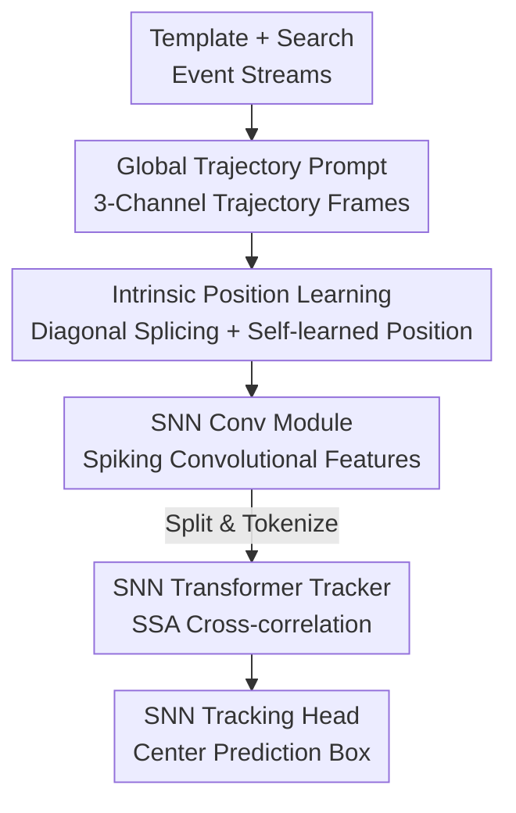

# SDTrack: A Baseline for Event-based Tracking via Spiking Neural Networks

**Conference**: CVPR 2026  
**Paper**: [CVF Open Access](https://openaccess.thecvf.com/content/CVPR2026/html/Shan_SDTrack_A_Baseline_for_Event-based_Tracking_via_Spiking_Neural_Networks_CVPR_2026_paper.html)  
**Code**: https://github.com/YmShan/SDTrack  
**Area**: Video Understanding  
**Keywords**: Event Camera, Single Object Tracking, Spiking Neural Networks, Spike-driven Transformer, Event Aggregation

## TL;DR
This paper proposes SDTrack, the first fully Spiking Neural Network (SNN) based Transformer pipeline for event tracking. By utilizing Global Trajectory Prompt (GTP), asynchronous event streams are aggregated into 3-channel event frames rich in trajectory information. A full spike-driven SNN Transformer tracker, featuring Intrinsic Position Learning (IPL), predicts target boxes end-to-end. SDTrack achieves competitive or SOTA accuracy on three event-tracking benchmarks with minimal parameters and energy consumption (Tiny version: 19.61M / 8.16mJ).

## Background & Motivation
**Background**: Event cameras offer microsecond-level temporal resolution, 140dB dynamic range, and low-power sparse output, making them advantageous for tracking in scenarios where RGB cameras fail, such as low light, overexposure, or high-speed motion. Current mainstream methods slice asynchronous event streams into equal-duration sub-streams, aggregate them into synchronous "event frames," and feed them into Transformer trackers designed for conventional cameras. SNNs, which use 0/1 binary spikes for activation and replace Multiplication-and-Accumulation (MAC) with low-power Accumulation (AC), naturally align with the sparsity of event data.

**Limitations of Prior Work**: ① Existing event aggregation methods suffer from significant information loss. Event Frames only record the "last" polarity per pixel, losing preceding motion information when multiple direction changes occur. Time-Surface and Event Count lack robust trajectory information. Methods by Zhu/Wang use four channels to record polarity change times, but these are incompatible with pre-trained weights designed for 3-channel inputs, limiting transfer learning. ② Existing SNN trackers (e.g., STNet, SNNTrack) are mostly hybrid ANN+SNN architectures, failing to fully exploit SNN energy efficiency, and lack cross-correlation modeling between template and search regions, which restricts tracking performance.

**Key Challenge**: To simultaneously achieve strong event frame representation (preserving spatio-temporal trajectories), compatibility with visual pre-training (3-channel alignment), and full spike-driven execution (avoiding degradation into hybrid architectures).

**Goal**: Address two sub-problems: (a) Design an event aggregation method that preserves global trajectories while aligning with 3-channel pre-training formats; (b) Design a pure SNN tracker with self-attention cross-correlation.

**Key Insight**: The authors observed that 3-channel event frames maximize the reuse of ImageNet pre-training. Thus, they placed "positive/negative polarity accumulation" in the first two channels and "global trajectory" in the third. Furthermore, they found that joint positional encoding of template-search frames combined with residual convolution blocks before the Transformer allows the network to learn positional information autonomously, eliminating the need for explicit positional encoding.

**Core Idea**: Replace lossy aggregation and hybrid architectures with "3-channel Trajectory Event Frames (GTP) + Full Spiking Transformer Tracker (IPL self-learned position)" to create the first end-to-end, pure SNN event tracking baseline without data augmentation or post-processing.

## Method

### Overall Architecture
The SDTrack pipeline receives template and search event streams. First, **GTP** aggregates them into 3-channel event frames (Template: 3×128×128, Search: 3×256×256). **IPL** then splices these two frames along the diagonal into a unified matrix (with zero-filling for off-diagonal blocks), which is fed into the **SNN Conv Module** for shallow feature extraction. The matrix is then split back into template/search components, tokenized, and passed to the **SNN Transformer Module** for template-search cross-correlation using Spiking Self-Attention (SSA). Finally, the **SNN Tracking Head** (center-point head) outputs the target's center position and scale. The entire pipeline is full spike-driven and end-to-end. During inference, it uses no dynamic template updates or post-processing like Hanning window penalties.

### Key Designs

**1. GTP (Global Trajectory Prompt): Preserving Full Motion and Global Trajectories in 3-Channel Frames**

To address the loss of motion info in standard Event Frames and the incompatibility of 4-channel representations with pre-trained models, GTP designs a 3-channel frame. The first two channels accumulate the number of positive and negative polarities for each pixel within a time window $L$:  
$h^1_i(x,y)=\alpha\sum_{t_k\in L}\delta(x-x_k,y-y_k)\,\delta(p_k-1)$  
$h^2_i(x,y)=\alpha\sum_{t_k\in L}\delta(x-x_k,y-y_k)\,\delta(p_k+1)$  
where $\alpha$ is a coefficient that preserves information while suppressing noise. Unlike "last-polarity" methods, accumulation retains information about back-and-forth movement.

The third channel records the global trajectory, inheriting from the previous frame with temporal decay and adding "newly activated" pixels:
$$h^3_i(x,y)=h^3_{i-1}(x,y)\cdot\beta+\alpha\sum_{j=1}^{2}C\big(h^j_{i-1}(x,y),\,h^j_i(x,y)\big)$$
where $C(h^j_{i-1},h^j_i)=\mathbb{I}(h^j_{i-1}=0 \text{ and } h^j_i\neq0)$ triggers only for new motion. $\beta$ is a decay factor, and $h^3_0$ is initialized to zero. This channel acts as a "tail trajectory," providing position and shape cues. This format is inherently compatible with standard vision networks.

**2. IPL (Intrinsic Position Learning): Learning Position without Parameters**

To solve the sensitivity of event tracking to position while avoiding noise introduced by explicit positional encoding, IPL uses no extra encoding. Instead, it splices the template frame $Z\in(T,C,H_z,W_z)$ and search frame $X\in(T,C,H_x,W_x)$ diagonally:
$$\mathrm{IPL}(X,Z)=\begin{bmatrix} X & O_1 \\ O_2 & Z \end{bmatrix},\quad U\in(T,C,H_z+H_x,W_z+W_x)$$
This "diagonal splicing + residual convolution" allows the network to implicitly encode relative positions within the convolutional receptive field. Because SNNs are spike-driven, the zero-padding adds almost no computational overhead. Ablations show that removing IPL (using Siamese inputs) drops PR by 2.04%, and adding learnable/sine encoding actually decreases performance.

**3. Full Spiking Transformer Tracker: SNN Conv + SSA + Center Head**

The entire tracker is spike-driven. The backbone consists of **SNN Conv Blocks** (residual structures with spiking separable convolutions) and **SNN Transformer Blocks** using Spiking Self-Attention (SSA). SSA maps tokens to spiked $Q_s, K_s, V_s$ and performs cross-correlation via $\mathrm{SSA}(Q_s,K_s,V_s)=Q_s K_s^{\top}V_s * s$. The head is an SNN center-point prediction head, which proved superior to corner-point heads in experiments.

### Loss & Training
The backbone is pre-trained on ImageNet-1K and fine-tuned on event datasets using pair matching. No data augmentation is used. The total loss combines weighted focal loss for classification and L1 + Generalized IoU for regression:
$$\mathcal{L}=\mathcal{L}_{cls}+\lambda_{iou}\mathcal{L}_{iou}+\lambda_{L1}\mathcal{L}_{L1}$$
where $\lambda_{iou}=2$ and $\lambda_{L1}=5$. Inference follows standard SOT procedures using the first frame as the template.

## Key Experimental Results

### Main Results
Comparison on FE108, FELT, and VisEvent benchmarks. Energy consumption was measured on VisEvent.

| Method | Params (M) | Neuron | Energy (mJ) | FE108 AUC | FELT AUC | VisEvent AUC | VisEvent PR |
|------|---------|--------|----------|-----------|----------|--------------|-------------|
| OSTrack256 | 92.52 | ANN | 98.90 | 54.6 | 35.9 | 32.7 | 46.4 |
| HiT-B | 42.22 | ANN | 19.78 | 55.9 | 38.5 | 34.6 | 47.6 |
| STNet | 20.55 | LIF | 103.53 | – | – | 35.0 | 50.3 |
| SNNTrack | 31.40 | BA-LIF | 8.25 | – | – | 35.4 | 50.4 |
| **SDTrack-Tiny** | **19.61** | I-LIF | **8.16** | 59.0 | 39.3 | 35.6 | 49.2 |
| **SDTrack-Base** | 107.26 | I-LIF | 30.52 | **59.9** | **40.0** | **37.4** | **51.5** |

- SDTrack-Tiny achieves SOTA AUC/PR (+1.6%/+2.0% on FE108) with the lowest parameters and energy.
- Compared to HiT-B (lightweight ANN), SDTrack-Tiny uses less than half the parameters and energy while outperforming it.

### Ablation Study
SDTrack-Tiny on FE108:

| # | Configuration | AUC(%) | PR(%) | Description |
|---|------|--------|-------|------|
| 1 | SDTrack-Tiny (Full) | 59.00 | 91.30 | Baseline |
| 2 | w/o IPL (Siamese) | 58.10 | 89.66 | PR drops 2.04% |
| 3 | + Learnable Pos. Enc. | 58.79 | 89.52 | Drops (Noise) |
| 4 | + Sine Pos. Enc. | 58.57 | 90.77 | Drops |
| 7 | Overlap Size 0→128 | 43.91 | 73.34 | Severe breakdown |
| 9 | No Pre-training | 47.80 | 74.50 | Essential |

### Key Findings
- **GTP is a Universal Plugin**: Adding GTP to mainstream trackers (STARK, OSTrack, etc.) significantly improves their performance on event data, suggesting that insufficient temporal information in traditional aggregation is a major bottleneck.
- **Position Learning**: Explicit positional encoding introduces noise; implicit learning through diagonal splicing (IPL) is superior.
- **Pre-training Value**: Without ImageNet pre-training, AUC drops from 59.0 to 47.80, validating the 3-channel design.
- **Efficiency**: SDTrack-Tiny consumes only 8.16mJ, comparable to SNNTrack but with higher accuracy, and far below ANN trackers like OSTrack (98.90mJ).

## Highlights & Insights
- **The third channel for "Global Trajectory" is ingenious**: It preserves spatio-temporal dynamics while aligning with 3-channel pre-training formats, solving the trade-off between information retention and transfer learning.
- **IPL provides "structure as prior"**: Splicing template and search frames allows the network to learn relative positions with zero additional parameters, a method that could benefit other position-sensitive SNN tasks.
- **Pure SNN feasibility**: This work proves that full-spike architectures no longer need ANN components to achieve high performance in tracking tasks.

## Limitations & Future Work
- The authors have not yet explored multi-modal SNN tracking (Event + RGB).
- Energy consumption is a theoretical estimate ($E_{MAC}=4.6$pJ, $E_{AC}=0.9$pJ) rather than real-chip measurement ⚠️.
- The Tiny version remains relatively weak on long-sequence benchmarks like FELT.
- Hyperparameter sensitivity for GTP ($\alpha, \beta$) across diverse datasets requires further discussion.

## Related Work & Insights
- **vs. Traditional Aggregation**: GTP preserves more info than Event Frame/Time-Surface and is more compatible than 4-channel time-based methods.
- **vs. Hybrid SNN Trackers**: Unlike STNet or SNNTrack, SDTrack is fully spike-driven and utilizes spiking self-attention for cross-correlation.
- **vs. ANN Trackers**: SDTrack addresses the high energy consumption and lack of temporal awareness of ANN trackers on event data.

## Rating
- Novelty: ⭐⭐⭐⭐⭐ (Full SNN Transformer + GTP/IPL designs)
- Experimental Thoroughness: ⭐⭐⭐⭐ (Universal plugin tests + ablations, though energy is theoretical)
- Writing Quality: ⭐⭐⭐⭐ (Clear motivation and trade-off analysis)
- Value: ⭐⭐⭐⭐⭐ (Establishes a strong efficiency/accuracy baseline)

<!-- RELATED:START -->

## Related Papers

- [\[CVPR 2026\] SpikeTrack: High-performance and Energy-efficient Event-Based Object Tracking with Spiking Neural Network](spiketrack_high-performance_and_energy-efficient_event-based_object_tracking_wit.md)
- [\[CVPR 2026\] Event6D: Event-based Novel Object 6D Pose Tracking](event6d_event-based_novel_object_6d_pose_tracking.md)
- [\[CVPR 2026\] Tracking through Severe Occlusion via Event-Derived Transient Cues](tracking_through_severe_occlusion_via_event-derived_transient_cues.md)
- [\[CVPR 2026\] MER-Tracker: Towards High-Speed 3D Point Tracking via Multi-View Event-RGB Hybrid Cameras](mer-tracker_towards_high-speed_3d_point_tracking_via_multi-view_event-rgb_hybrid.md)
- [\[CVPR 2026\] Seeing Motion Through Polarity for Event-based Action Recognition](seeing_motion_through_polarity_for_event-based_action_recognition.md)

<!-- RELATED:END -->
