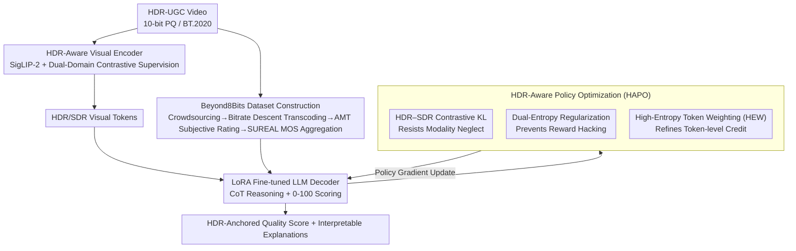

# Seeing Beyond 8bits: Subjective and Objective Quality Assessment of HDR-UGC Videos

**Conference**: CVPR 2026  
**Paper**: [CVF Open Access](https://openaccess.thecvf.com/content/CVPR2026/html/Saini_Seeing_Beyond_8bits_Subjective_and_Objective_Quality_Assessment_of_HDR-UGC_CVPR_2026_paper.html)  
**Code**: [Project Page](https://shreshthsaini.github.io/Beynod8Bits) (Project page only, no code repository found yet)  
**Area**: Video Understanding / Video Quality Assessment  
**Keywords**: HDR-UGC, Video Quality Assessment (VQA), Multimodal Large Language Models, Reinforcement Learning Fine-Tuning, GRPO

## TL;DR
For the rapidly growing yet neglected High Dynamic Range User-Generated Content (HDR-UGC) videos, which are overlooked by existing SDR quality assessment models, the authors build the largest crowdsourced subjective quality dataset to date, Beyond8Bits (~44k videos, 1.5M+ human ratings). They propose HDR-Q, the first multimodal large language model (MLLM) quality evaluator for HDR-UGC. Equipped with an "HDR-aware visual encoder" and a reinforcement learning fine-tuning framework named HAPO (which augments GRPO with HDR-SDR contrastive KL, dual-entropy regularization, and high-entropy token weighting), HDR-Q anchors its reasoning firmly on HDR cues. It achieves state-of-the-art (SOTA) performance across three datasets, pushing PLCC/SRCC to 0.91/0.92.

## Background & Motivation
**Background**: Driven by higher bit-depths, wider color gamuts, and larger luminance ranges, HDR videos are proliferating on platforms like YouTube, TikTok, and Instagram. However, the vast majority of perceptual video quality assessment (VQA) systems are still designed for Standard Dynamic Range (SDR).

**Limitations of Prior Work**: The high bit-depth of HDR exposes distortions that are imperceptible in SDR, such as near-black crushing, highlight clipping, banding, and exposure flicker, which are further exacerbated when combined with UGC shooting and compression artifacts. Models trained on professional HDR data or SDR-UGC fail to generalize to real-world HDR-UGC shot under heterogeneous conditions. Meanwhile, existing subjective HDR datasets are small, dominated by synthetic distortions or professional content (e.g., LIVE-HDR contains only 310 videos, and SFV+HDR has only 300 annotated videos), and lack large-scale real-world annotations.

**Key Challenge**: First, there is a lack of sufficiently large and realistic HDR-UGC subjective datasets to train models aligned with human perception. Second, even when using modern powerful Multimodal Large Language Models (MLLMs) for interpretable quality assessment, three major hurdles exist: ① Standard visual encoders are pre-trained on SDR and fail to capture HDR-specific cues; ② Under the next-token prediction paradigm, it is difficult to output finely calibrated continuous Mean Opinion Scores (MOS), as both discrete rating scales and regression heads lack granularity; ③ Without explicit encouragement, policies tend to ignore visual inputs and exhibit "modality neglect," relying instead on text priors.

**Goal**: First, bridge the data gap by building a realistic, large-scale HDR-UGC subjective database. Second, construct an MLLM quality evaluator capable of truly "perceiving" HDR.

**Key Insight**: The capacity for HDR perception is decoupled into two components: at the representation level, making the encoder sensitive to extreme luminance and color gamut fidelity; and at the reasoning level, utilizing reinforcement learning to force the policy to depend on HDR tokens rather than text shortcuts.

**Core Idea**: Replace the "general SDR encoder + naive GRPO" paradigm with an "HDR-aware visual encoder + HDR-anchored RL fine-tuning (HAPO)" framework, simultaneously forcing the model at both representation and optimization ends to base its quality judgments on HDR evidence.

## Method

### Overall Architecture
HDR-Q is built on Ovis2.5. The entire pipeline comprises two complementary branches: the **perception branch** utilizes an HDR-adapted visual encoder to encode 10-bit PQ HDR frames (and their deterministic tone-mapped SDR counterparts) into HDR-sensitive visual tokens; the **reasoning branch** employs a LoRA-fine-tuned language decoder to generate a Chain-of-Thought (CoT) explanation and output a 0–100 quality score based on these tokens. The optimization core is HAPO (HDR-Aware Policy Optimization), which augments the GRPO framework with three HDR-specific mechanisms to force the model to base its reasoning on HDR visual cues, followed by Gaussian regression rewards for fine-grained MOS calibration. The foundational dataset is the Beyond8Bits database. Note: The SDR branch is processed as an auxiliary forward pass only during training for comparison, while inference only executes the single-path HDR decoding, incurring no additional deployment overhead.

### Key Designs

**1. Beyond8Bits: The First Large-Scale Real-World HDR-UGC Crowdsourced Subjective Database**

Existing HDR datasets are either too small or dominated by synthetic distortions / professional content, preventing models from learning real-world heterogeneous UGC degradations. The authors gathered 6,861 unique HDR source videos from two pathways: 2,253 videos captured with informed consent by users using consumer-grade devices (e.g., iPhone, Pixel, Galaxy), and 4,608 CC-licensed videos from Vimeo, covering human subjects, nature, night scenes, etc., with cross-device variations. Every video was validated for HDR metadata (PQ transfer functions, 10-bit HEVC, BT.2020 color gamut), cropped to a maximum of 10 seconds, and transcoded across a bitrate gradient (1080p–360p, 0.2–5 Mbps) simulating real-world streaming, preserving complete HDR signaling, yielding 44,276 videos. The subjective study was conducted on Amazon Mechanical Turk, **restricted to devices/browsers that passed HDR display capability verification**, using a continuous 0–100 Likert scale following ITU-R BT.500-14. Consistency checks were performed using hidden duplicate and "gold standard" videos, yielding over 1.5 million valid ratings with an average of ~35 unique ratings per video. MOS aggregation was done via the SUREAL framework, which models individual ratings as $S_{ij}=\psi_j+\Delta_i+\nu_i X,\; X\sim\mathcal{N}(0,1)$, explicitly separating rater bias $\Delta_i$ and inconsistency $\nu_i$ to estimate the true score $\psi_j$ via maximum likelihood. The resulting inter-rater median SRCC was 0.90, confirming reliability. This dataset is a prerequisite for models to learn authentic HDR perception.

**2. HDR-Aware Visual Encoder: Dual-Domain Contrastive Supervision to Avoid HDR/SDR Representation Collapse**

General-purpose visual encoders are pre-trained on SDR and fail to distinguish extreme luminance values and color gamut differences when fed with HDR frames. The authors adopt SigLIP-2 as the backbone $\mathcal{E}_\psi$, **retaining full-precision 10-bit HDR signals without tone mapping**, thereby safeguarding near-black structures, highlight dynamics, and wide-gamut relationships. Concurrently, a deterministic tone-mapping operator $TM(\cdot)$ (PQ-to-$\gamma$ mapping, quantization, and BT.709 downscaling) is used to generate SDR reference frames $v_{SDR}$. Qwen2.5-VL-72B is utilized to generate captions for the HDR frames as alignment supervision. A key hurdle is that the same generic caption "holds true" for both HDR and SDR frames; directly aligning both would cause their embeddings to collapse together. To address this, **dual-domain contrastive supervision** is introduced, forcing the HDR embedding to be closer to its caption than the SDR embedding:

$$\mathcal{L}_{\text{contrast}}=\max\!\Big(0,\;\delta-D\big(\mathcal{E}_\psi(x_t),\mathcal{E}_\psi(c_t)\big)+D\big(\mathcal{E}_\psi(x^{SDR}_t),\mathcal{E}_\psi(c_t)\big)\Big)$$

where $D$ is the cosine distance and $\delta$ is the margin. The total encoder loss $\mathcal{L}_{\text{enc}}=\mathcal{L}_{\text{Sigmoid}}(x_t,c_t)+\lambda_{\text{ctr}}\mathcal{L}_{\text{contrast}}$ simultaneously preserves semantic alignment and HDR discriminative power, ensuring the embeddings are sensitive to both semantic content and HDR contrast/luminance cues.

**3. HDR–SDR Contrastive KL: Information-Theoretic Prevention of "Modality Neglect"**

Naive GRPO only ensures training stability but does not guarantee that the policy truly utilizes visual inputs. In visually heavy perceptual tasks like HDR-UGC VQA, the policy can easily rely on linguistic priors to output coherent answers while disregarding HDR evidence. The first technique in HAPO is to contrast two rollouts: one with full input (text + SDR + HDR tokens, denoted as $\pi_\theta^{HDR}$), and one with HDR tokens masked out (text + SDR, denoted as $\pi_\theta^{SDR}$), and **maximize the KL divergence between them**:

$$\mathcal{K}_{\text{HDR}}(\theta)=D_{\text{KL}}\big(\pi_\theta^{HDR}\,\|\,\pi_\theta^{SDR}\big)$$

The intuition is simple: if removing HDR tokens significantly perturbs the decoding distribution, it indicates the model indeed leverages HDR information rather than defaulting to SDR reasoning. The authors also use variational mutual-information upper bounds to prove that $\mathbb{E}[\mathcal{K}_{\text{HDR}}]$ lower-bounds the conditional mutual information $I_\theta(o;v,v_{SDR}\mid v_{SDR})$ (minus a mismatch term $\kappa_\theta$), demonstrably improving the output's reliance on HDR inputs.

**4. Dual-Entropy Regularization + High-Entropy Token Weighting (HEW): Preventing Reward Hacking and Focusing Gradients on Key Reasoning Steps**

Simply maximizing contrastive KL can lead to an "entropy explosion" trap, where the policy satisfies the objective by outputting highly uncertain, random answers. To counteract this, HAPO adds token-level entropy regularization to both HDR and SDR paths: $\mathcal{H}_{\text{dual}}=\mathbb{E}\frac{1}{K}\sum_{i,t}[\eta_1\mathcal{H}(\pi_\theta^{HDR})+\eta_2\mathcal{H}(\pi_\theta^{SDR})]$, preventing representation collapse while maintaining sharp, HDR-anchored distributions. Furthermore, GRPO assigns the same normalized advantage $\hat{A}_i$ to all tokens in a response, ignoring granularity in token-level information. In HDR VQA, **high-entropy tokens often correspond to critical steps where the model identifies and calibrates HDR distortions** (e.g., banding, highlight clipping, near-black compression). Incorporating this insight, HEW recalibrates the group-normalized advantage into token-specific advantages:

$$w_{i,t}=\mathrm{clip}\!\Big(1+\lambda_{\text{HEW}}\frac{H_{i,t}}{\frac{1}{|o_i|}\sum_{t'}H_{i,t'}},w_{\min},w_{\max}\Big),\quad \tilde{A}_{i,t}=w_{i,t}\cdot\hat{A}_i$$

where $H_{i,t}$ is the token entropy. This scaling concentrates the learning signals on the most informative reasoning steps, resulting in stronger HDR anchoring and more accurate MOS.

### Loss & Training
The complete HAPO objective modifies the GRPO clipped surrogate objective by replacing the standard advantage with token-weighted $\tilde{A}_{i,t}$, augmented with three auxiliary terms: a penalty on the reference policy KL $\beta D_{\text{KL}}(\pi_\theta^{HDR}\|\pi_{\text{ref}})$ for stability, a bonus on the contrastive KL $\gamma\mathcal{K}_{\text{HDR}}(\theta)$ for HDR anchoring, and a dual-entropy penalty $\mathcal{H}_{\text{dual}}(\theta)$ to prevent entropy explosion. The reward is a weighted combination of three sources: $\mathcal{R}_i=w_{\text{fmt}}R_{\text{fmt}}+w_{\text{sc}}R_{\text{sc}}+w_{\text{self}}R_{\text{self}}$ (format reward, **Gaussian-weighted regression reward** with $\sigma=3,\alpha=1$ for fine-grained MOS alignment, and within-group self-consistency reward). Training contains two phases: Stage 1 (Modality Alignment) trains the projection layer and aligns HDR tokens using a short HAPO pass; Stage 2 (Full-SFT/HAPO) runs complete HAPO on the full HDR-UGC corpus. Implementation details: Ovis2.5 + rank-4 LoRA, $T=8$ frames uniformly sampled per video, native 10-bit PQ inputs without decimation, group size $K=8$, $\epsilon=0.1$, $\beta=0.02$, $\gamma=0.5$, $\eta_1/\eta_2=0.01/0.05$, $\lambda_{\text{HEW}}=0.3$ ($w_{\min}/w_{\max}=0.5/2.0$), AdamW, lr $1\times10^{-5}$, executed on 4×H200 GPUs.

## Key Experimental Results

### Main Results
On the Beyond8Bits test set, HDR-Q comprehensively outperforms SDR, HDR, and MLLM baselines, notably reducing RMSE (bold denotes the best performance):

| Dataset | Metric | HDR-Q (Ours) | Prev. SOTA | Gain |
|--------|------|------|----------|------|
| Beyond8Bits | SRCC ↑ | **0.9206** | HIDRO-VQA 0.8508 | +0.070 |
| Beyond8Bits | PLCC ↑ | **0.9118** | HIDRO-VQA 0.8784 | +0.033 |
| Beyond8Bits | RMSE ↓ | **5.1594** | HIDRO-VQA 6.0875 | -0.93 |
| Beyond8Bits | KRCC ↑ | **0.7218** | HIDRO-VQA 0.6694 | +0.052 |

Additionally, zero-shot transfer (without retraining) on cross-datasets demonstrates high correlation and low error, showing that the representations learned via HDR-aware encoding and HAPO generalize well across HDR UGC/PGC domains:

| Dataset | Metric | HDR-Q (Ours) | Prev. SOTA |
|--------|------|------|----------|
| LIVE-HDR | SROCC ↑ | **0.9081** | HIDRO-VQA 0.8793 |
| LIVE-HDR | RMSE ↓ | **7.6031** | HDR-ChipQA 9.8038 |
| SFV+HDR | SROCC ↑ | **0.7251** | FastVQA 0.7130 |
| SFV+HDR | PLCC ↑ | **0.7502** | HIDRO-VQA 0.7320 |

Notably, vanilla MLLMs (Qwen2.5-VL, Ovis2.5, etc.) obtain a low SRCC of 0.26–0.35, making them nearly unusable. HDR-Q (SDR) (excluding the HDR pipeline under the same framework) achieves an SRCC of 0.8914, which further shoots up to 0.9206 when HDR cues are incorporated, reinforcing the value of HDR-specific features.

### Ablation Study (Beyond8Bits)

| Configuration | PLCC | SRCC | RMSE | CoT Length | Token Entropy | Description |
|------|------|------|------|---------|---------|------|
| GRPO baseline | 0.79 | 0.81 | 10.73 | 168 | 0.20 | No additions |
| + HDR-Enc. | 0.81 | 0.83 | 8.96 | 161 | 0.24 | HDR Encoder only |
| HAPO w/o HDR-SDR KL | 0.84 | 0.86 | 7.10 | 142 | 0.29 | No contrastive KL (relapse of modality neglect) |
| HAPO w/o Dual Ent. | 0.89 | 0.91 | 5.82 | 148 | 0.26 | No dual entropy (unstable, lengthy reasoning) |
| HAPO w/o HEW | 0.87 | 0.88 | 6.11 | 155 | 0.27 | No HEW (suboptimal credit assignment) |
| HAPO w/o Self-Reward | 0.90 | 0.92 | 5.22 | 140 | 0.31 | No self-consistency reward (reduced stability on noisy samples) |
| **HDR-Q (Full)** | **0.91** | **0.92** | **5.15** | **137** | **0.33** | Full Model |

### Key Findings
- **HDR visual encoder and contrastive KL are key pillars**: Excluding HDR fine-tuning causes a substantial drop in SRCC (signaling the indispensability of 10-bit cues). Removing the HDR-SDR KL causes the RMSE to jump from 5.15 back to 7.10, showing that "modality neglect" easily resurfaces.
- **HAPO yields more concise and precise reasoning**: Over the course of training, CoT length decreases from 168 to 137 tokens, while token entropy increases to 0.33, demonstrating that the model learns to provide concise evidence-based answers rather than generating generic, repetitive templated phrases.
- **Efficient execution**: HAPO only incurs a single auxiliary SDR forward pass during training; during inference, it decodes via a single HDR line, maintaining throughput comparable to standard MLLMs.

## Highlights & Insights
- **Formulating modality neglect as an optimizable objective**: Utilizing the HDR-SDR contrastive KL to explicitly force the model to rely on HDR tokens, alongside a variational mutual-information upper-bound proof connecting the KL divergence to output dependence on HDR input. This paradigm—contrasting masked modalities + information-theoretic validation—can be directly generalized to any multimodal RL tasks suffering from shortcut learning.
- **HEW captures the essence of perceptual tasks**: Key diagnostic decisions regarding HDR artifacts tend to occur at high-entropy tokens. Weighting RL gradients by token entropy successfully channels optimization capacity into critical steps that actually require "reasoning." This holds immense promise for other fine-grained perceptual reinforcement learning scenarios (RLHF).
- **Double-domain alignment with full-precision 10-bit HDR + SDR reference**: A highly practical design that retains 10-bit dynamics while utilizing SDR as negative samples to generate alignment pressure, tackling the silent but critical "representation collapse" of HDR and SDR embeddings induced by general captions.
- **Rigorous data engineering**: By filtering crowdsourced annotators to include only those on verified HDR devices and leveraging gold-standard/repetition checks, crowdsourced label noise is effectively suppressed, securing a high median inter-rater SRCC of 0.90.

## Limitations & Future Work
- **Dependence on a deterministic tone-mapping operator for the SDR reference**: Both the contrastive supervision and contrastive KL are tied to a fixed $TM(\cdot)$ operator. If the tone-mapping operator is suboptimally configured, bias in the SDR counterpart might bleed into the HDR anchoring signal; the sensitivity towards tone-mapping configurations is not thoroughly investigated.
- **Under-sampling (8 frames per video)**: Dynamic temporal distortions (e.g., exposure flicker, which are key characteristics of HDR-UGC) are heavily downsampled. Sparse sampling may impair the detection of transient temporal artifacts; robustness on long-form videos or high-motion scenes has not been fully verified.
- **Code and Weights are not yet public** (only project page linked). Several hyper-parameters ($\gamma, \eta, \lambda_{\text{HEW}}$) require local validation tuning, presenting a non-trivial replication barrier.
- Performance metrics are relatively low on SFV+HDR for all methods. Because the task complexity differs across datasets (e.g., LIVE-HDR vs. SFV+HDR), absolute performance marks should not be compared directly.

## Related Work & Insights
- **vs. HIDRO-VQA / HDR-ChipQA** (blind HDR-VQA): These methods rely on non-linear luminance mapping or large-scale unlabeled HDR data to scale up ChipQA/CONTRIQUE via pure regression-based scoring. This work introduces an MLLM-based scheme that provides both quality scores and HDR-grounded natural language explanations, outperforming them by ~0.07 in SRCC on Beyond8Bits.
- **vs. Q-Align / DeQA / Visual-Quality-R1** (SDR-based MLLM VQA): Developed primarily for SDR, these methods suffer from severe performance drop-offs when migrating to HDR-UGC (SRCC drops to ~0.4). This work circumvents this failure by utilizing an HDR-aware visual encoder (preserving 10-bit) and HAPO optimization to address HDR characteristics specifically.
- **vs. Vanilla GRPO**: While standard GRPO secures training stability, it treats all tokens uniformly and does not prevent visual modality neglect. HAPO transforms it into a perception-specialized version by coupling it with contrastive KL (preventing modality neglect), dual entropy (preventing reward hacking), and HEW (token-level credit assignments).

## Rating
- **Novelty**: ⭐⭐⭐⭐⭐ The first HDR-UGC MLLM quality evaluator alongside the largest crowdsourced subjective HDR-UGC dataset. The contrastive KL and HEW within HAPO represent highly unique designs.
- **Experimental Thoroughness**: ⭐⭐⭐⭐⭐ Includes main experiments across three datasets, zero-shot transfer, detailed ablation studies, and analysis of model decoding dynamics.
- **Writing Quality**: ⭐⭐⭐⭐ The connection between motivation, mechanism, and mathematical proof is highly cohesive, though the equations are dense and some hyperparameter details are scattered throughout.
- **Value**: ⭐⭐⭐⭐⭐ Tri-fold contribution spanning dataset, model architecture, and optimization paradigm; stands out as a foundational work in the nascent field of HDR-UGC evaluation.

<!-- RELATED:START -->

## Related Papers

- [\[CVPR 2026\] MDS-VQA: Model-Informed Data Selection for Video Quality Assessment](mds-vqa_model-informed_data_selection_for_video_quality_assessment.md)
- [\[CVPR 2026\] SkillSight: Efficient First-Person Skill Assessment with Gaze](skillsight_efficient_first-person_skill_assessment_with_gaze.md)
- [\[NeurIPS 2025\] Seeing Beyond the Scene: Analyzing and Mitigating Background Bias in Action Recognition](../../NeurIPS2025/video_understanding/seeing_beyond_the_scene_analyzing_and_mitigating_background_bias_in_action_recog.md)
- [\[CVPR 2026\] Seeing Motion Through Polarity for Event-based Action Recognition](seeing_motion_through_polarity_for_event-based_action_recognition.md)
- [\[CVPR 2026\] Seeing Conversations: Communication Context Identification in Egocentric Video](seeing_conversations_communication_context_identification_in_egocentric_video.md)

<!-- RELATED:END -->
