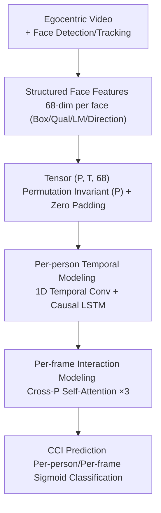

# Seeing Conversations: Communication Context Identification in Egocentric Video

**Conference**: CVPR 2026  
**Paper**: [CVF Open Access](https://openaccess.thecvf.com/content/CVPR2026/html/Dorszewski_Seeing_Conversations_Communication_Context_Identification_in_Egocentric_Video_CVPR_2026_paper.html)  
**Code**: https://github.com/dorszewski/cci (Available)  
**Area**: Video Understanding  
**Keywords**: Egocentric Video, Social Scene Understanding, Communication Context Identification, Temporal-Relational Modeling, Hearing Augmentation

## TL;DR
This paper proposes "Communication Context Identification (CCI)," a new task aimed at determining whether individuals in an egocentric video belong to the wearer's conversation group. The authors release a 68.9-hour multi-person, multi-conversation dataset and design CoCoNet—a lightweight model utilizing only structured facial features with joint temporal-relational reasoning—achieving a 96% balanced accuracy on CCI.

## Background & Motivation

**Background**: Humans effortlessly recognize their conversation partners in multi-person scenes using non-verbal cues like head orientation and gaze, maintaining a mental map of the "conversation group" even if someone is temporarily silent or out of view. In computer vision, the most related works are Ego4D's "Talking to me" (TTM) and Selective Auditory Attention Localization (SAAL), which focus on "who is speaking to the wearer right now."

**Limitations of Prior Work**: These methods are essentially **active speaker detection**—they focus on immediate speech within short windows (sub-second to several seconds) and require rapid switching as the conversation turns. They fail to identify **silent conversation partners** and cannot maintain the state of a partner once the wearer looks away. However, the membership of a real conversation group is **stable** on a minute-scale, a structure that instantaneous speaker detection overlooks.

**Key Challenge**: Determining group membership requires more than single-frame spatial cues (e.g., proximity to camera). Multi-party conversations necessitate joint reasoning across time and individuals. For instance, if the wearer looks at A, and A looks at B, both A and B might be partners. If the wearer then turns to C, A and B should still be "remembered" as part of the group. Instantaneous, per-person independent judgments cannot capture these relational dynamics.

**Goal**: To **decouple** "conversation group membership identification" from audio-driven active speaker detection. The objective is to infer the group status of every detected person—including those silent or at the periphery—over long durations using only egocentric visual cues.

**Key Insight**: The motivation stems from a specific audio application—**context-aware speech enhancement**. In noisy multi-speaker environments, speech separation systems can isolate individual voices, but identifying "which speakers are relevant to the user" remains the bottleneck. If a visual model can stably define the conversation group, hearing aids can prioritize enhancing those voices even when they are silent or the user is not facing them.

**Core Idea**: Extract lightweight structured features (bounding boxes, quality scores, 3D keypoints, head orientation) for each detected face. Employ a compact network (**CoCoNet**) that is **permutation-invariant across individuals, recurrent across time, and utilizes self-attention across people** to output the per-frame, per-person probability of belonging to the conversation group.

## Method

### Overall Architecture
The CCI task is defined as: given an egocentric video stream with face detection boxes, perform **binary classification for each detected face** to determine if it belongs to the wearer's conversation group. Evaluation treats each face as an independent sample, encouraging causal (online) prediction based on local temporal information. Due to class imbalance (partners account for 66% of detections), the primary metric is **balanced accuracy (bAcc)**, supplemented by mAP and **TbAcc** (the average bAcc across exponentially growing input lengths: 1, 5, 25, 125, 625, 3125 frames, and the full approx. 5-minute segment).

CoCoNet organizes the video into a tensor of shape $(P, T, 68)$, where $P$ is the number of identified people and $T$ is the number of frames. Each person is assigned a fixed index in the $P$ dimension (maintained even if they leave and return to the field of view), with zero-padding for frames where they are absent. The architecture consists of four serial modules: Feature Extraction → Temporal Modeling → Interpersonal Interaction Modeling → CCI Prediction.

### Key Designs

**1. Structured Face Features: Replacing Heavy Encoders with 68-D Interpretable Signals**

To maintain real-time performance, CoCoNet avoids feeding entire face images into a CNN. Instead, it extracts 68 structural features per face: bounding box coordinates $F_{\text{box}}=(x,y,w,h)$, detection/recognition confidence $F_{\text{qual}}$, 20 3D face keypoints relative to the box $F_{\text{lm}}$ ($20 \times 3 = 60$ dimensions), and head orientation (yaw, pitch) $F_{\text{dir}}$ derived from keypoints. These features are highly relevant: $F_{\text{box}}$ **implicitly encodes the wearer's orientation and distance** (larger, centered faces imply the wearer is facing them closely), $F_{\text{dir}}$ reflects others' orientations, and $F_{\text{qual}}$ indirectly signals occlusions. These are obtained from standard detectors (YuNet) and recognizers (SFace), enabling faster-than-real-time deployment and better interpretability than black-box CNNs.

**2. Permutation Invariance + Variable Length Training**

Real social scenes have dynamic person counts and varying conversation lengths. CoCoNet applies **uniform per-person processing** on the $P$ dimension; the first linear layer shares weights across $P$ and $T$, making it naturally invariant to the order of people. The training strategy further enhances flexibility: each batch takes 16 video segments, randomly clips 4096 frames (~164s), and further partitions them into segments of length $T \in [1, 4096]$. The number of people $P$ is randomly sampled from $[1, 9]$, and **random individual omission** is used as data augmentation. Ablations show that varying $P$ and random omission improves bAcc from 92% to 96%.

**3. Temporal-Interaction Factorization**

Identifying group membership requires "remembering past interactions" (temporal integration) and "observing current interpersonal relationships" (relational reasoning). CoCoNet **factorizes** these: the temporal module uses a $(1, 5)$ 1D convolution to smooth noise followed by a **Causal LSTM** (64 hidden units) shared across individuals to maintain history. The interaction module then applies **self-attention** (3 layers, 4 heads) across the $P$ dimension at each time step. This allows the model to infer complex relationships (e.g., "A is looking at B, B is not looking at me, but both A and B are partners") by attending to others' temporal-aware representations.

### Loss & Training
Implemented in PyTorch with a latent dimension of 128. Linear/Conv layers use ReLU + BatchNorm, with dropout (0.5). Optimization uses AdamW with **weighted binary cross-entropy** to address class imbalance. The model has only 431k parameters, and inference for a 5-minute video takes <0.5s on a CPU.

## Key Experimental Results

### Main Results
The dataset covers 68.9 hours (6.2 million frames) across 48 participants in 6 sessions. The test set is split into "matched" (seen participants in new conversations) and "unseen" (8 participants never seen in training).

| Classifier | matched | unseen | size 2 | size 3 | size 4-5 | size 6-10 |
| :--- | :--- | :--- | :--- | :--- | :--- | :--- |
| Center distance (Spatial only) | 59 | 63 | 81 | 56 | 55 | 54 |
| Feature-MLP (Multi-spatial) | 73 | 76 | 85 | 77 | 77 | 61 |
| ResNet18-Face | 69 | 69 | 82 | 73 | 72 | 51 |
| **CoCoNet (Full)** | **95** | **97** | **99** | **95** | **95** | **97** |

CoCoNet achieves **96% bAcc** overall. Performance on unseen participants (97%) is as high as matched ones (95%), indicating the model generalizes via abstract visual cues rather than identity-specific patterns.

### Ablation Study

| Configuration | bAcc | mAP | TbAcc | Description |
| :--- | :--- | :--- | :--- | :--- |
| $F_{\text{box}}$ only | 86 | 93 | 79 | Only box pos/size |
| $F_{\text{dir}}$ only | 89 | 96 | 76 | Only head orientation |
| $F_{\text{box}} + F_{\text{dir}}$ | 94 | 98 | 86 | Significant gain when combined |
| w/o Temporal & Interaction | 74 | 83 | 74 | Per-person per-frame baseline |
| w/o Interaction | 92 | 98 | 81 | LSTM only |
| w/o Temporal | 83 | 91 | 83 | Attention only |
| **CoCoNet (Full)** | **96** | **99** | **87** | — |

### Key Findings
- **Temporal integration is vital for large groups**: At single-frame input, bAcc for large groups (6-10 people) is low (~70-80%); with full temporal context, it surges to 97%.
- **Temporal vs. Interaction**: Removing the LSTM drops bAcc to 83%, while removing attention drops it to 92%. However, in the TbAcc metric (which includes short contexts), both drops are similar, suggesting **relational modeling is crucial when temporal context is limited.**
- **Spatial overlap is the primary failure mode**: Overlapping conversation groups reduce bAcc from 99% to 94%; 50% of small/medium group segments contain such competitive proximity.

## Highlights & Insights
- **Reframing the Task**: Shifting from "active speaker detection" to "conversation group identification" recognizes that stable group structure is more valuable for hearing aids than instantaneous speech turns.
- **Structured Features vs. ResNet**: Using 68-dimensional interpretable features (96% bAcc) outperforms ResNet encoders (90%), proving that social context reasoning depends more on "cross-person relational dynamics" than pixel-level facial appearance.
- **Factorized Design**: The per-person LSTM + per-frame self-attention design effectively balances temporal continuity with relational complexity while maintaining computational efficiency.

## Limitations & Future Work
- **Visual-only**: The model lacks audio integration, which could help resolve ambiguities between silent partners and silent bystanders.
- **Controlled Environment**: While diverse in group sizes, data was collected in a seated indoor setting; generalization to mobile, outdoor, or highly dynamic "street" scenarios remains to be tested.
- **Upstream Dependency**: The system relies heavily on the quality of face detection and keypoint estimation; failures in these pre-processing steps propagate to CCI.

## Related Work & Insights
- **vs. Ego4D TTM / SAAL**: These focus on active speakers in short windows (0.8s). CoCoNet handles long-term membership, including silent participants.
- **vs. Exterior Group Detection**: Traditional methods (using F-formations) look at the whole scene from a wall-mounted camera. CCI is **egocentric**, identifying only the wearer's partners.

## Rating
- Novelty: ⭐⭐⭐⭐⭐ 
- Experimental Thoroughness: ⭐⭐⭐⭐⭐ 
- Writing Quality: ⭐⭐⭐⭐ 
- Value: ⭐⭐⭐⭐⭐

<!-- RELATED:START -->

## Related Papers

- [\[CVPR 2026\] Seeing Motion Through Polarity for Event-based Action Recognition](seeing_motion_through_polarity_for_event-based_action_recognition.md)
- [\[CVPR 2026\] CVA: Context-aware Video-text Alignment for Video Temporal Grounding](cva_context-aware_video-text_alignment_for_video_temporal_grounding.md)
- [\[CVPR 2026\] Image Guides Images: Consistent Video Amodal Completion with Rectified In-Context Exemplar Guidance](image_guides_images_consistent_video_amodal_completion_with_rectified_in-context.md)
- [\[CVPR 2026\] Minerva-Ego: Spatiotemporal Hints for Egocentric Video Understanding](minerva-ego_spatiotemporal_hints_for_egocentric_video_understanding.md)
- [\[CVPR 2026\] VecAttention: Vector-wise Sparse Attention for Accelerating Long Context Inference](vecattention_vector-wise_sparse_attention_for_accelerating_long_context_inferenc.md)

<!-- RELATED:END -->
