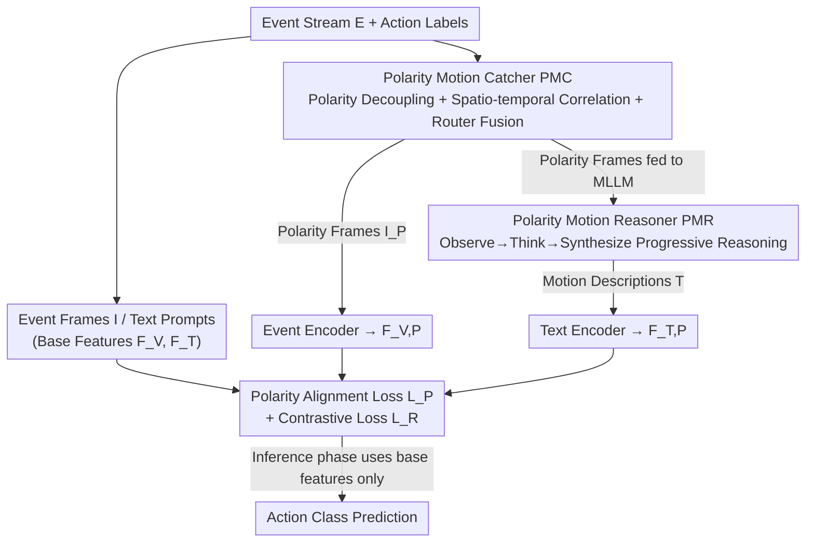

# Seeing Motion Through Polarity for Event-based Action Recognition

**Conference**: CVPR 2026  
**Paper**: [CVF Open Access](https://openaccess.thecvf.com/content/CVPR2026/html/Cao_Seeing_Motion_Through_Polarity_for_Event-based_Action_Recognition_CVPR_2026_paper.html)  
**Code**: None  
**Area**: Video Understanding  
**Keywords**: Event Camera, Action Recognition, Polarity Motion, Cross-modal Alignment, Multimodal Large Language Models (MLLM)

## TL;DR
Addressing the issue where existing event-text cross-modal action recognition methods stack positive and negative polarities into a single frame, thereby losing motion direction cues, POKER introduces a Polarity Motion Catcher (PMC) to explicitly decouple polarities and extract spatio-temporal motion primitives. Simultaneously, a Polarity Motion Reasoner (PMR) enables MLLMs to progressively reason about polarity-aware motion text descriptions. Finally, a polarity alignment loss pulls both feature paths toward class centers, delivering stable improvements of 1.3~2.6 points over the EventBind baseline on three EAR benchmarks.

## Background & Motivation
**Background**: Event cameras asynchronously record brightness changes per pixel and output sparse event streams, which are inherently suited for event-based action recognition (EAR) in scenarios involving high-speed motion, extreme lighting, and privacy sensitivity. Recently, the mainstream approach involves stacking event streams into dense event frames and leveraging vision-language models (VLM) for event-text cross-modal alignment learning, using linguistic semantics to compensate for the ambiguous semantics of event data.

**Limitations of Prior Work**: Most cross-modal methods treat event streams as standard stacked frames. The core physical quantity of events—**polarity**, which indicates whether a pixel has become brighter ($+1$) or darker ($-1$)—is flattened and mixed into the same frame during stacking. From a motion perspective, positive polarity captures the **leading edge** of motion, while negative polarity captures the **trailing edge**; together, they encode motion direction and temporal evolution. Merging them into one frame discards critical information regarding "where and how" things move, resulting in insufficient discriminative power in spatio-temporal representations and incomplete cross-modal semantic alignment.

**Key Challenge**: Discriminative information in events is essentially hidden within the directional motion encoded by polarity. However, to utilize powerful CNN/Transformer encoders, frame-stacked representations sacrifice polarity separability, creating a structural conflict between representation capacity and polarity fidelity.

**Goal**: Explicitly extract motion knowledge carried by polarity from both **visual** and **textual** modalities and integrate it into an event-text learning framework to ensure more comprehensive cross-modal alignment and more discriminative features.

**Key Insight**: The solution is anchored in the physical mechanism of event generation. Since polarity naturally distinguishes between leading and trailing edges of motion, the streams should be decoupled by polarity rather than stacked, allowing for separate modeling of their spatio-temporal dynamics. Meanwhile, MLLMs, which are proficient in semantic reasoning, can be used to "read" and describe polarity-based motion in natural language.

**Core Idea**: Replace "stacked-frame direct alignment" with "explicit polarity decoupling + MLLM progressive polarity motion reasoning + polarity alignment" to couple visual dynamics and semantic reasoning through the lens of polarity.

## Method

### Overall Architecture
Building upon an event-text contrastive learning baseline (EventBind), POKER introduces two collaborative modules to inject polarity motion knowledge: the **Polarity Motion Catcher (PMC)** (for the visual side) and the **Polarity Motion Reasoner (PMR)** (for the textual side). During training, the network processes two data streams: one uses original event frames $I$ and standard label prompts to generate **base features** $F_V, F_T$; the other uses the polarity-decoupled visual stream from PMC to generate **polarity-enhanced visual features** $F_{V,P}$ and motion reasoning descriptions from PMR to generate **polarity-enhanced textual features** $F_{T,P}$. Both feature sets are jointly optimized via a contrastive loss $L_R$ and a polarity alignment loss $L_P$. Crucially, **only base features are used during the inference phase** for final predictions—polarity enhancement serves as a "knowledge teacher" during training without increasing test overhead.

### Key Designs

**1. Polarity Motion Catcher (PMC): Decoupling polarities to measure spatio-temporal correlations.**

This module addresses the "stacking flattens polarity" issue. PMC first splits the original event stream into a positive stream $E_{PP}=\{e_i \mid p_i=+1\}$ and a negative stream $E_{NP}=\{e_i \mid p_i=-1\}$, which are stacked into positive frames $I_{PP}$ and negative frames $I_{NP}$. Frame differencing is then used to extract motion primitives in two dimensions: **Intra-Polarity Temporal Correlation (PTC)** measures motion continuity within the same polarity, $I_{PTC}(t)=I_{PP}(t)-I_{PP}(t-1)$ and $I_{NTC}(t)=I_{NP}(t)-I_{NP}(t-1)$; **Inter-Polarity Spatial Correlation (SC)** measures spatial differences between positive and negative polarities at the same timestamp, $I_{SC}(t)=I_{PP}(t)-I_{NP}(t)$. These three correlation maps $C=\{I_{PTC}, I_{NTC}, I_{SC}\}$ serve as the core motion primitives extracted by PMC.

To avoid equal weighting, PMC employs **Dynamic Polarity Fusion**: conditioned on the original frame $I$, a gating function $G(\cdot)$ implemented via a learnable routing matrix predicts weights to aggregate primitives that contribute most to discrimination into the polarity motion input $I_P$:

$$I_P = \sum_m W_m I_m, \quad \{W_m\}=\mathrm{Softmax}(G(I)), \quad m\in\{PTC, NTC, SC\}$$

This allows the model to adaptively decide whether to focus on temporal continuity or spatial contrast, uncovering cross-polarity dependencies more effectively than simple concatenation.

**2. Polarity Motion Reasoner (PMR): Progressive prompting for MLLMs to "read" polarity motion.**

While PMC outputs $I_P$ rich in motion info, it lacks semantically aligned text. Direct input of event frames to MLLMs fails as MLLMs are not pre-trained on raw event data (zero-shot performance is low). PMR uses a **progressive reasoning prompt** $P$ to decompose the MLLM $\psi$ reasoning into three serial stages: **Observation** (locating objects and identifying instantaneous states); **Thinking** (interpreting motion regions and trends by comparing current and previous event frames, e.g., identifying that positive polarity on an arm indicates forward motion); and **Synthesis** (integrating observations into a complete motion description $T$). This ensures the output is strictly based on visual evidence. The resulting structural narration, such as `{arms, moving toward each other}->{hands, making contact}`, translates visual dynamics into robust, polarity-aware text.

**3. Polarity Alignment Loss $L_P$: Class center constraints to tolerate intra-class variance.**

The diverse polarity frames $I_P$ and motion descriptions $T$ introduce high intra-class variance, making direct sample-to-sample alignment difficult. $L_P$ constructs robust **polarity class centers** by pulling event polarity features $F_{V,P}=E_V(I_P)$ and textual polarity features $F_{T,P}=E_T(T)$ toward their respective class centers $\mu_V^c, \mu_T^c$ (the mean of intra-class features):

$$L_P = \frac{1}{C}\sum_{c=1}^{C}\left\|\mu_V^c-\mu_T^c\right\|_2^2$$

This achieves cross-modal alignment while remaining tolerant of intra-class variations. The final training objective is $L = L_R + \alpha L_P$, where $L_R$ is the task-side contrastive loss (InfoNCE) with temperature $\tau$.

## Key Experimental Results

### Main Results
On three EAR benchmarks, POKER consistently improves the EventBind baseline across both stacked and reconstructed frame representations:

| Dataset | Representation | EventBind Baseline | + POKER (Ours) | Gain |
|--------|------|---------------|---------|------|
| SeAct | Stacked | 67.24 | 69.82 | +2.58 |
| DVS Action | Stacked | 94.73 | 96.49 | +1.76 |
| THUE-ACT-50-CHL | Stacked | 60.77 | 62.06 | +1.29 |
| SeAct | Recon | 74.13 | 76.72 | +2.59 |
| DVS Action | Recon | 98.24 | 99.60 | +1.36 |
| THUE-ACT-50-CHL | Recon | 61.14 | 63.72 | +2.58 |

Note: Hits 99.60% on DVS Action with reconstructed frames, approaching the Prev. SOTA EMP (99.80%).

### Ablation Study
Module-wise breakdown (reconstructed frames, baseline using EventBind encoders):

| Configuration | SeAct (%) | THUE-ACT-50-CHL (%) | Description |
|------|-----------|---------------------|------|
| Baseline | 74.13 | 61.14 | No polarity enhancement |
| + PMC | 75.00 | 62.24 | Visual polarity motion capture |
| + PMR | 75.86 | 62.98 | Textual polarity reasoning |
| + PMC + PMR (Full) | 76.72 | 63.72 | Collaborative synergy |

Additional diagnostic ablations:

| Dimension | Comparison | Key Metric (THUE/SeAct) | Conclusion |
|------|------|----------------------|------|
| PMC Fusion Strategy | Concat / Add / Router | 61.51 / 63.35 / **63.72** | Learnable router is optimal |
| Alignment Loss | Contrastive / Polarity $L_P$ | 62.62 / **63.72** | $L_P$ outperforms standard contrastive |
| MLLM used in PMR | Qwen3-VL-30B / GPT-4o-mini / Gemini-2.5-Pro | 75.00 / 75.86 / **76.72** | Gemini-2.5-Pro yields best reasoning |

### Key Findings
- **PMC and PMR are complementary**: PMC alone (visual side) yields a +0.87~1.1 boost; PMR alone (textual side) also boosts performance, and their synergy is highest. This indicates that "explicit polarity decoupling" and "semantic motion reasoning" address polarity gaps from orthogonal directions.
- **MLLMs require scaffolding**: Zero-shot understanding of event data by general MLLMs is only 36~52% (and even lower for event-specific models like EventGPT). PMR’s progressive prompting is essential to translate reasoning capacity into effective motion descriptions.
- **Value of Router Fusion**: Compared to simple concatenation, the learnable router adaptively assigns weights to motion primitives based on the action, which is key to extracting discriminative power.

## Highlights & Insights
- **Returning to Physical Mechanisms**: The most significant insight is anchoring improvements in event generation principles (Positive = Leading edge, Negative = Trailing edge). This identifies a fundamental flaw in the frame-stacking paradigm rather than just adding another module.
- **Training Enhancement, Zero Inference Overhead**: Polarity features act as "teachers" during training to constrain base features. Since inference only uses the base branch, POKER serves as a plug-and-play enhancer with high practical utility.
- **MLLM as a "Motion Annotator"**: Using progressive prompting to turn MLLMs into structured motion narrators provides a scaffolding strategy transferable to other domains where data distributions do not match MLLM pre-training (e.g., Radar, medical signals).
- **Class Center Alignment for Generative Supervision**: Since MLLM-generated descriptions naturally have intra-class variance, class-center alignment proves to be a robust reusable trick for handling noisy textual supervision.

## Limitations & Future Work
- **Dependence on External MLLMs**: PMR performance is highly correlated with the strength of the chosen MLLM. Best results rely on closed-source APIs, affecting reproducibility costs and stability.
- **Incremental Absolute Gains**: On saturated datasets (DVS Action at 98%+), gains are limited to 1~2.6 points. The most significant gains occur in complex scenes (THUE-ACT-50-CHL).
- **Extra Training Computation**: Decoupling streams and calculating correlations increases training-time computational and memory overhead, although this is not reflected at inference.

## Related Work & Insights
- **vs. EventGPT / ExACT**: These methods introduced linguistic semantics to EAR but treat events as stacked frames. POKER adds missing polarity directional knowledge.
- **vs. EventBind (Baseline)**: EventBind performs event-text alignment without polarity modeling. POKER consistently improves upon it across different representations and datasets.
- **vs. Knowledge Enhancement**: Unlike methods that use external knowledge for weak supervision, POKER extracts internal knowledge from the event generation mechanism itself.

## Rating
- Novelty: ⭐⭐⭐⭐ Anchoring improvements in physical polarity mechanisms is novel and grounded.
- Experimental Thoroughness: ⭐⭐⭐⭐ Comprehensive across three datasets and multiple representations with detailed ablations.
- Writing Quality: ⭐⭐⭐⭐ Clear motivation and intuitive diagrams.
- Value: ⭐⭐⭐⭐ Plug-and-play with zero inference overhead; the scaffolding paradigm for MLLMs is highly transferable.

<!-- RELATED:START -->

## Related Papers

- [\[CVPR 2026\] SMV-EAR: Bring Spatiotemporal Multi-View Representation Learning into Efficient Event-Based Action Recognition](smv-ear_bring_spatiotemporal_multi-view_representation_learning_into_efficient_e.md)
- [\[CVPR 2026\] Tracking through Severe Occlusion via Event-Derived Transient Cues](tracking_through_severe_occlusion_via_event-derived_transient_cues.md)
- [\[CVPR 2026\] DarkShake-DVS: Event-based Human Action Recognition under Low-light and Shaking Camera Conditions](darkshake-dvs_event-based_human_action_recognition_under_low-light_and_shaking_c.md)
- [\[CVPR 2026\] OpenMarcie: Dataset for Multimodal Action Recognition in Industrial Environments](openmarcie_dataset_for_multimodal_action_recognition_in_industrial_environments.md)
- [\[CVPR 2026\] VideoNet: A Large-Scale Dataset for Domain-Specific Action Recognition](videonet_a_large-scale_dataset_for_domain-specific_action_recognition.md)

<!-- RELATED:END -->
