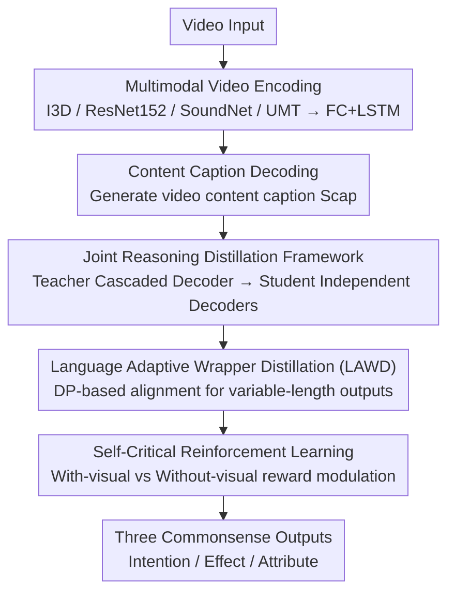

# Self-Critical Distillation Network for Video-based Commonsense Captioning

**Conference**: CVPR 2026  
**Paper**: [CVF Open Access](https://openaccess.thecvf.com/content/CVPR2026/html/Yuan_Self-Critical_Distillation_Network_for_Video-based_Commonsense_Captioning_CVPR_2026_paper.html)  
**Code**: https://github.com/yuan687198/scdnet  
**Area**: Video Understanding / Video Commonsense Captioning  
**Keywords**: Video Commonsense Captioning, Self-critical Reinforcement Learning, Knowledge Distillation, Cascaded Decoder, Visual Grounding

## TL;DR
SCD-Net addresses two major problems caused by the "video → content description → commonsense" reasoning chain: the lack of visual grounding and the isolation of different commonsense categories. It employs self-critical reinforcement learning to strengthen visual reasoning and a joint reasoning distillation framework (cascaded teacher decoder + student + language adaptive wrapper distillation) to establish inter-class correlations. On the V2C dataset, it outperforms LLM-based methods without relying on Large Language Models.

## Background & Motivation
**Background**: Video-based commonsense captioning requires models to not only describe visible video content but also infer three types of commonsense behind events: intention (why it happened), effect (what changes it leads to), and attribute (how to characterize the agent). The mainstream approach constructs a reasoning chain of "video $V$ → content description $C$ → commonsense $I/E/A$" using an encoder-decoder paradigm.

**Limitations of Prior Work**: This reasoning chain has two structural defects. First, **lack of visual grounding**: Information in the video modality is far richer than text, and different videos often share the same content description. To maintain accuracy, models tend to generate the same commonsense for different videos sharing the same description, leading to reduced diversity and semantic detachment from the video ("visually-irrelevant generic outputs"). Second, **isolation between commonsense categories**: Existing models use independent decoders for the three types of commonsense, ignoring inter-class correlations—knowing the intention ("she wants to cook a healthy meal") and attributes ("this person is skillful") actually helps infer the effect ("she will finish cooking delicious food quickly").

**Key Challenge**: One could introduce LLMs (e.g., TKG-Net using GPT knowledge) to supplement semantics, but at a high computational cost. Alternatively, one can address the two weak points of the reasoning chain itself without additional resources. The authors choose the latter.

**Goal**: (1) Ensure commonsense generation truly utilizes visual information to improve consistency with video semantics; (2) Enable mutual guidance between the three types of commonsense during generation while maintaining fairness during inference (where other categories' ground-truth is unavailable).

**Key Insight**: Utilize self-critical reinforcement learning to "force" the model to prove its use of vision by comparing the reward difference between "with visual input" and "without visual input" paradigms to modulate training gradients. Use teacher-student distillation to safely transform "unavailable ground-truth of other categories at test time" into learnable inter-class knowledge.

**Core Idea**: A dual-track optimization of the reasoning chain using self-critical reinforcement for "visual grounding" and joint reasoning distillation for "inter-class correlation."

## Method

### Overall Architecture
Given a video $V$, SCD-Net first extracts multimodal features using multiple visual encoders and generates a video content description $S_{cap}$ via a content decoder. Then, the process splits into two paths: the **Joint Reasoning Distillation (JRD)** framework, where a teacher model uses a two-stage cascaded decoder to learn inter-class correlations from other categories' ground-truth and distills this knowledge into a student model that does not require other ground-truth at test time; and **Self-Critical Reinforcement Learning**, which constructs "with visual" and "without visual" generation paradigms and uses their score difference as a reward to reinforce the utilization of visual information. Both paths jointly optimize the same reasoning chain to output intention, effect, and attribute descriptions.

### Key Designs

**1. Joint Reasoning Distillation (JRD): Safely Distilling "Unavailable Inter-class Ground-Truth"**

Directly allowing a commonsense decoder to read ground-truth from other categories leverages correlations but creates training-testing unfairness. SCD-Net resolves this via a teacher-student structure. The **Teacher** uses a two-stage cascaded decoder: the first stage inputs "content description + other categories' one-hot ground-truth" to reconstruct the target category, with loss $L^{T1}_{cms}=-\sum_t \log p(y_t\mid y_{<t}, [S_{cap}, \tilde{S}^{cur}_{cms}]; \theta_{T1})$. The second stage takes the outputs of the first stage from other categories $S^{oth}_{cms}$ along with visual features as input, with loss $L^{T2}_{cms}=-\sum_t \log p(y_t\mid y_{<t}, [F_{mul}, S_{cap}, S^{oth}_{cms}]; \theta_{T2})$. The **Student** uses three independent decoders with the same structure, relying only on $[F_{mul}, S_{cap}]$ to generate commonsense ($L^{S}_{cms}$ as cross-entropy). The teacher distills inter-class knowledge into the student, allowing the student to benefit from these correlations during testing while maintaining fairness.

**2. Language Adaptive Wrapper Distillation (LAWD): Aligning Variable-Length Sentences via DP**

When teacher and student outputs differ in length, traditional word-for-word alignment calculates high loss for semantically equivalent but displaced words (e.g., "there is" vs "a man")—a "synonym misalignment" issue. LAWD replaces KL divergence with dynamic programming (DP). Given student and teacher embedding matrices $H^X\in\mathbb{R}^{n\times e}$ and $H^Y\in\mathbb{R}^{m\times e}$, a cost matrix $C(H^X,H^Y)=(\|h^X_i-h^Y_j\|)_{n\times m}$ is defined. DP finds the optimal path cost from $(0,0)$ to $(n,m)$:

$$r_{i,j}=\min\{r_{i-1,j-1}, r_{i-1,j}, r_{i,j-1}\} + c_{i,j}$$

The distillation loss is $L_{kd}=r_{n,m}$. This ensures that words with the same semantics but different positions are not wrongly penalized, enabling stable inter-class knowledge transfer.

**3. Self-Critical Reinforcement Learning: Forcing Visual Utilization via Reward Differences**

To address the lack of visual grounding, SCD-Net designs two paradigms: one with both video features and content description as input, and another masking the video features. If the model truly utilizes vision, the quality of the "with-visual" version should exceed the "without-visual" version. Since metrics like CIDEr are non-differentiable, self-critical RL is used. The difference in scores is used as a reward to modulate the gradient:

$$\nabla_\theta L_{cms}(\theta)=-\gamma\,\tanh^{*}\!\big(r(y^{v})-r(y^{wv})\big)\,\nabla_\theta \log p_\theta(y^{v}_{1:N_{cms}})$$

where $r(y^{v})$ and $r(y^{wv})$ are metrics for with/without visual inputs. This encourages gradients when vision is effectively used (positive difference) and penalizes inefficient utilization, embedding "visual grounding" directly into the optimization objective.

### Loss & Training
The total loss is $L=\lambda_1 L_{cap}+\lambda_2 L^{S}_{cms}+\lambda_3 L_{kd}$, with self-critical RL incorporated into $L^{S}_{cms}$ and $L^{T}_{cms}$. Training involves two stages: 200 epochs of cross-entropy followed by 2000 epochs of self-critical training. Parameters include learning rate 3.5e-4, Adam optimizer, 300-step warm-up, $\lambda_1{:}\lambda_2{:}\lambda_3=1{:}3{:}0.0005$, and batch size 64.

## Key Experimental Results

### Main Results
On the large-scale V2C (Video-to-Commonsense) dataset (9,721 scenes, 121,618 descriptions), evaluation is performed using CIDEr (C), ROUGE-L (R), and BLEU (B-1, B-4). SCD-Net (without LLM) significantly outperforms the non-LLM baseline HybridNet and even exceeds the LLM-based TKG-Net which uses GPT knowledge:

| Category | Model | Use LLM | C | R | B-1 | B-4 |
|------|------|-----------|------|------|------|------|
| Intent | HybridNet (baseline) | × | 92.6 | 60.1 | 69.4 | 53.1 |
| Intent | TKG-Net | ✓ | 100.6 | 62.0 | 70.4 | 55.7 |
| Intent | **SCD-Net** | × | **106.3** | **63.7** | **72.5** | **58.1** |
| Effect | HybridNet (baseline) | × | 66.2 | 41.5 | 49.0 | 38.8 |
| Effect | **SCD-Net** | × | **80.6** | **46.5** | **54.0** | **44.8** |
| Attribute | HybridNet (baseline) | × | 32.5 | 41.0 | 58.7 | 51.7 |
| Attribute | **SCD-Net** | × | **34.9** | **42.5** | **61.4** | **56.5** |

CIDEr for the "Intent" category increased from 92.6 to 106.3, and for "Effect" from 66.2 to 80.6.

### Ablation Study
Table 2 breaks down the two main components (SC = Self-Critical, Dis = Joint Reasoning Distillation):

| Category | Configuration | C | R | B-1 | B-4 |
|------|------|------|------|------|------|
| Intent | Baseline | 92.6 | 60.1 | 69.4 | 53.1 |
| Intent | + SC | 103.1 | 62.2 | 69.9 | 55.2 |
| Intent | + Dis | 98.1 | 61.9 | 70.1 | 55.5 |
| Intent | + SC + Dis | 104.9 | 63.0 | 70.7 | 56.1 |
| Effect | Baseline | 66.2 | 41.5 | 49.0 | 38.8 |
| Effect | + SC | 76.3 | 44.6 | 51.6 | 41.8 |
| Effect | + Dis | 73.4 | 43.9 | 52.1 | 42.7 |
| Effect | + SC + Dis | 78.8 | 45.7 | 52.8 | 43.3 |

### Key Findings
- **Self-Critical Reinforcement Learning (SC) contributes most individually**: For Intent/Effect, +SC improved CIDEr from 92.6→103.1 and 66.2→76.3, respectively, showing visual grounding is the most critical weak point.
- **Components are complementary**: The combination of SC and Dis achieves the best results across almost all metrics, confirming visual reasoning and inter-class correlations are orthogonal improvement directions.
- **Outperforms LLMs without LLM resources**: SCD-Net surpasses TKG-Net (using GPT) in all intent-category metrics while significantly reducing resource consumption.

## Highlights & Insights
- **Clever contrastive design for self-critical rewards**: Transforming the abstract question "did the model use vision?" into a calculable reward difference modulates gradients directly, bypassing the non-differentiable nature of CIDEr.
- **Distillation resolves training-inference conflicts**: The teacher-cascaded and student-independent decoder design is an elegant solution for tasks where auxiliary ground-truth is available only during training.
- **DP-based alignment in LAWD**: Solving synonym misalignment with dynamic programming is more aligned with the semantic nature of natural language than word-by-word KL divergence.

## Limitations & Future Work
- **High training cost**: The second stage requires 2000 epochs of reinforcement learning; stability is sensitive to hyperparameters ($\gamma, \lambda$).
- **Metric dependency**: Rewards depend on automatic metrics like CIDEr, which might amplify biases of the metrics themselves (e.g., toward frequent words).
- **Single dataset verification**: Evaluated only on V2C with fixed commonsense types; generalization to open commonsense categories remains unknown.
- **Teacher model complexity**: The two-stage cascaded decoder adds overhead during the training phase.

## Related Work & Insights
- **vs HybridNet (backbone)**: HybridNet optimizes three losses in a transformer but lacks visual grounding and inter-class mutual inference; SCD-Net significantly outperforms it by adding SC + Dis.
- **vs TKG-Net**: TKG-Net supplements semantics using GPT; SCD-Net achieves equal or better performance using distillation and reinforcement learning without additional external resources.
- **vs Classic Self-Critical (Rennie et al.)**: Traditional SCST uses the model's own output to normalize rewards; this paper redefines self-critical as a "with-vision vs without-vision" contrastive reward specifically for grounding.

## Rating
- **Novelty**: ⭐⭐⭐⭐ Contrastive self-critical rewards and cascaded distillation to resolve fairness are a creative combination for this task.
- **Experimental Thoroughness**: ⭐⭐⭐⭐ Comprehensive categories and ablations, though multi-dataset verification is missing.
- **Writing Quality**: ⭐⭐⭐⭐ Clear analysis of reasoning chain defects, complete formulas, and well-designed diagrams.
- **Value**: ⭐⭐⭐⭐ Outperforming LLMs without LLMs is highly practical for resource-constrained video understanding.

<!-- RELATED:START -->

## Related Papers

- [\[CVPR 2026\] Self-Paced and Self-Corrective Masked Prediction for Movie Trailer Generation](self-paced_and_self-corrective_masked_prediction_for_movie_trailer_generation.md)
- [\[CVPR 2026\] Bootstrapping Video Semantic Segmentation Model via Distillation-assisted Test-Time Adaptation](bootstrapping_video_semantic_segmentation_model_via_distillation-assisted_test-t.md)
- [\[CVPR 2026\] Stay in your Lane: Role Specific Queries with Overlap Suppression Loss for Dense Video Captioning](stay_in_your_lane_role_specific_queries_with_overlap_suppression_loss_for_dense_.md)
- [\[CVPR 2026\] Boosting Self-Supervised Tracking with Contextual Prompts and Noise Learning](boosting_self-supervised_tracking_with_contextual_prompts_and_noise_learning.md)
- [\[CVPR 2026\] SAIL: Similarity-Aware Guidance and Inter-Caption Augmentation-based Learning for Weakly-Supervised Dense Video Captioning](sail_similarity-aware_guidance_and_inter-caption_augmentation-based_learning_for.md)

<!-- RELATED:END -->
