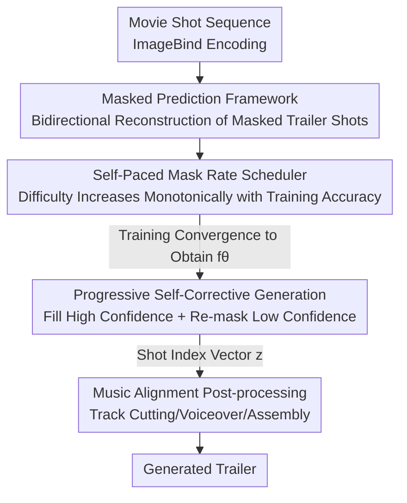

# Self-Paced and Self-Corrective Masked Prediction for Movie Trailer Generation

**Conference**: CVPR 2026  
**Paper**: [CVF Open Access](https://openaccess.thecvf.com/content/CVPR2026/html/Zhu_Self-Paced_and_Self-Corrective_Masked_Prediction_for_Movie_Trailer_Generation_CVPR_2026_paper.html)  
**Code**: https://github.com/Dixin-Lab/SSMP (Available)  
**Area**: Video Understanding  
**Keywords**: Movie trailer generation, masked prediction, self-paced learning, self-correction, bidirectional context modeling

## TL;DR
Reformulates movie trailer generation as a task of "mask reconstruction on trailer shot sequences using movie shots as prompts." By employing a Transformer encoder with self-paced mask rate scheduling and iterative re-masking (self-correction), the model significantly outperforms selection-then-ranking and autoregressive methods in F1 and ranking accuracy.

## Background & Motivation
**Background**: Automatic trailer generation involves selecting key shots from a full-length movie and reordering them into an engaging short clip. Dominant approaches follow a "selection-then-ranking" paradigm: first selecting candidate shots based on specific scoring (visual appeal, emotional intensity, relevance to subtitles/plot, etc.), then ordering them using music-video alignment or LLM-assisted narration. Recent works also treat this as a sequence-to-sequence problem, utilizing autoregressive (AR) models for shot-by-shot prediction.

**Limitations of Prior Work**: Selection-then-ranking decouples the inherently coupled processes of selection and ranking. Models fail to jointly reason over semantic relevance and temporal continuity, allowing errors from the selection phase to propagate directly to the ranking phase. While autoregressive methods unify these steps, they generate sequences strictly from left to right and lack the ability to revise early decisions—once a shot is incorrectly selected, subsequent shots are forced to align with that error.

**Key Challenge**: Both paradigms lack a **self-correction** mechanism, which is central to the workflow of human editors. Professional editors iteratively refine their work by replacing shots at various positions rather than finalizing in a single pass. Without this feedback loop, models remain trapped by unavoidable error propagation.

**Goal**: (1) Develop a trailer generator capable of bidirectional context modeling and progressive self-correction; (2) Enable the training task difficulty to adapt to the model's current performance for improved efficiency and stability.

**Key Insight**: The authors draw inspiration from masked prediction in BERT/LLaDA. Bidirectional mask reconstruction allows a model to synthesize global context and repeatedly re-mask low-confidence positions, directly corresponding to the "iterative selection and replacement" workflow of professional editors.

**Core Idea**: Trailer generation is formulated as "conditional masked prediction." Using the movie shot sequence as a prompt, the trailer shot sequence is randomly masked and rebuilt. During training, a **self-paced mask rate scheduler** adjusts task difficulty according to model performance. During generation, **progressive self-correction** is achieved by iteratively filling high-confidence positions and re-masking the rest.

## Method

### Overall Architecture
SSMP segments both the movie $\mathcal{M}=\{m_i\}_{i=1}^{I}$ and the trailer $\mathcal{V}=\{v_j\}_{j=1}^{J}$ into shot sequences via TransNet-v2. Each shot is treated as a token, with 1024D features extracted using a frozen ImageBind model. Since trailer shots are subsets of movie shots ($\mathcal{V}\subset\mathcal{M}$), the task is essentially picking a movie shot for each trailer position. The core is a four-layer Transformer encoder $f_\theta$ (mask predictor). During training, movie features (prompt, constant) and the masked trailer features are concatenated and fed into the encoder for bidirectional reconstruction. During generation, starting from a "fully masked" trailer sequence, the model iteratively fills high-confidence shots and re-masks low-confidence ones until all positions are filled. Music beat-based post-processing is applied for the final assembly.

### Key Designs

**1. Masked Prediction Framework: Replacing Pipelines and AR with Bidirectional Reconstruction**

To address the inability of decoupled or AR models to jointly model and revise decisions, the authors reformulate trailer generation as BERT-style conditional mask reconstruction. A binary alignment truth matrix $G=[g_{j,i}]$ is established by matching each trailer shot to its "most similar" movie shot via cosine similarity: $s_{j,i}=\frac{\langle v_j,m_i\rangle}{\|v_j\|\|m_i\|}$, where $g_{j,\ell}=1$ if and only if $\ell=\arg\max_i s_{j,i}$. During training, target shots are randomly replaced by a learnable mask placeholder $\mathrm{MP}$ at rate $t$ to obtain a partially masked sequence $V^t$. The concatenated input $[\mathcal{M};V^t]$ is passed to $f_\theta$ to predict features $\hat{V}^t$ for masked positions. The conditional probability of assigning the $i$-th movie shot to the $j$-th trailer position is calculated via softmax over cosine similarities:

$$\hat{s}^t_{j,i}=\frac{\langle \hat{v}^t_j, m_i\rangle}{\|\hat{v}^t_j\|_2\|m_i\|_2},\quad P^t=\mathrm{Softmax}(\hat{S}^t).$$

The training objective is the cross-entropy loss restricted to masked positions $\mathcal{J}'$ (normalized by the mask rate $\frac{1}{t}$): $\min_\theta -\mathbb{E}\big[\frac{1}{t}\sum_i\sum_{j\in\mathcal{J}'} g_{j,i}\log p_{j,i}\big]$. This bidirectional modeling allows selection and ranking to occur simultaneously, fundamentally supporting the re-masking correction phase.

**2. Self-Paced Mask Rate Scheduler: Adapting Difficulty to Model Capability**

The mask rate $t$ determines reconstruction difficulty. A rate too low results in trivial tasks, while a rate too high prevents convergence. The authors dynamically schedule $t$ based on training accuracy $a_n$ (the hit rate of $\arg\max_i p_{j,i}$ at masked positions) using a momentum update:

$$b_{n+1}=\mu_a a_n+(1-\mu_a)b_n,$$
$$\tilde{t}_{n+1}=\mu_t t_n+(1-\mu_t)[t_{\min}+\Delta t\cdot\sigma_\beta(b_{n+1}-0.5)],\quad t_{n+1}=\max\{t_n,\tilde{t}_{n+1}\}.$$

Here, $b_{n+1}$ represents the history of accuracy. $\sigma_\beta$ is a sigmoid function with temperature $\beta$ that smooths the mapping of accuracy to the range $[t_{\min},t_{\max}]=[0.1,1]$. The $\max$ operator ensures that the mask rate is **monotonically non-decreasing**: once the model masters a difficulty level, it does not regress to easier tasks.

**3. Progressive Self-Corrective Generation: Locking High Confidence and Re-masking Others**

To solve the "irreversible early decision" problem, the generation phase begins with an all-masked sequence $V_0=[\mathrm{MP}]$. A cumulative confidence vector $q=[q_j]\in[0,1]^J$ (initially 0) tracks the reliability of each position. In each iteration, the best candidate $i^*_j=\arg\max_{i\in\mathcal{I}_k} p_{j,i}$ is identified, and confidence is updated as $q_j=\min\{q_j+p_{j,i^*_j},1\}$. A Bernoulli trial $\tau\sim\mathrm{Bernoulli}(q_j)$ determines whether to lock the position: if $\tau=1$, the candidate shot is assigned and removed from available sets; if $\tau=0$, the position is re-masked for the next iteration. This mechanism ensures that only stable, high-confidence shots are fixed, while low-confidence shots are re-evaluated within a more reliable context. Since $q_j$ increases monotonically, the process converges within finite steps.

### Loss & Training
Training utilizes the cross-entropy loss from Eq. (4). Ablations show CE significantly outperforms MSE, as MSE suffers from the curse of dimensionality and lacks a discriminative margin for high-dimensional features. The optimizer is AdamW ($LR=10^{-4}$ with cosine scheduling and 0.1 warmup, weight decay 0.1). Scheduler hyperparameters are $\beta=10,\mu_a=0.98,\mu_t=0.1$. The model is a 4-layer Transformer (4 heads, hidden size 1024, FFN 2048) trained for 500 epochs on a single H100. Post-processing involves Ruptures for music segmentation, DeepSeek-V3 for selecting subtitles/voiceovers, MiniCPM-V2.6 for shot description, and DP-based alignment using CLIP text similarity.

## Key Experimental Results

The dataset is an extension of CMTD (500 movies, 922 trailers), split into Test-8 and Test-74. A Test-2024 set (30 movies released in 2024) verifies generalization. Metrics include Precision/Recall/F1 for selection, and Levenshtein Distance (LD) and Pairwise Agreement Accuracy (AA) for ranking.

### Main Results

| Test Set | Method | F1↑ | LD↓ | AA↑ |
|----------|--------|------|------|------|
| Test-8 | MMSC (Prev. SOTA) | 0.1391 | 99.25 | 0.58 |
| Test-8 | TGT (AR) | 0.1153 | 103.87 | 0.48 |
| Test-8 | **SSMP (Ours)** | **0.1618** | **99.50** | **0.68** |
| Test-74 | MMSC | 0.1991 | 82.48 | 0.50 |
| Test-74 | TGT | 0.1326 | 88.29 | 0.43 |
| Test-74 | **SSMP (Ours)** | **0.2373** | **81.87** | **0.67** |
| Test-2024 | MMSC | 0.1506 | 93.91 | 0.52 |
| Test-2024 | TGT | 0.1601 | 103.25 | 0.46 |
| Test-2024 | **SSMP (Ours)** | **0.1759** | **93.29** | **0.60** |

F1 scores exceed MMSC by 2.27% and 3.82% on the main test sets, while AA surges by 10% and 17%. This ranking performance boost validates the effectiveness of bidirectional context and self-correction. User studies across themes/rhythm/attractiveness show SSMP leading in all dimensions.

### Ablation Study

| Configuration | F1↑ (Test-ALL) | AA↑ | Description |
|---------------|------|------|-------------|
| Random Mask Rate | 0.1377 | 0.64 | Difficulty not coupled to model |
| Linear Decending | 0.1760 | 0.66 | Hard to easy |
| Linear Ascending | 0.1915 | 0.66 | Easy to hard |
| **Self-Paced** | **0.1996** | **0.68** | Adaptive to accuracy; faster convergence |
| Greedy Generation | 0.1958 | 0.67 | No re-masking correction |
| **Self-Corrective Gen** | **0.1996** | **0.68** | Iterative re-masking of low-confidence |
| MSE Loss | 0.1211 | 0.56 | No discriminative margin in high dim |
| **CE Loss** | **0.1996** | **0.68** | Pulls correct shots, pushes others |

### Key Findings
- **"Ascending > Descending/Random" validates curriculum difficulty**: Linear ascending already performs well (0.1915 F1), proving the importance of the easy-to-hard order. Self-paced scheduling further refines this by tracking real-time performance.
- **Momentum $\mu_t$ is robust**: $\mu_t=0.1$ is optimal, but performance remains stable across the $[0.1, 0.9]$ range.
- **Self-correction primarily aids ranking**: Compared to greedy generation, AA increases from 0.67 to 0.68 and LD drops from 92.60 to 91.19. Cumulative confidence suppresses error propagation.
- **Position tolerance $R$ significantly impacts metrics**: Increasing $R$ from 0 to 2 causes F1 on Test-8 to jump from 0.16 to 0.63. This indicates that adjacent shots from the same scene are often interchangeable, suggesting strict metrics may understate quality.

## Highlights & Insights
- **BERT-style prediction for discrete selection**: Successfully adapts masked prediction to a "shot-level" selection task. Using cosine similarity vs movie shot features avoids the difficulties of regressing directly to high-dimensional visual vectors.
- **"Generation as Re-masking"**: This self-correction mechanism formalizes the human editing process into an iterative algorithm with guaranteed convergence, offering a superior alternative to "one-shot" autoregressive models.
- **Transferable Self-Paced Scheduler**: The "momentum-based monotonic scheduler" can be applied to any masked reconstruction task (video/audio/multimodal tokens) where "mask ratio = task difficulty."

## Limitations & Future Work
- **Reliance on $\mathcal{V}\subset\mathcal{M}$**: Real trailers often include title cards, assets from other films, or re-colorized shots. Pure selection cannot account for these.
- **Exogenous Trailer Length $J$**: The length is determined by music segments rather than the model, tying the rhythm strictly to the pre-selected music track.
- **Metric Sensitivity**: Strict alignment (R=0) might not reflect perceived quality. Soft-alignment metrics closer to human perception could be explored.
- **Hard Ground Truth Truths**: Alignment depends on ImageBind cosine similarity. If the encoder lacks discriminative power for certain shots, the supervised signal becomes noisy.

## Related Work & Insights
- **vs. Selection-then-Ranking (IPOT / MMSC)**: These decouple selection and ranking. SSMP's joint "selection + ranking" through bidirectional masking significantly leads in AA (0.67 vs 0.50 on Test-74).
- **vs. Autoregressive (TGT)**: TGT is unidirectional and cannot correct mistakes. SSMP uses re-masking to refine predictions globally, outperforming TGT in all metrics.
- **vs. BERT / LLaDA**: While inheriting the bidirectional context, SSMP introduces a **self-paced, monotonic** mask rate scheduler and migrates masked prediction to structured discrete shot selection.

## Rating
- Novelty: ⭐⭐⭐⭐ Reformulating trailer generation as masked prediction with self-paced scheduling is a distinct paradigm shift.
- Experimental Thoroughness: ⭐⭐⭐⭐ Robust testing on multiple sets plus user studies and detailed ablations. Needs larger scale cross-dataset comparisons.
- Writing Quality: ⭐⭐⭐⭐ Clear motivation-mechanism-formula alignment. Minor notation inconsistencies.
- Value: ⭐⭐⭐⭐ New SOTA in trailer generation with open-source code; the scheduler is broadly applicable.

<!-- RELATED:START -->

## Related Papers

- [\[CVPR 2026\] Exploring Adaptive Masked Reconstruction for Self-Supervised Skeleton-Based Action Recognition](exploring_adaptive_masked_reconstruction_for_self-supervised_skeleton-based_acti.md)
- [\[CVPR 2026\] TimeBridge: Self-Supervised Video Representation Learning via Start-End Joint Embedding and In-Between Frame Prediction](timebridge_self-supervised_video_representation_learning_via_start-end_joint_emb.md)
- [\[CVPR 2026\] Boosting Self-Supervised Tracking with Contextual Prompts and Noise Learning](boosting_self-supervised_tracking_with_contextual_prompts_and_noise_learning.md)
- [\[CVPR 2026\] A Stitch in Time: Learning Procedural Workflow via Self-Supervised Plackett-Luce Ranking](a_stitch_in_time_learning_procedural_workflow_via_self_supervised_plackett_luce_r.md)
- [\[CVPR 2026\] SEASON: Mitigating Temporal Hallucination in Video Large Language Models via Self-Diagnostic Contrastive Decoding](season_mitigating_temporal_hallucination_in_video_large_language_models_via_self.md)

<!-- RELATED:END -->
