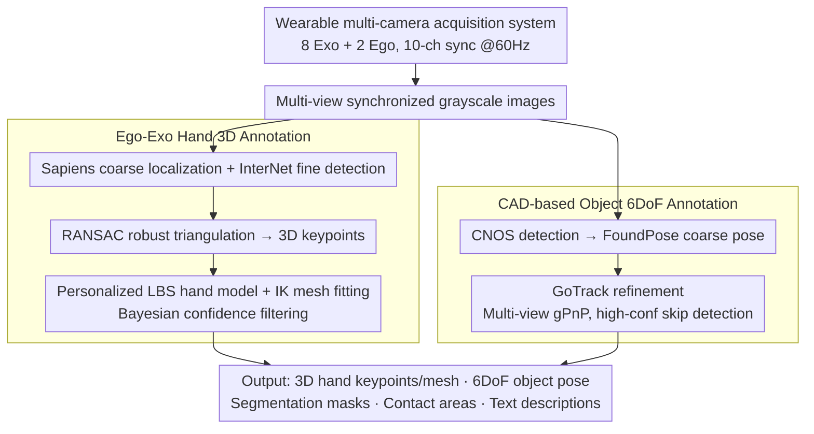

# SHOW3D: Capturing Scenes of 3D Hands and Objects in the Wild

**Conference**: CVPR 2026  
**arXiv**: [2603.28760](https://arxiv.org/abs/2603.28760)  
**Code**: [https://show3d-dataset.github.io/](https://show3d-dataset.github.io/)  
**Area**: Video Understanding  
**Keywords**: Hand-object interaction dataset, in-the-wild 3D annotation, multi-camera acquisition, egocentric vision, hand pose estimation

## TL;DR

Ours presents SHOW3D, the first hand-object interaction dataset in true in-the-wild environments with precise 3D annotations. By designing a lightweight wearable multi-camera backpack system and an ego-exo fusion annotation pipeline, 4.3 million frames of multi-view data were collected. Both hands and objects achieve sub-centimeter annotation accuracy. Cross-dataset experiments validate the generalization advantages of models trained on this data.

## Background & Motivation

1.  **Background**: 3D understanding of hand-object interaction is crucial for AR/VR and robotics. Existing datasets (GigaHands, HOT3D, ARCTIC, etc.) are primarily collected in indoor studios using motion capture systems or fixed multi-camera arrays.
2.  **Limitations of Prior Work**: Studio environments limit scene diversity and realism—fixed equipment restricts mobility, and markers affect the visual appearance of hands and objects. Conversely, datasets like Ego-Exo4D provide environmental diversity but lack precise 3D annotations.
3.  **Key Challenge**: There is a fundamental trade-off between environmental realism and 3D annotation accuracy. One either has precise annotations in restricted environments or diverse environments without annotations.
4.  **Goal**: Break this trade-off—acquire precise 3D annotations for hands and objects in true in-the-wild environments.
5.  **Key Insight**: Design an approximately 8kg backpack-mounted multi-camera system that requires no markers and achieves markerless automatic 3D annotation using advanced 2D detection and multi-view triangulation.
6.  **Core Idea**: Use a wearable multi-camera system combined with an ego-exo automatic annotation pipeline to achieve studio-comparable 3D hand-object annotation accuracy in the wild.

## Method

### Overall Architecture

The system consists of three parts: (1) a backpack-mounted multi-camera acquisition system (8 exocentric + 2 head-mounted egocentric cameras, totaling 10 synchronized fisheye cameras @ 60Hz), (2) an ego-exo 3D hand pose annotation pipeline, and (3) a CAD-based 3D object pose annotation pipeline. The input consists of multi-view synchronized grayscale images. The acquisition system splits into two parallel branches for hand and object annotation, eventually merging to output 3D hand keypoints/meshes, 6DoF object poses, segmentation masks, contact areas, and text descriptions.

### Key Designs

**1. Wearable multi-camera acquisition system: Obtaining multi-angle synchronized imagery without restricting user movement**

The precision of studio data comes from fixed camera arrays, whereas in-the-wild acquisition cannot tether a person to fixed equipment—this is the physical source of the conflict between environmental realism and annotation accuracy. SHOW3D's solution is a "wearable" camera array: 8 grayscale fisheye cameras ($1024 \times 1280$, $152^\circ \times 116^\circ$ FOV) mounted in a hemispherical arrangement on a backpack frame, plus 2 egocentric cameras from a Meta Quest 3, totaling 10-channel hardware synchronization @ 60Hz. The entire backpack weighs about 8kg, lightweight enough to avoid interfering with natural movements like walking, crouching, or reaching. Consequently, acquisition occurs in gardens, hallways, restaurants, and outdoor seating areas. Fisheye lenses ensure maximum spatial coverage with minimal cameras. While the helmet is not rigidly fixed to the backpack, its relative pose is solved in real-time using 5 MoCap cameras tracking optical markers on the helmet, allowing free head movement while maintaining precise extrinsic calibration. The key is that the entire reference frame moves with the person—accuracy no longer depends on "static cameras" but on "known relative relationships between cameras," bringing studio-grade multi-view geometry to the outdoors.

**2. Ego-Exo Hand 3D Annotation: Extracting sub-centimeter hand keypoints and meshes without markers**

In-the-wild environments preclude the use of markers (which contaminate the visual appearance), so 3D annotations must be derived purely from image geometry. The difficulty lies in the fact that a single detector struggle to cover the full image while clearly seeing small hands. SHOW3D uses complementary two-stage detection: Sapiens identifies 21 hand keypoints in the full image for coarse localization, and InterNet perform fine detection on the cropped perspective patches. The former provides coverage, while the latter provides high resolution. Two sets of 2D keypoints are fused into 3D keypoints via RANSAC robust triangulation—RANSAC specifically handles outliers caused by occlusion or detection errors. After obtaining 3D keypoints, a personalized Linear Blend Skinning (LBS) hand model is fitted using Inverse Kinematics (IK) to produce a full hand mesh. The final safeguard is Bayesian confidence estimation, which combines keypoint/triangulation errors and IK residuals into a confidence score to filter out low-quality frames. The 2 egocentric cameras are particularly useful for filling blind spots where the 8 exocentric views are blocked by the body or objects.

**3. CAD-based Object 6DoF Annotation: Labeling poses for any object with a CAD model via multi-view geometry**

Object pose labeling also cannot rely on markers, and single-view performance collapses under heavy occlusion. SHOW3D adopts a three-stage pipeline based entirely on DINOv2 features without object-specific training: CNOS for 2D detection, FoundPose for coarse poses, and GoTrack for 6DoF refinement. All three stages are extended from single-view to multi-view input. The core is replacing standard PnP with multi-view gPnP: multiple cameras simultaneously constrain the same object pose, fundamentally improving accuracy and reliability while being naturally resistant to occlusion. To save computation, if the current frame's confidence is high enough, the pipeline skips detection and coarse estimation, using the previous frame's results for refinement—effectively degrading frame-by-frame detection into tracking. The "DINOv2-based, no object-specific training" approach allows the pipeline to be plug-and-play for any new object with a CAD model, enabling expansion to 21 categories of daily objects.

### Loss & Training

The annotation pipeline itself does not involve end-to-end training but is a combination of 2D detection + geometric triangulation/optimization. For hands, confidence is estimated via a Bayesian formula (keypoint detection/triangulation error + IK residual); for objects, the multi-view confidence from the GoTrack refiner is used as a filtering threshold.

## Key Experimental Results

### Main Results

Cross-dataset generalization for 3D hand pose estimation (MKPE mm↓):

| Training Set | Test Set | MKPE(mm) |
| :--- | :--- | :--- |
| UmeTrack | SHOW3D | 22.2 (+55%) |
| HOT3D | SHOW3D | 19.6 (+37%) |
| UmeTrack+HOT3D | SHOW3D | 16.4 (+15%) |
| SHOW3D | SHOW3D | 15.5 (+8%) |
| All three | SHOW3D | **14.3** |
| HOT3D | HOT3D | 14.0 (+14%) |
| All three | HOT3D | **12.3** |

### Ablation Study

Cross-dataset generalization for interaction field estimation (ADE mm↓):

| Training Set | Test Set | ADE(mm) | ACC($m/s^2$) |
| :--- | :--- | :--- | :--- |
| SHOW3D | HOT3D | 14.70 | 4.05 |
| HOT3D | HOT3D | 11.29 | 3.21 |
| HOT3D+SHOW3D | HOT3D | **8.80** | **2.16** |
| HOT3D | SHOW3D | 22.57 | 5.61 |
| SHOW3D | SHOW3D | 13.82 | 3.79 |

Text-driven 6DoF object trajectory prediction (Mean Translation Error mm↓):

| Predicted Frames | W/O Text | W/ Text | Gain |
| :--- | :--- | :--- | :--- |
| 30 frames | 42.7 | 30.4 | -29% |
| 60 frames | 46.7 | 35.0 | -25% |

### Key Findings

-   **Generalization Asymmetry**: A model trained on SHOW3D tested on HOT3D achieves only 14.70mm ADE, whereas a model trained on HOT3D tested on SHOW3D reaches 22.57mm (+54%), confirming that in-the-wild data covers a broader distribution.
-   **Asymmetric Joint Training Gains**: Adding SHOW3D to training improves HOT3D testing by 22% ($11.29 \to 8.80$), while adding HOT3D to SHOW3D only improves performance by 2% ($13.82 \to 13.50$), indicating SHOW3D largely encompasses the studio environment distribution.
-   Text conditioning provides the most significant improvement for trajectory prediction of "mustard" objects (72%) and "mug" (34%), demonstrating the value of semantic context in disambiguating similar trajectories.
-   UMAP visualization shows SHOW3D spanning across the compact clusters of three studio datasets (GigaHands, HOT3D, ARCTIC) in the feature space.

## Highlights & Insights

-   **Balanced Engineering Design and Scientific Validation**: Beyond being an acquisition system, the paper devotes significant effort to quantifying annotation accuracy—reaching sub-centimeter levels compared to MoCap gold standards for both hands and objects, which is extremely rare for in-the-wild dataset papers.
-   **Practical Solution to the Trade-off**: The 8kg backpack + Quest 3 combination makes true outdoor acquisition (gardens, hallways, restaurants, etc.) practically feasible while maintaining the annotation capability of 10 synchronized cameras @ 60Hz.
-   **Innovation in Text Annotation**: Using LLMs to generate diverse semantic descriptions from manipulation instructions. Text-conditional trajectory prediction experiments confirm the practical utility of these annotations for downstream tasks rather than just increasing dataset variety.

## Limitations & Future Work

-   Only 21 daily objects, limited compared to GigaHands' 417 categories.
-   Still requires high-end computing workstations (placed on a mobile cart following the user), leading to high deployment costs.
-   Grayscale images lack color information, which may be detrimental to appearance-dependent tasks like object recognition.
-   Personalized hand models require high-resolution hand scans, limiting large-scale subject recruitment.
-   Future work could integrate tactile sensing and depth cameras to expand data modalities.

## Related Work & Insights

-   **vs GigaHands**: 51 RGB cameras, studio setting, 3.7M frames, 417 objects. SHOW3D's environmental diversity far exceeds GigaHands, though it has fewer objects and lacks RGB.
-   **vs HOT3D**: Also uses Meta Quest 3, but HOT3D uses MoCap + markers for labeling, restricting it to the studio. SHOW3D uses a markerless pipeline for in-the-wild acquisition.
-   **vs Ego-Exo4D**: In-the-wild acquisition, large scale, but only has sparse hand annotations and no object annotations. SHOW3D proves that dense 3D annotation is possible in the wild.

## Rating

-   Novelty: ⭐⭐⭐⭐ First in-the-wild 3D hand-object interaction dataset with high practical system design.
-   Experimental Thoroughness: ⭐⭐⭐⭐⭐ Three downstream task validations + quantitative annotation accuracy evaluation + cross-dataset generalization analysis.
-   Writing Quality: ⭐⭐⭐⭐⭐ Clearly presents motivation, system design, annotation pipeline, and experiments—a model for dataset papers.
-   Value: ⭐⭐⭐⭐⭐ Directly and significantly advances egocentric vision and hand-object interaction fields.

<!-- RELATED:START -->

## Related Papers

- [\[CVPR 2026\] CaptionFormer: Unified Segmentation, Tracking, and Captioning for Spatio-Temporal Objects](captionformer_unified_segmentation_tracking_and_captioning_for_spatio-temporal_o.md)
- [\[NeurIPS 2025\] EAG3R: Event-Augmented 3D Geometry Estimation for Dynamic and Extreme-Lighting Scenes](../../NeurIPS2025/video_understanding/eag3r_event-augmented_3d_geometry_estimation_for_dynamic_and_extreme-lighting_sc.md)
- [\[CVPR 2026\] MER-Tracker: Towards High-Speed 3D Point Tracking via Multi-View Event-RGB Hybrid Cameras](mer-tracker_towards_high-speed_3d_point_tracking_via_multi-view_event-rgb_hybrid.md)
- [\[ICML 2026\] AVTrack: Audio-Visual Tracking in Human-centric Complex Scenes](../../ICML2026/video_understanding/avtrack_audio-visual_tracking_in_human-centric_complex_scenes.md)
- [\[ECCV 2024\] SemTrack: A Large-Scale Dataset for Semantic Tracking in the Wild](../../ECCV2024/video_understanding/semtrack_a_large-scale_dataset_for_semantic_tracking_in_the_wild.md)

<!-- RELATED:END -->
