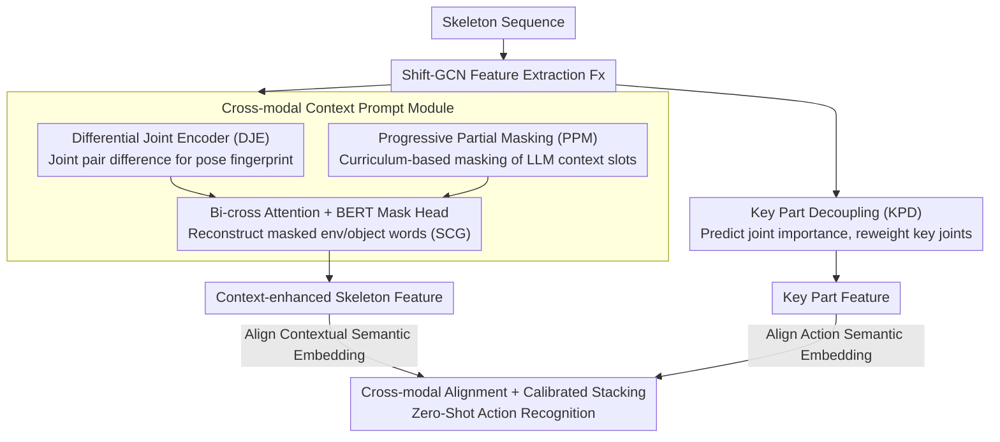

# SkeletonContext: Skeleton-side Context Prompt Learning for Zero-Shot Skeleton-based Action Recognition

**Conference**: CVPR 2026  
**arXiv**: [2603.29692](https://arxiv.org/abs/2603.29692)  
**Code**: [https://github.com/NingWang2049/skeletoncontext](https://github.com/NingWang2049/skeletoncontext)  
**Area**: Video Understanding / Action Recognition  
**Keywords**: Zero-Shot Action Recognition, Skeleton Sequences, Contextual Prompt Learning, Cross-modal Alignment, Key Part Decoupling

## TL;DR

Ours proposes the SkeletonContext framework, which reconstructs missing environmental and object contextual semantics from pre-trained language models via a cross-modal context prompt module. It further enhances the discriminativeness of motion-critical joints through a key part decoupling module, achieving SOTA performance on NTU-60/120 and PKU-MMD under Zero-Shot (ZSL) and Generalized Zero-Shot (GZSL) settings.

## Background & Motivation

1. **Background**: Zero-Shot Skeleton-based Action Recognition (ZSSAR) recognizes unseen classes by aligning skeleton features with text embeddings in a shared space. Existing methods focus on better skeleton encoders, data augmentation, or external knowledge enhancement.
2. **Limitations of Prior Work**: Skeleton sequences only contain joint coordinates and lack contextual cues such as objects and environments. Actions like "typing on a keyboard" and "writing on paper" exhibit highly similar skeleton motions, making them indistinguishable without contextual information like "keyboard" or "paper."
3. **Key Challenge**: There is an inherent semantic gap between the skeleton modality (naturally lacking context) and semantic descriptions (rich in context), which limits the effectiveness of direct alignment.
4. **Goal**: Inject language-driven contextual semantics into skeleton representations to bridge the cross-modal semantic gap.
5. **Key Insight**: Generate structured context descriptions (environment + object used + target object) using LLMs, and then train the model to "reconstruct" these contexts from skeleton motion, enabling the skeleton encoder to acquire context-awareness.
6. **Core Idea**: Enable the skeleton encoder to infer contextual semantics (e.g., interacting objects and environments) from motion patterns through masked reconstruction.

## Method

### Overall Architecture

This paper addresses the issue where skeleton sequences only contain joint coordinates without object or environment information, making actions with similar motions indistinguishable. The core idea is to let the skeleton encoder learn to "hallucinate" the missing context.

The workflow begins with a Shift-GCN extracting features from the skeleton sequence, followed by two branches. The **Cross-modal Context Prompt Module** captures fine-grained representations via a Differential Joint Encoder, which then interacts with masked context prompts (processed by BERT) through bi-directional cross-attention. A BERT mask prediction head is used to infer the missing context words (environment, objects), resulting in "context-enhanced skeleton features." Simultaneously, the **Key Part Decoupling Module** predicts a joint importance map to highlight key joints carrying the action. Finally, features from both branches are aligned with their respective semantic embeddings via contrastive learning.

### Key Designs

**1. Cross-modal Context Prompt Module: Inferring Objects and Environments**

While previous works (SCoPLe, Neuron) enhanced the text encoder to match the skeleton, they failed to fill the information gap on the skeleton side. Ours directly injects contextual semantics into the skeleton encoder. LLMs (ChatGPT-4) generate structured descriptions for each category: "In [environment], [body part] uses [object] to [sub-action] on [target object]". During training, slots for environment, object used, and target object are replaced with `[MASK]`. The skeleton features interact with BERT tokens via bi-directional cross-attention, and the BERT head reconstructs the masked words, supervised by a reconstruction loss $\mathcal{L}_{ccr}$. This mechanism, termed Semantic Context Grounding (SCG), forces contextual semantics into the skeleton representation.

**2. Differential Joint Encoder (DJE): Extracting Pose Fingerprints**

Fine-grained relative relationships between joints are crucial for contextual inference. This module pools skeleton features to a topological level, projects them as query and key, and calculates differential topological representations for all joint pairs:

$$A^{diff} = \phi(\mathcal{T}_1(H_x^Q) - \mathcal{T}_2(H_x^K))$$

The resulting difference matrix weights the original features to output a topologically enhanced embedding $F_x^{diff}$. Differential encoding explicitly extracts patterns like "bent waist" (implying a desk) or "hand to head" (implying head interaction).

**3. Progressive Partial Masking (PPM): Curriculum Learning for Reconstruction**

Reconstructing three slots simultaneously from skeletons is difficult and creates a distribution gap between structured prompts and BERT's natural language pre-training. A masked ratio $r_t$ that increases linearly with training steps is introduced:

$$r_t = \min(1, t/T)$$

Initially, $r_t$ is small, masking fewer slots to let the model rely on BERT's language prior. As training progresses, all slots are masked, forcing the model to infer the full context entirely from skeleton motion and language priors.

**4. Key Part Decoupling Module (KPD): Discriminativeness for Context-Free Actions**

For actions like "waving" or "bowing" that lack object interactions, context reconstruction might introduce noise. KPD serves as a backup for these "context-independent" actions. Given skeleton feature $F_x$, it predicts a joint importance map $K_{out}$ and produces part-level features $F_x^p = K_{out} \odot F_x$. A calibration loss $\mathcal{L}_{kpd} = \sum_t \lVert K_{out,t} - K_{gt} \rVert_2$ aligns predictions with a prior distribution $K_{gt}$ derived from LLM descriptions. This captures category-agnostic motion-part relationships that generalize to unseen classes.

### Loss & Training

Total loss: $\mathcal{L} = \mathcal{L}_{align} + \mathcal{L}_{ccr} + \mathcal{L}_{kpd}$:
- $\mathcal{L}_{align}$: Contrastive cross-entropy loss aligning context-enhanced features and key part features with their respective embeddings.
- $\mathcal{L}_{ccr}$: Masked context reconstruction loss supervising BERT to recover masked words.
- $\mathcal{L}_{kpd}$: Joint importance calibration loss guided by LLM-generated body part priors $K_{gt}$.

Inference utilizes calibrated stacking to mitigate domain shift in GZSL, aggregating predictions from both context and part branches.

## Key Experimental Results

### Main Results

ZSL Accuracy (%):

| Method | NTU-60 55/5 | NTU-60 48/12 | NTU-120 110/10 | NTU-120 96/24 |
|------|-------------|--------------|----------------|---------------|
| STAR (ACMM24) | 81.4 | 45.1 | 63.3 | 44.3 |
| Neuron (CVPR25) | 86.9 | 62.7 | 71.5 | 57.1 |
| FS-VAE (ICCV25) | 86.9 | 57.2 | 74.4 | 62.5 |
| **Ours** | **89.6** | **64.4** | 74.2 | 60.1 |

GZSL Harmonic Mean H (%):

| Method | NTU-60 55/5 | NTU-60 48/12 | NTU-120 110/10 | NTU-120 96/24 |
|------|-------------|--------------|----------------|---------------|
| ScoPLe (CVPR25) | 70.8 | 57.9 | 52.2 | 52.2 |
| Neuron (CVPR25) | 71.4 | 59.1 | 63.3 | 53.6 |
| FS-VAE (ICCV25) | 75.7 | 52.1 | 63.3 | 54.7 |
| **Ours** | **77.1** | **61.1** | 63.1 | **56.1** |

### Ablation Study

| DJE | SCG | PPM | KPD | NTU60-ZSL | NTU120-GZSL |
|-----|-----|-----|-----|-----------|-------------|
| ✗ | ✗ | ✗ | ✗ | 79.4 | 49.4 |
| ✓ | ✗ | ✗ | ✗ | 81.4 | 51.4 |
| ✓ | ✓ | ✗ | ✗ | 83.9 | 55.4 |
| ✓ | ✓ | ✓ | ✗ | 87.4 | 55.9 |
| ✓ | ✓ | ✓ | ✓ | **89.6** | **56.1** |

### Key Findings

- **Context reconstruction is the primary contribution**: SCG provides the largest jump (81.4→83.9 ZSL), and PPM stabilizes it further to 87.4.
- **Superior on Hard-Level similar classes**: Ours achieves 55.8% GZSL, outperforming Neuron by 12.0% and FS-VAE by 5.1%, validating the role of context inference in fine-grained discrimination.
- **Object-related slots (Use Object + Target Object) contribute more than the environment slot** (87.0 vs 84.4), as skeleton actions are largely defined by hand-object interactions.
- Performance on PKU-MMD (GZSL H-mean: 71.4%) surpasses the second-best (Neuron) by 2.2%.

## Highlights & Insights

- **Inverse Design - Enhancing Skeleton instead of Text**: Unlike prior works (SCoPLe, Neuron), SkeletonContext enhances the skeleton representation to carry contextual semantics, addressing information asymmetry at the source.
- **Knowledge Transfer via Masked Reconstruction**: Adapts masked reconstruction from vision-language pre-training (e.g., VL-BEiT) to the vision-less skeleton modality, allowing BERT's language knowledge to "flow" into the skeleton encoder.
- **Qualitative Interpretability**: The model can infer contextual objects like "keyboard" or "pen/paper" directly from skeletons during inference without any text input, demonstrating a learned motion-to-context mapping.

## Limitations & Future Work

- Dependency on the quality and template of LLM-generated descriptions.
- Only three context slots are considered, potentially missing fine-grained body-part interaction nuances.
- Shift-GCN is used as the base encoder; more advanced encoders (e.g., CTR-GCN, InfoGCN) might yield better results.
- On the NTU-120 110/10 split, it does not surpass FS-VAE (74.2 vs 74.4), suggesting diminishing returns for context enhancement in seen-class-heavy scenarios.

## Related Work & Insights

- **vs SCoPLe (CVPR25)**: SCoPLe uses joint text-skeleton prompts but does not introduce external context. SkeletonContext fills the information gap via reconstruction.
- **vs Neuron (CVPR25)**: Neuron uses multi-turn side information to guide alignment but operates at the alignment level. SkeletonContext injects context directly into the encoder side.
- **vs FS-VAE (ICCV25)**: FS-VAE decomposes frequency components, which is complementary to the contextual injection of this work.

## Rating

- Novelty: ⭐⭐⭐⭐ Using masked reconstruction for skeleton-side contextual injection is a novel perspective.
- Experimental Thoroughness: ⭐⭐⭐⭐⭐ Comprehensive splits across three datasets, GZSL+ZSL, hard-class analysis, and extensive ablations.
- Writing Quality: ⭐⭐⭐⭐ Clear logic, though some mathematical notation is slightly redundant.
- Value: ⭐⭐⭐⭐ Significant push for ZSSAR; the "enhance skeleton-side" strategy is highly generalizable.

<!-- RELATED:START -->

## Related Papers

- [\[ICCV 2025\] Frequency-Semantic Enhanced Variational Autoencoder for Zero-Shot Skeleton-based Action Recognition](../../ICCV2025/video_understanding/frequency-semantic_enhanced_variational_autoencoder_for_zero-shot_skeleton-based.md)
- [\[ECCV 2024\] SA-DVAE: Improving Zero-Shot Skeleton-Based Action Recognition by Disentangled Variational Autoencoders](../../ECCV2024/video_understanding/sa-dvae_improving_zero-shot_skeleton-based_action_recognition_by_disentangled_va.md)
- [\[CVPR 2026\] Exploring Adaptive Masked Reconstruction for Self-Supervised Skeleton-Based Action Recognition](exploring_adaptive_masked_reconstruction_for_self-supervised_skeleton-based_acti.md)
- [\[CVPR 2026\] Metadata-Aware Multi-Prompt Reasoning for Zero-Shot Accident Understanding](metadata-aware_multi-prompt_reasoning_for_zero-shot_accident_understanding.md)
- [\[CVPR 2026\] Protect to Adapt: Orthogonal Subspace Control with Ranked Negative-Prompt Curriculum for Few-Shot Action Recognition](protect_to_adapt_orthogonal_subspace_control_with_ranked_negative-prompt_curricu.md)

<!-- RELATED:END -->
