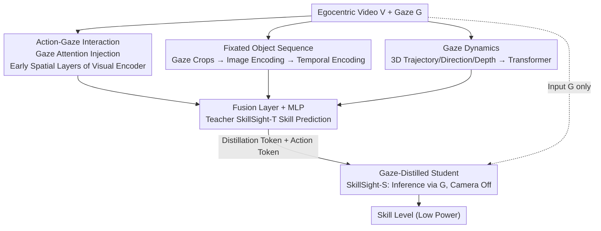

# SkillSight: Efficient First-Person Skill Assessment with Gaze

**Conference**: CVPR 2026  
**Paper**: [CVF Open Access](https://openaccess.thecvf.com/content/CVPR2026/html/Wu_SkillSight_Efficient_First-Person_Skill_Assessment_with_Gaze_CVPR_2026_paper.html)  
**Code**: None  
**Area**: Video Understanding  
**Keywords**: Egocentric Vision, Skill Assessment, Gaze, Knowledge Distillation, Smart Glasses Power Consumption

## TL;DR
SkillSight models skill levels using egocentric video + gaze. It first trains a teacher model on "Video + Gaze" to achieve SOTA, then distills it into a student model that uses **only gaze and turns off the camera** during inference. On three cross-domain datasets, it approaches or exceeds heavy video-based methods with 14–73x lower power consumption.

## Background & Motivation
**Background**: Performing "skill assessment" (judging proficiency in an activity) on smart glasses is considered valuable for immediate guidance, progress tracking, and identifying weaknesses. However, mainstream skill assessment relies on a **third-person perspective**—pre-installing cameras in the environment to capture human body poses.

**Limitations of Prior Work**: Third-person solutions require specialized environments and cannot follow users into the real world (courts, climbing walls, stages). A few egocentric works suffer from two major issues: ① Head-mounted cameras cannot see the wearer's full body, and visibility in dynamic scenes beyond a tabletop is poor; ② Continuous video recording is extremely power-hungry, conflicting with the requirements for "real-time interactive skill learning."

**Key Challenge**: There is a trade-off between power and accuracy: either use high-power continuous video for accuracy or save power by losing the fine-grained information needed for skill discrimination. Existing power-saving solutions (audio-triggered sampling, IMU + sparse frames) still require periodic camera activation, which incurs startup latency and instantaneous power spikes.

**Key Insight**: The authors hypothesize that **skill is reflected not only in "how to do" (video) but also in "how attention is allocated" (gaze)**. Cognitive science provides evidence that experts and novices have distinct gaze patterns (volleyball experts fixate on contact points earlier, soccer experts scan the surroundings more, and stable "quiet eye" gaze features exist in surgery, driving, and music). Gaze cameras are much more power-efficient than RGB cameras and protect privacy by only filming the eyes.

**Core Idea**: Train a teacher with "Video + Gaze," then **distill visual knowledge into gaze features** so the student model can infer skill levels using only gaze during inference—completely turning off the power-hungry RGB camera while retaining action semantics from the video.

## Method

### Overall Architecture
SkillSight is a **two-stage multimodal framework**. The first stage trains the teacher, SkillSight-T: it processes egocentric video $V$ and gaze $G$ simultaneously, using three complementary components to model "action-gaze interaction," "sequences of fixated objects," and "temporal gaze dynamics." Features from these three streams are concatenated for skill classification via a fusion layer. The second stage trains the student, SkillSight-S: using only gaze $G$ as input, it compresses the teacher's visual features into gaze representations through **knowledge distillation**, allowing the camera to remain off during inference.

The task is formalized as follows: a dataset $E=\{(V,G,S)\}$, where each sample contains egocentric video $V$, gaze signal $G$ (including 3D gaze point, 3D gaze direction, 2D projection $g_{2d}$, gaze depth, and glass translation/rotation), and skill level label $S$. Two settings are defined: Video+Gaze learns $F_v(V,G)\to S$ (=Teacher), and Gaze-only learns $F_g(G)\to S$ (=Student, using video during training but only gaze during inference).

### Key Designs

**1. Action-Gaze Interaction: Injecting Gaze Attention into Early Spatial Layers**

This component addresses the issue that "the camera knows what is seen but not where one is looking." The authors use 2D gaze coordinates $g_{2d}^t$ to locate the fixated area in frame $t$ and construct a Gaussian attention map to inject into the **first spatial encoder layer** $f_{V,0}$ of a TimeSformer. Specifically, each frame is divided into $p^2$ patches of size $L\times L$. A Gaussian kernel $A_g^t[m,n]=\exp(-d_c^t(m,n)/2\sigma^2)$ is centered on the patch $c^t=\lfloor g_{2d}^t/L\rfloor$ corresponding to the gaze point (after normalization, $d_c^t(m,n)=\|(m,n)-c^t\|_2$). This is then superimposed on the original attention map: $A_m^t=\sigma(A_v^t+\beta_c A_g^t)$, where $\beta_c$ is a learnable weight per scene (basketball, soccer, etc.), resulting in the embedding $e_v=f_V(V,g_{2d})$.

Unlike prior gaze-action methods that pool gaze on late-stage features, this approach emphasizes highlighting gaze regions during the **earliest spatial encoding stage**, allowing the model to semantically highlight the fixation point and capture the association between "visual focus and action" from the start.

**2. Fixated Object Sequence: Reflecting Differences in Objects Viewed by Experts vs. Novices**

The authors observe a highly discriminative phenomenon: **the distribution of fixated objects differs significantly** across skill levels. Novice pianists gaze at their hands much more frequently (77%) than experts (45%), who look more at the score; climbing experts show greater gaze depth (1.4m vs. 1.1m) as they analyze upcoming moves. Thus, gaze-centered regions $v_c^t$ are cropped based on $g_{2d}^t$ to serve as proxies for "fixated objects."

The key treatment is: the authors **do not process the crop sequence as a video**, as crops from different frames are not spatially aligned. Instead, they use a pre-trained image encoder $f_I$ (DINOv2) to extract semantic embeddings for each crop, followed by a temporal encoder $f_T$ to model sequence-level relations, obtaining $e_c=f_T([f_I(v_c^1),\dots,f_I(v_c^T)])$. This retains the semantics of "which objects were viewed and how they switched" while avoiding spatial misalignment issues.

**3. Gaze Dynamics: Explicitly Encoding Fixation Frequency, Saccade Speed, and 3D Changes**

The first two components answer "what is being looked at" but do not explicitly reflect **how the gaze moves**—fixation frequency, saccade speed, and displacement in the 3D environment, which vary greatly across skill levels. $G_i$ already contains rich 3D information about subject trajectory, gaze direction, and depth. The authors use a transformer encoder $f_g$ to process this, yielding $e_g=f_g(G)$. To avoid biases like "subject orientation," all gaze signals are **normalized relative to the first frame**. The three feature streams are concatenated and passed through a fusion layer $f_m$ (3-layer MLP) for teacher prediction $\hat S=f_m([e_v,e_c,e_g])$, trained with standard cross-entropy $L_{CE}$.

**4. Gaze-only Distillation Student: Compressing Visual Knowledge into Gaze for Camera-Off Inference**

This is the core of power saving. The authors argue that "visual cues can be embedded into gaze signals" because humans exhibit consistent gaze patterns when observing specific objects or performing specific actions. In skill scenarios, actions, environments, and relevant objects are highly aligned (cooking = kitchen + spatula, shooting = court + hoop), allowing gaze to naturally carry substantial visual information. The student $f_s$ is a transformer encoder that only takes $G$ but uses a multi-branch token design: $\hat e_s,\hat S,\hat a=f_s([t_{cls},t_{dis},t_{act},G])$, where the distillation token $t_{dis}$ aligns with teacher features and the action recognition token $t_{act}$ predicts sub-tasks (e.g., dribbling, free throws) to assist skill judgment. The distillation loss is $L_{dis}=\|f_p(\hat e_s)-f_t([e_v,e_c,e_g])\|_1$, with projection layers $f_p, f_t$ aligning features and filtering modality-specific signals. The total loss is $L_{student}=L_{CE}+\lambda_{dis}L_{dis}+\lambda_{act}L_{act}$. Student inference takes only 1.6ms per sample.

### Loss & Training
The teacher is trained using SGD for 15 epochs (lr $5\times10^{-3}$, batch size 8), and the student using AdamW for 10 epochs (lr $1\times10^{-4}$, batch size 32) on 8x RTX 6000 GPUs. Videos are segmented into 10 clips per EgoExo4D protocol, and predictions are averaged. Both process 16-frame clips at 2 FPS. $f_V$ is a TimeSformer pre-trained with EgoVLPv2, $f_I$ is DINOv2, and $f_s/f_g$ are 4-layer 768-dim transformers.

## Key Experimental Results

Three datasets: Ego-Exo4D (Soccer, Basketball, Climbing, Dance, Music, Cooking; 4 skill levels), Multi-Sense Badminton (MSB; 3 levels), and Expert-Novice Soccer (2 levels; no video, teacher trained with body joints + gaze). Accuracy metrics (%).

### Main Results

| Method | Modality | Power (mW) | EgoExo4D Overall | MSB |
|------|------|---------|------------------|-----|
| TimeSformer | V | 697.5 | 45.5 | 50.5 |
| Skillformer | V | 697.5 | 42.4 | 44.0 |
| EgoExoLearn | V+G | 141.4 | 42.3 | 31.7 |
| Beholder | V+G | 132.4 | 34.1 | 30.6 |
| **SkillSight-T** | V+G | 943 | **50.1** | **53.1** |
| X3D-XS | V | 88 | 34.2 | 42.7 |
| EgoDistill | V+I | 16.5 | 42.6 | 43.4 |
| EgoTrigger | V+A | 9.9 | 34.1 | — |
| Gaze-only | G | 9.5 | 37.0 | 42.3 |
| **SkillSight-S** | G | 9.5 | **44.4** | 47.0 |

Teacher SkillSight-T achieves the best accuracy in all scenarios, outperforming the best video method TimeSformer by 5% absolute (10% relative) on EgoExo4D. The student SkillSight-S uses only gaze with 9.5mW power, achieving 44.4% accuracy, outperforming **all low-power baselines** and leading in 5 out of 7 scenarios. Even compared to heavy video methods, it ranks second while saving 14–73x power. On Expert-Novice Soccer, SkillSight-S exceeds both Gaze-only (66.0) and Body-motion-only baselines (which require IMUs).

### Ablation Study

| Configuration / Comparison | Key Result | Description |
|------|---------|------|
| SkillSight-T vs. Naive End-to-End | +8% | Fusion of three components is significantly better than direct end-to-end. |
| SkillSight-S vs. Gaze-only Baseline | 37.0→44.4 | Distillation effectively compresses teacher's visual knowledge into gaze (+7.4%). |
| SkillSight-S vs. TimeSformer | Power ↓73×, Acc ↓1.1% | Optimal trade-off between power and accuracy. |
| SkillSight-S vs. EgoDistill (Best low-power) | Power ↓43% | Higher accuracy with even lower power consumption. |

Power consumption is estimated using smart glasses hardware parameters: $P=\omega N/T+\rho B/T+\sum_m \vartheta_m\varsigma_m$ ($\omega$=4.6pJ/MAC computation, $\rho$=80pJ/byte memory, $\vartheta_{rgb}$=35mW vs. $\vartheta_{eye}$=7.8mW sensor activation), quantifying the saving from turning off the RGB camera.

### Key Findings
- **Gaze itself is a highly concentrated skill signal**: The gaze-only student approaches heavy video methods, showing that gaze encodes "what to see + how to move attention" sufficiently; purely visual power-saving methods (X3D-XS, EgoDistill single-frame, EgoTrigger audio-trigger) fail to learn consistent cross-scene skill patterns.
- **Early spatial layer injection > Late pooling**: Highlighting the gaze region in the first spatial encoder layer captures "visual focus-action" associations better than pooling gaze on late-stage features.
- **Crops as semantic sequences, not video**: Since crops are misaligned, using DINOv2 for semantic extraction followed by temporal modeling avoids the alignment issues of treating them as video.
- **Failure Case**: In scenarios like vegetable cutting where skill depends on subtle hand movements and gaze does not reflect proficiency, gaze-only systems struggle (indicated in Figure 4).

## Highlights & Insights
- **The "camera-off skill estimation" distillation perspective is clever**: The core argument is that in skill scenarios, action-environment-object alignment allows video information to be compressed into gaze, turning a power-saving engineering problem into a representation learning problem backed by cognitive science.
- **Transferable tricks**: Gaussian gaze attention injection into early spatial layers, multi-branch student tokens (distillation + action), and treating variable-position crops as "semantic sequences" rather than video can be applied to other egocentric tasks.
- **Model feedback for psychology**: SkillSight-S predictions of expert/novice gaze differences in basketball (hoop vs. ball), climbing (longer action-related fixations), and piano (more frequent score-hand switching) align with and refine existing psychological findings.

## Limitations & Future Work
- **Inability to capture subtle hand movements**: The authors acknowledge that gaze does not reflect skill in tasks like cutting, which is an inherent upper bound for gaze-only solutions.
- **Dependency on high-quality gaze sensing**: The method requires rich signals (3D gaze point, depth, glasses pose) from eye-tracking cameras/IR/IMU; information is weaker on MSB with only 2D gaze (student is ~6% weaker than teacher on MSB).
- **Classification vs. Regression**: The task is framed as discrete skill level classification (aligned with existing labels); fine-grained continuous scoring is left for future work.
- **Teacher inference is still heavy**: SkillSight-T at 943mW is higher than pure video methods; power saving relies entirely on the student; the distillation gap (44.4 vs. 50.1) suggests room for improvement.

## Related Work & Insights
- **vs. EgoExoLearn / Beholder (V+G)**: These limit processing to visual areas around the gaze; they work when gaze is on hands but fail when gaze moves away (e.g., looking at a wall in climbing). SkillSight explicitly models gaze dynamics and object sequences to avoid this.
- **vs. [37] (Prior gaze-skill work)**: It was only validated on static tabletop tasks (cooking, lab); SkillSight extends gaze skill assessment to dynamic, large-scale outdoor scenes.
- **vs. EgoDistill (V+I) / EgoTrigger (V+A)**: These still rely on periodic visual input, incurring camera startup latency and power spikes, and struggle to distinguish subtle actions with single frames. SkillSight does not use the camera during inference and achieves better accuracy at lower power.

## Rating
- Novelty: ⭐⭐⭐⭐⭐ First to systematically use gaze as a cross-domain, low-power, privacy-preserving egocentric skill signal; novel distillation perspective.
- Experimental Thoroughness: ⭐⭐⭐⭐ Three datasets, multiple baselines, power quantification, qualitative + psychological analysis. Some ablations are in the supplement.
- Writing Quality: ⭐⭐⭐⭐ Clear connection between motivation and cognitive science; well-structured components.
- Value: ⭐⭐⭐⭐⭐ Paves the way for real-time skill learning on smart glasses; 14–73x power reduction is highly practical.

<!-- RELATED:START -->

## Related Papers

- [\[CVPR 2026\] Affordance-First Decomposition for Continual Learning in Video–Language Understanding](affordance-first_decomposition_for_continual_learning_in_video-language_understa.md)
- [\[CVPR 2026\] MDS-VQA: Model-Informed Data Selection for Video Quality Assessment](mds-vqa_model-informed_data_selection_for_video_quality_assessment.md)
- [\[CVPR 2026\] Enhancing Accuracy of Uncertainty Estimation in Appearance-based Gaze Tracking with Probabilistic Evaluation and Calibration](enhancing_accuracy_of_uncertainty_estimation_in_appearance-based_gaze_tracking_w.md)
- [\[ACL 2026\] VISTA: Verification In Sequential Turn-based Assessment](../../ACL2026/video_understanding/vista_verification_in_sequential_turn-based_assessment.md)
- [\[ICCV 2025\] Multi-modal Multi-platform Person Re-Identification: Benchmark and Method](../../ICCV2025/video_understanding/multi-modal_multi-platform_person_re-identification_benchmark_and_method.md)

<!-- RELATED:END -->
