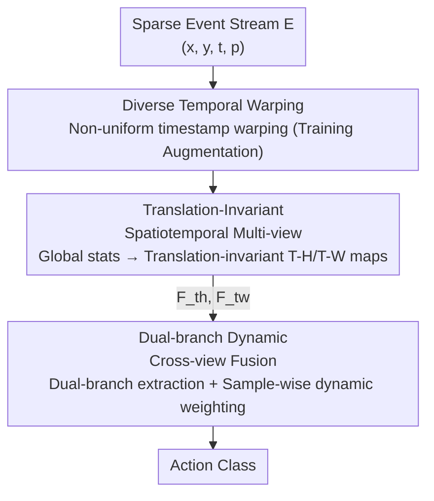

# SMV-EAR: Bring Spatiotemporal Multi-View Representation Learning into Efficient Event-Based Action Recognition

**Conference**: CVPR 2026  
**Paper**: [CVF Open Access](https://openaccess.thecvf.com/content/CVPR2026/html/Fan_SMV-EAR_Bring_Spatiotemporal_Multi-View_Representation_Learning_into_Efficient_Event-Based_Action_CVPR_2026_paper.html)  
**Code**: https://github.com/Fineshawray/SMV-EAR  
**Area**: Video Understanding / Event-Based Action Recognition  
**Keywords**: Event Camera, Action Recognition, Multi-view Representation, Translation Invariance, Dynamic Fusion

## TL;DR
For Event-Based Action Recognition (EAR), rather than aggregating events into H-W frames along the temporal axis, this paper projects them along the H/W axes into two "temporal views" (T-H and T-W). It systematically re-engineers three stages: representation (translation-invariant TISM), fusion (dual-branch dynamic fusion DDCF), and augmentation (diverse temporal warping DTW). Ours achieves Top-1 gains of +7.0%/+10.7%/+10.2% on three EAR benchmarks while reducing parameters by 30.1% and computation by 35.7%.

## Background & Motivation

**Background**: Event cameras record brightness changes asynchronously with microsecond temporal resolution, naturally capturing motion dynamics while being privacy-friendly and low-power. Current mainstream EAR approaches perform temporal binning on sparse H-W-T events to cluster them into a stack of "frame-like" images for processing with mature 2D or video models.

**Limitations of Prior Work**: Although aggregating events into H-W frames matches human intuition, it buries the most critical temporal motion cues "between frames." Since the number of frames is finite, continuous physical actions are discretized into a few snapshots, discarding fine-grained temporal dynamics during binning. Existing Spatiotemporal Multi-View Representation Learning (SMVRL) methods (e.g., MVF-Net for EOR) proposed a promising idea: projecting events along H and W axes so that motion cues reside within T-W and T-H "temporal view" images (motion within images, rather than between them). However, applying this directly to EAR suffers from two major flaws: (i) performing spatial binning on the H/W axes causes the projection result to change based on "where in the image" an action occurs, making the representation **translation-variant** and allowing position to interfere with discriminative features; (ii) using **early concatenation** of T-H and T-W maps followed by a shared branch ignores the fact that the two views have misaligned dimensions ($H \neq W$) and different semantics (horizontal vs. vertical motion), failing to exploit cross-view complementarity.

**Key Challenge**: T-H/T-W multi-view representations have potential for EAR, but "adhering to the temporal binning paradigm" conflicts with the inherent structure of this representation—binning breaks spatial translation invariance, and concatenation flattens view heterogeneity.

**Goal**: Re-examine several key design stages of applying SMVRL to EAR, specifically addressing representation, architecture, and augmentation.

**Core Idea**: For representation, replace binning with **global unbinned** statistics to achieve translation invariance (TISM). For fusion, use **dual-branch post-fusion with sample-wise dynamic weighting** to respect and exploit view heterogeneity (DDCF). Finally, introduce a temporal warping augmentation (DTW) that **simulates real-world action speed variations**.

## Method

### Overall Architecture
The input to SMV-EAR is a sparse event stream $E=\{(x_k,y_k,t_k,p_k)\}$, and the output is the action category. The pipeline is linked by three contributing modules: first, **TISM** projects events along H and W axes and converts them into two translation-invariant 2D feature maps $\{F_{th}, F_{tw}\}$ (from T-H and T-W views, respectively); then, **DDCF** uses two independent ResNet branches to extract logits for each view and fuses them using dynamic weighting derived from sample-wise cross-view attention to produce the final prediction; during training, **DTW** augmentation is added, performing non-uniform warping on event timestamps to simulate different action speeds, further improving test accuracy. Notably, the HW view ($F_{hw}$) is intentionally discarded to save computation, as it primarily contains spatial context of "where the action is" rather than temporal motion cues.

### Key Designs

**1. TISM: Achieving Translation-Invariant Multi-view Representation via Global Unbinned Statistics**

The limitation is straightforward—the action type should be independent of its position in the image, but spatial binning causes projections to drift with position, breaking translation invariance. Ours decomposes the view encoding function into three optional components: window function $w_c$, measurement function $m_c$, and aggregation function $a_c$, i.e., $F_c=a_c(m_c(w_c(E)))$. For view $v$, let $z_v$ be its orthogonal axis (x for T-H, y for T-W); translation invariance requires $F_v(E\mid z_v)=F_v(E\mid z_v+\Delta z_v)$ for any displacement $\Delta z_v$. Through derivation (details in supplements), the authors identify a feasible combination: (i) the **window must be a global, unbinned $w_0$**; (ii) measurements involving the $z$ dimension are only translation-invariant under variance aggregation, but since variance is computationally expensive (second-order moment), first-order sums are used instead. The final selection is a compact two-channel combination:

$$F_v = [\,\mathrm{sum}(c(w_0(E))),\ \mathrm{sum}(p(w_0(E)))\,]\in\mathbb{R}^{2\times U\times V}$$

Each view retains only two maps: "global event count $c$" and "global polarity sum $p$" ($U \times V$ is the 2D resolution of the view). This ensures translation invariance and compresses the representation. t-SNE visualizations (Fig. 6 in the paper) show that this global, translation-invariant encoding makes the feature space more separable.

**2. DDCF: Dual-branch Independent Extraction + Sample-wise Dynamic Weighted Post-fusion**

The limitation is that early concatenation flattens dimensional misalignment and semantic differences between T-H and T-W views. Ours shifts to dual-branch post-fusion: each view map passes through a ResNet to obtain logits $L_v=R_v(F_v)$, then fused as $L=\mathcal{F}([L_{th},L_{tw}])$. The authors further observe that the discriminative power of the two views varies per sample even within the same action class (e.g., "Jump up" in Fig. 7: some samples are clear in W but blurry in H, and vice-versa). Thus, fixed-weight fusion (logit averaging, view-level or class-level weighting) is insufficient; **sample-wise** adaptation is required:

$$L = w_{th}(E)\,L_{th} + w_{tw}(E)\,L_{tw}$$

Weights $[w_{th},w_{tw}]=\mathcal{L}(\mathcal{T}(S))$ are learned neither from the input/intermediate features (mismatched dimensions and high cost) nor from final logits (too compressed), but from semantic vectors $S_v \in \mathbb{R}^{512}$ obtained via global pooling before the classification heads. Specifically, $S=[S_{th},S_{tw}]$ is fed into a multi-head attention block $\mathcal{T}(\cdot)$ to model cross-view complementarity, followed by a linear layer for weights. Ablations show this Sample-wise Weighting (SW) outperforms early concatenation by +10.8% and view/class-level weighting by approximately 2%.

**3. DTW: Simulating Action Speed Variation via Diverse Temporal Warping**

Existing event augmentations (random drop, spatial transforms, occlusions, mixing) rarely generate complex, non-uniform temporal dynamics, yet real human actions naturally vary in speed. DTW performs non-uniform warping directly on **sparse event timestamps** (rather than frame indices) using a warping function $\mathcal{W}:\{t_k\}\to\{t'_k\}$ with an instantaneous speed scaling factor $s(t)=\frac{d\mathcal{W}(t)}{dt}$: $s(t)>1$ causes local deceleration (events become sparser) and $s(t)<1$ causes acceleration (events become denser). The algorithm randomly selects $l$ non-overlapping intervals ($l=4$ in experiments), chooses a function (identity / linear / power / exponential / cosine) for each, and samples an amplitude, stitching segments to ensure temporal continuity. These functions maintain temporal order, unlike FlipT which reverses causality. Since it operates on timestamps, warping remains consistent across different views—a geometric constraint frame-based methods cannot easily satisfy.

## Key Experimental Results

### Main Results

On three EAR benchmarks (HARDVS, DailyDVS-200, THU-EACT-50-CHL), Ours significantly outperforms the baseline SMVRL method MVF-Net with higher efficiency:

| Dataset | Metric | SMV-EAR(Ours) | MVF-Net(Baseline) | Gain |
|--------|------|------|----------|------|
| HARDVS | Top-1(%) | 59.63 | 52.61 | +7.0 |
| DailyDVS-200 | Top-1(%) | 54.65 | 43.98 | +10.7 |
| THU-EACT-50-CHL | Top-1(%) | 66.7 | 56.5 | +10.2 |
| HARDVS | MACs / Params | 1.8G / 23.5M | 2.8G / 33.6M | MACs −35.7% / Params −30.1% |

Note: SMV-EAR in the table refers to the version with DTW augmentation. SMV-EAR* refers to the version without augmentation (HARDVS Top-1 55.63%). Using ResNet18 as a backbone, Ours exceeds multi-view methods (CoST, MVFNet) that use ResNet50.

### Ablation Study

Incremental addition of the three contributions (THU-EACT-50-CHL, Baseline MVF-Net 56.5%):

| Configuration | Top-1(%) | FLOPs | Params | Description |
|------|---------|-------|--------|------|
| MVF-Net (Baseline) | 56.5 | 5.6G | 33.6M | Early concat + Spatial binning |
| + TISM | 59.4 | 5.5G | 33.6M | Translation-inv representation, +2.9% |
| + TISM, DDCF | 62.9 | 3.6G | 23.5M | Dual-branch dynamic fusion, +3.5% & efficient |
| + All (Add DTW) | 66.7 | 3.6G | 23.5M | Augmentation +3.8% |

Ablation of DDCF internal fusion strategies (T-H/T-W dual-branch):

| Fusion Method | Top-1(%) | Description |
|---------|---------|------|
| EC (Early Concat) | 55.9 | Baseline style concatenation |
| LA (Logits Average) | 64.3 | Fixed weight |
| VW (View-level Weight) | 64.8 | Fixed weight |
| CW (Class-level Weight) | 65.2 | Fixed weight |
| SW (Sample-wise Weight) | 66.7 | Dynamic (Ours), Optimal |

### Key Findings
- **Contributions are nearly orthogonally complementary**: TISM/DDCF/DTW contribute +2.9%/+3.5%/+3.8% respectively with no significant conflicts. DDCF improves accuracy while cutting parameters from 33.6M to 23.5M and computation from 5.6G to 3.6G.
- **View selection confirms discarding HW**: Using $F_{hw}$ alone yields only 35.6%, while $F_{th}$ alone reaches 60.9%. Adding $F_{hw}$ to create a triple-view model (67.0%) barely improves over the T-H+T-W dual-view model (66.7%) despite doubling computation—proving the HW view is largely redundant for EAR.
- **Significant Translation Robustness**: After injecting $\pm 40\text{px}$ spatial translation, MVF-Net drops from 56.5% to 46.1%, while SMV-EAR only drops slightly from 66.7% to 64.9%, validating the translation-invariant design of TISM.
- **Failure Cases**: Camera motion remains difficult (relative to SlowFast −2.9%) because dense background events occlude action patterns in temporal maps. The authors observe that ego-motion appears as nearly linear streaks in temporal maps, suggesting a potential prior for decoupling foreground actions from background motion.

## Highlights & Insights
- **Coordinate System Shift as System Engineering**: The core insight is that "motion cues belong inside images, not between frames." Realizing this required solving translation invariance in representation and view heterogeneity in fusion—Ours re-engineers all design stages rather than proposing a single trick.
- **Clean Formalization of Translation Invariance**: Decomposing encoding into window/measure/aggregation and screening combinations via a displacement invariance equation is elegant and transferable to other event representation designs.
- **Evidence-based Dynamic Fusion**: The motivation for sample-wise weighting is supported by specific observations (e.g., the "Jump up" example), making the "adaptive fusion" claim much more persuasive.
- **Timestamp-level DTW**: By operating directly on sparse timestamps, DTW ensures geometric consistency across views—a constraint impossible to maintain with frame-based methods.

## Limitations & Future Work
- **Degradation in Camera Motion Scenes**: Dense background events occlude actions. The authors acknowledge this as a weakness and suggest a "linear streak prior" without a concrete solution.
- **Cost of Discarding HW View**: For tasks requiring spatial appearance (e.g., multi-subject or non-human actions), discarding $F_{hw}$ may no longer be appropriate. Ours is limited to general human action recognition.
- **Minimalist TISM Representation**: Using only two channels (count + polarity) favors efficiency and invariance but may lose info for fine-grained actions. Variance channels are more accurate (+0.4%) but were discarded for speed.
- **DTW Hyperparameters**: The number of intervals ($l=4$) and warping amplitudes were determined experimentally. Stability across datasets is primarily discussed in supplements.

## Related Work & Insights
- **vs MVF-Net [8] (Direct Baseline)**: Both use T-H/T-W multi-views, but MVF-Net uses spatial binning (translation-variant) and early concatenation (shared branch). Ours uses global translation-invariant representations and dual-branch sample-wise dynamic post-fusion, gaining +7~10% with lower cost.
- **vs Frame-based EAR (ESTF, EV-ACT, etc.)**: These aggregate events into H-W frames; temporal cues are hidden between frames and limited by frame count. Ours encodes temporal cues into single view maps, better fitting continuous motion.
- **vs Spike/Point Cloud/Graph methods (SDT, EventMamba, EventMG)**: Those maintain sparsity and high efficiency but struggle with accuracy and hardware support. Ours uses a compact 2D representation with standard ResNets, balancing accuracy and hardware friendliness.
- **vs Video Temporal Augmentation**: Sampling or jittering operates on dense frame intervals. DTW warps sparse event timestamps non-uniformly while maintaining cross-view consistency, which is unique to the event domain.

## Rating
- Novelty: ⭐⭐⭐⭐ Systematizes the insight of "coordinate projection" into three design stages. Formalization of translation invariance is innovative, though built on existing SMVRL.
- Experimental Thoroughness: ⭐⭐⭐⭐⭐ Comprehensive coverage across three benchmarks, incremental ablations, view selection, fusion strategy, translation robustness, and fine-grained analysis.
- Writing Quality: ⭐⭐⭐⭐ Clear logical chain and specific motivations. Formulas and figures work well together, though some key derivations are relegated to supplements.
- Value: ⭐⭐⭐⭐ Simultaneously improves accuracy and reduces parameters/computation in EAR; concepts (view selection + invariance + dynamic fusion) are transferable.

<!-- RELATED:START -->

## Related Papers

- [\[CVPR 2026\] Seeing Motion Through Polarity for Event-based Action Recognition](seeing_motion_through_polarity_for_event-based_action_recognition.md)
- [\[CVPR 2026\] MER-Tracker: Towards High-Speed 3D Point Tracking via Multi-View Event-RGB Hybrid Cameras](mer-tracker_towards_high-speed_3d_point_tracking_via_multi-view_event-rgb_hybrid.md)
- [\[CVPR 2026\] DarkShake-DVS: Event-based Human Action Recognition under Low-light and Shaking Camera Conditions](darkshake-dvs_event-based_human_action_recognition_under_low-light_and_shaking_c.md)
- [\[CVPR 2026\] SHANDS: A Multi-View Dataset and Benchmark for Surgical Hand-Gesture and Error Recognition Toward Medical Training](shands_a_multi-view_dataset_and_benchmark_for_surgical_hand-gesture_and_error_re.md)
- [\[AAAI 2026\] SUGAR: Learning Skeleton Representation with Visual-Motion Knowledge for Action Recognition](../../AAAI2026/video_understanding/sugar_learning_skeleton_representation_with_visual-motion_knowledge_for_action_r.md)

<!-- RELATED:END -->
