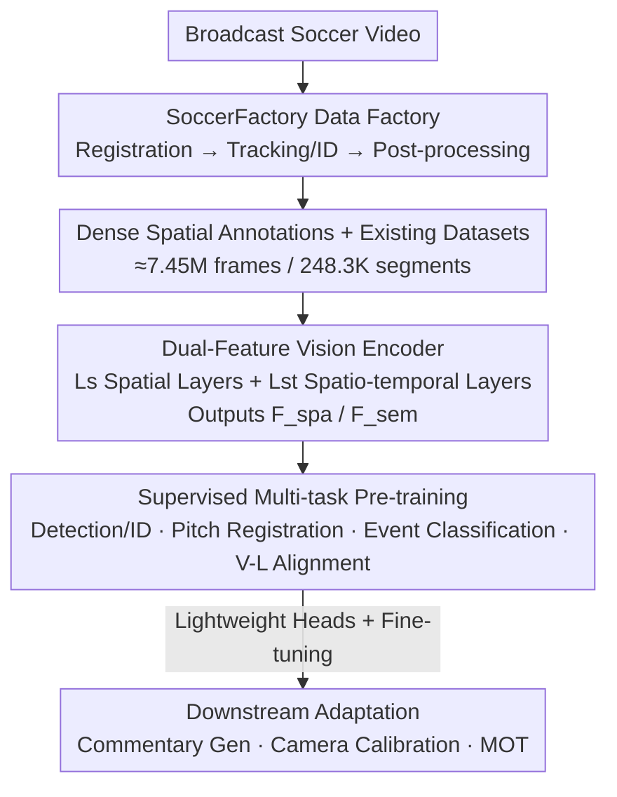

# SoccerMaster: A Vision Foundation Model for Soccer Understanding

**Conference**: CVPR2026  
**arXiv**: [2512.11016](https://arxiv.org/abs/2512.11016)  
**Code**: https://haolinyang-hlyang.github.io/SoccerMaster (Project homepage; data/code/models promised to be open-sourced)  
**Area**: Video Understanding / Vision Foundation Models  
**Keywords**: Soccer Understanding, Vision Foundation Models, Multi-task Pre-training, Spatio-temporal Attention, Automated Data Annotation

## TL;DR
SoccerMaster utilizes a shared spatio-temporal ViT encoder and five lightweight task heads to integrate four categories of "spatial perception + semantic reasoning" tasks—player detection/identification, pitch registration, event classification, and vision-language alignment—into a single supervised multi-task pre-training stage. Supported by an automated annotation pipeline, SoccerFactory, which mass-produces dense spatial labels, the model outperforms general vision foundation models (SigLIP 2 / DINOv3) and specialized soccer models (MatchVision) across downstream tasks such as detection, tracking, camera calibration, and commentary generation.

## Background & Motivation

**Background**: Soccer vision understanding has gained significant traction, but the mainstream approach relies on "one expert model per task"—separate networks for detection, tracking, jersey number identification, and commentary generation. This fragmentation leads to high exploration costs, requiring new data collection and model tuning for every additional task.

**Limitations of Prior Work**: A few attempts at "unified models" (e.g., MatchVision/UniSoccer) follow a "vision-language alignment" route. These models optimize almost exclusively for semantic-level objectives during pre-training, **ignoring dense spatial supervision**. Consequently, the models can "describe" what is happening (semantics) but cannot "point out" where entities are (spatial), creating a gap between spatial perception and semantic reasoning. The paper quantifies this: MatchVision achieves only 17.0 mAP in player detection, far below the 49.5 achieved by the proposed method.

**Key Challenge**: Soccer understanding inherently suffers from a dichotomy between "spatial perception" and "semantic reasoning." The former requires geometric precision (player bounding boxes, pitch keypoints, camera parameters), while the latter requires high-level abstraction (event categories, commentary text). Training these objectives separately prevents cross-representation learning. Conversely, joint training is hindered by the lack of large-scale datasets containing both dense spatial labels and precise temporal semantics; while the SoccerNet series is comprehensive, its annotations are tailored for isolated tasks and lack dense spatial labels specifically for broadcast views.

**Goal**: (1) To create a unified soccer vision foundation model where a single encoder representation serves both spatial perception and semantic reasoning; (2) To overcome the bottleneck of scarce dense spatial labels to facilitate multi-task pre-training.

**Key Insight**: The authors hypothesize that by **simultaneously** optimizing for "pitch geometry" and "match semantics" during pre-training, the shared encoder is forced to develop multi-granularity representations that understand both position and meaning. The scarcity of spatial labels can be addressed by "distilling" broadcast videos through an automated pipeline composed of existing expert models (YOLOv8 / ReID / SAM2 / Qwen2.5-VL / PnL).

**Core Idea**: Replace the "one model per task" paradigm with "one spatio-temporal encoder + multi-task supervised pre-training," and use an automated annotation pipeline to supplement missing dense spatial supervision.

## Method

### Overall Architecture
The SoccerMaster pipeline operates on two tracks: The **Data Track** uses the automated pipeline SoccerFactory to convert broadcast videos into dense annotations (boxes, jersey numbers, pitch keypoints, camera parameters). These are merged with existing datasets (SoccerNet-GSR/v2, MatchTime, SoccerReplay-1988) to form a pre-training pool of approximately 7.45 million frames and 248,300 video segments (2.75M frames for spatial perception, 4.71M frames for semantic reasoning). The **Model Track** uses a ViT encoder to extract both "spatial features $\mathcal{F}_{\mathrm{spa}}$" and "semantic features $\mathcal{F}_{\mathrm{sem}}$" from video segments. These features are fed into five lightweight task heads for supervised multi-task pre-training. After pre-training, the model is adapted to downstream tasks (commentary generation, camera calibration, multi-object tracking) using minimal head adjustments or fine-tuning.

The encoder input consists of $T{=}30$ frames at $512{\times}512$ resolution. It comprises $L_s{=}16$ layers of pure spatial attention blocks followed by $L_{st}{=}8$ layers of spatio-temporal attention blocks (hidden dimension 1024, initialized from siglip2-large-patch16-512). The first $L_s$ layers perform only intra-frame spatial self-attention, outputting spatial features $\mathcal{F}_{\mathrm{spa}}\in\mathbb{R}^{T\times h\times w\times d}$ that preserve fine-grained details. The final $L_{st}$ layers employ TimeSformer-style "temporal attention + spatial attention" alternation, followed by MAP attention pooling to obtain global dynamic semantic features $\mathcal{F}_{\mathrm{sem}}\in\mathbb{R}^{T\times d}$. Spatial features are fed to the detection and pitch registration heads, while semantic features are fed to the event classification and alignment heads—enabling "one encoder, two granularities."

### Key Designs

**1. SoccerFactory Automated Data Factory: Scaling Dense Spatial Labels**

To address the bottleneck of scarce and expensive broadcast-view spatial annotations, the authors chain multiple expert models into a three-stage pipeline. **Stage 1: Pitch Registration**: Following the GSR approach, keypoint/line detectors establish geometric correspondence between images and pitch coordinates, followed by a PnL module to estimate camera parameters. Projections from a standard pitch are then used to refine keypoints. **Stage 2: Tracking and Identification**: YOLOv8 fine-tuned on soccer data detects players/goalkeepers/referees, followed by StrongSORT and PRTReID embeddings for tracking. Each crop is processed by Qwen2.5-VL to identify roles and jersey numbers, filtered by a readability classifier for occlusions. Team affiliation is determined via tracklet-level ReID embeddings clustered in pitch coordinates. **Stage 3: Post-processing**: SAM2 segmentation recovers missed detections and corrects ID switches. Roles and numbers are finalized via majority voting within tracklets to ensure temporal consistency, and fragmented tracks are merged using ReID and number consistency. This pipeline produces a complete set of "player boxes + roles + teams + numbers + pitch keypoints + camera parameters + pitch coordinate trajectories," scaling dense spatial supervision effectively.

**2. Dual-Granularity Spatio-Temporal Encoder: Unified ViT for Space and Semantics**

To overcome the need for separate models, the encoder uses a hierarchical design to produce two granularities of features in a **single forward pass**. The bottom $L_s$ layers perform intra-frame spatial self-attention $\mathbf{z}_{t,i}^{(l+1)}=\mathrm{SpatialAttn}(\mathbf{z}_{t,i}^{(l)},\{\mathbf{z}_{t,j}^{(l)}\}_{j=1}^{N})$, where tokens only interact within the same frame. This preserves the geometric detail required for detection/registration, and the output serves as $\mathcal{F}_{\mathrm{spa}}$. The top $L_{st}$ layers add temporal positional encodings and perform interleaved temporal/spatial attention. Temporal attention $\mathbf{z}_{t,i}^{(l+\frac12)}=\mathrm{TemporalAttn}(\mathbf{z}_{t,i}^{(l)},\{\mathbf{z}_{t',i}^{(l)}\}_{t'=1}^{T})$ allows tokens to interact across frames at the same spatial position to capture dynamic evolution, finally pooled into $\mathcal{F}_{\mathrm{sem}}$ via MAP pooling. This "spatial-first, spatio-temporal-second" design allocates expensive temporal attention only to the top layers, optimizing computation while specializing shallow layers for geometry and deep layers for semantics.

**3. Supervised Multi-task Joint Pre-training: Learning via Heterogeneous Objectives**

To address the lack of spatial supervision in alignment-based models, five lightweight heads $\Psi_{\mathrm{out}}=\{\Psi_{\mathrm{d}},\Psi_{\mathrm{k}},\Psi_{\mathrm{l}},\Psi_{\mathrm{e}},\Psi_{\mathrm{a}}\}$ are optimized jointly. The detection/ID head $\Psi_{\mathrm{d}}$ uses a Deformable-DETR style decoder to perform attention between learnable queries and $\mathcal{F}_{\mathrm{spa}}$. Three linear layers predict boxes, roles, and numbers, with a loss $\mathcal{L}_{\mathrm{a}}=\lambda_{\mathrm{cls}}\mathcal{L}_{\mathrm{cls}}+\lambda_{\mathrm{bbox}}\mathcal{L}_{\mathrm{bbox}}+\lambda_{\mathrm{r}}\mathcal{L}_{\mathrm{r}}+\lambda_{\mathrm{j}}\mathcal{L}_{\mathrm{j}}$ (focal loss for roles/numbers). Pitch registration heads $\{\Psi_{\mathrm{k}},\Psi_{\mathrm{l}}\}$ use PixelShuffle convolutions to predict keypoint/endpoint heatmaps via MSE ($\mathcal{L}_{\mathrm{k}},\mathcal{L}_{\mathrm{l}}$). The event classification head $\Psi_{\mathrm{e}}$ uses a two-layer Transformer on $\mathcal{F}_{\mathrm{sem}}$ with temporal pooling and cross-entropy loss $\mathcal{L}_{\mathrm{e}}$ (24 event classes). The alignment head $\Psi_{\mathrm{a}}$ computes similarity between temporally averaged $\mathcal{F}_{\mathrm{sem}}$ and SigLIP 2 text embeddings using the SigLIP contrastive loss $\mathcal{L}_{\mathrm{con}}$. The total loss is:

$$\mathcal{L}_{\mathrm{total}}=\lambda_{\mathrm{a}}\mathcal{L}_{\mathrm{a}}+\lambda_{\mathrm{k}}\mathcal{L}_{\mathrm{k}}+\lambda_{\mathrm{l}}\mathcal{L}_{\mathrm{l}}+\lambda_{\mathrm{e}}\mathcal{L}_{\mathrm{e}}+\lambda_{\mathrm{con}}\mathcal{L}_{\mathrm{con}}.$$

Crucially, dense spatial losses and high-level semantic losses share the same encoder gradients, forcing the representation to encode both pitch geometry and match semantics.

**4. Lightweight Downstream Adaptation: Zero-shot and Fine-tuned Transfer**

To demonstrate that the encoder learns "universal transferable" representations, only minimal downstream heads are added. **Commentary Generation** uses a Q-Former to aggregate $\mathcal{F}_{\mathrm{sem}}$ temporally, projected into prefix embeddings for Llama-3-8B. **Camera Calibration** directly reuses the pre-trained pitch registration head to detect keypoints/lines, followed by a PnL module; as registration is a pre-training objective, this enables zero-shot inference. **Multi-Object Tracking** follows the MOTIP philosophy by treating data association as classification: object-level features from the DETR decoder are concatenated with learnable ID embeddings from an ID dictionary (historical context) and fed to an ID decoder (Transformer decoder) to predict identities for the current frame. This setup is end-to-end, eliminating the need for separate detectors, ReID models, and complex post-processing.

### Loss & Training
The pre-training objective is $\mathcal{L}_{\mathrm{total}}$ as defined above. The encoder is initialized with siglip2-large-patch16-512, with $L_s{=}16$, $L_{st}{=}8$, and $d{=}1024$. Inputs are $T{=}30$ frames at $512{\times}512$ resolution with $16{\times}16$ patches. In evaluation, camera calibration is tested in both zero-shot and fine-tuned settings, and commentary generation models are consistently fine-tuned on MatchTime.

## Key Experimental Results

### Main Results

Pre-training task evaluation (frozen encoder, trained heads; SoccerMaster evaluated directly as it was pre-trained on these tasks):

| Task/Metric | SigLIP 2 | DINOv3 | MatchVision | SoccerMaster |
|--------|------|------|------|------|
| Detection AP@50 | 72.3 | 70.2 | 51.9 | **91.5** |
| Detection mAP | 32.0 | 28.0 | 17.0 | **49.5** |
| Jersey Number (jn) | 78.2 | 76.1 | 74.9 | **79.7** |
| Role | 97.3 | 98.1 | 94.1 | **99.1** |
| Event Acc | 49.8 | 51.8 | 65.3 | **77.2** |
| Alignment top-1 | 3.4 | — | 4.0 | **39.0** |

Compared to the second-best, SoccerMaster improves detection mAP by +17.5 and event accuracy by +11.9. In alignment retrieval, it achieves 39.0%, significantly outperforming SigLIP 2 (3.4%), which highlights the domain gap.

Downstream task comparison (selected):

| Task | Metric | Prev. SOTA | SoccerMaster | Notes |
|------|------|------|------|------|
| Camera Calib (SN22-center) | FS | PnlCalib 67.6 | 75.8 (FT) / 70.1 (Zero-shot) | +8.2 FS at 512×512; ZS outperforms SOTA |
| Camera Calib (SN23-test) | FS | PnlCalib 51.8 | 56.2 (FT) | +4.4 FS |
| Multi-Object Tracking | HOTA / DetA | PRTreID 59.8 / 61.1 | 59.1 / **65.2** | End-to-end; best DetA |
| Commentary Gen | CIDEr | MatchVision 35.7 | **38.6** | Best BLEU@1/4 as well |

GSR annotation quality (validating SoccerFactory): On the SoccerNet-GSR test set, it achieves a GS-HOTA of 64.1, surpassing the challenge winner KIST-GSR (61.5), proving the automated labels are of human-grade quality.

### Ablation Study

Impact of SoccerFactory automated spatial annotations (using a compact variant: 224×224, $L_s{=}8$, $L_{st}{=}4$):

| Configuration | Detection AP@50 | Detection mAP | Jersey No. | Event Acc | Alignment top-1 |
|------|---------|---------|---------|---------|---------|
| Existing Data Only | 77.7 | 30.2 | 75.0 | 71.6 | 35.0 |
| + SoccerFactory Data | **82.0** | **37.5** | 76.5 | 70.5 | 36.8 |

Adding automated annotations significantly improves spatial tasks (+4.3 AP@50, +7.3 mAP) while keeping semantic tasks (event/alignment) stable, confirming the value of scalable spatial supervision.

### Key Findings
- **Dense spatial supervision is life-blood for detection**: The ablation shows a +7.3 mAP gain in detection, the largest across all tasks. Previous alignment models failed here precisely due to its absence.
- **The alignment domain gap is massive**: General models like SigLIP 2 achieve only 3.4% top-1 on soccer commentary retrieval, whereas the proposed model achieves 39.0%, emphasizing the need for domain-specific vision-semantic co-training.
- **Competitive zero-shot camera calibration**: Achieving an FS of 70.1 on SN22-center without fine-tuning proves that pitch registration as a pre-training task effectively teaches transferable geometric representations.
- **End-to-end tracking simplifies pipelines**: Achieving best-in-class DetA (65.2) without multi-stage "detector + ReID + post-processing" assemblies demonstrates the efficiency of the unified approach.

## Highlights & Insights
- **"Supervision" over "Architecture"**: The key insight is that the deficiency of current alignment models is not architectural but a lack of dense spatial supervision during pre-training. Instead of reinventing the encoder, the authors added spatial losses and scaled data.
- **The Pipeline as an Asset**: SoccerFactory integrates various experts into a robust data generator that matches human quality. This paradigm of "expert-ensemble labeling" is highly transferable to other vertical video domains (e.g., other sports or surveillance).
- **Clever Layered Spatio-temporal Design**: Confining temporal attention to the top layers ($L_{st}$) allows shallow layers to focus on geometric details for detection while deep layers capture semantics, optimizing both representation and computation.
- **Dual Granularity**: The explicit distinction between $\mathcal{F}_{\mathrm{spa}}$ and $\mathcal{F}_{\mathrm{sem}}$ provides a clear blueprint for any video task requiring both localization and high-level reasoning.

## Limitations & Future Work
- **Dependency on Expert Model Quality**: The ceiling of SoccerFactory is defined by its components (YOLOv8, SAM2, etc.). Error propagation from occlusions or rare angles remains an unanalyzed risk.
- **Non-Broadcast Views**: Performance drops in non-broadcast views (e.g., SN23-test zero-shot), as pre-training focused on standard broadcast camera angles.
- **Computational Cost**: Pre-training a 24-layer ViT on 7.45M frames at 512×512 is resource-intensive, making reproducibility challenging for smaller labs.
- **Domain Bound**: The "foundation model" is currently limited to soccer. Its cross-sport generalization (e.g., to basketball) has not yet been demonstrated.

## Related Work & Insights
- **vs MatchVision / UniSoccer**: These models focus on pure vision-language alignment without dense spatial objectives, resulting in poor detection (17.0 mAP) and retrieval. SoccerMaster's inclusion of spatial perception leads to a massive leap (49.5 mAP).
- **vs General VFMs (SigLIP 2 / DINOv3)**: General models lack the domain-specific nuances of soccer, particularly in specialized terminology and fast-paced dynamics, leading to the observed performance gap in retrieval.
- **vs Task-Specific Experts**: While traditional pipelines require separate models for each step, SoccerMaster offers a simplified end-to-end alternative with superior DetA and competitive overall tracking.

## Rating
- Novelty: ⭐⭐⭐⭐ First foundation model to unify spatial and semantic reasoning in soccer, though based on system integration of existing components.
- Experimental Thoroughness: ⭐⭐⭐⭐⭐ Comprehensive evaluation across 4 pre-training tasks and 4 downstream tasks, including ablation and data quality audits.
- Writing Quality: ⭐⭐⭐⭐ Clear definitions and architecture; however, some hyperparameter weights for loss terms are missing specific values.
- Value: ⭐⭐⭐⭐ Provides a unified backbone and a scalable annotation pipeline for the soccer domain, with high transfer potential for other sports.

<!-- RELATED:START -->

## Related Papers

- [\[CVPR 2025\] Towards Universal Soccer Video Understanding](../../CVPR2025/video_understanding/towards_universal_soccer_video_understanding.md)
- [\[CVPR 2026\] UniVBench: Towards Unified Evaluation for Video Foundation Models](univbench_towards_unified_evaluation_for_video_foundation_models.md)
- [\[CVPR 2025\] LLAVIDAL: A Large Language Vision Model for Daily Activities of Living](../../CVPR2025/video_understanding/llavidal_a_large_language_vision_model_for_daily_activities_of_living.md)
- [\[CVPR 2026\] Towards Data-Efficient Video Pre-training with Frozen Image Foundation Models](towards_data-efficient_video_pre-training_with_frozen_image_foundation_models.md)
- [\[CVPR 2025\] MambaVLT: Time-Evolving Multimodal State Space Model for Vision-Language Tracking](../../CVPR2025/video_understanding/mambavlt_time-evolving_multimodal_state_space_model_for_vision-language_tracking.md)

<!-- RELATED:END -->
