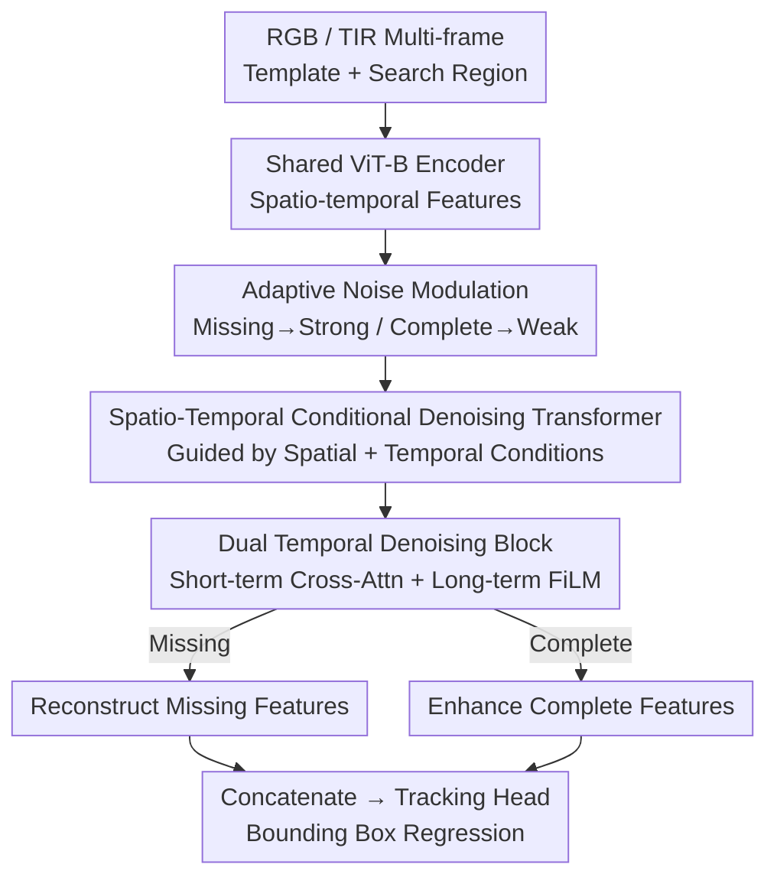

# Spatio-Temporal Conditional Denoising Transformer for Modality-Missing RGBT Tracking

**Conference**: CVPR 2026  
**Paper**: [CVF Open Access](https://openaccess.thecvf.com/content/CVPR2026/html/Lu_Spatio-Temporal_Conditional_Denoising_Transformer_for_Modality-Missing_RGBT_Tracking_CVPR_2026_paper.html)  
**Code**: None  
**Area**: Video Understanding  
**Keywords**: RGBT Tracking, Modality-Missing, Conditional Denoising, Spatio-Temporal Modeling, Diffusion

## TL;DR
The paper unifies "modality-missing completion" and "complete modality enhancement" in RGBT tracking into a single **spatio-temporal conditional denoising** process. By using short-term and long-term temporal cues from historical frames as conditions, a denoiser reconstructs missing modalities under strong noise and enhances complete modalities under weak noise. This single architecture and parameter set handle both scenarios, achieving SOTA or near-SOTA performance on three RGBT benchmarks under both complete and missing settings.

## Background & Motivation
**Background**: RGBT tracking relies on the complementarity of RGB (appearance/semantics) and TIR (thermal infrared, stable under low light/occlusion), proving valuable for security-critical scenarios like night surveillance and autonomous driving. However, real-world deployments often face **dynamic modality loss** due to sensor mismatch, occlusion, or hardware failure, causing standard multi-modal features to become unstable and tracking precision to plummet.

**Limitations of Prior Work**: Existing works for missing modalities fall into two categories: reconstruction methods like IPL (IJCV'25) that **generate missing modalities from available ones**, and Mixture-of-Experts/switching architectures like FlexTrack (ICCV'25) that change branches based on modality configuration. Both have flaws: ① They rely almost exclusively on **current-frame spatial cues**, ignoring temporal correlations from historical frames, leading to spatial bias and temporal inconsistency. ② Their architectures are **scenario-dependent**, requiring explicit switching or separate branches, which limits scalability and introduces computational redundancy.

**Key Challenge**: Modality-missing tracking requires the model to both **reconstruct missing info** and **adaptively utilize spatio-temporal context** for consistency. Scenario-switching approaches cannot satisfy both with a single set of parameters.

**Goal**: Achieve a **single model with a single set of parameters** to handle both missing and complete modality conditions, ensuring reconstruction maintains spatial detail and temporal coherence.

**Key Insight**: The authors reformulate multi-modal feature reconstruction as **spatio-temporal conditional denoising**. Since diffusion/denoising is inherently a process of "generating structured signals from noise under guidance," recovering/refining features from available modalities and historical context is perfectly framed as a conditional generation problem.

**Core Idea**: Use **noise intensity** as a task switch and **short-term + long-term temporal cues** as conditions to unify "missing reconstruction" and "complete enhancement" within a single Spatio-Temporal Conditional Denoising Transformer (SCDT).

## Method

### Overall Architecture
Given RGB and TIR video sequences, a **shared ViT-B encoder** (following ODTrack pre-training) extracts spatio-temporal features from multi-frame templates and search areas. Features of available modalities are injected with **adaptive Gaussian noise** and fed into the SCDT module. SCDT performs conditional denoising guided by two types of conditions: **spatial condition $c_s$** from the current frame and **temporal condition $c_t$** from historical frames of complementary modalities (including short-term adjacent tokens and long-term evolution tokens). In missing scenarios, **strong noise** forces the model to reconstruct the missing modality's semantics. In complete scenarios, **weak noise** is used to refine representations and improve alignment. Denoised features are concatenated and fed into the tracking head. The entire pipeline switches between scenarios without changing architecture or parameters.

### Key Designs

**1. Spatio-Temporal Conditional Denoising Formulation: Reformulating Fusion as Conditional Generation**

To address spatial bias and temporal inconsistency, SCDT learns to generate modality representations conditioned on available modalities and temporal cues. Given feature $f_m \in \mathbb{R}^{B \times N \times C}$, a noisy input is constructed:

$$\tilde f_m = \sqrt{\bar\alpha}\,f_m + \sqrt{1-\bar\alpha}\,\varepsilon, \quad \varepsilon \sim \mathcal{N}(0, \sigma^2 I)$$

The denoiser $D_\theta$ outputs the refined feature $\hat f = D_\theta(\tilde f_m; c_s, c_t)$. The noise variance $\sigma^2$ is **task-dependent**: high noise drives reconstruction, while low noise drives enhancement. In missing scenarios (e.g., TIR missing), strong noise is applied to the available modality to force the denoiser to infer missing semantics $\hat f_{m'}$. Supervision is provided by a feature-level reconstruction loss $L_{\text{recon}} = \lVert \hat f_{m'} - f_{m'} \rVert_2^2$.

**2. Dual Temporal Conditional Denoising Block: Short-term Cross-Attention for Alignment, Long-term FiLM for Coherence**

Each denoising block injects temporal conditions in a complementary manner. Short-term tokens $s_c$ from adjacent frames provide motion continuity via cross-attention:

$$f'_m = \tilde f_m^{SA} + \text{CrossAttn}(\tilde f_m^{SA}, s_c, s_c)$$

This mitigates cross-modal misalignment. Subsequently, a global token $l_c$ encoding long-term evolution applies scaling-shifting modulation via FiLM:

$$f''_m = f'_m \odot \big(1 + \tanh(W_s l_c)\big) + \tanh(W_r l_c)$$

The long-term token stabilizes features and suppresses noise activation.

**3. Adaptive Noise Modulation: Unifying Enhancement and Reconstruction via "Weak-Strong" Noise**

Instead of switching branches, authors use **noise intensity and loss objectives** to define fusion targets. Complete modalities pass through the same path with **weak noise** and an alignment loss focusing on first and second-order statistics:

$$L_{\text{align}} = \lVert \mu(\hat f_m) - \mu(f_m) \rVert_2^2 + \lVert \text{Var}(\hat f_m) - \text{Var}(f_m) \rVert_2^2$$

Dynamic weights ($\lambda_1=1, \lambda_2=0$ for missing; $\lambda_1=0, \lambda_2=1$ for complete) allow the shared denoiser to handle both tasks.

### Loss & Training
Total loss: $L_{\text{total}} = \lambda_1 L_{\text{recon}} + \lambda_2 L_{\text{align}} + \lambda_3 L_{\text{track}}$. Tracking loss follows ODTrack settings. Templates are 128×128, search areas 256×256. Trained on 6 RTX 4090s with AdamW; backbone LR $10^{-5}$, others $10^{-4}$. LasHeR/RGBT234 trained for 30 epochs; VTUAV for 5 epochs.

## Key Experimental Results

### Main Results
Benchmarks × Complete/Missing settings (PR=Precision Rate, SR=Success Rate; MPR/MSR for RGBT234).

| Dataset (Setting) | Metric | SCDT | Runner-up (FlexTrack/IPL) | Gain |
|--------|------|------|----------|------|
| LasHeR-Miss | PR / SR | **69.3 / 54.4** | 65.1 / 52.3 | +4.2 / +2.1 |
| RGBT234-Miss | MPR / MSR | **88.1 / 64.3** | 84.1 / 62.6 | +4.0 / +1.7 |
| VTUAV-Miss | PR / SR | **84.1 / 69.6** | 80.9 / 68.5 (IPL) | +3.2 / +1.1 |
| LasHeR | PR / SR | **77.4** / 61.0 | 77.3 / 62.0 | +0.1 / −1.0 |
| RGBT234 | MPR / MSR | **93.1** / 69.6 | 92.7 / 69.9 | +0.4 / −0.3 |
| VTUAV | PR / SR | **93.6 / 78.9** | 88.6 / 76.2 | +5.0 / +2.7 |

### Ablation Study
| Configuration | LasHeR PR/SR | LasHeR-Miss PR/SR | Description |
|------|---------|---------|------|
| baseline | 75.1 / 59.2 | 63.2 / 49.6 | No spatio-temporal condition |
| w/ SP | 75.7 / 58.7 | 66.9 / 52.2 | Spatial condition only |
| w/ SP+ST | 75.8 / 59.6 | 68.3 / 53.6 | Added short-term (benefits Missing) |
| w/ SP+LT | 76.0 / 59.7 | 67.3 / 52.9 | Added long-term (benefits Complete) |
| Full (SP+ST+LT) | **77.4 / 61.0** | **69.3 / 54.4** | Optimal complementarity |

"Weak-Strong" noise strategy (Weak for complete, Strong for missing) proved superior to "Strong-Strong" or "Weak-Weak" combinations.

### Key Findings
- **Temporal Division of Labor**: Short-term tokens mitigate local jitter in missing scenarios, while long-term tokens suppress global drift in complete scenarios.
- **Noise Ratio is Critical**: Strong-strong noise corrupts the alignment for complete modalities, while weak-weak noise fails to guide missing reconstruction effectively.
- **Performance Preservation**: The enhancement mechanism improves cross-modal feature quality even without degradation (PR +5.0 on VTUAV complete).

## Highlights & Insights
- **Noise as Task Switch**: Encoding the "reconstruct vs. enhance" decision into noise magnitude rather than explicit network branches is an elegant, scalable paradigm for multi-modal tasks.
- **Temporal Specialization**: Separating temporal modeling into "local alignment" (Cross-Attn) and "global modulation" (FiLM) provides a clear framework for historical frame utilization.
- **Reformulation via Denoising**: Attacking the fusion problem through conditional generation leverages the inherent ability of diffusion models to restore structure from noise.

## Limitations & Future Work
- The denoiser is sensitive to depth (4 layers optimal); inference speed/FPS were not reported, leaving questions about the efficiency vs. switching architectures ⚠️.
- Missing scenarios involve simulated variants (e.g., LasHeR-Miss); real-world sensor fault distributions may differ ⚠️.
- The stability of long-term tokens over very long sequences requires further cumulative error analysis.

## Related Work & Insights
- **vs. IPL (IJCV'25)**: IPL uses a reversible prompter for spatial generation; SCDT outperforms it significantly (+7.6 PR on LasHeR-Miss) by introducing temporal denoising.
- **vs. FlexTrack (ICCV'25)**: FlexTrack uses adaptive routing; SCDT achieves better results (+4.2 PR on LasHeR-Miss) with a unified, branchless architecture.
- **vs. Diffusion Transformers**: While most diffusion trackers focus on frame-level generation, SCDT incorporates temporal dependency directly into the denoising process.

## Rating
- Novelty: ⭐⭐⭐⭐⭐ Elegant use of noise intensity to unify reconstruction and enhancement.
- Experimental Thoroughness: ⭐⭐⭐⭐ Extensive benchmark coverage, though lacking real-world hardware failure testing.
- Writing Quality: ⭐⭐⭐⭐ Clear logic, though some token construction details are brief.
- Value: ⭐⭐⭐⭐ Establishes a strong baseline and a "noise-as-switch" paradigm for missing modality tasks.

<!-- RELATED:START -->

<!-- Papers will be listed here if available -->

<!-- RELATED:END -->

## Related Papers

- [\[CVPR 2026\] Progressive Multi-cue Alignment for Unaligned RGBT Tracking](progressive_multi-cue_alignment_for_unaligned_rgbt_tracking.md)
- [\[CVPR 2026\] VISTA: Video Interaction Spatio-Temporal Analysis Benchmark](vista_video_interaction_spatio-temporal_analysis_benchmark.md)
- [\[CVPR 2026\] RAGTrack: Language-aware RGBT Tracking with Retrieval-Augmented Generation](ragtrack_language-aware_rgbt_tracking_with_retrieval-augmented_generation.md)
- [\[CVPR 2026\] Towards Spatio-Temporal World Scene Graph Generation from Monocular Videos](towards_spatio-temporal_world_scene_graph_generation_from_monocular_videos.md)
- [\[CVPR 2026\] Streaming Video Crime Anticipation with Spatio-Temporal Causal Reasoning](streaming_video_crime_anticipation_with_spatio-temporal_causal_reasoning.md)

<!-- RELATED:END -->
