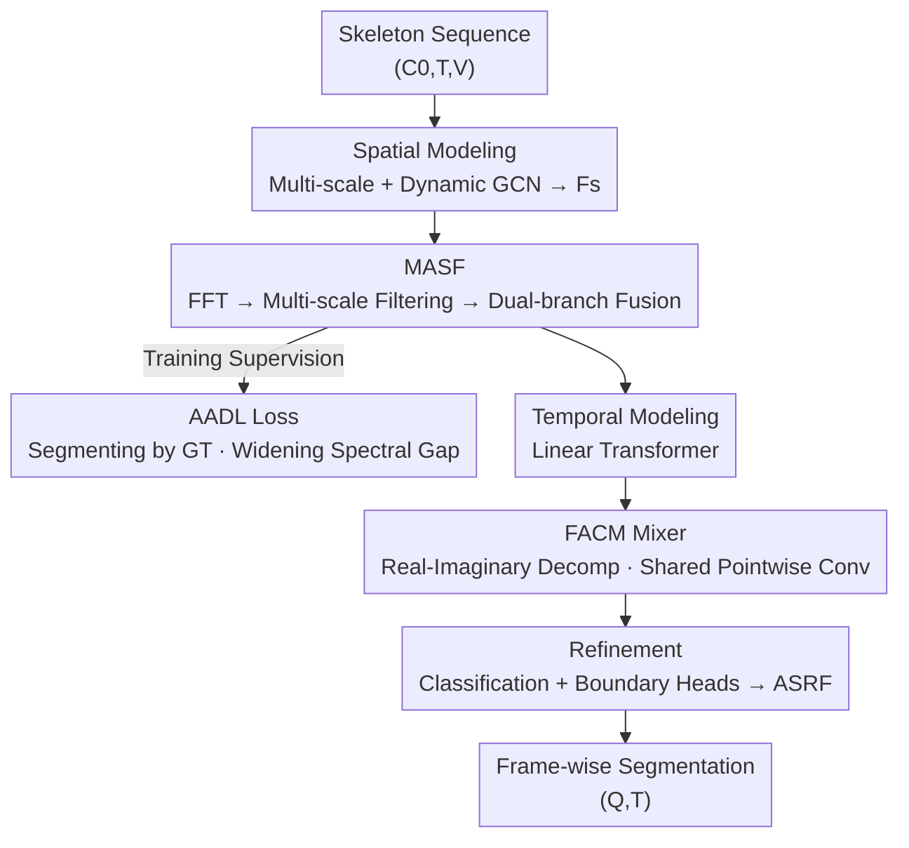

# Spectral Scalpel: Amplifying Adjacent Action Discrepancy via Frequency-Selective Filtering for Skeleton-Based Action Segmentation

**Conference**: CVPR 2026  
**Paper**: [CVF Open Access](https://openaccess.thecvf.com/content/CVPR2026/html/Ji_Spectral_Scalpel_Amplifying_Adjacent_Action_Discrepancy_via_Frequency-Selective_Filtering_for_CVPR_2026_paper.html)  
**Code**: https://github.com/HaoyuJi/SpecScalpel  
**Area**: Video Understanding / Temporal Action Segmentation  
**Keywords**: Skeleton action segmentation, frequency domain filtering, adjacent action discrimination, spectral editing, channel mixing

## TL;DR
To address the issues of "indistinguishable adjacent actions" and "blurry boundaries" in Skeleton-based Temporal Action Segmentation (STAS), this paper shifts modeling to the frequency domain. It employs a learnable "Spectral Scalpel" (Multi-scale Adaptive Spectral Filtering, MASF) to amplify action-specific frequencies and suppress shared frequencies, while using an "Adjacent Action Discrepancy Loss" (AADL) as an explicit target to widen the amplitude spectrum gap between adjacent segments. This approach achieves SOTA results across five datasets with lower FLOPs and parameters.

## Background & Motivation

**Background**: Skeleton-based Temporal Action Segmentation (STAS) aims to perform frame-level classification on long, untrimmed skeletal motion sequences — assigning an action label to every frame. Compared to RGB-based video action segmentation (VTAS), skeletal input is lightweight and robust to appearance. Dominant approaches combine "spatial modeling" (GCNs for joint dependencies) and "temporal modeling" (TCNs or Transformers for long-range relations, e.g., MS-GCN, DeST, LaSA).

**Limitations of Prior Work**: Two primary challenges remain. First is **inter-class confusion**, where visually or semantically similar actions (e.g., two specific figure skating moves) lack discriminative features. Second is **blurry boundaries**, where transitional dynamics between adjacent actions are so similar that the model cannot pinpoint the exact switching frame.

**Key Challenge**: The authors attribute the root cause to the temporal modeling paradigm itself. To aggregate context and maintain internal action coherence, TCNs and Transformers **essentially function as low-pass filters**, leading to an inherent "over-smoothing" effect. While useful for intra-action consistency, this smoothing **erases critical subtle differences between adjacent actions**, naturally blurring the boundaries. Essentially, existing architectures inherently "suppressed" discriminative signals, creating a need for a mechanism to explicitly recover and amplify core differences.

**Key Insight**: The authors shift from the spatio-temporal domain to the **frequency domain**. Skeletal motion is fundamentally an oscillation of joints; different actions possess distinct periodicity and spectral energy distributions — these differences are physical, not just superficial trajectories. The key observation is that action spectra contain both **shared common frequency components** and **unique, action-specific components**. The latter are the most susceptible to being erased by temporal smoothing. By **selectively suppressing shared frequencies and amplifying unique ones** in the frequency domain, one can directly enhance inter-class discriminability and sharpen transition boundaries (demonstrated via synthetic signals in Paper Fig. 1).

**Core Idea**: Treat "amplifying adjacent action discrepancy" as an explicit **surgical goal** and use adaptive spectral filtering as the **scalpel** — performing goal-constrained active spectral editing rather than the blind data-driven filtering typical of previous FFT methods.

## Method

### Overall Architecture
Spectral Scalpel maps a skeleton sequence $X \in \mathbb{R}^{C_0 \times T \times V}$ ($T$ frames, $V$ joints, $C_0$ input channels) to frame-wise labels $Y \in \mathbb{R}^{Q \times T}$. The pipeline consists of **four serial stages**: Spatial Modeling → Frequency Modeling → Temporal Modeling → Prediction Refinement. The spatial stage follows existing STAS frameworks (multi-scale GCN + dynamic GCN with channel/temporal branches) to obtain spatial features $F_s$. This is followed by three innovations: the frequency stage uses **Multi-scale Adaptive Spectral Filtering (MASF)** for spectral editing, supervised by the **Adjacent Action Discrepancy Loss (AADL)** during training; the temporal stage inserts a **Frequency-Aware Channel Mixer (FACM)** alongside a Linear Transformer to strengthen channel evolution from a spectral perspective. Final representations $F_R \in \mathbb{R}^{C\times T}$ enter classification and boundary heads, combined via ASRF post-processing.

### Key Designs

**1. Multi-scale Adaptive Spectral Filtering (MASF): Learnable multi-scale editing of the spectrum**

This module counters "over-smoothing" that erases action-specific frequencies. Given spatial features $F_s$, it performs an FFT along the time axis to the frequency domain $F_{f0}\in\mathbb{C}^{C\times S\times V}$. Then, $M$ filtering blocks are used: each with a learnable filter $H_m\in\mathbb{R}^{1\times R_m\times V}$, expanded to the spectral resolution $S$ via Nearest Neighbor Interpolation (NNI), applied via Hadamard product, and returned to the time domain via iFFT:

$$F_f^m = \mathcal{F}^{-1}\big(\mathrm{NNI}(H_m)\odot\mathcal{F}(F_s)\big)$$

All $H_m$ are initialized to 1s, allowing the model to learn which frequencies to suppress or amplify. Multi-scale filter lengths $R_m$ are arranged **linearly** rather than exponentially:

$$R_m = \frac{(M+m)\cdot R_{\max}}{2M}$$

Linear arrangement ensures less boundary overlap after interpolation, supporting finer-grained channel-wise weighting. The resulting $[F_f^1,\dots,F_f^M]$ are aggregated via **dual-branch dynamic-static channel-wise fusion**. The static branch learns cross-sample consistent weights $W_{st}\in\mathbb{R}^{M\times C}$, while the dynamic branch generates input-dependent weights $W_{dy}$ from $F_s$. This captures both generalization and instance-level adaptation.

**2. Adjacent Action Discrepancy Loss (AADL): Explicit goal for the "Scalpel"**

To ensure learnable filters actually "amplify differences," AADL explicitly targets this. During training, $F_f$ is sliced into $N$ action segments $F_a^1,\dots,F_a^N$ based on ground truth boundaries. Each segment is transformed via FFT to get its amplitude spectrum, unified to a fixed length $S_f$ via Linear Interpolation (LI):

$$F_b^n = \mathrm{LI}\big(|\mathcal{F}(F_a^n)|\big)$$

Crucially, regardless of segment length $T_n$, the frequency axis always covers $[0,f_s)$; $T_n$ only affects frequency resolution. Interpolation allows meaningful comparison between adjacent segments $F_b^n-F_b^{n-1}$. The loss calculates the absolute difference:

$$\mathcal{L}_{AAD}=\frac{1}{N-1}\sum_{n=2}^{N}-\log\!\big(\tanh(\alpha\cdot\mathbb{E}|F_b^n-F_b^{n-1}|)\big)$$

Minimizing $\mathcal{L}_{AAD}$ forces the spectral distance between adjacent segments to increase. This auxiliary loss guides MASF to learn discriminative frequency responses.

**3. Frequency-Aware Channel Mixer (FACM): Enhancing channel evolution via spectral perspective**

While the Linear Transformer captures temporal dependencies, channel-wise interactions are enhanced by FACM using spectral insights. For temporal features $F_{t1}^l\in\mathbb{R}^{C\times T}$, FFT is applied, separating real $R_0^l$ and imaginary $I_0^l$ parts. These are concatenated and passed through two pointwise convolutions:

$$R^l,I^l=\mathrm{Split}\big(W_{c2}\cdot W_{c1}\cdot\mathrm{Concat}[R_0^l,I_0^l]\big)$$

A key mathematical insight is that sharing the same pointwise convolution for real and imaginary parts is **equivalent to a linear transformation on the entire complex spectrum** ($W\cdot R_0^l+W\cdot jI_0^l=W\cdot F^l$). This maintains complex linearity and parameter efficiency without the losses associated with magnitude/phase decomposition.

### Loss & Training
The total loss includes: Cross-Entropy (CE) + Smoothness loss for classification, Binary Cross-Entropy (BCE) for boundaries, Action-Text Contrastive Loss (following LaSA), and the proposed AADL. Hyperparameters: channels $C=64$; $M=4$ filters for MASF with $R_{\max}=64$; AADL interpolation length $S_f=32$; Adam optimizer with LR 0.001 for 300 epochs.

## Key Experimental Results

### Main Results
Evaluation on five datasets with unified skeleton features. Representative F1@50 (%) segment-level metrics and efficiency on PKU-MMD v2:

| Dataset | Metric | Spectral Scalpel | Prev. SOTA | Gain |
|--------|------|------|----------|------|
| PKU-MMD (X-view) | F1@50 | 67.2 | 62.4 (ME-ST) | +4.8 |
| PKU-MMD (X-sub) | F1@50 | 66.6 | 64.3 (LPL) | +2.3 |
| MCFS-130 | F1@50 | 67.6 | 66.6 (LaSA) | +1.0 |
| TCG-15 | F1@50 | 74.7 | 73.8 (LPL) | +0.9 |
| LARa | F1@50 | 59.4 | 58.6 (LPL) | +0.8 |
| PKU-MMD | FLOPs / Params | 11.56G / 1.44M | 11.65G/1.60M (LaSA) | Lower |

The model achieves SOTA on almost all metrics with lower FLOPs and parameters than the previous strongest model. The +4.8% gain on X-view highlights the efficacy of spectral editing for cross-view discrimination.

### Ablation Study
Incremental ablation on PKU-MMD (X-sub) using a baseline of DeST + adaptive GCN + contrastive loss:

| Config | Acc | Edit | F1@10 | F1@25 | F1@50 |
|------|-----|------|-------|-------|-------|
| Baseline | 73.6 | 73.0 | 78.2 | 74.6 | 64.3 |
| +MASF | 74.5 | 73.7 | 78.7 | 75.4 | 65.6 |
| +AADL | 74.8 | 73.9 | 79.0 | 75.5 | 65.5 |
| +FACM | 74.0 | 73.2 | 78.0 | 74.8 | 65.7 |
| +MASF+AADL | 75.1 | 73.9 | 79.3 | 76.3 | 66.0 |
| +All (Full) | 75.4 | 74.5 | 79.7 | 76.8 | 66.6 |

### Key Findings
- **All components are complementary**, and the combination of MASF and AADL provides the primary gain.
- **Minimal Inference Overhead**: MASF adds only +0.01G FLOPs. AADL is a training-only cost, increasing training time by ~21% but adding zero to inference.
- **Mechanism Validation**: t-SNE shows higher intra-class tightness and inter-class separation. Visualization of frame-wise activation (Fig. 7) confirms that previously indistinguishable frequency patterns are separated, and shared low-frequency components are successfully suppressed.

## Highlights & Insights
- **Goal-Directed Filtering**: Instead of blind data-driven filtering, the "scalpel + target" decoupling allows spectral editing to have a clear supervisory signal.
- **Architectural Diagnosis**: Identifying temporal modeling as inherently "low-pass filtering" provides a rigorous explanation for boundary blurring, making the frequency-domain solution naturally self-consistent.
- **Complex Linear Synergy**: The FACM pointwise convolution trick is an elegant engineering solution that avoids non-linear decomposition losses while remaining parameter-efficient.
- **Frequency Axis Alignment**: Leveraging signal processing properties (constant frequency range regardless of segment length) allows a simple interpolation to solve the complex problem of comparing variable-length segments.

## Limitations & Future Work
- Blurry boundaries and misclassifications still persist in complex cases.
- AADL **requires ground-truth action boundaries**, making it a fully supervised training loss. Its application in weak/semi-supervised scenarios is not direct.
- The 21% increase in training time is non-negligible for large datasets.
- Future work: Exploring adaptive local and multi-stage filtering, frequency-based contrastive learning, and incorporating frequency priors for better generalization.

## Related Work & Insights
- **vs DeST / LaSA (Spatio-temporal STAS)**: These focus on spatial GCNs and temporal attention. This paper adds a **Frequency Stage** to directly combat the over-smoothing inherent in those architectures. 
- **vs Prior FFT methods (AFF, DFFormer)**: While others use blind data-driven filters, this work introduces AADL as an explicit "discrepancy amplifier" target.
- **vs DFN (Video Action Segmentation)**: While DFN uses Fourier-based token mixing, this is the **first to systematically introduce spectral analysis to skeleton STAS**, targeting the domain-specific challenge of adjacent action discrimination.

## Rating
- Novelty: ⭐⭐⭐⭐⭐ First systematic introduction of spectral analysis to skeleton STAS with a well-defined "scalpel + goal" paradigm.
- Experimental Thoroughness: ⭐⭐⭐⭐⭐ SOTA across five datasets, complete ablation, efficiency analysis, and multiple visualizations.
- Writing Quality: ⭐⭐⭐⭐⭐ Clear logical flow from structural diagnosis to frequency domain solution.
- Value: ⭐⭐⭐⭐ High accuracy and efficiency with plug-and-play modules, though dependency on frame-level labels limits some application areas.

<!-- RELATED:START -->

## Related Papers

- [\[CVPR 2026\] LaDy: Lagrangian-Dynamic Informed Network for Skeleton-based Action Segmentation via Spatial-Temporal Modulation](lady_lagrangian-dynamic_informed_network_for_skeleton-based_action_segmentation_.md)
- [\[CVPR 2026\] Hierarchical Action Learning for Weakly-Supervised Action Segmentation](hierarchical_action_learning_for_weakly-supervised_action_segmentation.md)
- [\[CVPR 2026\] SkeletonContext: Skeleton-side Context Prompt Learning for Zero-Shot Skeleton-based Action Recognition](skeletoncontext_skeleton-side_context_prompt_learning_for_zero-shot_skeleton-bas.md)
- [\[CVPR 2026\] Exploring Adaptive Masked Reconstruction for Self-Supervised Skeleton-Based Action Recognition](exploring_adaptive_masked_reconstruction_for_self-supervised_skeleton-based_acti.md)
- [\[ICCV 2025\] Frequency-Semantic Enhanced Variational Autoencoder for Zero-Shot Skeleton-based Action Recognition](../../ICCV2025/video_understanding/frequency-semantic_enhanced_variational_autoencoder_for_zero-shot_skeleton-based.md)

<!-- RELATED:END -->
## Related Papers

- [\[CVPR 2026\] SkeletonContext: Skeleton-side Context Prompt Learning for Zero-Shot Skeleton-based Action Recognition](skeletoncontext_skeleton-side_context_prompt_learning_for_zero-shot_skeleton-bas.md)
- [\[CVPR 2026\] Polyphony: Diffusion-based Dual-Hand Action Segmentation with Alternating Vision Transformer and Semantic Conditioning](polyphony_diffusion-based_dual-hand_action_segmentation_with_alternating_vision_.md)
- [\[CVPR 2026\] Exploring Adaptive Masked Reconstruction for Self-Supervised Skeleton-Based Action Recognition](exploring_adaptive_masked_reconstruction_for_self-supervised_skeleton-based_acti.md)
- [\[ICCV 2025\] Frequency-Semantic Enhanced Variational Autoencoder for Zero-Shot Skeleton-based Action Recognition](../../ICCV2025/video_understanding/frequency-semantic_enhanced_variational_autoencoder_for_zero-shot_skeleton-based.md)
- [\[CVPR 2026\] Prototypical Action Reasoning Facilitated by Vision-Language Alignment for Egocentric Action Anticipation](prototypical_action_reasoning_facilitated_by_vision-language_alignment_for_egoce.md)

<!-- RELATED:END -->
