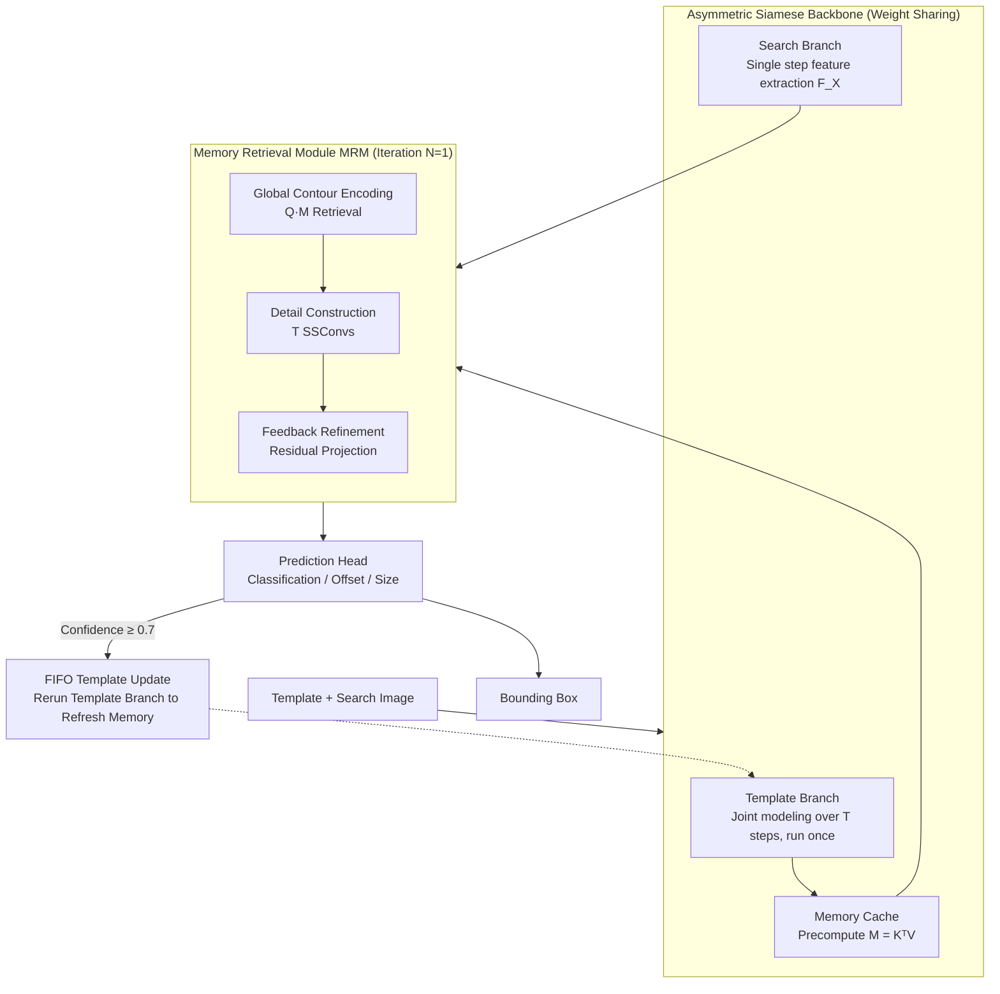

# SpikeTrack: A Spike-driven Framework for Efficient Visual Tracking

**Conference**: CVPR 2026  
**arXiv**: [2602.23963](https://arxiv.org/abs/2602.23963)  
**Code**: Yes (mentioned in paper)  
**Area**: Video Understanding  
**Keywords**: Spiking Neural Networks, Visual Tracking, Energy Efficiency, Asymmetric Architecture, Memory Retrieval

## TL;DR
Propose SpikeTrack, the first RGB visual tracking framework fully compliant with the spike-driven paradigm. By utilizing asymmetric timestep expansion, unidirectional information flow, and a brain-inspired Memory Retrieval Module (MRM), it achieves SOTA performance among SNN trackers and performs on par with ANN trackers, while consuming only 1/26 the energy of TransT.

## Background & Motivation
Spiking Neural Networks (SNNs) simulate biological neuron spatio-temporal dynamics and spike mechanisms to achieve low-power computing: (i) computations are triggered only when event-driven, and (ii) matrix multiplication between spike tensors and weights is converted into sparse additions. This grants SNNs significant energy-saving advantages on neuromorphic chips.

**Limitations of Prior Work in SNN Tracking**:

**RGB-based methods** (SiamSNN, Spike-SiamFC++): Although spike neurons are used, they decode spike signals into continuous values for computation, failing to implement full spike-driven processing, which limits energy efficiency.

**Event camera-based methods**: These directly mimic the one-stream architecture of ANNs (e.g., OSTrack), concatenating the template and search area before feeding them into the backbone for bidirectional interaction. This approach has two flaws:
   - It fails to fully exploit the spatio-temporal correlation dynamics of SNN neurons.
   - Dense bidirectional interactions significantly increase computational overhead.

**Core Problem**: Can a SNN tracker be designed to follow the spike-driven paradigm while simultaneously leveraging spatio-temporal modeling capabilities?

## Method

### Overall Architecture
SpikeTrack specifically addresses making a **fully spike-driven** SNN both energy-efficient and accurate for RGB single-object tracking. The core idea is "isolating heavy computation and maintaining unidirectional information flow." A weight-sharing spiking backbone is divided into a template branch and a search branch. The template branch executes only during initialization or template updates across multiple timesteps to cache intermediate features as memory. Subsequently, for each incoming search frame, the search branch runs for a single timestep, retrieving target cues from the memory via the Memory Retrieval Module (MRM) to refine target perception. Finally, a prediction head regresses the bounding box. Since information only flows from the template branch to the search branch, the computationally intensive parts are isolated, which is the fundamental reason for its efficiency over ANNs.

### Key Designs

**1. Asymmetric Siamese Backbone: Isolating heavy template computation**

Event-based SNN trackers often copy the one-stream architecture of ANNs—concatenating template and search areas for bidirectional interaction—which neglects SNN spatio-temporal dynamics and consumes excessive power. SpikeTrack adopts an **asymmetric timestep** approach: the template branch expands over $T$ timesteps, feeding one template at each step to model representations jointly via SNN spatio-temporal dynamics. The search branch runs only a single timestep for speed. The backbone uses Spike-Driven Transformer V3 with Normalized Integer LIF (NI-LIF) neurons. A key improvement is making the decay factor a **learnable** variable $\beta_t = \sigma(\theta_t)$, allowing the network to adaptively decide how much history to retain:

$$U[t] = \beta_t H[t-1] + Y[t], \quad S[t] = \text{Clip}(\text{round}(U[t]), 0, D)/D$$

Learnable $\beta_t$ offers more flexibility than fixed decay (gaining +1.9 LaSOT AUC), and isolating the template branch is the primary source of energy reduction.

**2. Memory Retrieval Module (MRM): Brain-inspired unidirectional information transfer**

After computing search features, the model must "borrow" target cues from the template without re-executing expensive bidirectional attention. MRM is inspired by neuroscience: recurrent connections in the L2/3 area of the V1 visual cortex iteratively refine perception based on prior expectations when an object is occluded. MRM splits retrieval into three steps: **Global Profile Encoding** (where template features $F_Z$ are projected into $K_S, V_S$ to precompute the memory matrix $M = K_S^T V_S$), **Detail Construction** (using $T$ dedicated SSConvs to process temporal variations), and **Feedback Refinement** (simulating feedback from higher visual areas). Since spike attention has linear complexity and $M$ is precomputed once for multi-frame reuse, it ensures efficiency and unidirectional flow; ablation shows $N=1$ iterations is optimal.

**3. Prediction Head: Three-branch regression without separate quality assessment**

Spiking features are relatively coarse-grained. The prediction head uses three parallel branches: a classification branch for target center localization, an offset branch to compensate for local discretization errors, and a size branch for normalized bounding box dimensions. It avoids a separate quality score module by using the localization score as confidence (also used for the 0.7 template update threshold). This keeps the structure fully spiking and simple, though it may introduce low-quality templates in long sequences.

### Loss & Training
- **Loss Function**: $\mathcal{L} = \mathcal{L}_{class} + \lambda_G \mathcal{L}_{IoU} + \lambda_{L_1} \mathcal{L}_1$, with $\lambda_G=2$, $\lambda_{L_1}=5$.
- $\mathcal{L}_{class}$: Weighted focal loss; $\mathcal{L}_{IoU}$: Generalized IoU loss; $\mathcal{L}_1$: L1 regression loss.
- Training Data: COCO + LaSOT + TrackingNet + GOT-10k.
- Two-stage Training: $T=1$ model trained for 320 epochs, then $T>1$ model fine-tuned from $T=1$ for 60 epochs.
- Template Update: FIFO queue with an update interval of 25 frames and a confidence threshold of 0.7.
- Energy Calculation: $E_{SNN} = \text{FLOPs} \times E_{AC} \times SFR \times T \times D$. $E_{AC}=0.9$ pJ (45nm), significantly lower than $E_{MAC}=4.6$ pJ.

## Key Experimental Results

### Main Results

| Dataset | Metric | SpikeTrack-B384 | TransT (ANN) | Energy Ratio |
|--------|------|-----------------|--------------|--------|
| LaSOT | AUC | 66.7 | 64.9 | 27.3 vs 75.2 mJ (1/2.8) |
| TrackingNet | AUC | 82.0 | 81.4 | 27.3 vs 75.2 mJ |
| GOT-10k | AO | 73.1 | 72.3 | 27.3 vs 75.2 mJ |
| TNL2K | AUC | 54.8 | 50.7 | 27.3 vs 75.2 mJ |

SpikeTrack-B256-T3 outperforms TransT by 2.2% AUC on LaSOT while consuming only 1/7.6 the energy.

| Dataset | Metric | SpikeTrack-S256 | SpikeSiamFC++ | Gain |
|--------|------|-----------------|---------------|------|
| UAV123 | AUC | 66.2 | 57.8 | +8.4 |
| OTB100 | AUC | 69.4 | 64.4 | +5.0 |
| GOT-10k | AO | 67.8 | - | - |

### Ablation Study

| Configuration | Energy (mJ) | GOT-10k AO | LaSOT AUC | Description |
|------|----------|------------|-----------|------|
| Baseline (Asym) | 8.7 | 71.3 | 66.8 | Baseline |
| One-stream | 22.8 | 70.8 | 65.4 | Energy ↑163%, Accuracy ↓ |
| Vanilla Cross-attn | 7.6 | 70.9 | 65.0 | Replaces MRM, Accuracy ↓ |
| Modulation (spike) | 6.8 | 58.3 | 49.9 | AsymTrack style unsuitable for SNN |
| Mean Fusion | 8.5 | 71.0 | 66.2 | Channel weighting is better |
| Fixed Decay | 8.9 | 68.9 | 66.0 | Learnable decay is better |

### Key Findings
- The asymmetric architecture outperforms one-stream in both accuracy and energy, proving SNN spatio-temporal dynamics + MRM is superior to brute-force bidirectional interaction.
- Template modulation methods from AsymTrack degrade significantly when spiked (AUC 49.9), indicating that using templates as convolution kernels for signal modulation is not suitable for coarse SNN representations.
- Learnable decay factors provide better control over temporal interaction compared to fixed decay (+1.9 LaSOT AUC).
- The gap with OSTrack primarily exists in Deformation and Fast Motion scenarios, which challenge SNN deep semantic understanding and re-detection.
- $N=1$ iterations for MRM is optimal; more iterations accumulate error and cause over-focusing.

## Highlights & Insights
1. **Asymmetric Design Sophistication**: The multi-step template branch exploits SNN dynamics while the single-step search branch ensures efficient inference, combining SNN advantages with Siamese efficiency.
2. **Brain-inspired MRM**: Inspired by V1 cortex recurrent connections, the precomputed memory matrix allows cross-frame reuse, balancing biological plausibility with engineering efficiency.
3. **Pareto Optimality**: Achieves the first energy-accuracy Pareto optimum in RGB tracking—surpassing equivalent ANNs while reducing energy consumption by orders of magnitude.
4. **Scalability**: 6 model variants cover different precision-power requirements.

## Limitations & Future Work
- Weak performance in scenarios with similar object interference, as spike encoding struggles to convey fine-grained semantic information.
- Template updates rely on a simple confidence threshold without a dedicated quality assessment module.
- Increasing $T$ in long-term tracking (LaSOT) does not always improve performance because simple scoring may introduce low-quality templates.
- Energy consumption is currently theoretically calculated for 45nm process; it has not been tested on actual neuromorphic hardware.

## Related Work & Insights
- Inherits the asymmetric Siamese concept from AsymTrack (CVPR'25) but replaces ANN template modulation with SNN spatio-temporal dynamics.
- Uses Spike-Driven Transformer V3, a Meta-Transformer style SNN.
- The precomputation of the MRM memory matrix is analogous to KV-caching in Transformers.
- Provides a reference for applying SNNs to broader video understanding tasks like MOT and video segmentation.

## Rating
- Novelty: ⭐⭐⭐⭐ (Asymmetric spike tracking + brain-inspired MRM)
- Experimental Thoroughness: ⭐⭐⭐⭐⭐ (7 benchmarks, 6 variants, detailed energy analysis)
- Writing Quality: ⭐⭐⭐⭐ (Clear structure, good neuroscience parallels)
- Value: ⭐⭐⭐⭐ (Advances practical SNN application in visual tracking)

<!-- RELATED:START -->

## Related Papers

- [\[CVPR 2026\] SpikeTrack: High-performance and Energy-efficient Event-Based Object Tracking with Spiking Neural Network](spiketrack_high-performance_and_energy-efficient_event-based_object_tracking_wit.md)
- [\[CVPR 2026\] An Efficient Token Compression Framework for Visual Object Tracking](an_efficient_token_compression_framework_for_visual_object_tracking.md)
- [\[CVPR 2026\] Drift-Resilient Temporal Priors for Visual Tracking](drift-resilient_temporal_priors_for_visual_tracking.md)
- [\[CVPR 2026\] Adaptive Capacity Autoregressive Visual Tracking](adaptive_capacity_autoregressive_visual_tracking.md)
- [\[CVPR 2026\] UETrack: A Unified and Efficient Framework for Single Object Tracking](uetrack_a_unified_and_efficient_framework_for_single_object_tracking.md)

<!-- RELATED:END -->
