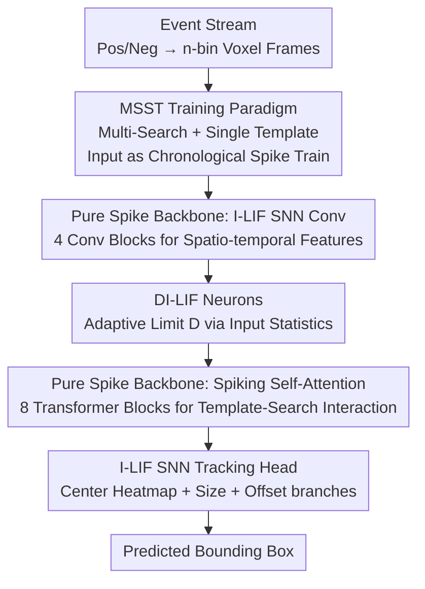

# SpikeTrack: High-performance and Energy-efficient Event-Based Object Tracking with Spiking Neural Network

**Conference**: CVPR 2026  
**Paper**: [CVF Open Access](https://openaccess.thecvf.com/content/CVPR2026/html/Wang_SpikeTrack_High-performance_and_Energy-efficient_Event-Based_Object_Tracking_with_Spiking_Neural_CVPR_2026_paper.html)  
**Code**: None  
**Area**: Video Understanding (Event-based Object Tracking / Spiking Neural Networks)  
**Keywords**: Event Camera, Single Object Tracking, Spiking Neural Network, Spiking Transformer, Energy Efficiency

## TL;DR
SpikeTrack utilizes a **pure spike-driven** Spiking Transformer for event-based single object tracking. By employing a "Multi-Search-Single-Template (MSST)" training paradigm, it feeds the inherent temporal continuity of tracking into the membrane potential accumulation of the SNN. Furthermore, "Dynamic Integer LIF (DI-LIF)" neurons adaptively adjust the spike firing upper limit based on input sparsity. It achieves SOTA accuracy on FE108, FELT, and VisEvent benchmarks, while consuming only 6.6% of the energy and 25.8% of the parameters compared to the second-best method.

## Background & Motivation

**Background**: Single object tracking has long been dominated by RGB methods (Siamese, correlation filters, Transformer trackers like OSTrack / SeqTrack / ODTrack). However, RGB cameras suffer from blur or overexposure in extreme scenarios such as high-speed motion or high-contrast lighting. Event cameras capture intensity changes with microsecond-level temporal resolution and a 140 dB dynamic range (vs. ~60 dB for RGB), making them naturally suitable for these challenging scenes. Consequently, event tracking has become a research hotspot.

**Limitations of Prior Work**: Event data is inherently a sparse, asynchronous stream of spikes, which aligns perfectly with the "integrate-and-fire" temporal mechanism and sparse communication of SNNs. Theoretically, SNNs offer both energy efficiency and temporal awareness. However, existing event SNN trackers (STNet, SNNTrack) almost exclusively use **hybrid CNN-SNN architectures** where CNNs perform the heavy lifting for feature extraction and SNNs only provide a temporal layer. This fails to reap the low-power benefits of pure SNNs and misses the opportunity to use self-attention for template-search interaction.

**Key Challenge**: Pure SNN architectures are well-studied in classification but are nearly non-existent in tracking. There are two primary difficulties: first, explicitly modeling the **inter-frame** trajectory evolution within the SNN (which previously required bulky LSTMs or computationally intensive multi-search Transformers); second, the information loss when SNNs quantize membrane potentials into spikes. While I-LIF neurons mitigate quantization errors using integer firing, their maximum firing integer $D$ is **globally fixed**, lacking adaptability to dynamic tracking scenarios where appearance and motion speed vary rapidly. Fast motion generates massive events that are truncated by a fixed $D$, while static scenes produce excessive pulses, increasing energy and noise.

**Goal**: To build a **pure spike-driven** event tracking framework that (i) leverages SNN temporal dynamics for inter-frame trajectory modeling without external modules, and (ii) allows spike quantization to adapt to inputs, eliminating the rigidity of a fixed $D$.

**Core Idea**: Using a Spiking Transformer as the backbone, the MSST training paradigm treats multi-frame search sequences as temporal spike trains fed into the SNN (allowing membrane potential accumulation to capture motion). Additionally, DI-LIF adaptively adjusts the spike firing limit based on batch-level input statistics—raising the limit for dense inputs to enhance response and lowering it for sparse inputs to suppress redundancy.

## Method

### Overall Architecture

SpikeTrack is an end-to-end tracker that requires no data augmentation or post-processing. An event stream is first sliced into $n$-bin voxel grids, where each bin accumulates positive and negative events into two-channel event frames. During training, instead of just a "1 template + 1 search" pair, **multiple consecutive search frames + a single template frame** are fed into the network as a chronologically ordered spike train (MSST). The membrane potential $U$ of the spiking neurons updates continuously across frames, naturally encoding temporal continuity.

The pipeline consists of three sequential stages: first, the **I-LIF SNN Conv module** (4 cascaded convolutional blocks) extracts spatio-temporal features; second, the **DI-LIF SNN Transformer module** (8 blocks) performs template-search spike self-attention interaction, where spike firing limits are adaptively adjusted; finally, the cross-correlation features are sent to the **I-LIF SNN Tracking Head**, which uses three branches (center heatmap + size regression + offset regression) to localize the target. The entire process is spike-driven, replacing Multiply-Accumulate (MAC) operations with energy-efficient Accumulate (AC) operations.

### Key Designs

**1. MSST Training Paradigm: Explicit Temporal Modeling via Membrane Potential**

The essence of tracking is capturing the temporal evolution of a target using historical cues. Previous methods either used manual update rules (low generalization) or fed multi-search frames into Transformers (high computation). SpikeTrack observes that the SNN membrane potential accumulates over time, acting as a "free" temporal memory. By distributing multiple search frames across different timesteps (Multi-Search-sequence-and-Single-Template), the network naturally learns inter-frame dynamics through the cross-frame accumulation of $U$. This eliminates the need for bulky RNN modules while remaining computationally efficient due to the sparse nature of SNNs. Increasing the search sequence length from 1 to 10 improves SR from 34.6% to 38.9%.

**2. DI-LIF (Dynamic Integer LIF): Adaptive Spike Firing Limits**

I-LIF neurons represent information via firing rates $s^\ell = \frac{1}{D}\lfloor\mathrm{clip}(x^\ell, 0, D)\rfloor$. During inference, this is decomposed into $D$ binary spikes $s^\ell = \frac{1}{D}\sum_{t=1}^{D} s^\ell[t]$, replacing MAC with AC. DI-LIF makes $D$ **adaptive to input statistics per batch**. Given features $X \in \mathbb{R}^{B\times C\times H\times W\times T}$, the mean activation is computed:

$$\mu(X) = \frac{1}{HWT}\sum_{h=1}^{H}\sum_{w=1}^{W}\sum_{t=1}^{T} X[:,:,h,w,t]$$

A learnable linear layer and sigmoid function then produce a regulation factor $\alpha = \sigma(W\cdot\mu(X) + b)$, and the quantization depth is calculated as:

$$D_{batch} = \lfloor \alpha \cdot D_{init} + D_{init} \rceil$$

Where $D_{init}$ is the baseline (default 6). For dense events (intense motion), $D$ is increased to enhance response; for sparse events, $D$ is decreased to suppress redundancy and noise. This reduces quantization errors while maintaining the discrete spike nature of SNNs.

**3. Pure Spike-Driven Backbone: Full I-LIF Conv + Spiking Self-Attention**

To realize the low-power benefits of SNNs, the entire backbone is spike-driven. The convolutional blocks refine features via $U' = U + \mathrm{SNNSepConv}(U)$, where separable convolutions utilize "Pointwise $\rightarrow$ Depthwise $\rightarrow$ Pointwise" sequences, each preceded by an I-LIF layer. The Transformer blocks use Spiking Self-Attention (SSA) by projecting tokens into spike matrices $Q_s, K_s, V_s$, and computing correlations via $\mathrm{SSA} = (Q_s K_s^\top / \sqrt{d_h})\, V_s$. The tracking head also uses three spike-driven branches: center score map $\hat{C}$, size regression $\hat{S}$, and offset regression $\hat{O}$. Sparse spike activity ensures the number of AC operations is significantly lower than standard MAC counts, and AC energy consumption (0.9 pJ) is far lower than MAC (4.6 pJ).

### Loss & Training
The head utilizes a joint classification and regression loss: $L = L_{cls} + \lambda_{iou} L_{iou} + \lambda_{L1} L_{L1}$, with $\lambda_{iou}=2$ and $\lambda_{L1}=5$. Training is conducted on 8 RTX 4090s with a batch size of 8, using AdamW (initial LR $4\times10^{-4}$), sequence length of 10, and $D_{init}=6$ for 60 epochs.

## Key Experimental Results

### Main Results
Comparison with SOTA methods ($SR$=Success Rate, $PR$=Precision Rate, Power indicates inference energy):

| Method | Params(M) | Energy(mJ) | FE108 SR/PR | FELT SR/PR | VisEvent SR/PR |
|------|--------|---------|-------------|------------|----------------|
| OSTrack (ECCV22) | 92.52 | 98.90 | 54.3 / 86.2 | 35.9 / 45.5 | 33.7 / 45.3 |
| ARTrack (CVPR23) | 202.56 | 174.80 | 56.6 / 87.4 | 39.5 / 49.4 | 32.3 / 42.8 |
| HIPTrack (CVPR24) | 120.41 | 307.74 | 50.8 / 81.0 | 38.2 / 48.9 | 32.3 / 42.8 |
| SNNTrack (TIP25) | 31.40 | 8.25 | 57.2 / 89.0 | — | 35.9 / 49.1 |
| HDETrack (CVPR24) | 97.82 | 120.8 | 59.8 / 92.2 | — | 37.3 / 52.5 |
| **Ours** | **25.26** | **7.92** | **60.3 / 92.7** | **41.0 / 52.3** | **38.9 / 54.3** |

On VisEvent, Ours outperforms the second-best method by 1.6% in SR and 1.8% in PR. On FE108, Ours achieves 92.7% PR and 60.3% SR. Efficiency is the highlight: compared to HDETrack, Ours uses only 25.8% of the parameters and 6.6% of the energy (7.92 mJ vs. 120.8 mJ).

### Ablation Study (VisEvent, SR/PR)

| Configuration | SR(%) | PR(%) | Description |
|------|------|------|------|
| Full (Ours) | 38.9 | 54.3 | Complete model |
| DI-LIF $\rightarrow$ I-LIF | 38.1 | 53.0 | Fixed $D$ drops SR/PR by 0.8/1.3 |
| DI-LIF $\rightarrow$ LI-LIF | 38.4 | 52.8 | Learnable $D$ fixed at inference drops PR by 1.5 |
| Transformer depth 8 $\rightarrow$ 4 | 37.4 | 52.0 | Insufficient depth for feature extraction |
| Transformer depth 8 $\rightarrow$ 12 | 38.0 | 52.2 | Excessive depth introduces redundancy |

### Key Findings
- **MSST sequence length is the key knob**: Increasing length from 1 to 10 improves SR by ~4.3%, proving membrane potential accumulation effectively captures timing.
- **Dynamic adjustment is essential**: LI-LIF (learnable but fixed during inference) performs worse than DI-LIF, indicating that gain comes from online adaptation to inputs.
- **Unprecedented Energy Efficiency**: Pure spike architecture reduces energy to a fraction of ANN trackers while maintaining higher accuracy, breaking the "SNN-accuracy-tradeoff" stereotype.
- **Long-term Robustness**: The advantage over HDETrack grows as sequence length increases, reaching +1.5% SR at 2000 frames.

## Highlights & Insights
- **Temporal memory in membrane potential**: MSST avoids adding recurrent modules by simply reorganizing training inputs, "stealing" temporal modeling from the SNN's inherent dynamics.
- **Adaptive spike budget**: DI-LIF functions like conditional computing, allocating more spikes for dense information and fewer for sparse noise, which is a universally applicable concept for spike-driven models.
- **Proven Pure SNN Feasibility**: This is the first framework to prove that a pure SNN (with Spiking Self-Attention) can exceed ANN performance in tracking with orders of magnitude less energy.

## Limitations & Future Work
- **Training Overhead**: MSST increases training memory from 5.8 GB to 18.8 GB and duration from 2.5h to 8h.
- **Absolute Accuracy**: SR remains relatively low (~38.9% on VisEvent), indicating event tracking is still an evolving field.
- **Batch-level vs. Sample-level**: DI-LIF currently adapts at the batch level; per-sample or per-token thresholds may offer further precision.
- **Theoretical Power**: Energy is estimated using standard formulas rather than measured on neuromorphic hardware.

## Related Work & Insights
- **vs. STNet / SNNTrack**: They use CNNs for features; Ours is pure spike-driven and utilizes Spiking Self-Attention, leading in both accuracy and efficiency.
- **vs. I-LIF**: I-LIF uses fixed $D$; SpikeTrack uses online adaptation for $D$ to handle dynamic scenes.
- **vs. Multi-Search Transformers (e.g., ODTrack)**: ANN Transformers have high compute costs for long sequences; Ours uses SNN dynamics to maintain low cost over time.

## Rating
- Novelty: ⭐⭐⭐⭐⭐ 
- Experimental Thoroughness: ⭐⭐⭐⭐ 
- Writing Quality: ⭐⭐⭐⭐ 
- Value: ⭐⭐⭐⭐⭐ 

<!-- RELATED:START -->

## Related Papers

- [\[CVPR 2026\] SDTrack: A Baseline for Event-based Tracking via Spiking Neural Networks](sdtrack_a_baseline_for_event-based_tracking_via_spiking_neural_networks.md)
- [\[CVPR 2026\] SpikeTrack: A Spike-driven Framework for Efficient Visual Tracking](spiketrack_a_spike-driven_framework_for_efficient_visual_tracking.md)
- [\[CVPR 2026\] Event6D: Event-based Novel Object 6D Pose Tracking](event6d_event-based_novel_object_6d_pose_tracking.md)
- [\[CVPR 2026\] UETrack: A Unified and Efficient Framework for Single Object Tracking](uetrack_a_unified_and_efficient_framework_for_single_object_tracking.md)
- [\[CVPR 2026\] MER-Tracker: Towards High-Speed 3D Point Tracking via Multi-View Event-RGB Hybrid Cameras](mer-tracker_towards_high-speed_3d_point_tracking_via_multi-view_event-rgb_hybrid.md)

<!-- RELATED:END -->
