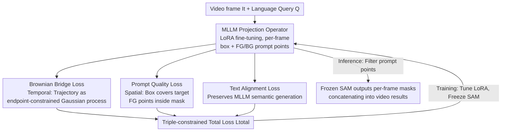

# SPOT: Spatiotemporal Prompt Optimization for Motion-Stabilized MLLM-Guided Video Segmentation

**Conference**: CVPR 2026  
**Paper**: [CVF Open Access](https://openaccess.thecvf.com/content/CVPR2026/html/Fan_SPOT_Spatiotemporal_Prompt_Optimization_for_Motion-Stabilized_MLLM-Guided_Video_Segmentation_CVPR_2026_paper.html)  
**Code**: To be confirmed  
**Area**: Video Understanding / Semantic Segmentation / Multimodal VLM  
**Keywords**: Referring Video Segmentation, Reasoning Video Segmentation, Brownian Bridge, Prompt Optimization, MLLM+SAM

## TL;DR
SPOT achieves SOTA across 6 benchmarks (Ref-YouTube-VOS, MeViS, ReVOS, etc.) without altering architectures or performing video pre-training. It relies solely on two new loss constraints to regulate the spatiotemporal behavior of prompt points generated by image-pretrained MLLMs for SAM: a Brownian Bridge loss models target trajectories as endpoint-constrained Gaussian processes for temporal smoothness, and a prompt quality loss ensures spatial geometric consistency.

## Background & Motivation
**Background**: The mainstream paradigm for Referring Video Segmentation (RVOS) and Reasoning Video Segmentation (ReasonVOS) cascades Multimodal Large Language Models (MLLMs) with visual foundation models like SAM. The MLLM parses linguistic-visual semantics to generate spatial prompts (bounding boxes + foreground/background points) per frame, while SAM performs pixel-level segmentation based on these prompts. This combination excels on static images.

**Limitations of Prior Work**: The issue lies in the "video" aspect. Existing MLLMs are mostly pre-trained on static image-text pairs, generating prompts independently for each frame without considering the physical continuity of video motion. MLLMs fail to model target trajectories, leading to abrupt changes in prompt points across adjacent frames, which causes severe non-physical temporal jittering in SAM masks and breaks temporal consistency.

**Key Challenge**: Current remedies follow two paths: either fine-tuning/pre-training MLLMs on large-scale video-text data to inject temporal capabilities (costly in computation and annotation, hard to adapt to existing foundation model ecosystems), or designing complex temporal fusion modules/memory banks (high system complexity, task-specific, poor generalization). Both paths attempt to "force-feed" explicit spatiotemporal understanding into MMLMs while ignoring the physical priors of video dynamics: object trajectories naturally follow motion continuity, forming smooth spatiotemporal context flows.

**Goal**: To achieve both temporal smoothness and spatial precision in segmentation results without changing MLLM architecture, performing video pre-training, or modifying SAM.

**Key Insight**: The authors propose that static pre-trained MLLMs already possess latent spatiotemporal reasoning capabilities. These capabilities only need to be activated by "regulating output behavior" through physical motion constraints rather than retraining the model. In other words, temporal inconsistency in video segmentation stems from the "prompt generation" stage rather than limitations in the foundation model architecture.

**Core Idea**: The problem is reformulated as searching for an optimal prompt sequence for the black-box SAM. Two complementary losses (temporal Brownian Bridge loss + spatial prompt quality loss) constrain the output space of the MLLM (viewed as a "learnable projection operator"), ensuring prompt point trajectories are both smooth and situated on the target geometry.

## Method

### Overall Architecture
SPOT repositions the MLLM as a learnable projection operator $\Pi_\theta:(I_t,Q)\mapsto(b_t,P_t)$, aiming to map each frame $I_t$ and language query $Q$ to the neighborhood of an "optimal prompt set" $\mathcal{P}^*$. The pipeline consists of two stages: **Prompt Generation Phase**, where the MLLM predicts a bounding box $b_t\in\mathbb{R}^4$ and a set of foreground/background prompt points $P_t=\{(x_{t,i},y_{t,i},l_{t,i})\}_{i=1}^K$ for each frame (where $l\in\{0,1\}$ is the foreground/background label, and all points are constrained within $b_t$); and **Mask Generation Phase**, where a fixed SAM takes $(I_t,b_t,P_t)$ to output per-frame masks $M_t=\mathrm{SAM}(I_t,b_t,P_t)$, which are concatenated into video-level results $M=\{M_t\}_{t=1}^T$.

The key observation is: SAM is a fixed, non-differentiable black box whose output depends solely on input prompts. Thus, "learning good segmentation" is equivalent to "finding an optimal prompt sequence $\{(b_t,P_t)\}$ that makes SAM outputs approximate the ground truth masks." The authors identify two geometric properties of the optimal prompt set $\mathcal{P}^*$ as optimization targets: **Temporal Consistency** (prompts should be smooth across adjacent frames to avoid SAM jittering) and **Spatial Locality** (the box $b_t$ must cover the GT mask, foreground points must fall within the mask, and background points must fall outside). These properties are approximated by the Brownian Bridge loss and the prompt quality loss, respectively, supplemented by a text alignment loss to maintain the MLLM's inherent semantic generation capabilities. The MLLM is fine-tuned using LoRA, while SAM is kept frozen throughout.

### Key Designs

**1. Brownian Bridge Loss: Modeling Smooth Trajectory as a Gaussian Process**

This addresses the jittering caused by independent per-frame generation. Since intermediate frames lack supervision signals, the MLLM often fails to generate coherent motion. The authors model the target center motion trajectory as a **Brownian Bridge** stochastic process. A Brownian Bridge $B(t)$ is a Gaussian process satisfying endpoint constraints $B(0)=a$ and $B(T)=b$. Its path minimizes the expected Dirichlet energy $\int_0^T\|\dot B(t)\|^2 dt$, meaning the smoothest trajectory in the absence of intermediate supervision is the one with minimal velocity change. This provides a physically meaningful mathematical definition for "smoothness."

Implementation: Given the ground truth centers $c_{t_0}^{gt}$ and $c_{t_0+T_s-1}^{gt}$ from the endpoints of a video segment $[t_0,t_0+T_s-1]$, the trajectory at any intermediate time $t$ follows a conditional Gaussian $\mathcal{N}(\mu_t,\Sigma_t)$, where $\mu_t=(1-\alpha_t)c_{t_0}^{gt}+\alpha_t c_{t_0+T_s-1}^{gt}$, $\Sigma_t=\sigma^2\alpha_t(1-\alpha_t)I_2$, and $\alpha_t=\frac{t-t_0}{T_s-1}$ is the normalized time ratio. The variance is maximal at intermediate frames and converges to zero at endpoints, capturing motion uncertainty. The loss pulls all prompt points toward the shared trajectory mean $\mu_t$:

$$\mathcal{L}_{\text{BBridge}}^{[t_0,t_0+T_s-1]}=\sum_{t=t_0+1}^{t_0+T_s-2}\frac{1}{K}\sum_{k=1}^K\frac{\|P_{t,k}-\mu_t\|_2^2}{\max(\alpha_t(1-\alpha_t),\epsilon)}$$

The denominator $\alpha_t(1-\alpha_t)$ is the core of **variance-adaptive weighting**: closer to endpoints ($\alpha_t\to0$ or $1$), variance is smaller and weight is higher, forcing precise localization; in middle frames, variance is larger and weight is lower, allowing for reasonable motion fluctuations. The authors provide a Bayesian interpretation (Theorem 1): minimizing this loss is equivalent to MAP estimation of the true trajectory with a Brownian Bridge prior.

**2. Prompt Quality Loss: Spatial Locality via Geometric Supervision**

SAM is highly sensitive to the spatial layout of prompt points. Kirillov et al. noted that SAM is sensitive to positive sample (foreground point) positions but relatively tolerant of negative samples. Thus, the key is ensuring foreground points truly fall within the target. This loss consists of two parts. First, a **bounding box loss** uses SmoothL1 to align predicted boxes $b^t$ with the GT mask's minimum bounding rectangle $b^t_{gt}$ for coarse localization: $\mathcal{L}_{\text{bbox}}^t=\mathrm{SmoothL1}(b^t,b^t_{gt})$.

Second is **geometric consistency supervision**. It supervises whether a prompt point should be considered a valid foreground point based on its spatial location relative to the GT mask. During training, the MLLM's real-valued logits $z_{t,i}$ are used to construct a differentiable signal: point coordinates are rounded to pixel positions $(u_{t,i},v_{t,i})$, and the GT mask value $y_{t,i}^{gt}=M^t_{gt}(u_{t,i},v_{t,i})\in\{0,1\}$ serves as the supervision target. Standard binary cross-entropy is then applied:

$$\mathcal{L}_{\text{class}}^t=-\sum_{i=1}^K\left[y_{t,i}^{gt}\log\sigma(z_{t,i})+(1-y_{t,i}^{gt})\log(1-\sigma(z_{t,i}))\right]$$

The composite is $\mathcal{L}_{\text{quality}}^t=\mathcal{L}_{\text{bbox}}^t+\mathcal{L}_{\text{class}}^t$. The authors argue that as long as positive points fall within the mask and the box covers the mask, SAM’s IoU increases monotonically with more positive points, effectively maximizing SAM's segmentation quality indirectly through differentiable geometric supervision.

**3. Text Alignment Loss + Total Loss**

To prevent the loss of the MLLM's native language understanding, a standard autoregressive language modeling objective is retained as the text alignment loss: $\mathcal{L}_{\text{text}}^t=-\sum_j\log p_\theta(w_j\mid I_t,Q,w_{<j})$. The final triple-constrained total loss is:

$$\mathcal{L}_{\text{total}}=\sum_{t=t_0}^{t_0+T_s-1}\left(\mathcal{L}_{\text{quality}}^t+\lambda_{\text{text}}\mathcal{L}_{\text{text}}^t\right)+\lambda_{\text{bb}}\mathcal{L}_{\text{BBridge}}^{[t_0,t_0+T_s-1]}$$

### Loss & Training
The backbone is Qwen-VL-7B-Chat, fine-tuned with LoRA while freezing most original parameters. EfficientViT-XL1-SAM is used for the segmentation end. MLLM and SAM communicate via two dialogue rounds: the first generates the box, and the second samples a $5\times5$ grid within the box to determine foreground/background points. Inference includes filtering prompt points by confidence thresholds. Hyperparameters: $\lambda_{\text{bb}}=0.1$, $\lambda_{\text{text}}=0.5$, segment length $T_s=8$, diffusion coefficient $\sigma^2=1.0$.

## Key Experimental Results

### Main Results
SPOT outperforms previous methods, including large-scale LLM frameworks, on RVOS benchmarks (J&F, higher is better):

| Dataset | Metric | SPOT-13B | Prev. Best | Gain |
|--------|------|----------|----------|------|
| Ref-YouTube-VOS | J&F | 71.8 | 69.2 (SAMWISE) | +2.6 |
| Ref-DAVIS-2017 | J&F | 77.2 | 74.9 (DTOS-9B) | +2.3 |
| MeViS | J&F | 51.2 | 49.5 (SAMWISE) | +1.7 |
| A2D-Sentences | IoU(Overall) | 82.2 (7B) | 81.1 (DsHmp) | +1.1 |
| JHMDB-Sentences | IoU(Overall) | 75.0 (7B) | 73.9 (DsHmp) | +1.1 |

On the reasoning-heavy ReVOS dataset, gains are particularly significant, especially in the temporal stability metric R:

| Model | Overall J&F ↑ | Stability R ↑ |
|------|---------------|-----------|
| VISA-13B | 50.8 | 15.1 |
| SPOT-7B | 52.7 | 16.5 |
| SPOT-13B | 54.8 | 18.0 |

Notably, SPOT-7B outperforms VISA-13B, proving that performance stems from "regulating output behavior" rather than scale.

### Ablation Study
Ablation of core components (Ref-YouTube-VOS, SPOT-7B, Full model J&F=70.5):

| Configuration | J&F | Note |
|------|-----|------|
| Full Model | 70.5 | Complete model |
| w/o $\mathcal{L}_{\text{BBridge}}$ | 65.2 | Dropping temporal constraint decreases J&F by 5.3% |
| w/o $\mathcal{L}_{\text{quality}}$ | 62.7 | Dropping spatial constraint has largest impact (-7.8%) |
| w/o $\mathcal{L}_{\text{text}}$ | 67.8 | Dropping semantic constraint decreases J&F by 2.7% |
| MLLM + SAM 2 (w/o Eq.10) | 66.9 | Switching to SAM2 is inferior to full SPOT |

### Key Findings
- **Spatial geometric constraints contribute most**: Removing the prompt quality loss causes a 7.8% drop, confirming the sensitivity of SAM to positive point placement.
- **Architecture is not the bottleneck; prompt generation is**: Full SPOT using SAM (70.5) significantly outperforms the "MLLM + SAM 2" baseline (66.9), verifying the core hypothesis that inconsistency arises from the prompt generation phase.
- **Variance-adaptive weighting is essential**: Constant weighting drops J&F by 1.8%, indicating that different frames require distinct uncertainty handling.
- **Optimal hyperparameters**: Performance peaks at $T_s=8$ and $\lambda_{\text{bb}}=0.1$. Segments that are too short lack context, while those that are too long increase optimization complexity.

## Highlights & Insights
- **Converting "Black-box SAM" into "Differentiable Prompt Supervision"**: By proving that prompt quality optimization aligns with SAM's IoU improvement, the authors bypass the non-differentiability of foundation models.
- **Brownian Bridge as a Physical Prior**: Instead of simple L2 smoothing, it provides a rigorous Gaussian process framework for smoothness, naturally balancing constraints through variance.
- **The "Activation vs. Injection" Paradigm**: The finding that static MLLMs already "know" spatiotemporal reasoning and only need behavioral constraints is a significant methodology shift for cascaded foundation models.
- **Lightweight and Zero-Shot Friendly**: Tuning only LoRA parameters preserves the foundation model's generalization while remaining computationally efficient.

## Limitations & Future Work
- **Endpoint Ground Truth Dependency**: The Brownian Bridge loss requires GT masks for the start and end of segments during training; incorrect endpoints can bias the entire trajectory.
- **Continuous Motion Assumption**: The model assumes smooth movement, which may struggle with rapid direction changes, sudden occlusions, or overlapping instances of the same class.
- **Fragment-based Optimization**: Optimization is currently performed on fixed 8-frame segments; long-range consistency across segment boundaries requires further study.
- **Absolute Stability R is still low**: Despite leading the SOTA, the stability metric R on ReVOS remains low (18.0), suggesting temporal stability in reasoning tasks is far from solved.

## Related Work & Insights
- **vs. Video Pre-training (VISA / VideoLISA)**: These methods inject temporal awareness through massive video-text fine-tuning. SPOT achieves better results with 7B parameters than they do with 13B through simple output constraints.
- **vs. Complex Architectures (SAM 2 / Memory Banks)**: These methods use architectural changes for inter-frame association. SPOT achieves superior consistency using the original SAM, suggesting the prompt generation mechanism was the primary source of error.
- **Insight**: The strategy of "freezing a powerful but non-differentiable foundation model and only learning controllable frontend inputs" via physically/geometrically meaningful losses can be extended to detection, keypoints, and controllable generation tasks.

## Rating
- Novelty: ⭐⭐⭐⭐⭐ Uses the Brownian Bridge for physical priors and transforms non-differentiable SAM problems into differentiable ones.
- Experimental Thoroughness: ⭐⭐⭐⭐ Covers 6 benchmarks with comprehensive ablations; however, quantitative temporal stability visualization could be more extensive.
- Writing Quality: ⭐⭐⭐⭐ Clear motivation and solid Bayesian interpretations; code not yet available.
- Value: ⭐⭐⭐⭐⭐ The paradigm of "regulating outputs instead of retraining models" is highly practical for the foundation model ecosystem.

<!-- RELATED:START -->

## Related Papers

- [\[CVPR 2026\] SAM2Text: Towards Prompt-Free and Multi-Resolution Video Scene Text Segmentation](sam2text_towards_prompt-free_and_multi-resolution_video_scene_text_segmentation.md)
- [\[CVPR 2026\] Towards Streaming Referring Video Segmentation via Large Language Model](towards_streaming_referring_video_segmentation_via_large_language_model.md)
- [\[CVPR 2026\] Minerva-Ego: Spatiotemporal Hints for Egocentric Video Understanding](minerva-ego_spatiotemporal_hints_for_egocentric_video_understanding.md)
- [\[CVPR 2026\] Robust Promptable Video Object Segmentation](robust_promptable_video_object_segmentation.md)
- [\[CVPR 2026\] No Need For Real Anomaly: MLLM Empowered Zero-Shot Video Anomaly Detection](no_need_for_real_anomaly_mllm_empowered_zero-shot_video_anomaly_detection.md)

<!-- RELATED:END -->
