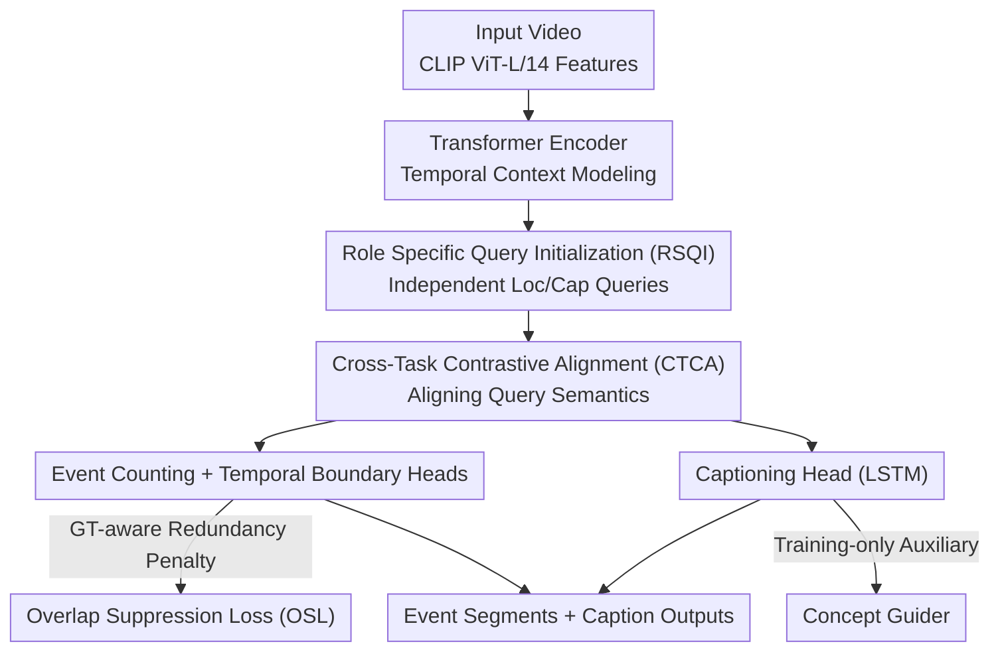

# Stay in your Lane: Role Specific Queries with Overlap Suppression Loss for Dense Video Captioning

**Conference**: CVPR 2026  
**arXiv**: [2603.11439](https://arxiv.org/abs/2603.11439)  
**Code**: [https://github.com/edwardback/ROS-DVC](https://github.com/edwardback/ROS-DVC)  
**Area**: Video Understanding  
**Keywords**: Dense Video Captioning, Role-Specific Queries, Overlap Suppression Loss, Contrastive Alignment, Concept Guidance

## TL;DR
This paper proposes ROS-DVC, which decouples shared queries in the DETR-based DVC framework into independent localization and caption queries. It introduces an Overlap Suppression Loss to penalize temporal overlaps between queries and a Cross-Task Contrastive Alignment to ensure cross-task semantic consistency, achieving SOTA captioning and localization performance on YouCook2 and ActivityNet Captions.

## Background & Motivation
Dense Video Captioning (DVC) aims to **simultaneously** perform event temporal localization and natural language description in long videos. Early methods adopted a two-stage "localize-then-describe" strategy where two modules were trained independently, lacking interaction. PDVC first introduced the DETR architecture to DVC, using a set of learnable queries to predict event segments and generate descriptions in parallel, achieving end-to-end joint optimization.

**Limitations of Prior Work in query-based DVC**:

**Multi-task interference**: Localization and captioning share the same set of queries, forcing a single query to handle the distinct tasks of "finding boundaries" and "writing descriptions." At the attention level, query attention cannot precisely focus on event boundaries (requiring broad attend for localization) while simultaneously focusing on fine-grained semantics of keyframes (requiring dense attend for captioning)—these two optimization goals conflict, leading to blurred attention. Although DDVC attempted query decomposition, it merely derived caption queries from localization queries via an MLP; their attention distributions remained highly similar, failing to achieve true task separation.

**Temporal redundancy**: Multiple queries tend to capture overlapping temporal intervals, generating redundant descriptions. As shown in Figure 1(a), the baseline model repeatedly detects the same time segment and produces identical captions, severely impacting localization accuracy and description diversity.

**Key Challenge**: Queries must serve two heterogeneous tasks, but a shared representation space leads to conflicting optimization directions. Furthermore, the lack of explicit constraints on temporal relationships between queries prevents the automatic elimination of overlaps.

**Key Insight**: Rather than forcing one query to perform two roles, the model utilizes two independent sets of queries to "stay in their lanes"—localization queries focus on broad temporal context for boundary positioning, while caption queries focus on semantic details of keyframes. Explicit loss designs constrain query behavior: contrastive loss ensures cross-task consistency, and overlap loss penalizes temporal redundancy.

**Core Idea**: Use role-specific independent queries to eliminate multi-task interference in DVC and apply Overlap Suppression Loss to eliminate temporal redundancy.

## Method

### Overall Architecture
ROS-DVC follows a DETR-style parallel encoder-decoder framework but replaces the "single query set for localization and description" with "two query sets managing separate tasks." A video first uses a pre-trained CLIP ViT-L/14 to extract frame-level features, which are sent to a Transformer encoder for temporal context modeling. In the decoder, two sets of independent learnable queries are placed in parallel—localization queries for finding boundaries and caption queries for writing descriptions—each reading frame features through cross-attention. Finally, four task heads predict event counts, temporal boundaries, description text, and event concepts. The entire process is trained end-to-end. Building on this backbone, the model addresses multi-task interference and temporal redundancy through query separation and three new losses/auxiliary heads.

### Key Designs

**1. Role Specific Query Initialization: Decoupling localization and captioning at the source**

Traditional query-based DVC uses the same query for both boundary detection and description. However, these tasks have opposing attention requirements: localization needs broad attention over large temporal contexts, while description needs dense attention on keyframes for fine-grained semantics. ROS-DVC splits the single query set into $\{q_{\text{loc}}^j\}_{j=1}^K$ and $\{q_{\text{cap}}^j\}_{j=1}^K$, initialized from two **completely independent** learnable embedding spaces. Each set performs cross-attention with encoded frame features. Both sets share the same decoder and reference the same visual locations (provided by localization query reference points) in cross-attention to ensure they focus on the same visual regions. Unlike DDVC, which derives caption queries from localization queries via MLP, independent initialization allows each query set to converge to its optimal attention pattern.

**2. Cross-Task Contrastive Alignment (CTCA): Ensuring consistency across task-specific queries**

Decoupling queries introduces a risk: localization and caption queries might drift semantically, leading to situations where one locates event A but describing event B. CTCA uses an asymmetric contrastive loss to align them. After Hungarian matching identifies the query indices $\mathcal{M}$ corresponding to ground truth, for each $j \in \mathcal{M}$, the $j$-th caption query $\tilde{q}_{\text{cap}}^j$ and its corresponding localization query $\tilde{q}_{\text{loc}}^j$ are treated as a positive pair, with other localization queries as negatives:

$$\mathcal{L}_{\text{CTCA}} = -\sum_{j \in \mathcal{M}} \log \frac{\exp(\text{sim}(\tilde{q}_{\text{cap}}^j, \tilde{q}_{\text{loc}}^j)/\tau)}{\sum_{j'} \exp(\text{sim}(\tilde{q}_{\text{cap}}^j, \tilde{q}_{\text{loc}}^{j'})/\tau)}$$

where $\text{sim}(\cdot)$ is cosine similarity and $\tau$ is the temperature parameter. This preserves task independence while allowing localization queries to gain semantic awareness.

**3. Overlap Suppression Loss (OSL): Explicitly penalizing temporal redundancy**

A major cause of poor localization is multiple queries clustering around the same interval. OSL adaptively penalizes overlaps based on the alignment between predictions and ground truth (GT). Given the overlap between predicted intervals $P_o(i,j) = \text{IoU}(B_i, B_j)$ and the alignment between prediction and GT $P_g(i,j) = \text{IoU}(B_i, G_j)$, an adaptive weight is defined:

$$\alpha = \gamma \cdot P_g + (1-\gamma) \cdot (1-P_g), \quad \gamma \leq 0.5$$

When predictions align well with GT ($P_g$ is high), $\alpha$ is small and overlap is barely penalized. When predictions deviate from GT, $\alpha$ is large and suppression is aggressive. The final loss is $\mathcal{L}_{\text{OSL}} = -\alpha \cdot \log(\beta - P_o)$, where $\beta$ is a maximum overlap threshold. This GT-aware design prunes redundancy while preserving detections for adjacent events.

**4. Concept Guider: Injecting high-level semantics without inference overhead**

Concept Guider provides a lightweight alternative to external memory banks. It extracts the top-$N_c$ nouns and verbs from the training captions as a concept vocabulary and constructs a multi-hot label $Y^c \in \{0,1\}^{N_c}$ for each event. The concept head uses an MLP + sigmoid on the caption query output to predict concept distributions: $\hat{y}_c = \text{sigmoid}(\text{MLP}(\tilde{q}_{\text{cap}}))$. This head is discarded during inference, having served its purpose of embedding core concepts into the caption queries during training.

### Loss & Training
The total loss combines standard DVC losses with three new components:
$$\mathcal{L}_{\text{total}} = \lambda_{\text{giou}}\mathcal{L}_{\text{giou}} + \lambda_{\text{cls}}\mathcal{L}_{\text{cls}} + \lambda_{\text{cap}}\mathcal{L}_{\text{cap}} + \lambda_{\text{ec}}\mathcal{L}_{\text{ec}} + \lambda_{\text{CTCA}}\mathcal{L}_{\text{CTCA}} + \lambda_{\text{OSL}}\mathcal{L}_{\text{OSL}} + \lambda_{\text{CG}}\mathcal{L}_{\text{CG}}$$

- Visual Encoding: CLIP ViT-L/14, 1 FPS sampling.
- Decoder: 2-layer deformable transformer, 4-level multi-scale features.
- Queries: $K=50$ for YouCook2 ($F=200$ frames), $K=10$ for ActivityNet ($F=100$ frames).
- Hyperparameters: $\gamma=0.25$, $\beta=1.0$, $N_c=30$.

## Key Experimental Results

### Main Results — Captioning Performance

| Method | Pre-trained | YouCook2 CIDEr↑ | YouCook2 SODA_c↑ | ActivityNet CIDEr↑ | ActivityNet SODA_c↑ |
|------|--------|-----------------|-------------------|--------------------|--------------------|
| PDVC | ✗ | 29.69 | 4.92 | 29.97 | 5.92 |
| CM2 | ✗ | 31.66 | 5.34 | 33.01 | 6.18 |
| MCCL | ✗ | 36.09 | 5.21 | 34.92 | 6.16 |
| E2DVC | ✗ | 34.26 | 5.39 | 33.63 | 6.13 |
| **ROS-DVC (Ours)** | **✗** | **39.18** | **7.06** | **35.04** | **6.45** |

On YouCook2, ROS-DVC's CIDEr is 3.09 higher than MCCL (which uses external memory), and its SODA_c is 1.85 higher. On ActivityNet, it achieves the best CIDEr (35.04) among non-pretrained methods.

### Main Results — Localization Performance

| Method | YouCook2 Rec.↑ | YouCook2 Pre.↑ | YouCook2 F1↑ | ActivityNet Rec.↑ | ActivityNet F1↑ |
|------|---------------|---------------|-------------|-------------------|----------------|
| PDVC | 22.89 | 32.37 | 26.81 | 53.27 | 54.78 |
| E2DVC | 24.36 | 34.75 | 28.64 | 54.67 | 56.14 |
| **ROS-DVC** | **29.34** | **35.26** | **32.03** | **55.35** | **55.50** |

On YouCook2, F1 is 3.39 higher than E2DVC. On ActivityNet, Recall and Precision are more balanced, indicating the event counter predicts counts closer to ground truth.

### Ablation Study

| RSQI | CTCA | OSL | CG | CIDEr↑ | SODA_c↑ | F1↑ | Description |
|------|------|-----|-----|--------|---------|-----|------|
| ✗ | ✗ | ✗ | ✗ | 29.69 | 5.39 | 26.81 | Baseline (PDVC) |
| ✓ | ✗ | ✗ | ✗ | 32.33 | 5.43 | 27.00 | Query Separation Only (CIDEr +2.64) |
| ✗ | ✗ | ✓ | ✗ | 33.60 | 6.79 | 31.22 | OSL Only (F1 +4.41) |
| ✗ | ✗ | ✗ | ✓ | 31.40 | 5.62 | 27.69 | Concept Guidance Only (CIDEr +1.71) |
| ✓ | ✓ | ✗ | ✗ | 34.48 | 5.58 | 27.59 | Separation + Contrastive (CIDEr +4.79) |
| ✓ | ✓ | ✓ | ✓ | **39.18** | **7.06** | **32.03** | **Full Model (Best across all metrics)** |

### Key Findings
- **OSL contributes most to localization**: Adding OSL alone boosts F1 from 26.81 to 31.22 (+4.41), confirming that temporal overlap is a major bottleneck.
- **RSQI + CTCA contributes most to captioning**: Query separation and alignment improve CIDEr by 4.79, showing task decoupling releases captioning potential.
- **The four components are complementary**: The full model significantly outperforms any three-component combination.
- **$\gamma=0.25$ is optimal for OSL**: Smaller values hurt caption quality; larger values weaken overlap suppression.
- **Removing $\alpha$ (uniform penalty) reduces Precision**: This validates the necessity of GT-aware adaptive weights.

## Highlights & Insights
- **Simplicity of independent query initialization**: Task decoupling is achieved without extra encoders or complex interaction mechanisms, simply by initializing from different embedding spaces.
- **Adaptive OSL design** avoids over-constraining the model by using the $\alpha$ weight to balance redundancy reduction and preservation of correct detections.
- **Concept Guider leverages "training enhancement + zero inference cost"**: This paradigm enriches semantics without increasing system complexity at runtime.

## Limitations & Future Work
- The captioning head uses an LSTM; performance could likely improve by replacing it with a Transformer or LLM-based generator.
- The concept vocabulary ($N_c=30$) is small and derived from fixed statistics, which may struggle in open-vocabulary scenarios.
- Evalution is limited to YouCook2 and ActivityNet; generalization to other video types (e.g., Ego4D) remains to be tested.
- OSL assumes continuous temporal segments and may not apply to multi-label or hierarchical event scenarios.

## Related Work & Insights
- **vs PDVC**: While PDVC introduced the DETR framework to DVC with shared queries, ROS-DVC introduces decoupling and explicit constraints, yielding gains of +9.49 CIDEr and +5.22 F1.
- **vs DDVC**: DDVC relies on MLP-derived queries. ROS-DVC's independent initialization is more thorough and functions without requiring GPT-2.
- **Transferability**: The GT-aware overlap penalty in OSL can be directly transferred to other temporal tasks like action detection or moment retrieval to solve proposal redundancy.

## Rating
- Novelty: ⭐⭐⭐⭐ Clear intuition and simple design, though individual technical complexity is moderate.
- Experimental Thoroughness: ⭐⭐⭐⭐⭐ Comprehensive benchmarks, ablations, and hyperparameter analysis.
- Writing Quality: ⭐⭐⭐⭐ Logical motivation and clear visualizations (e.g., attention comparison).
- Value: ⭐⭐⭐⭐ Provides a clear paradigm for query-based DVC; OSL is highly transferable.
- Value: TBD

<!-- RELATED:START -->

## Related Papers

- [\[CVPR 2026\] SAIL: Similarity-Aware Guidance and Inter-Caption Augmentation-based Learning for Weakly-Supervised Dense Video Captioning](sail_similarity-aware_guidance_and_inter-caption_augmentation-based_learning_for.md)
- [\[AAAI 2026\] Explicit Temporal-Semantic Modeling for Dense Video Captioning via Context-Aware Cross-Modal Interaction](../../AAAI2026/video_understanding/explicit_temporal-semantic_modeling_for_dense_video_captioning_via_context-aware.md)
- [\[CVPR 2026\] Beyond Caption-Based Queries in Video Moment Retrieval](beyond_caption-based_queries_in_video_moment_retrieval.md)
- [\[CVPR 2026\] Self-Critical Distillation Network for Video-based Commonsense Captioning](self-critical_distillation_network_for_video-based_commonsense_captioning.md)
- [\[CVPR 2026\] Your One-Stop Solution for AI-Generated Video Detection](your_one-stop_solution_for_ai-generated_video_detection.md)

<!-- RELATED:END -->
