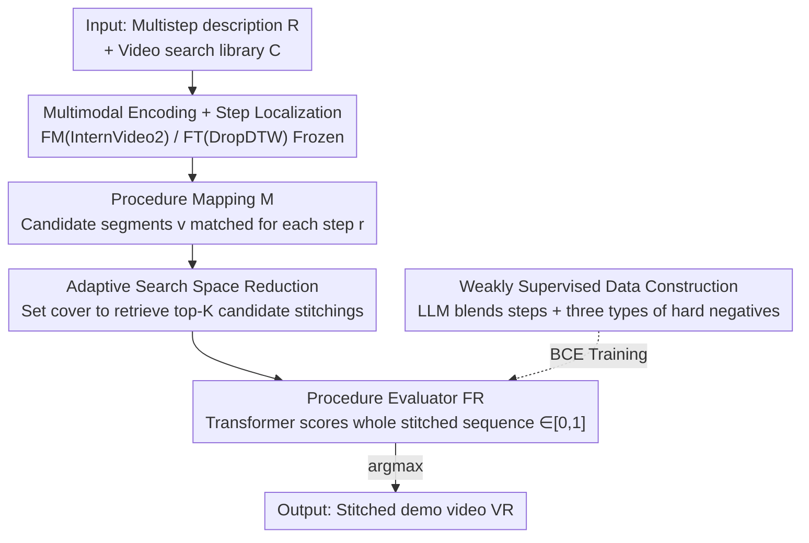

# Stitch-a-Demo: Creating Video Demonstrations from Multistep Descriptions

**Conference**: CVPR 2026  
**Paper**: [CVF Open Access](https://openaccess.thecvf.com/content/CVPR2026/html/Wu_Stitch-a-Demo_Creating_Video_Demonstrations_from_Multistep_Descriptions_CVPR_2026_paper.html)  
**Code**: [Project Page](https://vision.cs.utexas.edu/projects/stitch-a-demo/) (UT Austin, code not yet explicitly open-sourced)  
**Area**: Video Understanding / Instructional Video Retrieval  
**Keywords**: Multistep Descriptions, Video Demonstration, Cross-Video Stitching, Procedure Evaluator, Contrastive Hard Negatives

## TL;DR
Given a multi-step text procedure (e.g., a recipe), Stitch-a-Demo utilizes a learned "procedure evaluator" to retrieve and **stitch segments across videos** from thousands of instructional videos, composing a demonstration video that is both accurate for each step and visually coherent. It achieves up to a 29% improvement in recall compared to state-of-the-art (SOTA) retrieve-only or generation-only methods, leading by an overwhelming margin in human preference.

## Background & Motivation
**Background**: To obtain visual demonstrations from text, the mainstream approaches follow two paths: text-to-video retrieval and image/video generation. Retrieval is adept at finding the semantically most matching segments from existing candidates, while generation excels at creating scenes not present in the dataset.

**Limitations of Prior Work**: Both paths handle only a **single context**—a single caption or a single action description—to retrieve or generate a matching video clip. However, real-world instruction scenarios (recipes, gardening manuals, woodworking procedures) are **multi-step sequences**. If each step is processed in isolation, retrieving the most similar segment for each and then stitching them together, the resulting demonstration suffers from **incoherence**: step three might suddenly feature a different kitchen, different ingredient states, or even a pre-chopped onion reverting to a whole one. Generative methods are limited to producing short segments (whereas instruction videos typically span 5–30 minutes) and mostly degrade to "generating one keyframe per step", lacking action details and prone to introducing hallucinations.

**Key Challenge**: A good demonstration must simultaneously satisfy two objectives: **correctness** (each segment indeed demonstrates the corresponding step) and **coherence** (adjacent segments are continuous in terms of visuals, environment, and object states). Existing methods only optimize the "step-by-step instantaneous video-text alignment", failing to capture cross-step coherence. Meanwhile, although there is a vast amount of instructional videos online, any **specified step sequence** (even one arbitrarily imagined by a user) is almost impossible to be fully covered by a single video—the combinations of steps are explosive.

**Goal**: To learn a function $F(R, C) = V_R$ that takes a multi-step description $R=(r_1,\dots,r_n)$ and a video library $C$ as input, and outputs a segment sequence $V_R=(v_1,\dots,v_n)$, where each $v_i$ can come from **any** video in the library, ensuring that each step is correct and the overall sequence is coherent.

**Key Insight**: Rather than relying on heuristic rules to judge "which stitchings are good," the core observation of the authors is that large-scale weakly supervised data can be **automatically** generated, into which **hard negative samples** are carefully injected, allowing the model to learn the two constraints of "correctness + coherence" from contrastive training.

**Core Idea**: Replace step-by-step similarity scoring with a **learned procedure evaluator** (procedure evaluator), trained contrastively with three types of hard negative samples that violate different constraints. This allows the model to directly score the plausibility of the "entire stitched sequence" rather than making individual step-level predictions for hard stitching.

## Method

### Overall Architecture
The system is a retrieval pipeline: "localize $\to$ map $\to$ evaluate $\to$ retrieve and stitch". Given query $R$ and video library $C$: use frozen multimodal encoder $F_M$ (InternVideo2) to encode step description $r_i$ and segment $v_i$ to 768-dim features; use frozen temporal localizer $F_T$ (DropDTW) to parse each video into (step text, segment) pools $P$; match candidate segments for each step of query $R$, forming *procedure mapping* $M$; the core module is a Transformer-based **procedure evaluator** $F_R$, which takes the video+text features of entire stitched candidate $(v_1,\dots,v_n)$ and outputs the probability of it being a correct and coherent demo $\in[0,1]$. During inference, the candidate with the maximum probability is selected as the output $V_R$. The key to training $F_R$ is not architecture, but **data**: use LLM to blend steps of different videos to generate large-scale weakly supervised positive samples $D_w$, corrupt positive samples in three targeted ways to obtain hard negatives, train with binary cross-entropy (BCE). Finally, a **set cover** algorithm is used to scale down the candidate space.

### Key Designs

**1. Procedure Evaluator $F_R$: Scoring the "Entire Stitched Sequence" instead of Step-by-Step**

Existing retrieval methods only calculate step-by-step similarity and then perform a naive stitch, failing to capture cross-step coherence. Stitch-a-Demo replaces this with a learning-based module: $F_R$ is a 4-layer, 8-head Transformer encoder. The inputs are concatenated feature sequences of step texts and video candidate segments, where each position receives the step text feature $F_M(r_i)$ and the video feature $F_M(v_i)$. The CLS output token is passed through a linear layer to obtain the probability of a correct and coherent demo:

$$F_R\big((v_1, v_2, \dots, v_n)\mid v_i\sim r_i,\ (r_i,v_i)\in M\big)\to[0,1]$$

where $v\sim r$ denotes segment $v$ demonstrating step $r$. Because $F_R$ observes the **entire sequence** at once, self-attention can establish relations across steps, thus identifying cross-step coherence (e.g., whether the kitchen in step three matches step two, or whether the onion's state has regressed). Inference seeks the candidate stitching with the maximum probability: $V_R = \arg\max_{(v_1,\dots,v_n)} F_R(\cdot)$.

**2. Three Types of Hard Negatives: Dissecting "Correctness + Coherence" into Contrastive Violations**

To train the evaluator effectively, it must be exposed to imperfect cases. Instead of human labeling, the authors apply **targeted corruption** to positive samples to generate hard negatives, where each corruption targets a specific constraint:

- **Step/Goal Correctness**: Replace a segment $v\sim r$ with a mismatched segment $v'\not\sim r$ from the same source video. To create hard negative samples, the replaced segment is extracted from the **same source video** (same source but incorrect semantics), forcing the model to distinguish correct semantics from similar visual styles.
- **Visual Coherence**: To minimize switching source videos, if three consecutive steps are from the same video ($v_k, v_{k+1}, v_{k+2} \in V^{(j)}$), the middle segment is replaced with a semantically correct segment from **another video**—creating an unnecessary video cut to penalize lack of continuity.
- **Object State Coherence**: Objects should not undergo irreversible state reversals. For instance, chopped onions should not revert to a whole onion, and sanded wood should not revert to unsanded wood. This is modeled by taking two segments $v$ (demonstrating $r_x$) and $v'$ (demonstrating $r_y$) from the same source video where $v$ chronologically precedes $v'$, and **reversing their order** ($x>y$) to construct the negative instance.

These three classes of constraints directly map to correctness and coherence, and are **automatically derived** without requiring manual labeling.

**3. LLM Blending to Build Weakly Supervised Data: Training the Model to "Stitch Across Videos"**

To learn cross-video stitching, the model needs training data where steps are derived from different videos, whereas original datasets only contain single-source videos. The authors use LLMs for generation: instructional video databases (HowTo100M, COIN, CrossTask, HT-Step) are processed by segmenting their ASR transcriptions into step-level summaries using Llama-3.1 70B. Pairing step vectors with MPNet identifies flows with cosine similarities $>0.8$. Finally, the LLM is prompted to **blend these steps into a new procedural flow** (e.g., merging steps from two distinct recipe variants into one). Since the source steps have timestamps, the corresponding video clips are directly reused. This forms the weakly supervised positive training set $D_w$ (446k training samples). The authors acknowledge LLM-induced noise, but manual verification confirms **75% high-quality labels**, showing that the scale of training data outweighs noise issues. Hard negatives are sampled directly from $D_w$.

**4. Adaptive Search Space Reduction: Compressing Exponential Space via Set Cover**

When allowing each step to be retrieved from any video, the candidate space size is $O((KN)^M)$ for $M$ steps and an average of $K$ segments per video, which cannot be exhaustively searched. The authors formulate this as a **set cover problem**. For each video $V^{(i)}$, a set is defined as:

$$S_i := \{(x, v)\mid x\in\mathbb{Z},\ v\in V^{(i)},\ v\sim r_x\}$$

which captures which query steps are covered by this video. The target is to choose the minimum number of sets $S_i$ that cover all steps in $R$ (equivalent to minimizing source video switches). A greedy algorithm selects top-K coverage paths to feed into $F_R$. This technique achieves two goals: it reduces candidate search space during inference, and helps form destructor sets for evaluation. Results (Fig. 5) show that even with a small K, the ground truth is preserved with high probability, making this method scalable.

### Loss & Training
The correct stitched sequences are labeled 1, and negative/corrupted sequences are labeled 0. Standard binary cross-entropy (BCE) loss is utilized to train $F_R$. Encourses $F_M$ and $F_T$ are frozen throughout, and only $F_R$ is trained. Given domain discrepancies (cooking/woodworking/gardening), **one distinct $F_R$ is trained for each domain**. Optimization is conducted with Adam, learning rate of $3\times10^{-4}$, batch size of 24, for 10 epochs using 8 Quadro RTX 6000 GPUs. $F_M$'s output dimension and $F_R$'s input/hidden dimensions are set to 768.

## Key Experimental Results

Task Setup: For each test instance, 499 distractor items are paired (including constraint-violating hard negatives and candidate paths from the set cover reduction), leading to 500 candidate choices. Metrics: Recall@50 (higher is better), and Median Rank (MR, lower is better). Evaluation is carried out across cooking, woodworking, and gardening domains.

### Main Results (Video Demonstration Retrieval, Cooking Domain Selected)

| Method | SaD-MC MR↓ | SaD-MC R@50 | SaD-VD MR↓ | SaD-VD R@50 | HT-Step MR↓ | HT-Step R@50 |
|------|-----------|-------------|-----------|-------------|-------------|--------------|
| CoVR | 193 | 0.04 | 132 | 0.04 | 161 | 0.12 |
| VidDetours | 124 | 0.21 | 80 | 0.31 | 125 | 0.22 |
| Text-only | 108 | 0.32 | 76 | 0.36 | 123 | 0.26 |
| Recipe2Video | 125 | 0.21 | 50 | 0.50 | 93 | 0.29 |
| InternVideo (second best) | 36 | 0.55 | 8 | 0.71 | 68 | 0.42 |
| **Ours** | **3** | **0.84** | **3.5** | **0.91** | **40** | **0.56** |

Ours achieves SOTA results across all domains, test sets, and metrics: compared to the second best (InternVideo), recall improves by up to **29%** and MR is improved by up to **33 spots**. The key contrast is that InternVideo uses the **exact same** encoders $F_M$ and $F_T$ but lacks the procedure evaluator $F_R$, demonstrating the impact of this core evaluation innovation. Similarly, against hierarchical retrieval (HiREST), the proposed method outperforms recall on SaD-VD/HT-Step by 0.42 / 0.32 respectively.

### Human Preference Study (Cooking Domain, max 60 pairs per comparison, 3 annotators per sample)

| Ours vs | Step | Goal | Quality | Total |
|---------|------|------|---------|-------|
| Recipe2Video | 0.77 | 0.74 | 0.74 | 0.77 |
| InternVideo | 0.75 | 0.72 | 0.78 | 0.75 |
| ShowHowTo (Generative) | 0.94 | 0.94 | 0.85 | **0.98** |

Ours outperforms baselines across all four dimensions (Step accuracy, Goal accuracy, Quality, and Total preference). The preference rate compared to the generative SOTA (ShowHowTo) reaches 0.98. Strikingly, humans prefer our stitched outcomes **over original single-source video demonstrations by 83:17**, demonstrating that natural single-source videos struggle to match specific multi-step target definitions as precisely as our stitched results.

### Key Findings
- **Procedure Evaluator is the Key**: Removing $F_R$ (degrading to InternVideo-style step-by-step similarity alignment) drops recall from 0.84 to 0.55. This represents the most significant performance drop, proving that scoring the whole sequence is fundamentally stronger than greedy step-by-step matches.
- **State Coherence Negatives are Crucial**: The inclusion of chronologically reversed state negatives is validated to provide a highly informative training signal, teaching the model crucial real-world state transitions.
- **Robustness in both Multi-source Stitching and Single-source Restoration**: The model excels both in tasks requiring multi-source stitching (SaD-MC/SaD-VD) and single-source video segment retrieval (HT-Step/COIN/CrossTask), suggesting that contrastive training comprehensively improves correctness and coherence.
- **Set Coverage Enables Scalability**: Even with a small search candidate set size K, the greedy set cover formulation keeps high-probability ground truth matches inside candidate inputs, outperforming random sampling or edited-NN while reducing computational complexity.

## Highlights & Insights
- **Formulating Coherence as a Learnable Discriminative Task**: Instead of manually tuning heuristic coherence metrics (which limits methods like Recipe2Video), a Transformer encoder is trained to directly classify whether a video is well-stitched, letting learning-based processes discover what defines coherence. This sequence validation paradigm can be extended to various stitching problems.
- **Negative-as-Label**: The three hard negative types translate the abstract concept of "correctness + coherence" into procedurally generated violations (semantic swapping, unnecessary cutting, and temporal reversal), avoiding additional manual labeling.
- **LLM as an Augmentation Engine**: LLMs blend different videos to create "cross-video procedural demonstrations"—a type of positive instance virtually nonexistent in raw training datasets.
- **Reducing Combinatorial Complexity via Classic Optimization**: Formulating the exponential search space as set cover solved via a greedy top-K path selection makes the pipeline computationally viable.

## Limitations & Future Work
- **Dependency on Frozen Pre-trained Backbones**: Localizer (DropDTW) and encoder (InternVideo2) are frozen during training. Upstream localization errors propagate to the mapping $M$, which the downstream evaluator cannot correct.
- **Domain-Specific Constraints**: Separate $F_R$ modules are trained for cooking, woodworking, and gardening, lacking a unified open-domain evaluator. Extending to new domains requires distinct data and training cycles.
- **Weak Supervision Noise**: Labeling noise is present in about 25% of the LLM-blended datasets.
- **Inherent Limitation of Retrieval**: The generation capacity is bounded by the database; actions or settings not present inside the retrieval library cannot be synthesized. Hybrid paradigms bridging retrieval and controlled video generation are highlighted as future work directions.

## Related Work & Insights
- **vs InternVideo / Text-only**: These approaches perform step-level text-to-video retrieval and stitch them greedily, lacking sequence-level modeling. Our model integrates a procedure evaluator $F_R$ on top of identical backbones, improving recall from 0.55 to 0.84.
- **vs Recipe2Video**: This prior work optimizes visual matching via manual heuristic metrics, which struggle with semantic correctness and object state preservation. The proposed method frames temporal and state coherence as a unified contrastive learning target, outperforming Recipe2Video.
- **vs CoVR / VidDetours**: These are retrieval architectures but are not tailored for multi-step composition. Adapting them for step-wise retrieval yields poor results, highlighting that multi-step demonstration construction is a distinct challenge.
- **vs ShowHowTo (Generative)**: Generative baselines produce keyframes instead of fluid video actions and often introduce hallucinations. Our retrieval-based stitching model maintains a 0.98 human preference margin, showcasing the advantage of stitching existing video assets over generation in instructional settings.

## Rating
- **Novelty**: ⭐⭐⭐⭐ Formulates the novel "multi-step description $\to$ cross-video stitched demonstration" task, with a clean learning-based evaluator and automatic hard negative generation.
- **Experimental Thoroughness**: ⭐⭐⭐⭐ Evaluated across three domains, multiple test collections, strong SOTA baselines, human evaluations, and search space analyses.
- **Writing Quality**: ⭐⭐⭐⭐ The task definition is clear, and the alignment between constraints and negative generation is well-described.
- **Value**: ⭐⭐⭐⭐ Directly applicable to instructional video search, robot imitation learning setup, and multi-step visualization.

<!-- RELATED:START -->

## Related Papers

- [\[CVPR 2026\] A Stitch in Time: Learning Procedural Workflow via Self-Supervised Plackett-Luce Ranking](a_stitch_in_time_learning_procedural_workflow_via_self_supervised_plackett_luce_r.md)
- [\[CVPR 2025\] Unbiasing through Textual Descriptions: Mitigating Representation Bias in Video Benchmarks](../../CVPR2025/video_understanding/unbiasing_through_textual_descriptions_mitigating_representation_bias_in_video_b.md)
- [\[CVPR 2026\] Video Panels for Long Video Understanding](video_panels_for_long_video_understanding.md)
- [\[CVPR 2026\] An Empirical Study on How Video-LLMs Answer Video Questions](an_empirical_study_on_how_video-llms_answer_video_questions.md)
- [\[CVPR 2026\] CVA: Context-aware Video-text Alignment for Video Temporal Grounding](cva_context-aware_video-text_alignment_for_video_temporal_grounding.md)

<!-- RELATED:END -->
