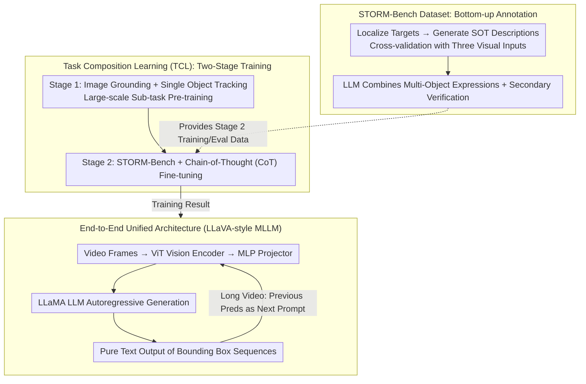

# STORM: End-to-End Referring Multi-Object Tracking in Videos

**Conference**: CVPR 2026 Findings  
**arXiv**: [2604.10527](https://arxiv.org/abs/2604.10527)  
**Code**: [https://github.com/amazon-science/storm-referring-multi-object-grounding](https://github.com/amazon-science/storm-referring-multi-object-grounding)  
**Area**: Video Understanding  
**Keywords**: Referring Multi-Object Tracking, MLLM, Task Composition Learning, Video Understanding, Dataset

## TL;DR
STORM is the first end-to-end Multi-modal Large Language Model (MLLM) framework for Referring Multi-Object Tracking (RMOT). It significantly reduces the dependence on labeled RMOT data through a Task Composition Learning strategy and establishes a high-quality STORM-Bench dataset.

## Background & Motivation

**Background**: Referring Multi-Object Tracking (RMOT) requires models to track all matching targets in a video based on a textual description. Existing RMOT methods decouple object localization and tracking into independent modules, relying on external detectors.

**Limitations of Prior Work**: (1) RMOT training videos are extremely scarce; (2) labelings in existing datasets are ambiguous and domain-restricted; (3) modular approaches struggle to comprehend complex referring expressions and reason about causal or relational dependencies.

**Key Challenge**: RMOT is a complex task requiring joint vision-language understanding and temporal tracking, yet the extremely high annotation cost prevents the acquisition of sufficient training data.

**Goal**: To unify localization and tracking, eliminate dependence on external modules, and resolve the data scarcity issue.

**Key Insight**: Borrowing from the "pre-train on basic capabilities before fine-tuning" philosophy in LLM pre-training, RMOT is decomposed into two foundational sub-tasks: image grounding and single-object tracking.

**Core Idea**: Use Task Composition Learning to decompose RMOT into data-rich sub-tasks, learning foundational localization and tracking capabilities first, followed by fine-tuning with a small amount of RMOT data.

## Method

### Overall Architecture
The core of STORM is using Task Composition Learning (TCL) to bypass RMOT data scarcity: the task is split into data-rich sub-tasks for two-stage training, allowing an end-to-end MLLM to perform direct reasoning, while the high-quality training/evaluation data is provided by the bottom-up annotated STORM-Bench. Specifically, it consists of three parts: **Task Composition Learning (TCL)** uses two-stage training, where Stage 1 involves pre-training on large-scale image grounding and single-object tracking data, and Stage 2 involves fine-tuning with STORM-Bench using a Chain-of-Thought (CoT) strategy; the **End-to-End Unified Architecture** is a LLaVA-style MLLM where a ViT vision encoder extracts frame-level features → an MLP projector maps them to the text space → a LLaMA-based LLM autoregressively generates bounding box sequences, outputting structured text like `Object 1: Frame 1: [x1,y1,x2,y2], ...`, with long videos processed in slices using previous predictions as prompts for the next segment; and the **STORM-Bench Dataset** follows a bottom-up labeling process, first localizing targets, then generating and verifying descriptions, and finally using an LLM to combine them into multi-object referring expressions.

### Key Designs

**1. Task Composition Learning (TCL): Building RMOT capabilities from data-rich sub-tasks**

The bottleneck for RMOT is not the model architecture but the annotation—it requires bounding all matching targets, maintaining identity across frames, and aligning with complex referring descriptions, making the cost per video far exceed ordinary detection. STORM breaks this by decomposing RMOT into two foundational sub-tasks with massive existing data: image grounding (understanding "expression ↔ box" correspondence) and single-object tracking (understanding temporal consistency of the same object across frames). Stage 1 pre-trains on these large-scale datasets for cross-modal alignment and temporal continuity. Stage 2 then uses a much smaller STORM-Bench for fine-tuning to combine these into "tracking a set of objects by description." During fine-tuning, a Chain-of-Thought (CoT) strategy explicitly decomposes reasoning: first localizing targets in the initial frame, then using them as anchors for temporal tracking, which helps maintain identity in multi-object or occluded scenarios. This path essentially migrates the LLM pre-training paradigm to RMOT, reducing the required RMOT annotations from a "massive necessity" to "minimal alignment data."

**2. End-to-End Unified Architecture: Reasoning via pure text bounding box sequences**

Traditional RMOT pipelines decouple localization, tracking, and text matching into independent modules, losing information at each boundary and breaking the causal/relational dependencies within complex expressions. STORM eliminates all external detectors and trackers, allowing the MLLM to autoregressively output bounding box sequences as pure text in the format `Object 1: Frame 1: [x1,y1,x2,y2], ...`. Consequently, semantic reasoning and box generation occur within the same model, directly leveraging the LLM's推理 capability to parse compound conditions like "people in red clothes running left." For long videos exceeding context limits, the model processes short clips sequentially, using the predicted boxes from the previous clip as prompts for the next—ensuring trajectory continuity across segments through state-relay.

**3. STORM-Bench Dataset: Bottom-up annotation leveraging labeling asymmetry**

Existing RMOT datasets often use top-down annotation—starting with a description and then finding targets—which leads to ambiguity and narrow domains. STORM-Bench uses a bottom-up approach: targets are first localized in the video, descriptions are generated for each (cross-validated by an MLLM with three visual inputs to reduce hallucinations), and finally, an LLM combines individual descriptions into a multi-object referring expression with secondary verification. This is based on the insight that "describing a bounded object is more reliable than localizing from a phrase." By placing the easier task first and using known answers to constrain the harder steps, pipeline noise is minimized. This results in 15.7K videos, 251K images, and 200K expressions, serving as both a training source for Stage 2 and a benchmark for RMOT.

### Loss & Training
Standard next-token prediction cross-entropy loss is used. Since bounding boxes are predicted as text tokens, localization, tracking, and referring understanding are unified under the same autoregressive optimization objective.

## Key Experimental Results

### Main Results

| Task/Dataset | Metric | STORM | Prev. SOTA | Gain |
|-------------|------|-------|----------|------|
| RefCOCO val | Acc@0.5 | 89.1 | 88.7 (M-GPT2) | +0.4 |
| Elysium RSOT | AUC | 84.1 | 83.3 (Elysium) | +0.8 |
| STORM-Bench RMOT | HOTA | 42.9 | 37.9 (Qwen2.5-VL) | +5.0 |

### Ablation Study

| Configuration | HOTA | Description |
|------|------|------|
| Full STORM | 42.9 | Complete model |
| w/o Stage 1 Pre-training | 35.2 | Sub-task pre-training contribution is significant |
| w/o CoT Reasoning | 39.6 | Chain-of-Thought improves tracking consistency |

### Key Findings
- The TCL strategy significantly reduces RMOT data requirements, and image grounding pre-training also enhances RMOT performance.
- Longer and more comprehensive prompts further improve tracking performance (87.4 → 87.5 AUC).
- The end-to-end approach clearly outperforms modular pipelines (e.g., Grounding DINO + Tracker), which achieved only 31.7 HOTA.

## Highlights & Insights
- **Utility of Task Decomposition**: Decomposing complex tasks into data-rich sub-tasks is a general strategy to overcome annotation bottlenecks, transferable to other video tasks requiring complex labeling.
- **Bottom-up Annotation Pipeline**: A more robust labeling method than top-down approaches, exploiting the asymmetry where "description is simpler than localization."

## Limitations & Future Work
- Based on an 8B parameter model, inference efficiency remains a deployment bottleneck.
- Sequential processing of long videos may lose tracking consistency across distant segments.
- Free-form text output occasionally generates incorrectly formatted bounding box tokens.

## Related Work & Insights
- **vs ReferGPT**: While ReferGPT adds matching modules to MLLMs, STORM is entirely end-to-end.
- **vs Elysium**: Elysium uses noisy top-down labels; STORM's bottom-up labeling is more reliable.

## Rating
- Novelty: ⭐⭐⭐⭐ First end-to-end MLLM RMOT framework with a clever TCL strategy.
- Experimental Thoroughness: ⭐⭐⭐⭐⭐ Comprehensive evaluation across three levels (Image/SOT/RMOT).
- Writing Quality: ⭐⭐⭐⭐ Clear problem definition and detailed methodology.
- Value: ⭐⭐⭐⭐ Significant value in both the dataset and the methodology.

<!-- RELATED:START -->

## Related Papers

- [\[ECCV 2024\] OneTrack: Demystifying the Conflict Between Detection and Tracking in End-to-End 3D Trackers](../../ECCV2024/video_understanding/onetrack_demystifying_the_conflict_between_detection_and_tracking_in_end-to-end_.md)
- [\[CVPR 2026\] FlexHook: Rethinking Two-Stage Referring-by-Tracking in RMOT](rethinking_two-stage_referring-by-tracking_in_referring_multi-object_tracking_ma.md)
- [\[CVPR 2026\] Hypergraph-State Collaborative Reasoning for Multi-Object Tracking](hypergraph-state_collaborative_reasoning_for_multi-object_tracking.md)
- [\[CVPR 2026\] MV-TAP: Tracking Any Point in Multi-View Videos](mv-tap_tracking_any_point_in_multi-view_videos.md)
- [\[CVPR 2026\] ProgTrack: A Multi-Object Tracking Algorithm with Progressive Matching Strategy](progtrack_a_multi-object_tracking_algorithm_with_progressive_matching_strategy.md)

<!-- RELATED:END -->
