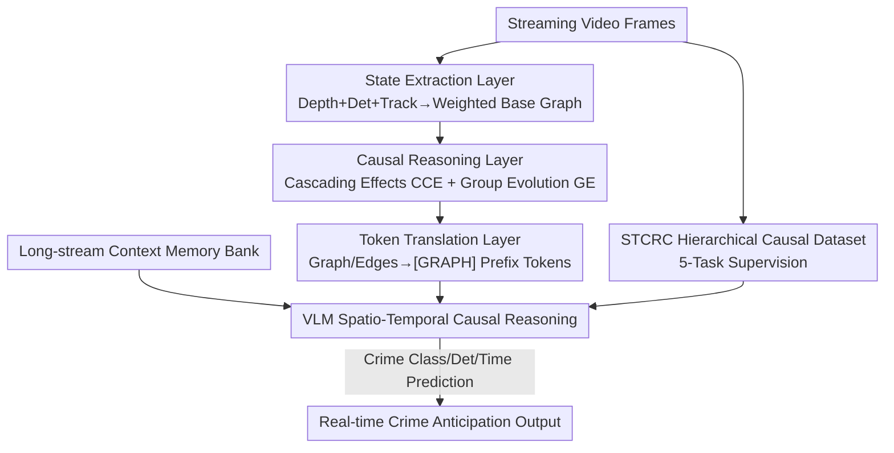

# Streaming Video Crime Anticipation with Spatio-Temporal Causal Reasoning

**Conference**: CVPR 2026  
**Paper**: [CVF Open Access](https://openaccess.thecvf.com/content/CVPR2026/html/Wang_Streaming_Video_Crime_Anticipation_with_Spatio-Temporal_Causal_Reasoning_CVPR_2026_paper.html)  
**Code**: None  
**Area**: Video Understanding  
**Keywords**: Crime anticipation, streaming video understanding, spatio-temporal causality, hypergraph, Vision-Language Model

## TL;DR
To address the issue where "existing surveillance systems only provide post-event/mid-event alerts and cannot anticipate crimes before they occur," this paper makes two contributions: constructing the STCRC dataset with spatio-temporal causal annotations (73K samples, 5 progressive causal reasoning tasks) and designing a streaming co-processor STCH that converts implicit entity dynamics into explicit causal hypergraphs for VLMs. This achieves a 70.7% relative improvement in crime classification, a 10.1% improvement in detection, and a 3.7% reduction in time prediction error.

## Background & Motivation
**Background**: Traditional Video Anomaly Detection (VAD) models tasks as "detecting events that deviate from normal behavior," which is essentially post-event or real-time classification—alerting only after something happens. Recently, Vision-Language Model (VLM) based video understanding methods have shown potential in high-level semantic reasoning due to their broad world knowledge. A series of "streaming video understanding" works (utilizing KV-cache management and memory bank buffering for state perception) have also enabled models to perform online inference.

**Limitations of Prior Work**: These methods are primarily **retrospective**—they excel at "summarizing what happened after watching a segment." However, crime anticipation requires **forward-looking** reasoning: identifying danger signals from a sequence of seemingly harmless precursor events **before** the crime actually occurs. For example, a robber suddenly accelerating towards a victim, or the distance between a gun and a victim narrowing frame-by-frame—these are "spatio-temporal causal precursors." Existing streaming methods lack such supervision signals and lack architectural mechanisms for explicitly modeling spatio-temporal causal relationships.

**Key Challenge**: The authors attribute the weakness to two points. First, **Data Deficiency**: existing crime datasets lack spatio-temporal causal annotations, preventing models from learning the causal dynamics of "precursor event chains $\to$ crime." Second, **Architectural Deficiency**: while VLMs can easily detect "this is a person, that is a gun," they cannot explicitly structure implicit motion causality between entities (e.g., A suddenly accelerating $\to$ causing group B to disperse).

**Goal**: To equip VLMs with real-time crime anticipation capabilities by solving two sub-problems: "supplementing causal supervision data" and "adding causal modeling modules."

**Key Insight**: The authors start from "**predictive causality**"—they do not seek to establish a rigorous structural causal model, but rather utilize the **structured temporal sequences of precursor events** and **concurrent spatial relationship dynamics** as highly predictive signals for future crimes.

**Core Idea**: Use a hierarchical causal dataset to teach VLMs causal reasoning, and employ a streaming hypergraph module to translate implicit entity dynamics into explicit causal structures as input prefixes for the VLM.

## Method

### Overall Architecture
The system aims to input an **untrimmed streaming video** (with an observation window $\{x_t\}_{t=1}^{t_{obs}}$ before the crime occurs) and output predicted attributes for future crimes $\hat{P}_{future}$ (occurrence, type, and time-to-event). The pipeline consists of five modules: (a) **Annotation** to offline process UCF-Crime videos into the STCRC dataset with causal labels; (b) **Spatio-Temporal Causal Hypergraph (STCH)** as a streaming co-processor to convert entity dynamics into explicit hypergraphs and tokens frame-by-frame; (c) **Memory Bank** to retain historical context for long video streams; (d) **Spatio-Temporal Causal Reasoning Training** across five progressive causal tasks; and (e) Transferring learned capabilities to three **downstream tasks**: classification, detection, and time prediction. Specifically, (a) is the offline data side, (b)(c) are the online module side, and (d)(e) are the training and evaluation side.

### Key Designs

**1. STCRC Dataset: Explicitly labeling the "Precursor $\to$ Crime" causal chain via five progressive tasks**

Existing crime datasets only label "which segment is anomalous" without identifying "which precursor events causally led to the crime." Based on UCF-Crime annotations, the authors processed data in three steps: ① **Temporal Event Annotation**: Using GPT-4o combined with previous events to binary classify each event as "Criminal Event (1) / Precursor Non-criminal Event (0)," explicitly marking the evolution chain of "benign precursor sequence $\to$ final crime"; ② **Spatial Relationship Annotation**: Estimating depth per frame via Depth Anything, detecting entity boxes with YOLO-World, and assigning IDs via ByteTrack. 2D box centers are combined with depth to get pseudo-3D coordinates $(c_x, c_y, z)$, used to calculate relative orientation and normalized Euclidean distance as "proximity" signals; ③ Organizing these materials into **five progressive reasoning tasks** ranging from local to global and entity-level: Task 1: Immediate Causal Inference, Task 2: Spatial Causal Inference, Task 3: Temporal Causal Structure Inference ($\gamma_{t-n} \prec \cdots \prec \gamma_{t+n}$), Task 4: Causal Relationship Inference (selecting true causal events from negatives), and Task 5: Entity-Event Causality. The dataset contains 73K samples (45,567 train / 12,467 val / 14,672 test), manually verified by ten annotators. Ablation shows this supervision is the core of anticipation capability—removing it drops classification from 40.67 to 23.03.

**2. STCH: Rendering implicit entity dynamics into explicit causal hyperedges for VLM input**

VLMs recognize objects but fail to model high-order causality like "A accelerating leads to B dispersing." STCH is a **streaming co-processor** that converts dynamics into explicit structures across three layers. The **State Extraction Layer** maintains a dynamic weighted base graph $G_b=(V, E_b)$: each node (entity) holds an activity score $\alpha_i \in (0,1]$, set to $\alpha_i \leftarrow 1$ when observed and exponentially decaying as $\alpha_i \leftarrow \lambda \alpha_i$ otherwise. Four types of features are extracted (kinematics, trajectory morphology, GloVe semantic embeddings, and temporal metadata), each paired with a GRU memory $h_i^{(t)} = \mathrm{GRU}(f_i^{(t)}, h_i^{(t-1)})$. Edge weights $w_{ij}$ combine spatial proximity kernels $k_{ij}$ and joint activation $\alpha_i\alpha_j$; edges below threshold $\tau$ are pruned. The **Causal Reasoning Layer** detects two types of hyperedges: **Cascading Effects (CCE)** use Z-score thresholds within a window $[t-\Delta_{hist}, t]$ to find responsive nodes $V_{resp}$ and previously mutated triggers $V_{trig}$, forming a hyperedge $H=(V_{trig}\cup V_{resp}, T_{edge})$ if spatial locality priors are met. **Group Evolution (GE)** performs connected component clustering on $G_b$ to detect aggregation and separation events. The **Token Translation Layer** uses GAT to encode $G_b$ into a global token $[G]$ and pools entity subsets for hyperedge tokens $[HE]$, wrapped as prefix tokens for the VLM. Removing STCH drops WF1 from 40.67 to 33.88.

**3. Long-stream Context Memory Bank: Ensuring no loss of distant historical evidence**

In long video streams, early precursors can be pushed out of the sliding window. The authors implement a memory bank $S_{mem}$: at each step, they pool the current window features into a query $Q_{cur}$ and retrieve history via $R_{mem}=\mathrm{CrossAttn}(Q_{cur}, S_{mem}, S_{mem})$. Current states are then appended to $S_{mem}$. This allows the model to utilize distant precursors for 60-second long-term anticipation.

### Loss & Training
The system uses Qwen2-VL-7B as the backbone for Supervised Fine-Tuning (SFT). Video is sampled at 2 FPS with an 8-frame streaming window. LoRA ($r=64, \alpha=32$) is applied to all linear layers. Training uses AdamW ($\beta_2=0.95$, weight decay 0.1) for 2 epochs with a $1\times10^{-5}$ learning rate and cosine annealing on NVIDIA H200s.

## Key Experimental Results

### Main Results
Evaluation was conducted on UCF-Crime (train/val/test) and XD-Violence (cross-domain). Metrics include TimeDiff (Mean Absolute Error of predicted time), AUC-S/M/L (different temporal windows), and WF1 (Weighted F1 for classification).

| Dataset | Metric | Ours | Best Baseline | Description |
|--------|------|------|---------------|------|
| UCF-Crime | WF1↑ | **40.67** | 23.83 (Flash-VStream) | ~70.7% relative gain |
| UCF-Crime | AUC-L↑ | **0.692** | 0.609 (Holmes-VAU) | Long-term capability +0.083 |
| UCF-Crime | TimeDiff↓ | **55.80** | 57.91 (VideoLLM-online) | Lower time prediction error |
| XD-Violence | WF1↑ | **36.90** | 30.51 (Flash-VStream) | Best cross-domain classification |
| XD-Violence | AUC-L↑ | **0.622** | 0.583 (Flash-VStream) | Best cross-domain long-term |

Ours achieves SOTA across nearly all metrics on both datasets.

### Ablation Study
Hierarchical removal results (Table 4, UCF-Crime):

| Configuration | WF1↑ | TimeDiff↓ | AUC-L↑ | Description |
|------|------|-----------|--------|------|
| Complete | 40.67 | 55.80 | 0.692 | Full Model |
| w/o STCH | 33.88 | 58.73 | 0.597 | Remove hypergraph module |
| w/o CCE | 39.81 | 57.61 | 0.642 | Remove cascading hyperedges |
| w/o GE | 36.64 | 57.53 | 0.644 | Remove group evolution hyperedges |
| w/o STCRC | 23.03 | 65.88 | 0.595 | Remove causal supervision |

### Key Findings
- **STCRC supervision is the primary contributor**: Without it, WF1 drops sharply from 40.67 to 23.03, and TimeDiff worsens significantly, proving that explicit causal supervision is the foundation of anticipation.
- **Specialization of STCH hyperedges**: Removing CCE primarily affects AUC, while removing GE has a larger impact on classification (WF1).
- **Task hierarchy**: Task 1 & 2 (local causality) improve detection/time prediction, while Task 5 (entity-level causality) has the strongest impact on classification.

## Highlights & Insights
- **Reframing "Anomaly Detection" as "Causal Anticipation"**: The biggest cognitive shift is moving from "classify after the event" to "predict before the event" using causal chains, supported by a new annotated dataset.
- **Hypergraph as a "Causal Translator"**: Using GRU + activity decay for streaming entity management and Z-score + clustering to capture "individual cascades" and "group evolution" is clever. Feeding structured outputs as tokens to LLMs is a transferable strategy for other relational video tasks.
- **Activity Score Decay**: The $\alpha_i \leftarrow \lambda\alpha_i$ mechanism allows entities to fade out smoothly, avoiding jitter caused by abrupt graph reconstruction in streaming settings.

## Limitations & Future Work
- The causality is **predictive causality** rather than structural causality—the authors admit they do not seek a rigorous structural causal model, meaning the model relies on highly predictive statistical associations that might fail in OOD (Out-of-Distribution) scenarios.
- Annotation depends heavily on GPT-4o's judgment and manual verification; the spatial annotation pipeline (Depth Anything + YOLO-World + ByteTrack) may propagate cumulative errors.
- Only validated on two datasets with Qwen2-VL-7B; real-time latency impacts of the STCH layers and hyperparameter sensitivity (e.g., $\tau, \lambda$) are not fully explored.

## Related Work & Insights
- **vs. Traditional VAD (UR-DMU / CLAP)**: These perform retrospective classification. Ours performs forward-looking anticipation and explicitly models causality rather than just learning "normal vs. abnormal" boundaries.
- **vs. Streaming VLMs (Flash-VStream / VideoLLM-online)**: While they solve efficiency/context via memory, they remain retrospective. Ours adds STCH for explicit structure and STCRC for anticipation supervision.
- **vs. Offline VLMs (GPT-4o / Holmes-VAD)**: Offline methods require the full video, failing online causal constraints. Even when adapted via sliding windows, Ours outperforms them.

## Rating
- Novelty: ⭐⭐⭐⭐⭐ Reframing the task and introducing the causal hypergraph module makes both the task and method highly novel.
- Experimental Thoroughness: ⭐⭐⭐⭐ Solid results over two datasets plus cross-domain and ablations, though backbones are limited.
- Writing Quality: ⭐⭐⭐⭐ Motivations and module logic are clear with well-integrated diagrams.
- Value: ⭐⭐⭐⭐ High value for public safety; the STCRC dataset and "hypergraph as causal translator" concept are highly reusable.

<!-- RELATED:START -->

## Related Papers

- [\[CVPR 2026\] CaST-Bench: Benchmarking Causal Chain-Grounded Spatio-Temporal Reasoning for Video Question Answering](cast-bench_benchmarking_causal_chain-grounded_spatio-temporal_reasoning_for_vide.md)
- [\[CVPR 2026\] Towards Spatio-Temporal World Scene Graph Generation from Monocular Videos](towards_spatio-temporal_world_scene_graph_generation_from_monocular_videos.md)
- [\[CVPR 2026\] Prototypical Action Reasoning Facilitated by Vision-Language Alignment for Egocentric Action Anticipation](prototypical_action_reasoning_facilitated_by_vision-language_alignment_for_egoce.md)
- [\[CVPR 2026\] VISTA: Video Interaction Spatio-Temporal Analysis Benchmark](vista_video_interaction_spatio-temporal_analysis_benchmark.md)
- [\[CVPR 2026\] OASIS: On-Demand Hierarchical Event Memory for Streaming Video Reasoning](oasis_on-demand_hierarchical_event_memory_for_streaming_video_reasoning.md)

<!-- RELATED:END -->
