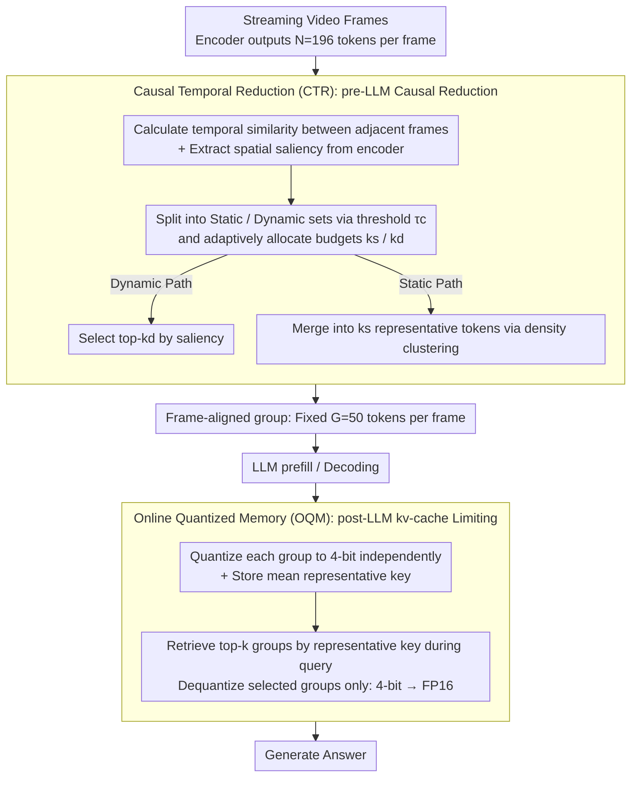

# StreamingTOM: Streaming Token Compression for Efficient Video Understanding

**Conference**: CVPR 2026  
**arXiv**: [2510.18269](https://arxiv.org/abs/2510.18269)  
**Code**: [yige24/StreamingTOM](https://yige24.github.io/StreamingTOM)  
**Area**: Video Understanding / Streaming Video QA / Token Compression  
**Keywords**: streaming video understanding, token compression, kv-cache quantization, training-free, causal inference

## TL;DR

StreamingTOM is proposed, a training-free two-stage streaming video understanding framework: Causal Temporal Reduction (CTR) performs causal temporal selection before the LLM to compress tokens per frame from 196 to 50; Online Quantized Memory (OQM) limits kv-cache growth after the LLM via 4-bit quantization and on-demand retrieval. The framework achieves a 15.7× compression ratio, 1.2× lower peak VRAM, and 2× faster TTFT.

## Background & Motivation

1.  **Dual Constraints of Streaming Video**: Unlike offline processing, streaming video VLMs face causality (no access to future frames) and accumulation (unbounded token growth over time), making token compression a necessity rather than an optional optimization.
2.  **Unbounded kv-cache Growth**: For instance, with LLaVA-OV-7B, a 1-hour video at 0.5 fps results in a kv-cache of 18.8 GB, exceeding typical GPU VRAM capacities and hindering real-time inference.
3.  **Prior Work Only Manages post-LLM**: Current training-free streaming methods (ReKV, LiveVLM, StreamMem) only perform eviction or compression on the kv-cache *after* the LLM, failing to reduce the $O(tNLd^2)$ computational overhead of pre-LLM prefill.
4.  **Offline Compression Violates Causality**: Established offline token merging/pruning methods (ToMe, DyCoke, HoliTom) rely on global/bidirectional attention and future frame information, making them inapplicable to streaming scenarios.
5.  **High Cost of Training-based Methods**: Training-based streaming methods (Flash-VStream, Dispider) require expensive retraining for specific models, making them difficult to migrate across different backbones.
6.  **Gap in pre-LLM Causal Compression**: To the best of the authors' knowledge, no previous training-free streaming method performs strictly causal token reduction before the LLM, leaving significant room for efficiency improvements.

## Method

### Overall Architecture

StreamingTOM addresses the two rigid constraints of streaming video VLMs—causality and unbounded kv-cache growth. It simultaneously reduces pre-LLM prefill computation and post-LLM decoding memory without training. The pipeline is split into two stages connected by a fixed-size **group abstraction** (frame-aligned groups with a fixed G=50 tokens per frame). After the visual encoder produces features, CTR compresses each frame to G tokens *before* the LLM and writes them to online memory. Upon a user query, OQM retrieves relevant groups from memory, performs 4-bit dequantization, and feeds them into the LLM for generation. Formally: $\text{StreamingTOM} = \text{OQM}_{16\to4} \circ \text{CTR}_{N\to G}$.

### Key Designs

**1. Causal Temporal Reduction (CTR): Strictly Causal Frame-wise Token Reduction pre-LLM**

Existing training-free streaming methods only manage the post-LLM kv-cache, leaving the $O(tNLd^2)$ prefill computation unoptimized, while offline token merging methods violate causality by looking at future frames. CTR fills this gap with a single-pass reducer that uses a causal window of only two adjacent frames and a fixed budget G per frame. For tokens at the same position in frames $t$ and $t{-}1$, cosine similarity $s_t^{(i)}$ measures cross-frame redundancy, while spatial saliency $\alpha_t^{(i)}$ is derived from the visual encoder's attention scores (calculated using chunked attention to avoid memory peaks). Based on a threshold $\tau_c=0.9$, tokens are categorized into a high-similarity static set $\mathcal{S}_t$ and a low-similarity dynamic set $\mathcal{D}_t$. The budget G is then adaptively divided into $k_s$ and $k_d$ based on the ratio of these sets. The dynamic path selects top-$k_d$ tokens by saliency to preserve new information, while the static path uses density clustering to merge tokens into $k_s$ representatives to remove redundancy. The frame-wise complexity is $O(N + G^2)$, and state requirements are restricted to the previous frame's features $O(Nd)$, neither of which grows with stream length. Consequently, prefill complexity is reduced from $O(tNLd^2)$ to $O(tGLd^2)$.

**2. Online Quantized Memory (OQM): Restricting kv-cache via 4-bit Quantization + On-demand Retrieval post-LLM**

While CTR reduces tokens per frame to G, the kv-cache still grows linearly with the number of frames. OQM independently quantizes each arriving group into 4-bit (using per-head, per-channel scale/offset) and stores a representative key $\bar{\mathbf{k}}_t$. During querying, the decoder state is compared against the representative keys of all groups using cosine similarity, and only the top-k most relevant groups undergo 4-bit → FP16 dequantization. Thus, the complete history is stored in a compressed state at $O(T \cdot G \cdot d / 4)$, while active KV remains at $O(k \cdot G \cdot d)$ ($k \ll T$), ensuring decoding latency does not scale with stream length. The combined compression ratio of both stages is $4N/G = 4 \times 196/50 \approx 15.7\times$.

## Key Experimental Results

### Main Results (Offline Long Video, LLaVA-OV-7B backbone)

| Method | VideoMME Overall | MLVU | EgoSchema | Avg |
|---|---|---|---|---|
| LLaVA-OV-7B (offline baseline) | 58.4 | 64.7 | 60.1 | 61.0 |
| +LiveVLM (training-free SOTA) | 57.3 | 66.3 | 59.0 | 60.9 |
| +StreamMem | 59.4 | 66.9 | 63.0 | 63.1 |
| **+StreamingTOM (Ours)** | **59.9** | **67.9** | **63.7** | **63.8** |

### Main Results (Online Streaming, RVS benchmark, 28GB VRAM limit)

| Method | RVS-Ego Acc/Score | RVS-Movie Acc/Score | Avg Acc/Score |
|---|---|---|---|
| Flash-VStream (Training-based) | 57.0 / 4.0 | 53.1 / 3.3 | 55.0 / 3.6 |
| StreamMem | 57.6 / 3.8 | 52.7 / 3.4 | 55.2 / 3.6 |
| **StreamingTOM** | **58.3 / 3.9** | **53.2 / 3.5** | **55.8 / 3.7** |

### Efficiency Metrics

- **kv-cache Compression Ratio**: 15.7×
- **Peak VRAM**: 1.2× reduction compared to LiveVLM
- **TTFT**: 2× acceleration compared to LiveVLM
- **1-hour Video kv-cache**: 18.8 GB → 1.2 GB
- **Memory Growth**: VRAM usage for 16–512 frames only increases from 16.0 GB → 16.7 GB (sub-linear)
- **Throughput**: Stable at approximately 20 tokens/s for long sequences

### Ablation Study

| Tokens | Quantization | Compression Ratio | VideoMME Overall |
|---|---|---|---|
| 40 | 4-bit | 5.1% | 58.9 |
| **50** | **4-bit** | **6.4%** | **59.9** |
| 60 | 4-bit | 7.7% | 59.3 |
| 50 | 2-bit | 3.2% | 58.5 |

- 50 tokens represent the optimal balance: too few (40) loses critical detail, while too many (60) reduces temporal coverage under fixed VRAM.
- 4-bit quantization outperforms 2-bit, providing the best accuracy-compression trade-off.

## Highlights & Insights

1.  **Pioneering Causal pre-LLM Token Compression**: Fills the gap in pre-LLM compression for training-free streaming methods, reducing prefill complexity from $O(tNLd^2)$ to $O(tGLd^2)$.
2.  **Elegant Group Abstraction**: The fixed-size frame-aligned group serves both as CTR output and OQM storage/retrieval units, ensuring temporal consistency and predictable latency.
3.  **Completely Plug-and-Play**: Requires no training and can be directly applied to different backbones like LLaVA-OV.
4.  **Deployment Friendly**: Runs on a single A6000, is batch-agnostic, and exhibits sub-linear memory growth.
5.  **Two-stage Complementarity**: CTR reduces computation while OQM reduces memory. Both are essential, and their combination significantly outperforms single-stage approaches.

## Limitations & Future Work

1.  **Fixed G May Be Sub-optimal**: Using the same 50-token budget for all frames is inflexible for frames with varying information density (e.g., keyframes vs. static frames).
2.  **Single Backbone Validation**: Experiments are primary based on LLaVA-OV-7B and have not been verified on larger models (e.g., 72B) or other architectures.
3.  **2-frame Window Constraint**: CTR's causal window only considers adjacent frames, which might accumulate errors in slowly changing scenes.
4.  **Retrieval Quality of Representative Keys**: OQM uses mean keys for retrieval, which might lack precision for fine-grained temporal reasoning.
5.  **Lack of Multimodal Audio Stream Evaluation**: Only visual streams are considered, whereas real-world streaming applications often include audio.

## Related Work & Insights

| Dimension | StreamingTOM | LiveVLM/StreamMem | DyCoke/HoliTom | Flash-VStream |
|---|---|---|---|---|
| Pre-LLM Compression | ✅ CTR | ❌ | ✅ (Non-causal) | ✅ (Requires training) |
| Post-LLM Management | ✅ OQM 4-bit | ✅ kv-cache eviction | ❌ | ✅ (Requires training) |
| Causal Constraint | ✅ Strict | ✅ | ❌ Requires future frames | ✅ |
| Training Required | No | No | No | Yes |
| Compression Ratio | 15.7× | ~4× | ~4× | N/A |

## Rating

- Novelty: ⭐⭐⭐⭐ — First to introduce causal pre-LLM token compression in training-free streaming, with group abstraction unifying the two stages.
- Experimental Thoroughness: ⭐⭐⭐⭐ — Covers both offline/online benchmarks with detailed efficiency analysis and complete ablations.
- Writing Quality: ⭐⭐⭐⭐⭐ — Clear problem definition, rigorous derivations, and intuitive pipeline diagrams.
- Value: ⭐⭐⭐⭐ — Effectively addresses VRAM bottlenecks in streaming video VLM deployment with high practical utility.

<!-- RELATED:START -->

## Related Papers

- [\[CVPR 2026\] An Efficient Token Compression Framework for Visual Object Tracking](an_efficient_token_compression_framework_for_visual_object_tracking.md)
- [\[CVPR 2026\] EarlyTom: Early Token Compression Completes Fast Video Understanding](earlytom_early_token_compression_completes_fast_video_understanding.md)
- [\[ICLR 2026\] FLoC: Facility Location-Based Efficient Visual Token Compression for Long Video Understanding](../../ICLR2026/video_understanding/floc_facility_location-based_efficient_visual_token_compression_for_long_video_u.md)
- [\[CVPR 2026\] FluxMem: Adaptive Hierarchical Memory for Streaming Video Understanding](fluxmem_adaptive_hierarchical_memory_for_streaming_video_understanding.md)
- [\[CVPR 2026\] Unified Spatiotemporal Token Compression for Video-LLMs at Ultra-Low Retention](unified_spatiotemporal_token_compression_for_video-llms_at_ultra-low_retention.md)

<!-- RELATED:END -->
