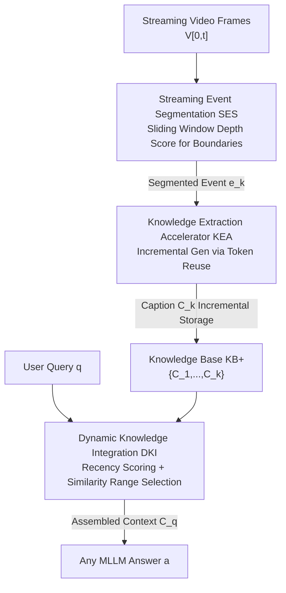

# StreamRAG: Enhancing Real-Time Video Understanding with Retrieval Augmentation

**Conference**: CVPR 2026  
**Paper**: [CVF Open Access](https://openaccess.thecvf.com/content/CVPR2026/html/Xie_StreamRAG_Enhancing_Real-Time_Video_Understanding_with_Retrieval_Augmentation_CVPR_2026_paper.html)  
**Code**: None  
**Area**: Video Understanding  
**Keywords**: Streaming Video QA, Retrieval Augmented Generation, Event Segmentation, Low-latency Captioning, Dynamic Knowledge Injection

## TL;DR
StreamRAG systematically introduces RAG to streaming video QA for the first time. By employing three plug-and-play modules—Real-time Event Segmentation, Low-latency Knowledge Extraction via historical token reuse, and Dynamic Retrieval Range selection based on query recency—it enhances models like Qwen2-VL and ViSpeak on OVO-Bench/StreamingBench with accuracy gains of approximately 11%~20% without altering the backbone MLLM architecture, while nearly halving caption generation latency.

## Background & Motivation
**Background**: In long-form video understanding, RAG has proven effective by converting videos into searchable external knowledge bases (captions, OCR, scene graphs) and retrieving evidence for LLMs. This overcomes context window limits and mitigates hallucinations via grounding. Representative works include DrVideo (agent-based keyframe localization), Goldfish (top-k segment matching via captions), VideoRAG (multimodal signals like OCR), and AdaRAG (adaptive retrieval based on query complexity).

**Limitations of Prior Work**: These methods almost entirely assume that the **full video is available in advance**, which is an offline setting. In streaming scenarios (autonomous driving, AI glasses, live streaming), three premises fail: (1) data is unbounded and continuous; (2) responses must be real-time and low-latency; (3) queries have strong temporal sensitivity—answers may depend on specific moments. Directly applying offline video-RAG pipelines leads to significant performance degradation. StreamChat, the closest streaming-related work, maintains hierarchical memory but utilizes **fixed-frequency updates** (ignoring content rhythm and breaking causal structure), **heavy captioning pipelines** (causing latency bottlenecks), and **pure similarity-based retrieval** (ignoring query recency).

**Key Challenge**: Streaming RAG faces three major trade-offs: when to update the knowledge base (too frequent causes fragmentation, too sparse causes information loss), caption richness vs. speed (latency), and how far back to retrieve (immediate queries need the latest segments, while retrospective queries need long-range history).

**Goal**: The paper addresses three specific sub-problems: (1) how to detect semantic boundaries online without labels to decide "when to update"; (2) how to reduce caption extraction latency while maintaining description quality; (3) how to dynamically adjust retrieval range and fusion granularity based on query recency.

**Key Insight**: The authors observe that streaming video naturally possesses **semantic continuity**—frames and descriptions of adjacent events overlap significantly. Most tokens from a previous caption remain valid for the next frame. Instead of compressing the input (traditional approach), the authors propose **reusing output semantic tokens** and only regenerating when content truly changes.

**Core Idea**: A suite comprising "Event-level Adaptive Segmentation + Incremental Captioning via token reuse + Dynamic Retrieval Range based on query recency" transforms offline RAG into a streaming version as a plug-and-play, architecture-agnostic enhancement.

## Method

### Overall Architecture
StreamRAG addresses streaming video QA where the model only sees the frame sequence $V_{[0,t]}=\{v_1,\dots,v_t\}$ up to the current time $t$, strictly adhering to causality (no future frames). Generation is reformulated as $a=M(V_{[0,t]}, q, C_q)$, where $C_q$ is the retrieved relevant knowledge. The pipeline consists of frame inflow → event segmentation → daily caption generation → dynamic knowledge fusion for queries. The three modules are: **Streaming Event Segmentation (SES)** for real-time semantic boundary detection; **Knowledge Extraction Accelerator (KEA)** for low-latency incremental captioning; and **Query-aware Dynamic Knowledge Integration (DKI)** for adaptive retrieval range selection based on recency and similarity.

### Key Designs

**1. Streaming Event Segmentation (SES): Unsupervised Real-time Boundary Detection**

Addressing the "When to Update" problem: Fixed-frequency frame cutting can split a complete event and break the causal chain. SES processes frames incrementally within a fixed window $W_t=\{v_{t-w},\dots,v_t\}$. It calculates semantic similarity $c^{ViT}_t$ between adjacent frames using ViT [CLS] tokens, then computes a "depth score" $d_i=(c^{ViT}_{l_i}+c^{ViT}_{r_i}-2c^{ViT}_i)^2$ for the $i$-th frame, where $c^{ViT}_{l_i}$ and $c^{ViT}_{r_i}$ are peak similarities to the left and right. Intuitively, at a boundary, the frame is incoherent with both sides, causing $d_i$ to spike. When $d_i$ exceeds a statistical threshold $\mu+\tau\cdot\sigma$, a significant boundary $t_b$ is identified. The sequence $\{v_{t_{prev}+1},\dots,v_{t_b}\}$ is sliced as event $e_k$. This online, label-free method maintains internal video causality and provides clean event granularity, yielding a ~2% accuracy improvement.

**2. Knowledge Extraction Accelerator (KEA): Token Reuse to Reduce Caption Latency**

Addressing the "Caption Latency" bottleneck: Offline RAG relies on external captioners for detailed descriptions, which is too slow for streaming. KEA reuses **output semantic tokens**. Given the previous caption $C_{k-1}=(w_1,\dots,w_{L_c})$ and new event frames $V_k$, it encodes the caption as $E_c$ and frames as $E_v$. A fusion $X=[E_v; E_c]$ is passed through the model (similar to prefilling) to get a probability matrix $P$. A "Generation Confidence Analysis" validates each token position $z$: the probability $p_z=P[L_v+z-1, w_{z+1}]$ is compared against a sliding mean $\mu$. A **divergence point** $o$ is identified where confidence drops significantly:

$$o=\min\Big\{z\in[\delta+1, L_c-1]\ \big|\ (\mu_{[z-\delta:z-1]}-\ell_z) > \max(\alpha\cdot|\mu_{[z-\delta:z-1]}|, \beta)\Big\}$$

Tokens before $o$ are retained. The model then performs autoregressive generation for the remainder. This leverages streaming continuity to avoid redundant generation, reducing latency by 27% with an 18% reuse rate while improving accuracy.

**3. Query-aware Dynamic Knowledge Integration (DKI): Adaptive Retrieval Ranges**

Addressing "One-size-fits-all Retrieval": Some queries target the present ("What are they doing?"), while others target history ("What was the climber doing before opening the bag?"). DKI first uses an LLM to assign a normalized recency score $S_t(q) \in [0,1]$. It also retrieves the top-3 relevant captions to calculate an average historical similarity $S_r(q)$. These are fused into a composite score:

$$S_c(q)=\gamma\cdot S_t(q)+(1-\gamma)\cdot(1-S_r(q))$$

Based on $S_c$, three retrieval tiers are selected: if $S_c > \theta_1$ (high recency/low history utility), only the latest caption is used; if $\theta_2 < S_c \le \theta_1$, $k_1$ historical captions are retrieved; if $S_c \le \theta_2$, $k_2$ captions provide a broader context. This balances efficiency and noise reduction based on the specific query's needs.

## Key Experimental Results

### Main Results
Evaluated on OVO-Bench (644 videos, 0.5–30 mins) and StreamingBench (900 videos, 4500 questions). StreamRAG was applied as a plug-and-play module to Qwen2-VL and ViSpeak.

| Benchmark | Model/Setting | Key Metrics | Baseline | +StreamRAG | Gain |
|-----------|---------------|-------------|----------|------------|------|
| OVO-Bench | Qwen2-VL-7B (R-Avg) | Accuracy | 60.65 | 69.96 | ~ +9 |
| OVO-Bench | ViSpeak (R-Avg) | Accuracy | 66.28 | 69.68 | +3.4 |
| OVO-Bench | ViSpeak + VideoRAG | R-Avg | 66.28 | 57.21 | -9 (Drop) |
| StreamingBench | Qwen2-VL-7B (Avg) | Accuracy | 71.15 | 77.33 | +6.2 |
| StreamingBench | ViSpeak (Avg) | Accuracy | 74.36 | 78.12 | +3.8 |

Notably, Qwen2-VL with StreamRAG achieves a relative improvement of ~20%, closing the gap with dedicated streaming models like ViSpeak. Directly applying VideoRAG hurt performance due to irrelevant audio signals and noisy knowledge fusion.

### Ablation Study

| Configuration | R-Avg | B-Avg | Note |
|---------------|-------|-------|------|
| KEA Only (KB) | 55.98 | 46.46 | Retrieval augmented KB only |
| + SES | 65.33 | 49.75 | Event segmentation added, R-Avg +9.4 |
| + SES + DKI | 68.54 | 51.28 | Dynamic fusion added |
| Full (Ours) | 69.96 | 53.08 | Complete model |

Additional results: At ~18% token reuse, latency drops 27% while accuracy increases. SES outperformed fixed 32-frame intervals (69.96 vs 68.98 R-Avg).

### Key Findings
- **SES contributes most** (R-Avg +9.4), as it preserves event causality and provides clean segments for captioning and retrieval.
- There is a "reuse vs. effect" sweet spot in **KEA**: ~18% reuse improves both speed and accuracy, while 33% reuse further reduces latency but introduces noise, lowering accuracy.
- **DKI is highly effective** for recency-sensitive queries by filtering irrelevant history, which is crucial for temporal precision in real-time scenarios.

## Highlights & Insights
- **Accelerating via "Preserving Semantic Output"**: Unlike most methods that compress input tokens, this work reuses output tokens, capturing the essence of streaming "temporal continuity." This perspective can benefit tasks like streaming OCR or speech-to-text.
- **Next-token Confidence as a Change Detector**: Using prediction probability drops as a label-free signal for content change is an elegant, lightweight approach for incremental generation.
- **Recency-Aware Retrieval**: The composite score $S_c$ balances query urgency with historical utility, offering a more nuanced approach than simple similarity matching.

## Limitations & Future Work
- The framework involves several hyperparameters ($\tau, \gamma, \theta_1, \theta_2, \text{etc.}$); their robustness across diverse domains was not fully explored.
- DKI's recency scoring requires an additional LLM call, the net benefit of which in extreme low-latency scenarios needs further quantification.
- Evaluation was limited to OVO-Bench and StreamingBench; performance on hour-long streams or ultra-fast scenario changes (e.g., rapid camera cuts) requires further validation.

## Related Work & Insights
- **vs. StreamChat**: Unlike StreamChat's fixed-frequency updates and heavy pipelines, StreamRAG uses SES for content-aware updates and KEA to bypass latency bottlenecks.
- **vs. VideoRAG**: VideoRAG is designed for offline static libraries; applying it to streaming introduces significant noise. StreamRAG is purpose-built for incremental streaming.
- **vs. ViSpeak**: While ViSpeak modifies the model to decouple perception and response, StreamRAG is architecture-agnostic and can be used to further enhance ViSpeak.

## Rating
- Novelty: ⭐⭐⭐⭐ Systematic RAG for streaming with unique token-reuse and recency-gated retrieval.
- Experimental Thoroughness: ⭐⭐⭐⭐ Coverage of two benchmarks and detailed module-wise ablation.
- Writing Quality: ⭐⭐⭐ Clear reasoning, though some symbol inconsistencies exist.
- Value: ⭐⭐⭐⭐ Significant practical value for real-world deployments in AI glasses and autonomous systems without retraining costs.

<!-- RELATED:START -->

<!-- RELATED:END -->

## Related Papers

- [\[CVPR 2025\] VISTA: Enhancing Long-Duration and High-Resolution Video Understanding by Video SpatioTemporal Augmentation](../../CVPR2025/video_understanding/vista_enhancing_long-duration_and_high-resolution_video_understanding_by_video_s.md)
- [\[CVPR 2026\] Compositional Transformation Reasoning for Composed Video Retrieval](compositional_transformation_reasoning_for_composed_video_retrieval.md)
- [\[CVPR 2026\] Beyond Caption-Based Queries in Video Moment Retrieval](beyond_caption-based_queries_in_video_moment_retrieval.md)
- [\[CVPR 2026\] SAIL: Similarity-Aware Guidance and Inter-Caption Augmentation-based Learning for Weakly-Supervised Dense Video Captioning](sail_similarity-aware_guidance_and_inter-caption_augmentation-based_learning_for.md)
- [\[ICML 2026\] ProAct-VL: A Proactive VideoLLM for Real-Time AI Companions](../../ICML2026/video_understanding/proact-vl_a_proactive_videollm_for_real-time_ai_companions.md)

<!-- RELATED:END -->
