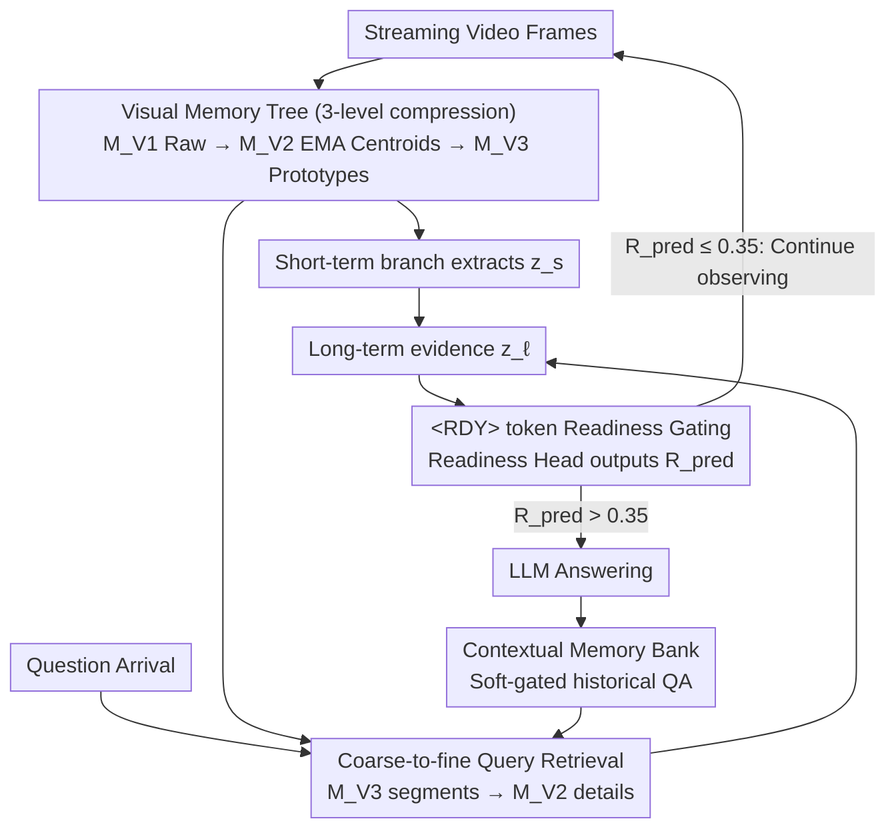

# StreamReady: Learning What to Answer and When in Long Streaming Videos

**Conference**: CVPR 2026  
**arXiv**: [2603.08620](https://arxiv.org/abs/2603.08620)  
**Code**: [Project Page](https://sacrcv.github.io/StreamReady-website/)  
**Area**: Video Understanding  
**Keywords**: Streaming Video Understanding, Answer Readiness, Temporal Reasoning, Multimodal Large Language Models (MLLMs), Proactive Question Answering

## TL;DR

This paper proposes a readiness-aware streaming video understanding paradigm. By introducing a learnable `<RDY>` token and the Answer Readiness Score (ARS) metric, the model learns not only to provide correct answers but also to answer at the precise moment evidence appears. It achieves SOTA performance across 9 streaming and offline video benchmarks.

## Background & Motivation

**Urgent demand for long video streaming understanding**: Real-world scenarios (surveillance, sports analysis, robotics, assistive systems) require models to reason in real-time as video frames arrive sequentially, rather than processing complete videos offline.

**Existing methods focus on "what to answer" while ignoring "when to answer"**: Most streaming video models only evaluate the correctness of the answer, completely overlooking the timing. Answering too early implies hallucination/speculation, while answering too late reduces real-time utility.

**Challenges in proactive reasoning scenarios**: In proactive settings, questions appear before the evidence. Models must continuously observe the video stream and determine when sufficient visual evidence has been accumulated to provide an answer.

**Lack of benchmarks with temporal annotations**: Current streaming benchmarks lack annotations for answer evidence time windows, making it impossible to systematically evaluate whether a model's answering timing is appropriate.

**Limitations of existing delayed answering solutions**: Strategies based on auxiliary MLLM delays (e.g., StreamBridge) or prompt-based delays suffer from non-determinism or additional computational overhead and lack deep coupling with the reasoning module.

**Gap in fine-grained temporal evaluation metrics**: A metric is needed to simultaneously measure correctness and timing, imposing heavy penalties on premature answers (hallucination) while being lenient toward minor delays.

## Method

### Overall Architecture

StreamReady aims to enable streaming video models to not only "answer correctly" but also "answer exactly when evidence is sufficient." Using Qwen-2-VL (7B) as the backbone and initializing the dual-branch Q-Former with HierarQ pre-trained weights, the pipeline consists of three stages: "hierarchical memory → query-aware reasoning → readiness gating." Streaming frames first enter a Visual Memory Tree (three layers from fine to coarse: raw frame buffer $\mathcal{M}_{V1}$, EMA centroids $\mathcal{M}_{V2}$, and abstract prototypes $\mathcal{M}_{V3}$) and a Contextual Memory Bank $\mathcal{M}_C$ for historical QA. When a question arrives, the short-term branch $Q_s$ extracts local evidence $z_s$ from $\mathcal{M}_{V1}$, while the long-term branch $Q_\ell$ performs coarse-to-fine retrieval on $\mathcal{M}_{V2}/\mathcal{M}_{V3}$ and integrates historical QA semantics to obtain $z_\ell$. Finally, an `<RDY>` token is attached to $z_\ell$, and a 2-layer MLP Readiness Head outputs a readiness score $R_{pred}\in[0,1]$. Answering is triggered via the LLM only if the score exceeds 0.35; otherwise, the model continues observing frames. Once answered, the fused representation is stored back into $\mathcal{M}_C$ as $a_i$.

### Key Designs

**1. Visual Memory Tree (Three-level Compression): Accommodating arbitrary length video with fine-to-coarse memory**

As streaming frames grow boundlessly, storing all frames leads to OOM. A constant-footprint memory is required. $\mathcal{M}_{V1}$ is a FIFO raw frame buffer for recent details. When full, evicted frames update $\mathcal{M}_{V2}$ centroids via EMA clustering (Eq. 1), where the threshold $\tau_t$ adapts to scene stability. When $\mathcal{M}_{V2}$ saturates or distribution shifts occur, it is abstracted into $\mathcal{M}_{V3}$ coarse-grained prototypes, with periodic mini-K-means realignment. Since all three layers have fixed sizes, latency and memory remain constant regardless of video length.

**2. Coarse-to-fine Query Retrieval: Locking segments with prototypes, extracting details with centroids**

The model must locate evidence accurately in massive memory. It first performs Top-K localization of relevant segments on $\mathcal{M}_{V3}$ prototypes (using softmax normalization for stable routing), then extracts fine-grained evidence via Top-m retrieval from corresponding $\mathcal{M}_{V2}$ centroids (without normalization to maintain sharp ranking). This mimics human episodic memory: prototypes provide temporal anchors, and centroids provide details.

**3. Contextual Memory Bank: Integrating historical QA semantics into current reasoning**

Multi-turn QA requires semantic continuity. The bank stores question embeddings $q_i$ and answer representations $a_i$ from historical pairs. Soft-gating matches the current question with historical ones, and the most relevant entries are fused into long-term visual features $z_\ell$ via lightweight cross-attention, allowing the model to recall previous interactions.

**4. Co-evolution of `<RDY>` token and reasoning module: Embedding "when" into "what"**

Timing judgments are inaccurate if attached to weak representations. StreamReady embeds the `<RDY>` token directly into the learned representations of the long-term reasoning branch $Q_\ell$. It evolves alongside query-aligned evidence, naturally sensing the transition from "weak alignment/low confidence" to "strong alignment/ready to answer." Ablations show this placement (ARS 0.68) significantly outperforms placement in the short-term branch (0.31) or the long-term input (0.54).

**5. Weakly-supervised Readiness Training: Learning timing without timestamps or reasoning interference**

Existing benchmarks lack evidence window annotations. Furthermore, joint gradients for "what" and "when" can cause interference. StreamReady addresses this with two strategies: First, it constructs weak pseudo-supervision—utilizing temporal similarity between $z_\ell$ and $\mathcal{M}_{V2}$ centroids during training (where full video is accessible) to label high-similarity segments as pseudo-positive regions $P$ and low-similarity as pseudo-negative $N$. A contrastive loss $\mathcal{L}_{ctr}$ ensures higher readiness scores where evidence is sufficient. Second, gradient isolation—$\mathcal{L}_{rdy}$ only updates the Readiness Head and `<RDY>` token. Gradients are truncated and not backpropagated to the reasoning module, allowing the reasoning module to focus on the standard video-text loss while the readiness mechanism independently learns timing.

### Loss & Training

- **Contrastive Readiness Loss**: $\mathcal{L}_{ctr} = -\log \sigma(R_{pred}(t^+) - R_{pred}(t^-))$, where $t^+ \in P$ and $t^- \in N$.
- **Temporal Smoothing Regularization**: $\mathcal{L}_{rdy} = \mathcal{L}_{ctr} + \lambda_{reg} \|\nabla_t R_{pred}(t)\|_1$, where L1 regularization suppresses noise and jitter in the readiness signal.
- **ARS Metric**: $\text{ARS} = \frac{1}{N}\sum_{i}(\text{EP}_i \cdot \text{LP}_i)$. The Early Penalty (EP) sharply penalizes premature answers using a sigmoid ($\gamma_e=6$), while the Late Penalty (LP) gently decays for delayed answers ($\gamma_\ell=1$). Effective accuracy is $\text{Acc}_e = \text{Acc} \times \text{ARS}$.

## Key Experimental Results

### Main Results

**ProReady-QA Readiness-aware Evaluation** (Table 2):

| Method | Size | Avg Acc. | Avg ARS | Acc_e |
|------|------|----------|---------|-------|
| Qwen-2-VL (baseline) | 7B | 41.4 | 0.34 | 0.20 |
| HierarQ | 7B | 46.0 | 0.40 | 0.27 |
| StreamBridge | 7B | 53.1 | 0.60 | 0.42 |
| InfiniPot-V | 7B | 52.0 | 0.47 | 0.36 |
| **StreamReady** | **7B** | **56.4** | **0.69** | **0.53** |

StreamReady outperforms the best competitor, StreamBridge, by ~3% in accuracy and ~9% in ARS, leading to an 11% improvement in effective accuracy. The largest ARS gains appear in REC (+0.25), GSD (+0.11), and CTD (+0.10), indicating that the readiness mechanism is particularly effective for tasks requiring evidence accumulation.

**Streaming Benchmark Generalization** (Table 3):

- StreamingBench: Avg 63.4 (vs ViSpeak 58.6), proactive subset 48.2 (vs ViSpeak 43.9).
- OVOBench: Avg 68.2 (vs StreamBridge 62.6), proactive subset 63.7 (vs ViSpeak 61.6).
- VStream-QA: RE/RM scores of 64.8/57.2, both optimal.

**Offline Long Video Benchmarks** (Table 4):

- VideoMME 65.8, MLVU 71.3, MVBench 71.8, EgoSchema 70.4.
- Outperforms StreamBridge (64.4/69.6/64.4/66.9) and Flash-VStream (61.2/66.3/65.4/68.2).
- When the readiness mechanism is disabled during offline evaluation, the memory hierarchy and query reasoning alone provide superior performance.

### Ablation Study

| Config | REC Acc/ARS | GSD Acc/ARS | CTD Acc/ARS |
|------|-------------|-------------|-------------|
| Baseline (Qwen-2-VL) | 20.7/0.31 | 35.1/0.52 | 30.3/0.28 |
| + Memory + QA Reasoning | 39.4/0.48 | 60.9/0.53 | 43.6/0.39 |
| + Readiness Mechanism | **39.6/0.68** | **61.2/0.68** | **43.5/0.59** |

- Memory and reasoning modules primarily improve accuracy (+19 on REC), while the readiness mechanism significantly boosts ARS (+0.20 on REC/CTD).
- The `<RDY>` + MLP Head performs comparably to a Transformer Head but is computationally lighter.
- Placing `<RDY>` on the learned long-term branch representations is most effective (ARS 0.68).

### Key Findings

- Basic reasoning modules (e.g., HierarQ’s Q-Former) improve accuracy but offer little help with timing; readiness mechanisms must pair with strong reasoning to improve both Acc and ARS.
- Using an auxiliary MLLM for readiness (StreamBridge style) yielded an ARS of only 0.60, inferior to the deeply coupled `<RDY>` token (0.68).
- StreamReady maintains constant latency and memory as video length increases due to fixed-size centroid/prototype memory, whereas Qwen-2-VL suffers from OOM.

## Highlights

- **First formalization of "readiness-aware" streaming video understanding**: Incorporates answering timing into evaluation and proposes the ARS metric with asymmetric penalties.
- **Lightweight and elegant readiness mechanism**: Uses a single `<RDY>` token + MLP Head without auxiliary models or heuristic rules, ensuring zero extra inference overhead.
- **Weakly-supervised temporal learning**: Learns timing without ground-truth timestamps by automatically constructing pseudo-supervision from reasoning-memory similarity.
- **Comprehensive benchmark contribution**: ProReady-QA provides 5 types of proactive tasks, 5K QA pairs, 30-60 minute videos, and annotated evidence windows.
- **Broad generalization**: Achieves SOTA across 9 streaming and offline benchmarks, proving the universality of the design.

## Limitations & Future Work

- ProReady-QA contains only 32 videos (10 Ego-4D + 22 MovieNet), which is limited in scale and diversity and may not cover all real-world streaming scenarios.
- Readiness learning relies on pseudo-supervision ($z_\ell$ and $\mathcal{M}_{V2}$ similarity). In scenarios with extremely scattered or blurry evidence, pseudo-labels may be inaccurate, leading to timing errors.
- The readiness threshold (0.35) is a fixed hyperparameter; different tasks may require tuning. Adaptive thresholds or confidence-based strategies were not explored.
- The three-level memory tree introduces several hyperparameters ($\alpha, \tau_t, J, U, K, m$), increasing tuning complexity. The choice of EMA decay significantly impacts memory quality.
- Validation was limited to 7B-scale models; performance on larger (e.g., 70B) or smaller (e.g., 2B) models remains to be verified.
- While the ARS parameters ($\gamma_e=6, \gamma_\ell=1$) were robust in experiments, optimal weights might vary across specific applications (e.g., security vs. sports).

## Related Work & Insights

- **Offline Long Video Understanding**: HierarQ, LLaVA-Video, and LongVU utilize memory or conditional storage but require the full video and memory reconstruction. StreamReady adapts query-aware conditioning for streaming without memory resets.
- **Streaming Video Understanding**: StreamBridge uses auxiliary MLLMs for delayed answering. Flash-VStream, StreamForest, and InfiniPot-V focus on online memory management. StreamReady's readiness mechanism is a complementary extension to these methods.
- **Streaming BenchMARKS**: ODVBench and StreamBench support past-dependent QA only; StreamingBench and OVOBench introduce proactive scenarios but are limited to short videos. ProReady-QA is the first to provide evidence windows and global multi-turn dependency for long videos.
- **Answering Timing Control**: Existing solutions involve prompt-based delays or auxiliary MLLM judgments. StreamReady proposes a new paradigm of embedding readiness logic directly into the reasoning module to avoid external dependencies.

## Rating

- Novelty: ⭐⭐⭐⭐⭐ — First to formalize timing and propose a complete metric + method + benchmark.
- Experimental Thoroughness: ⭐⭐⭐⭐⭐ — Comprehensive evaluation across 9 benchmarks with detailed ablations.
- Writing Quality: ⭐⭐⭐⭐ — Clear structure, standardized formulas, and rich visualizations.
- Value: ⭐⭐⭐⭐⭐ — Defines a new problem set and pushes the boundaries of streaming video understanding.

<!-- RELATED:START -->

## Related Papers

- [\[CVPR 2026\] Color When It Counts: Grayscale-Guided Online Triggering for Always-On Streaming Video Sensing](color_when_it_counts_grayscale-guided_online_triggering_for_always-on_streaming_.md)
- [\[CVPR 2026\] Learning Transferable Temporal Primitives for Video Reasoning via Synthetic Videos](learning_transferable_temporal_primitives_for_video_reasoning_via_synthetic_vide.md)
- [\[CVPR 2026\] Time Blindness: Why Video-Language Models Can't See What Humans Can?](time_blindness_why_video-language_models_cant_see_what_humans_can.md)
- [\[CVPR 2026\] An Empirical Study on How Video-LLMs Answer Video Questions](an_empirical_study_on_how_video-llms_answer_video_questions.md)
- [\[CVPR 2026\] MuKV: Multi-Grained KV Cache Compression for Long Streaming Video Question-Answering](mukv_multi-grained_kv_cache_compression_for_long_streaming_video_question-answer.md)

<!-- RELATED:END -->
