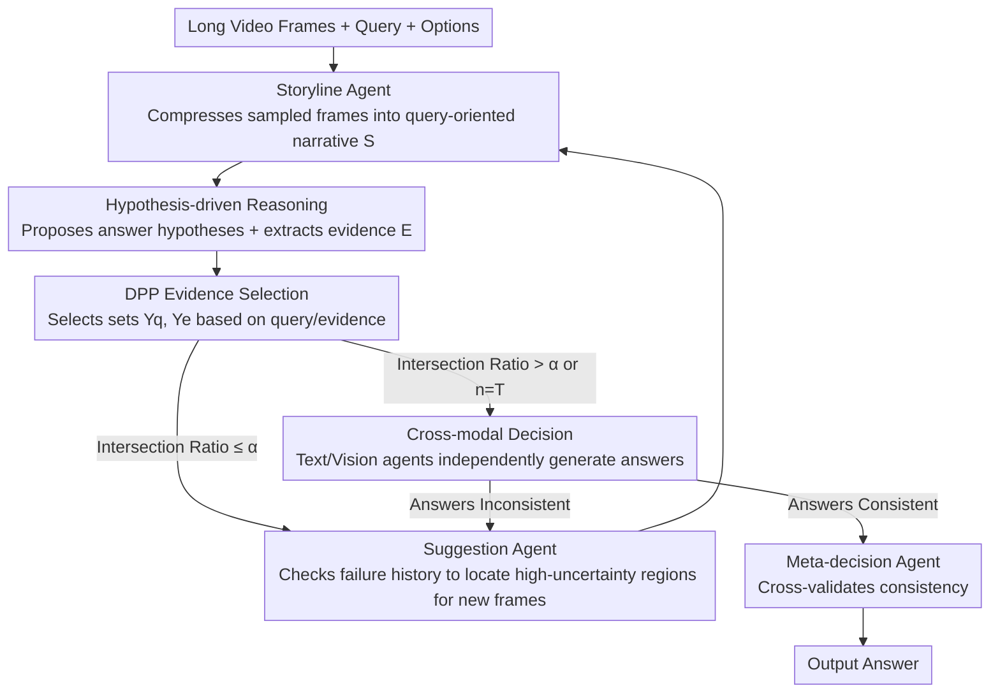

# SVAgent: Storyline-Guided Long Video Understanding via Cross-Modal Multi-Agent Collaboration

**Conference**: CVPR 2026  
**arXiv**: [2604.05079](https://arxiv.org/abs/2604.05079)  
**Code**: None  
**Area**: Video Understanding  
**Keywords**: long video QA, multi-agent, storyline, cross-modal reasoning, DPP

## TL;DR

The authors propose SVAgent, a storyline-guided cross-modal multi-agent framework for long video question answering. By progressively constructing narrative representations, utilizing DPP evidence selection, performing cross-modal consistency verification, and implementing iterative refinement, the framework achieves a performance improvement of 5.5%-11.5% over baselines.

## Background & Motivation

Video Question Answering (VideoQA) requires the integration of spatial, temporal, and semantic information. Existing methods suffer from three limitations: (1) a lack of explicit mechanisms to maintain global temporal structure; (2) no reliability guarantee in evidence acquisition; and (3) a lack of explicit verification, making them prone to errors due to insufficient or inconsistent evidence.

Humans naturally understand videos through a coherent storyline rather than by isolating related frames in a vacuum. SVAgent simulates this human cognitive approach by building a global temporal scaffold upon which hypothesis-driven reasoning and cross-modal verification are performed.

## Method

### Overall Architecture

SVAgent mimics the human process of watching long videos—first establishing a storyline that runs through the entire film, then performing hypothesis-driven reasoning and cross-modal verification on top of it, rather than locating related frames in isolation. Six agents form a closed loop: The Storyline Agent first compresses the video into a narrative representation that preserves temporal-semantic cues. The Hypothesis Agent then proposes answer hypotheses and uses DPP to select evidence frames. Text and Visual Decision Agents independently perform reasoning, and the Meta-Decision Agent checks for consistency between them. If inconsistency or insufficient evidence is detected, the Suggestion Agent proposes new frames and the process iterates back to the previous step until consistency is reached or the iteration limit $T$ is hit.

### Key Designs

**1. Storyline Agent: Establishing a Global Temporal Scaffold instead of Isolated Frame Localization**

Addressing the "lack of explicit mechanisms to maintain global temporal structure," this agent progressively constructs a video narrative representation based on the query. It compresses the video into a compact temporal abstraction, retaining only the temporal and semantic cues relevant to reasoning. It also supports incremental updates, allowing the refinement of incomplete narrative segments after incorporating new frames.

**2. Hypothesis-driven Reasoning + DPP Evidence Selection: Making Evidence Acquisition Diverse and Credible**

To address the "lack of reliability in evidence acquisition," the Hypothesis Agent proposes answer hypotheses and identifies supporting/refuting evidence. Determinantal Point Processes (DPP) are used to select two sets of frames, $\mathcal{Y}_q$ and $\mathcal{Y}_e$, based on the query $\mathcal{Q}$ and evidence $\mathcal{E}$, respectively. The DPP kernel matrix ensures that the selected frames satisfy both diversity and relevance. A coarse verification is performed using the intersection ratio $|\mathcal{Y}_q \cap \mathcal{Y}_e| / (|\mathcal{Y}_q| + |\mathcal{Y}_e|) > \alpha$: fine-grained cross-modal verification is only entered if the threshold $\alpha$ is exceeded; otherwise, the Suggestion Agent is triggered to propose new frames for the next iteration.

**3. Cross-modal Decision Verification: Consistency as a Gate for Answer Reliability**

Addressing the "lack of explicit verification and susceptibility to inconsistency errors," the Text Decision Agent processes only the storyline and subtitles, while the Visual Decision Agent processes only the storyline and frames. The two agents reason independently to produce separate answers. The answer $o$ from the hypothesis stage is intentionally withheld to prevent information leakage and the co-propagation of errors. The Meta-Decision Agent then checks both: if the answers are inconsistent, it reconciles them by weighting evidence based on frame importance; if they are consistent, a secondary cross-validation is performed to ensure the agreement is not a coincidence based on incomplete information. Any failure in this cycle triggers the Suggestion Agent for another iteration.

**4. Suggestion Agent: Directed Exploration Based on Failure History instead of Blind Resampling**

Addressing the issue of "not knowing where to look back when evidence is insufficient," the Suggestion Agent examines the frame indices already used and identifies periods that have not been fully utilized. It functions as a reasoning-driven directed retrieval strategy, prioritizing two types of frames: (1) unexplored or low-information intervals, and (2) intervals likely to contain evidence aligned with the query. It selects candidate frames that maximize expected information gain and minimize residual uncertainty. This replaces uniform sampling in subsequent rounds, feeding new frames back to the Storyline Agent for incremental updates—a closed loop that allows small models to approach the single-inference performance of larger models.

### Loss & Training

Ours requires no additional training and is based on zero-shot multi-agent collaboration using open-source Video MLLMs (e.g., Qwen2.5-VL). The maximum number of iterations $T$ controls the computational cost.

## Key Experimental Results

### Main Results

| Baseline → +SVAgent | LongVideoBench | MLVU | LVBench | VideoMME |
|----------------|---------------|------|---------|---------|
| Qwen2.5-VL 3B → +SVAgent | 53.0→**59.7** | 53.6→**61.2** | 31.6→**38.5** | 52.8→**60.7** |
| Gain | +6.7 | +7.6 | +6.9 | +7.9 |

### Key Findings

- Consistent improvement of 5.5%-11.5% across four long video benchmarks.
- Small models (3B) with SVAgent can approach or even exceed the single-inference performance of large models (72B).
- Cross-modal consistency verification effectively identifies reasoning uncertainty.
- Storyline construction is crucial for maintaining temporal coherence.
- The Storyline Agent supports incremental updates, correcting incomplete narrative segments as new frames are integrated.
- The Suggestion Agent utilizes historical failure records for directed exploration rather than random sampling.
- Independent reasoning by Text and Visual Decision Agents produces answers that the Meta-Decision Agent checks for consistency—confirming consensus or triggering refinement if they diverge.

## Highlights & Insights

- Simulates the human cognitive process of video understanding: Storyline construction → Hypothesis formation → Evidence searching → Cross-validation → Necessary look-back.
- The use of DPP for evidence selection ensures both diversity and relevance.
- The closed-loop iterative refinement mechanism adaptively decides when to terminate.

## Limitations & Future Work

- Multi-agent calls increase inference latency and API costs.
- Storyline quality depends on the accuracy of frame captioning.
- The framework may be overly complex for simple questions.
- The maximum iteration limit $T$ requires a balance between computational overhead and answer quality.
- Zero-shot multi-agent collaboration based on open-source Video MLLMs (e.g., Qwen2.5-VL) requires no extra training.
- Extensions to non-multiple-choice formats (e.g., open-ended QA) have not been explored.
- The comparison between Qwen2.5-VL 72B single-inference and 3B+SVAgent proves the value of agent collaboration.
- Frame captioning quality remains an upstream bottleneck for the storyline; stronger captioning models could be explored to improve performance.

## Rating

- Novelty: ⭐⭐⭐⭐ — Storyline-driven multi-agent video reasoning.
- Technical Depth: ⭐⭐⭐⭐ — Systematic six-agent closed-loop design.
- Experimental Thoroughness: ⭐⭐⭐⭐ — Consistent validation across four benchmarks and model scales from 3B to 72B.
- Value: ⭐⭐⭐ — Significant inference overhead; suitable for high-quality application scenarios.

<!-- RELATED:START -->

## Related Papers

- [\[CVPR 2026\] VideoSeek: Long-Horizon Video Agent with Tool-Guided Seeking](videoseek_long-horizon_video_agent_with_tool-guided_seeking.md)
- [\[CVPR 2026\] VideoChat-M1: Collaborative Policy Planning for Video Understanding via Multi-Agent Reinforcement Learning](videochatm1_collaborative_policy_planning_for_vide.md)
- [\[CVPR 2026\] Progressive Cross-Modal Causal Intervention for Long-Term Action Recognition](progressive_cross-modal_causal_intervention_for_long-term_action_recognition.md)
- [\[CVPR 2026\] Understanding Temporal Logic Consistency in Video-Language Models through Cross-Modal Attention Discriminability](understanding_temporal_logic_consistency_in_video-language_models_through_cross-.md)
- [\[CVPR 2026\] A Multi-Agent Perception-Action Alliance for Efficient Long Video Reasoning](a_multi-agent_perception-action_alliance_for_efficient_long_video_reasoning.md)

<!-- RELATED:END -->
