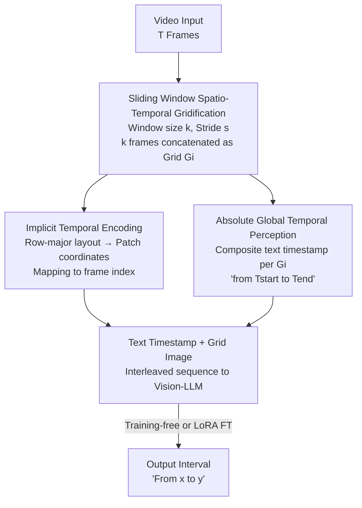

# T2SGrid: Temporal-to-Spatial Gridification for Video Temporal Grounding

**Conference**: CVPR 2026  
**Paper**: [CVF Open Access](https://openaccess.thecvf.com/content/CVPR2026/html/Guo_T2SGrid_Temporal-to-Spatial_Gridification_for_Video_Temporal_Grounding_CVPR_2026_paper.html)  
**Code**: None  
**Area**: Video Understanding  
**Keywords**: Video Temporal Grounding, Gridification, Multi-modal LLM, Temporal Modeling, Sliding Window

## TL;DR
T2SGrid transforms Video Temporal Grounding (VTG) from "frame-by-frame processing" to "grid-by-grid processing." By using a sliding window to concatenate continuous frames into a 2D grid in row-major order, it enables Vision-LLMs to utilize their superior spatial reasoning for temporal interpretation. Combined with a "composite text timestamp shared by the entire grid" for absolute time perception, it boosts the mIoU of Qwen2-VL-7B (which lacks temporal encoding) from 7.9 to 44.3 on Charades-STA and ActivityNet.

## Background & Motivation
**Background**: Video Temporal Grounding (VTG) aims to localize specific video segments based on a natural language query, outputting timestamps like "from X seconds to Y seconds." Current mainstream approaches adapt Vision-LLMs (e.g., Qwen2.5-VL) by augmenting them with temporal perception mechanisms.

**Limitations of Prior Work**: Three common routes for temporal perception have significant drawbacks. ① **Position Embedding (+PE)**: Can model relative order but fails to capture "absolute temporal position," which is essential for grounding, and requires extra encoding modules. ② **Text Timestamps (+TextNum)**: Inserting text tokens like "Frame 1" or "1 second" before each frame causes the number of text tokens to explode in long videos, diluting visual attention. ③ **Visual Numbering (+VisualNum)**: Directly drawing frame numbers on images destroys spatial details, which are critical for the semantic understanding of Vision-LLMs.

**Key Challenge**: Vision-LLMs are trained on static images; they possess **strong spatial reasoning but weak temporal reasoning**. Feeding a video linearly as a "long sequence of frames" causes the model to focus only on "what objects are in the frame" (based on static object saliency) rather than "how objects move between frames." Visualizing cross-attention reveals that temporal attention peaks deviate significantly from the Ground Truth, suggesting that serialized processing forces frame-by-frame object matching while losing motion cues.

**Goal**: Enable Vision-LLMs to truly understand temporal dynamics without adding specialized temporal modules or requiring large-scale new annotations.

**Key Insight**: Since models have strong spatial reasoning and weak temporal reasoning, the temporal problem is **translated into a spatial problem** by "folding" the temporal dimension into space. The authors observe that modern Vision-LLMs can inherently interpret grid puzzles: given a 3×3 frame grid, the model can infer "before / after" relative orders and even identify specific actions in the 6th grid cell. This suggests that grid layouts naturally encode temporal information.

**Core Idea**: Use a sliding window to concatenate continuous frames into a 2D grid (gridification) in row-major order. This allows a standard ViT to treat the grid as a single image, capturing local temporal dynamics via spatial attention. A "composite text timestamp for each grid" is then used to restore absolute global temporal awareness.

## Method

### Overall Architecture
The core of T2SGrid is reformulating "Video = Frame Sequence" as "Video = Grid Sequence." The pipeline consists of two steps: first, **Sliding Window Spatio-Temporal Gridification** segments the video into windows where $k$ frames are concatenated into a grid image $G_i$; second, **T2SGrid Temporal Modeling** implicitly encodes relative timing via the row-major layout and explicitly establishes absolute global timing by prepended text timestamps. The interleaved "text timestamp + grid" sequence is then fed into the Vision-LLM. This framework is **training-free** for existing models and can be further enhanced via LoRA fine-tuning.

### Key Designs

**1. Sliding Window Spatio-Temporal Gridification: Folding Time into Space without Sacrificing Resolution**

To solve the issue where linear processing misses motion, a sliding window with size $k$ and stride $s$ is defined. The $i$-th window $W_i = \{f_{i \times s}, \dots, f_{i \times s+k-1}\}$ is concatenated into a grid $G_i$ with an $M \times N = k$ layout (e.g., a 3×3 grid for 9 frames). Crucially, **gridification concatenates frames at their original resolution without downsampling**, preserving spatial details. Uniform sampling $(s=1, k=1)$ is a degenerate case; by setting $k>1$, the model sees neighbors (e.g., $f_{t-4}, \dots, f_{t+4}$) simultaneously, providing complete dynamic context. Stride $s$ manages overlap: $s < k$ for short videos ensures continuity for key actions, while $s = k$ prevents redundant computation for long videos.

**2. Implicit Temporal Encoding of Grid Layout: Row-Major Order as Deterministic Position Encoding**

The authors explain how spatial grids encode time through coordinate mapping. For a grid with $N_c$ frames per row, a frame at row $r_f$ and column $c_f$ has a temporal index $t_f = r_f \times N_c + c_f$. Self-attention operates on patch coordinates $(r_p, c_p)$ with 2D position embeddings $E(r_p, c_p)$. Frame coordinates are derived as $r_f = \lfloor r_p / h_{patch} \rfloor$ and $c_f = \lfloor c_p / w_{patch} \rfloor$. Thus, $t_f = \lfloor r_p / h_{patch} \rfloor \times N_c + \lfloor c_p / w_{patch} \rfloor$, making the **temporal index a well-defined function of patch coordinates**. Standard 2D position embeddings inherently contain the information needed for temporal inference without explicit timestamps or frame numbers.

**3. Composite Text Timestamp: Restoring Absolute Time Lost to Sliding Windows**

While the grid encodes **relative** timing, the absolute position of each segment on the global timeline is lost. Since VTG requires precise output like "X to Y seconds," the authors prepend a text timestamp to each grid: $\text{Prompt}_i = (\text{"from } T_{start} \text{ to } T_{end}\text{."}; \ \text{Image: } G_i)$. Unlike TextNum, which tags **every frame**, this approach uses **one composite timestamp for multiple frames**, significantly reducing token count and avoiding visual attention dilution. These timestamps form a continuous temporal chain across all grids.

## Key Experimental Results

### Main Results
Evaluated on Charades-STA and ActivityNet using mIoU and R@1 (IoU thresholds 0.3/0.5/0.7). T2SGrid works training-free and can be further improved via fine-tuning (T2SGrid-FT). Results on Charades-STA:

| Model | R@0.3 | R@0.5 | R@0.7 | mIoU |
|------|-------|-------|-------|------|
| Qwen2-VL-7B (No Temp. Encoding) | 8.7 | 5.4 | 2.4 | 7.9 |
| + T2SGrid (Training-free) | 70.1 (+61.4) | 46.7 (+41.3) | 20.1 (+17.7) | 44.3 (+36.4) |
| + T2SGrid-FT | 76.9 | 60.6 | 35.9 | 53.2 |
| LLaVA-OneVision-1.5-8B (Static Image) | 19.8 | 6.7 | 2.3 | 14.5 |
| + T2SGrid | 45.0 (+25.2) | 26.3 (+19.6) | 11.9 (+9.6) | 28.8 (+14.3) |
| GPT-4o | 55.0 | 32.0 | 11.5 | 35.4 |
| + T2SGrid | 57.3 (+2.3) | 36.7 (+4.7) | 14.8 (+3.3) | 36.9 (+1.5) |

For Qwen2-VL-7B, training-free T2SGrid increases mIoU from 7.9 to 44.3, outperforming many specialized Video-LLMs. LLaVA-OneVision also shows a +14.3 mIoU gain, confirming the effectiveness of using spatial reasoning for time. Gains are smaller for Qwen3-VL-8B (+1.8 mIoU), likely due to its existing text timestamp mechanism.

T2SGrid also generalizes to VQA (Table 3, Qwen2-VL-7B): Video-MME (Temporal Perception) +14.5; MVBench +6.6.

### Ablation Study
Component ablation (Charades-STA, Qwen2-VL-7B):

| ComTextNum | Sliding Window | Grid | R@0.3 | R@0.5 | R@0.7 | mIoU |
|:---:|:---:|:---:|------|------|------|------|
| ✗ | ✗ | ✗ | 8.7 | 5.4 | 2.4 | 7.9 |
| ✓ | ✗ | ✗ | 53.5 | 23.2 | 7.9 | 32.9 |
| ✓ | ✓ | ✗ | 58.3 | 35.1 | 13.6 | 36.5 |
| ✓ | ✓ | ✓ | 70.1 | 46.7 | 20.1 | 44.3 |

### Key Findings
- **Gridification is the most significant component**: While text timestamps (ComTextNum) jump mIoU from 7.9 to 32.9, adding the 2D grid layout further boosts it to 44.3 (+7.8), proving the value of implicit temporal encoding.
- **Zero-overhead for non-overlapping grids**: Without overlap, token counts (5766) and inference times (1.43s) are almost identical to frame-by-frame processing, while being 34.1% faster than VisualNum.
- **Grid size "sweet spot"**: Performance improves as window size increases (from 32.9 to 41.2 mIoU), but excessive grid density (e.g., 4x4) drops mIoU to 35.9 because single frames become too small, losing spatial detail. The 4x3 (g43) configuration is optimal.

## Highlights & Insights
- **Perspective shift**: Translating temporal problems into spatial problems utilizes the model's strengths rather than attempting to fix its weaknesses through expensive retraining.
- **Mathematical proof**: The coordinate mapping formula ($t_f = \lfloor r_p/h_{patch}\rfloor \times N_c + \lfloor c_p/w_{patch}\rfloor$) transforms the intuition of "reading grids" into a mathematical fact about attention mechanisms.
- **Optimized timestamps**: Composite timestamps address the "token explosion" and "visual dilution" of standard TextNum approaches.
- **Plug-and-play**: Substantial gains for various Vision-LLMs in a training-free manner make it highly practical for deployment.

## Limitations & Future Work
- **Diminishing returns for natively temporal models**: Models like Qwen3-VL-8B show smaller gains due to signal overlap/conflict between T2SGrid and their internal temporal schemes.
- **Hyperparameter sensitivity**: Grid size requires tuning to balance spatial detail against temporal context. Performance on ultra-long videos (beyond short datasets like Charades-STA) requires more validation.
- **Overlap overhead**: Overlap modes increase token counts and inference time, which may be costly for long videos.
- **Future Directions**: Adaptive grid layouts (dynamic $k, s$ based on motion density) or better integration of implicit grid signals with explicit timestamps.

## Related Work & Insights
- **vs. Position Encoding / Text Timestamps / Visual Numbering**: These remain within the "frame sequence" paradigm. T2SGrid shifts the paradigm by folding frames into spatial grids, avoiding token explosion and preserving spatial detail.
- **vs. IG-VLM / DynImg**: While these use grids for VQA, they focus on coarse-grained event understanding. T2SGrid is the first to leverage the implicit fine-grained temporal ordering within spatial layouts for grounding tasks.

## Rating
- Novelty: ⭐⭐⭐⭐⭐ 
- Experimental Thoroughness: ⭐⭐⭐⭐ 
- Writing Quality: ⭐⭐⭐⭐ 
- Value: ⭐⭐⭐⭐⭐ 

<!-- RELATED:START -->

## Related Papers

- [\[CVPR 2026\] HieraMamba: Video Temporal Grounding via Hierarchical Anchor-Mamba Pooling](hieramamba_video_temporal_grounding_via_hierarchical_anchor-mamba_pooling.md)
- [\[CVPR 2026\] CVA: Context-aware Video-text Alignment for Video Temporal Grounding](cva_context-aware_video-text_alignment_for_video_temporal_grounding.md)
- [\[CVPR 2026\] OmniVTG: A Large-Scale Dataset and Training Paradigm for Open-World Video Temporal Grounding](omnivtg_a_large-scale_dataset_and_training_paradigm_for_open-world_video_tempora.md)
- [\[CVPR 2026\] VideoITG: Multimodal Video Understanding with Instructed Temporal Grounding](videoitg_multimodal_video_understanding_with_instructed_temporal_grounding.md)
- [\[CVPR 2026\] Learning to Refuse: Refusal-Aware Reinforcement Fine-Tuning for Hard-Irrelevant Queries in Video Temporal Grounding](learning_to_refuse_refusal-aware_reinforcement_fine-tuning_for_hard-irrelevant_q.md)

<!-- RELATED:END -->
## Related Papers

- [\[CVPR 2026\] CVA: Context-aware Video-text Alignment for Video Temporal Grounding](cva_context-aware_video-text_alignment_for_video_temporal_grounding.md)
- [\[CVPR 2026\] OmniVTG: A Large-Scale Dataset and Training Paradigm for Open-World Video Temporal Grounding](omnivtg_a_large-scale_dataset_and_training_paradigm_for_open-world_video_tempora.md)
- [\[CVPR 2026\] VideoITG: Multimodal Video Understanding with Instructed Temporal Grounding](videoitg_multimodal_video_understanding_with_instructed_temporal_grounding.md)
- [\[CVPR 2026\] Learning to Refuse: Refusal-Aware Reinforcement Fine-Tuning for Hard-Irrelevant Queries in Video Temporal Grounding](learning_to_refuse_refusal-aware_reinforcement_fine-tuning_for_hard-irrelevant_q.md)
- [\[CVPR 2026\] HieraMamba: Video Temporal Grounding via Hierarchical Anchor-Mamba Pooling](hieramamba_video_temporal_grounding_via_hierarchical_anchor-mamba_pooling.md)

<!-- RELATED:END -->
