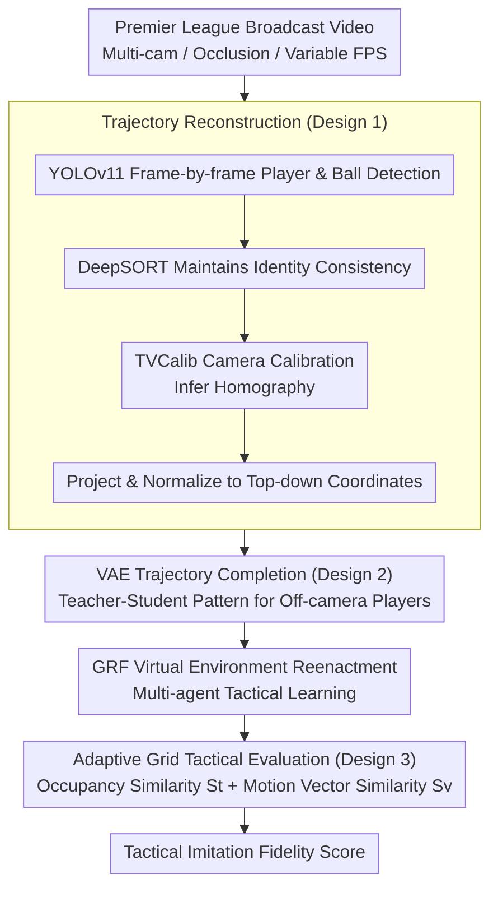

# TacSIm: A Dataset and Benchmark for Football Tactical Style Imitation

**Conference**: CVPR 2026  
**arXiv**: [2603.25199](https://arxiv.org/abs/2603.25199)  
**Code**: TacSIm (Publicly Available)  
**Area**: Video Understanding  
**Keywords**: Football Tactical Imitation, Multi-Agent Learning, Trajectory Reconstruction, Tactical Evaluation, Virtual Simulation

## TL;DR

This paper proposes TacSIm, the first large-scale dataset and benchmark designed to reconstruct full-team trajectories from real Premier League broadcast footage and perform tactical style imitation in a virtual football environment. It quantifies tactical imitation fidelity using two metrics: spatial occupancy similarity and motion vector similarity.

## Background & Motivation

**Background**: Current research in football imitation learning is primarily reward-oriented (e.g., number of goals, win-rate proxies), focusing on individual behavior cloning or reinforcement learning policy optimization rather than precise replication of team tactical organizational behavior.

**Limitations of Prior Work**: Three major challenges restrict the development of tactical imitation. First, data acquisition is limited—fine-grained tracking data from top leagues is protected by commercial barriers, and broadcast footage contains multi-camera switching, occlusions, and inconsistent frame rates, making it difficult to obtain 11v11 full-team trajectories. Second, there is an imbalance between individual behavior cloning and team collaboration optimization during imitation, leading to weak generalization under partial observability. Third, evaluation frameworks focus on individual errors or segment-level rewards, lacking a systematic evaluation of team spatial-temporal consistency.

**Key Challenge**: Existing research lacks a unified closed-loop benchmark from real games to virtual simulation, preventing the fair evaluation of tactical imitation quality across different methods.

**Goal**: (1) How to obtain standardized full-team trajectory data from broadcast footage; (2) How to define and quantify the quality of tactical style imitation; (3) How to fairly compare different imitation learning methods in a unified environment.

**Key Insight**: The authors start from Premier League broadcast footage, utilizing camera calibration, trajectory reconstruction, and VAE completion to obtain full-team coordinates, which are then mapped to the Google Research Football (GRF) virtual environment for tactical reenactment and evaluation.

**Core Idea**: Construct the first football tactical imitation benchmark from broadcast footage to virtual simulation, systematically evaluating the reproduction of team tactical styles through spatial occupancy and motion vector metrics.

## Method

### Overall Architecture

The TacSIm pipeline consists of three stages: (1) Data acquisition—reconstructing standardized coordinates of players and the ball from Premier League broadcasts via object detection, tracking, and camera calibration; (2) Trajectory completion—using a conditional VAE to complete player positions in invisible areas; (3) Virtual simulation and evaluation—inputting reconstructed initial states into the GRF virtual football platform for multi-agent systems to learn and replicate subsequent tactical behaviors, followed by comparison with real trajectories.

### Key Designs

**1. Trajectory Reconstruction from Broadcast Footage to Standard Coordinates: Converting multi-view, occluded TV footage into unified birds-eye-view (BEV) coordinates.**

The dataset starts with public Premier League broadcast videos. However, these shots involve frequent camera switches, player occlusions, and unstable frame rates. The authors chain vision tools into a pipeline: YOLOv11 detects players and the ball in each frame, and DeepSORT maintains identity consistency to prevent tracking ID jumps. A crucial step uses TVCalib to infer camera parameters from pitch markings, obtaining a homography transformation from the image plane to the real pitch to project pixel coordinates into a BEV. Results are normalized to the GRF simulation standard ranges $x \in [-1,1]$ and $y \in [-0.42, 0.42]$. This approach bypasses commercial barriers to official tracking data by using only public broadcasts.

**2. VAE-based Off-camera Trajectory Completion: Predicting "unseen but present" players outside the camera frame.**

Broadcast lenses typically capture only a portion of the pitch, causing reconstructed trajectories to have significant gaps. The authors use a conditional VAE to fill these gaps in a "Demonstrator-Learner" architecture. The demonstrator is a bidirectional RNN that observes **complete** trajectories during training to learn spatial-temporal dynamics. The learner receives only partially masked trajectories and uses a masked decoder to reconstruct missing motion. The training objective combines a reconstruction loss for missing areas and KL regularization:

$$\mathcal{L} = \mathbb{E}\big[\|(1-M) \odot (X - \hat{X})\|_2^2\big] + \beta \cdot KL$$

Where $M$ denotes visible positions. Using a VAE instead of deterministic interpolation accounts for the uncertainty of off-camera movement, generating smooth and diverse candidate trajectories that are physically plausible.

**3. Adaptive Grid Tactical Evaluation Protocol: Quantifying imitation fidelity through two complementary metrics.**

Tactical imitation depends on the team's spatial organization rather than meter-level errors of individual players. The pitch is discretized into a grid, with granularity $\Delta_g = \min(\Delta_{max}, \max(\Delta_{min}, \alpha/s_t))$ adjusted based on average displacement—grids expand when the team moves fast and tighten when moving slow. Two metrics are calculated: Spatial occupancy similarity uses the Jaccard index to measure overlap of occupied cells:

$$S_t = \frac{|O^{gt} \cap O^{pred}|}{|O^{gt} \cup O^{pred}|}$$

Motion vector similarity uses cosine similarity to measure flow alignment:

$$S_v = \frac{1}{2}\left(\frac{v^{gt} \cdot v^{pred}}{\|v^{gt}\|\, \|v^{pred}\|} + 1\right)$$

The final score is the arithmetic mean of both. $S_t$ monitors positioning, while $S_v$ monitors direction; using both prevents assigning a perfect score to agents standing in the correct spot but moving in the wrong direction.

### Loss & Training

The dataset contains 194,565 annotated video segments (~38,913 seconds), split 70%/15%/15% into training/validation/test sets by match identity to prevent team information leakage. Training employs multiple window lengths ($L \in \{1, 10, 25, 50\}$) and includes short-term closed-loop inference to mitigate exposure bias. During testing, only the first frame context is provided.

## Key Experimental Results

### Main Results

Prediction results at 3.0s using a 150-cell (15×10) grid:

| Method | Score | $S_t$ | $S_v$ |
|------|-------|-------|-------|
| BC | 37.86 | 28.57 | 47.14 |
| CMIL | 42.98 | 40.22 | 45.73 |
| IRL | 32.53 | 28.34 | 36.72 |
| CoDAIL | **50.89** | **48.56** | **53.22** |
| DRAIL | 41.72 | 39.88 | 43.56 |

### Ablation Study

| Grid Resolution | Best Method | 3s Score | 10s Score |
|-----------|---------|----------|-----------|
| 60-cell (10×6) | CoDAIL | 46.63 | 33.00 |
| 150-cell (15×10) | CoDAIL | 50.89 | 28.37 |
| 240-cell (20×12) | CMIL | 47.87 | 20.11 |
| 600-cell (30×20) | CoDAIL | 37.12 | 14.12 |
| 1768-cell (105×68) | CoDAIL | 27.10 | 6.45 |

### Key Findings

- **Prediction duration is the primary driver of performance decay**: All models show significant degradation from 3s to 10s, indicating a fundamental challenge in moving from "motion state imitation" to "tactical intent inference."
- **Existence of optimal grid resolution**: Medium grids (150/240 cells) balance tactical information retention with model learnability. Grids that are too coarse lose information, while those that are too fine lead to a dimensionality curse.
- **CoDAIL is overall superior**: Benefiting from its multi-agent coordination and adversarial learning framework, it performs best in short-to-medium-term predictions.
- **DRAIL is more robust in long-term prediction**: Diffusion models demonstrate relative advantages in spatial occupancy metrics at the 10s scale.

## Highlights & Insights

- **Strong Originality**: This is the first closed-loop benchmark for football tactical imitation from broadcast footage to virtual simulation, filling a gap in the field.
- **Clever Evaluation Design**: The adaptive grid and dual-metric system systematically quantify team-level tactical imitation quality for the first time.
- **Clear Practical Value**: The framework can be applied to coaching tactical analysis, customized opponent simulation, and player adaptability assessments.
- **Deep Cross-Analysis**: Spatial-temporal analysis reveals optimal configurations for different scenarios (short-term/fine-grained vs. long-term/macro).

## Limitations & Future Work

- The framework evaluates ball trajectories rather than individual player trajectories, which avoids identity ambiguity but limits evaluation granularity.
- The data only covers the Premier League, so tactical diversity is limited by a single league style.
- Lack of baseline comparisons against Transformer architectures and large-scale pre-trained models.
- The sim-to-real gap between the virtual environment (GRF) and real physics is not fully addressed.

## Related Work & Insights

- The SoccerNet series focuses on video understanding and tracking but lacks tactical-level spatial-temporal data.
- Google Research Football provides a fully observable simulation environment but differs from real-world match dynamics.
- The evaluation protocol design could inspire tactical analysis benchmarks in other team sports, such as basketball or ice hockey.

## Rating

- **Novelty**: ⭐⭐⭐⭐ — First football tactical imitation benchmark with clear application value.
- **Experimental Thoroughness**: ⭐⭐⭐ — Covers 5 baselines and multiple grid configurations but lacks more advanced model comparisons.
- **Writing Quality**: ⭐⭐⭐⭐ — Clear structure with detailed definitions of problems and evaluation protocols.
- **Value**: ⭐⭐⭐⭐ — Advances sports analytics and provides a new testbed for multi-agent imitation learning.

<!-- RELATED:START -->

## Related Papers

- [\[CVPR 2026\] SHANDS: A Multi-View Dataset and Benchmark for Surgical Hand-Gesture and Error Recognition Toward Medical Training](shands_a_multi-view_dataset_and_benchmark_for_surgical_hand-gesture_and_error_re.md)
- [\[CVPR 2026\] SAVA-X: Ego-to-Exo Imitation Error Detection via Scene-Adaptive View Alignment and Bidirectional Cross View Fusion](savax_egotoexo_imitation_error_detection_via_scene.md)
- [\[CVPR 2026\] OpenMarcie: Dataset for Multimodal Action Recognition in Industrial Environments](openmarcie_dataset_for_multimodal_action_recognition_in_industrial_environments.md)
- [\[CVPR 2026\] VideoNet: A Large-Scale Dataset for Domain-Specific Action Recognition](videonet_a_large-scale_dataset_for_domain-specific_action_recognition.md)
- [\[CVPR 2026\] VISTA: Video Interaction Spatio-Temporal Analysis Benchmark](vista_video_interaction_spatio-temporal_analysis_benchmark.md)

<!-- RELATED:END -->
