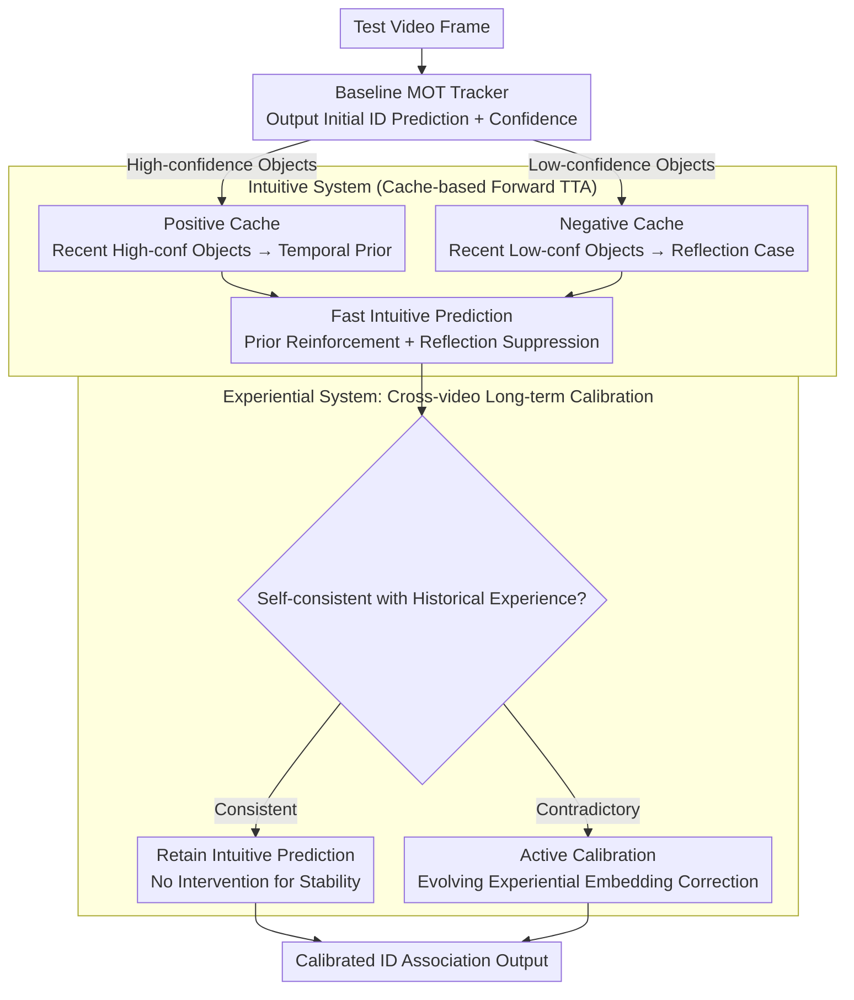

# Dual-level Adaptation for Multi-Object Tracking: Building Test-Time Calibration from Experience and Intuition

**Conference**: CVPR 2026  
**arXiv**: [2603.21629](https://arxiv.org/abs/2603.21629)  
**Code**: [https://github.com/1941Zpf/TCEI](https://github.com/1941Zpf/TCEI)  
**Area**: Video Understanding  
**Keywords**: Multi-Object Tracking, Test-Time Adaptation, Dual-process Theory, Distribution Shift, Identity Association

## TL;DR

Inspired by Kahneman's dual-process theory, the TCEI framework proposes a test-time adaptation method that combines an intuitive system (fast inference using episodic memory of recently observed objects) and an experiential system (calibrating intuitive predictions using accumulated experience from historical videos). It significantly improves multi-object tracking performance under distribution shifts without requiring backpropagation.

## Background & Motivation

1. **Background**: Multi-object tracking (MOT) often faces distribution shifts in appearance, motion patterns, and categories between training and test data, leading to degraded online inference performance. Test-time adaptation (TTA) is a promising paradigm to mitigate this.
2. **Limitations of Prior Work**: Existing TTA methods mostly target static image tasks (classification, segmentation), adapting only with intra-frame information while ignoring inter-frame temporal consistency and identity association requirements in MOT. Backpropagation-based TTA methods also suffer from low computational efficiency and catastrophic forgetting.
3. **Key Challenge**: In MOT, intra-frame cues are used to distinguish objects, while inter-frame temporal cues ensure ID consistency—both are equally important, but existing TTA methods only consider the former.
4. **Goal**: Design a forward-propagation TTA method for MOT that leverages historically observed objects to provide temporal guidance for current ID association.
5. **Key Insight**: Drawing an analogy to the dual-process theory of human decision-making—fast intuitive judgment (System 1) + slow deliberate calibration (System 2).
6. **Core Idea**: The intuitive system uses episodic memory of recent objects for fast predictions, while the experiential system calibrates inconsistencies in intuitive predictions using knowledge accumulated from all processed videos.

## Method

### Overall Architecture

TCEI addresses the breakdown of ID association when multi-object tracking encounters distribution shifts (mismatches in appearance, motion patterns, or categories compared to the training set) during the testing phase, achieved without backpropagation or network weight updates. It is not a standalone tracker but a test-time calibration module layered atop any existing MOT tracker. The pipeline operates as follows: the baseline tracker first outputs initial ID predictions for each frame; the intuitive system forms an "episodic memory" from objects observed in recent frames, using high-confidence objects as temporal priors to reinforce current predictions and low-confidence objects as negative examples to scrutinize predictions; the experiential system then utilizes a long-term memory spanning all processed videos to check if intuitive results are self-consistent with historical experience—allowing consistency and intervening for calibration if contradictions arise. The entire process involves only forward cache queries and similarity computations without gradient backpropagation—all "memory" resides in key-value caches, which is the foundation of the third key design "Cache-based Forward TTA."

### Key Designs

**1. Intuitive System: Applying Fast Patches to Current Predictions using Episodic Memory from Recent Frames**

**Design Motivation**: Baseline trackers only consider intra-frame cues during ID association, which easily leads to inconsistent identity assignments for the same target across adjacent frames under distribution shifts. The intuitive system maintains an episodic memory of recently processed objects, categorized by baseline prediction confidence: high-confidence objects serve as "temporal priors," whose features are compared with current detections to reinforce the current ID association; low-confidence or uncertain objects serve as "reflection cases," increasing vigilance and suppressing predictions when the model intends to make judgments similar to these failed cases. These dual signals essentially merge knowledge learned during training with evidence observed during testing, mimicking the human intuitive process of recalling recent experiences and checking against successful or failed cases.

**2. Experiential System: Deliberate Calibration via Cross-video Long-term Experience**

The intuitive system is limited by its short temporal reach and cannot provide long-term temporal information, failing when targets reappear after long occlusions or when appearances change drastically over time. The experiential system compensates for this by maintaining accumulated experience from all processed test videos. This experience is not a static template; rather, experiential embeddings evolve alongside query embeddings, capturing object-specific features instead of coarse category-level features. It operates on an "intervene-as-needed" basis: if intuitive predictions align with historical experience, they are retained; if contradictions are found, the system actively corrects the prediction toward the direction validated by experience.

**3. Cache-based Forward TTA: Test-time Optimization via Key-value Caches Instead of Backpropagation**

To avoid the costs of backpropagation—where gradient updates are slow and prone to being skewed by noise in the test stream, causing catastrophic forgetting—TCEI uses a key-value cache model to store memory. High-confidence objects are written into a positive cache as prior sources, while low-confidence objects are written into a negative cache as reflection signals. Caches are dynamically updated as the video progresses to align with the latest test environment. Prior/reflection in the intuitive system and evolving embeddings in the experiential system are all implemented through cache queries and similarity computations, involving only forward operations. Compared to backpropagation-based TTA like TENT, this cache-based scheme does not modify network weights, making it more stable and better suited for real-time-sensitive online MOT scenarios.

### Loss & Training

TCEI is a pure forward-propagation method and does not involve training or backpropagation. Intuitive prediction and experiential calibration are completed during inference through cache queries and similarity computations.

## Key Experimental Results

### Main Results

| Dataset | Metric | TCEI | Baseline Tracker | Gain |
|--------|------|------|-----------|------|
| MOT17 | HOTA/IDF1 | SOTA | Baseline | Significant |
| MOT20 | HOTA/IDF1 | SOTA | Baseline | Significant |
| DanceTrack | HOTA/IDF1 | SOTA | Baseline | Significant |
| Multi-dataset | Consistency | All Improved | - | Strong Generalization |

### Ablation Study

| Configuration | Key Metrics | Description |
|------|---------|------|
| Baseline Tracker Only | Baseline | No TTA adaptation |
| + Intuitive System (Pos-cache) | Gain | Temporal prior is effective |
| + Intuitive System (Pos+Neg-cache) | Further Gain | Reflection mechanism is effective |
| + Experiential System | SOTA | Long-term calibration further enhances performance |

### Key Findings

- TCEI consistently outperforms non-TTA baselines across three major datasets, validating the value of test-time adaptation for MOT.
- The forward-propagation scheme is more stable than backpropagation-based TTA methods (e.g., TENT) and is less prone to catastrophic forgetting.
- The dual utilization of high-confidence and low-confidence objects is more effective than using high-confidence objects alone (evidenced by the incremental contribution of the reflection mechanism in the "Pos+Neg-cache" ablation).
- The long-term memory of the experiential system is particularly important for scenes with drastic appearance changes (e.g., DanceTrack).

## Highlights & Insights

- **The mapping from dual-process theory to MOT-TTA** is natural: recent memory → intuitive fast judgment → deliberate experiential calibration. This cognitive framework provides clear guiding principles for method design.
- **The negative cache/reflection mechanism** is an interesting design: utilizing failed or uncertain cases as a "guide to avoid pitfalls."
- **Forward-propagation TTA** is critical for MOT scenarios with high real-time requirements, avoiding the overhead and instability of backpropagation.

## Limitations & Future Work

- Cache size and update strategies require careful tuning.
- Knowledge accumulation in the experiential system may lead to interference from outdated information in extremely long video sequences.
- Modeling of multi-object interaction relationships has not been considered.

## Related Work & Insights

- **vs TENT/FSTTA**: Backpropagation-based TTA methods have high computational overhead and are unstable; TCEI only requires forward propagation.
- **vs TDA/Tip-Adapter**: Cache-based TTA methods, but previously used for static image tasks; TCEI extends this to video temporal modeling.
- **vs ByteTrack/OC-SORT**: Traditional tracking methods lacks test-time adaptation capabilities; TCEI serves as an add-on module to enhance any tracker.
- The natural mapping from dual-process theory to MOT-TTA: recent memory → intuitive fast judgment → deliberate experiential calibration.
- The negative cache/reflection mechanism uses failed/uncertain cases as a "guide to avoid pitfalls," representing an interesting design innovation.
- Experiential embeddings evolve with query embeddings rather than using fixed templates, capturing object-specific features instead of category-level features.
- MOTIP's ID decoder redefines association as direct ID prediction; TCEI can serve as its upper-layer adaptive module.

## Rating

- Novelty: ⭐⭐⭐⭐ Natural interdisciplinary integration of dual-process cognitive theory and MOT test-time adaptation.
- Experimental Thoroughness: ⭐⭐⭐⭐ Verified across multiple datasets (MOT17/MOT20/DanceTrack) with complete ablation analysis.
- Writing Quality: ⭐⭐⭐⭐ Clear motivation, with intuitive framework diagrams for the human cognitive theory analogy.
- Value: ⭐⭐⭐⭐ The first systematic study of test-time adaptation for MOT; the forward-propagation scheme is highly practical.

<!-- RELATED:START -->

## Related Papers

- [\[CVPR 2026\] Bootstrapping Video Semantic Segmentation Model via Distillation-assisted Test-Time Adaptation](bootstrapping_video_semantic_segmentation_model_via_distillation-assisted_test-t.md)
- [\[CVPR 2026\] Hypergraph-State Collaborative Reasoning for Multi-Object Tracking](hypergraph-state_collaborative_reasoning_for_multi-object_tracking.md)
- [\[CVPR 2026\] ProgTrack: A Multi-Object Tracking Algorithm with Progressive Matching Strategy](progtrack_a_multi-object_tracking_algorithm_with_progressive_matching_strategy.md)
- [\[CVPR 2026\] Occlusion-Aware SORT: Observing Occlusion for Robust Multi-Object Tracking](occlusion-aware_sort_observing_occlusion_for_robust_multi-object_tracking.md)
- [\[CVPR 2026\] Enhancing Accuracy of Uncertainty Estimation in Appearance-based Gaze Tracking with Probabilistic Evaluation and Calibration](enhancing_accuracy_of_uncertainty_estimation_in_appearance-based_gaze_tracking_w.md)

<!-- RELATED:END -->
