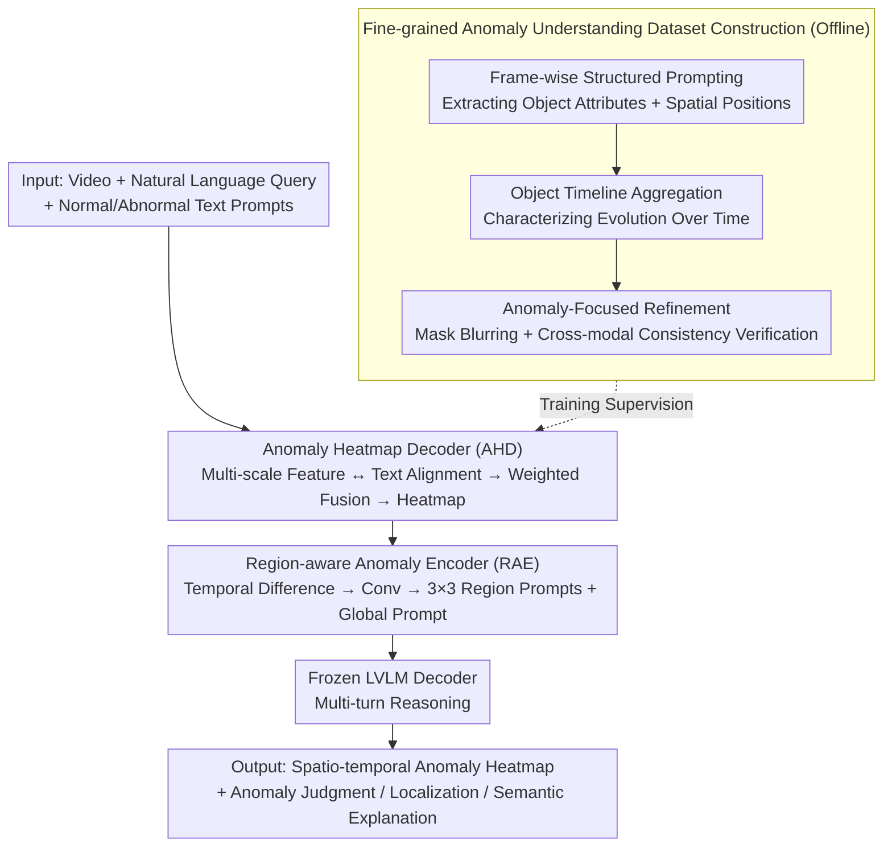

# Text-guided Fine-Grained Video Anomaly Understanding

**Conference**: CVPR2026  
**arXiv**: [2511.00524](https://arxiv.org/abs/2511.00524)  
**Code**: [github.com/momiji-bit/T-VAU](https://github.com/momiji-bit/T-VAU)  
**Area**: Video Understanding  
**Keywords**: Video Anomaly Detection, Anomaly Heatmap, Region-aware Encoder, Large Vision-Language Model, Multi-turn Dialogue  

## TL;DR
The T-VAU framework is proposed, which realizes pixel-level spatio-temporal anomaly localization through an Anomaly Heatmap Decoder (AHD) and designs a Region-aware Anomaly Encoder (RAE) to inject heatmap evidence into Large Vision-Language Models (LVLMs) for unified reasoning across anomaly detection, localization, and semantic explanation.

## Background & Motivation
Video Anomaly Detection (VAD) is critical for security surveillance. Existing methods face fundamental limitations:
- **Traditional VAD**: Outputs video/frame-level anomaly scores, providing coarse binary decisions without interpretable evidence. Fine-grained clues are often diluted by feature aggregation.
- **Direct LVLM Application**: Although capable of generating textual judgments, they lack pixel-level localization capabilities and are unreliable in capturing weak anomaly signals, leading to unfaithful textual descriptions.
- **LVLM-Diffusion Hybrids**: Combine visualization and text but can be unstable or inconsistent.

Core Requirement: Anomaly understanding requires not just "whether there is an anomaly," but also "where it is," "which object is responsible," and "how it evolves over time"—necessitating a closed loop from pixel-level evidence to linguistic reasoning.

Key Insight: (i) Extract spatio-temporal anomaly evidence through vision-text alignment, and (ii) inject this evidence as structured prompts into the LVLM for multi-task, multi-turn reasoning.

## Method

### Overall Architecture
T-VAU addresses tasks that traditional VAD cannot: not only identifying "this video is anomalous" but also specifying "which pixels, which objects, and how they evolve over time," while explaining the judgment in natural language. The approach attaches two lightweight trainable modules to a **frozen LVLM backbone**: an Anomaly Heatmap Decoder (AHD) "paints" anomaly signals into pixel-level heatmaps from visual representations, and a Region-aware Anomaly Encoder (RAE) compresses these heatmaps into structured prompts for the language model. The pipeline receives "Video + Natural Language Query + Normal/Abnormal Text Prompts" and outputs a spatio-temporal anomaly heatmap alongside multi-turn dialogue responses, forming a closed loop of evidence (heatmap) and reasoning (language). Training AHD and RAE requires supervision at the "object-level + temporal" granularity, which is generated by an offline fine-grained dataset construction pipeline (see below).

### Key Designs

**1. Anomaly Heatmap Decoder (AHD): "Reading" Anomalies via Vision-Text Alignment without Thresholds**

Traditional VAD either outputs a frame-level score (diluting fine-grained clues) or relies on manual thresholds to split normal/abnormal frames—making it neither interpretable nor robust. AHD takes a different approach: since the intermediate layers of the LVLM's visual encoder already carry rich semantics, visual features are directly aligned with "normal/abnormal" text prompts. Positions with higher alignment are treated as more likely to be anomalous. Specifically, multi-scale features $V_i$ (from layers 1, 8, 16, and 32) are extracted from the visual encoder, projected into the text space via MLP, and the cosine similarity is calculated per position: $h_c^i[t,h,w] = \text{CosineSimilarity}(V'_i[t,:,h,w], T_c)$. These are then fused across layers using learnable weights $H_c = \sum_i w_i \cdot h_c^i$. Finally, a softmax is applied over class channels, and the anomaly channel is taken as the heatmap. This process uses no hard thresholds; anomaly intensity is determined continuously by vision-text similarity, preserving responses to weak anomaly signals.

**2. Region-aware Anomaly Encoder (RAE): Translating Pixel Evidence into LLM-Understandable Structured Prompts**

AHD produces per-frame heatmaps, but LLMs process token sequences. Flattening heatmaps directly is too long and loses motion information. RAE bridges this gap by first computing temporal differences on adjacent heatmaps $X[t] = H_c[t+1] - H_c[t]$ to make motion cues like "where and how things move" explicit. It then uses a convolutional backbone to extract region-aware features, dividing each frame into a $3\times3$ grid with adaptive pooling to generate region prompts $P_{region}$, while spatial mean pooling provides a global prompt $p_{global}$ summarizing the frame. These are concatenated into a prompt sequence $P_{An} = [P_{base}, P_{region}, p_{global}]$ and fed to the LLM decoder alongside visual prompts and dialogue context. Consequently, the language model receives a compact summary of "which regions, the overall situation, and temporal changes" rather than raw pixels.

**3. Fine-grained Anomaly Understanding Dataset Construction: High-Granularity Supervision**

To train a model capable of identifying specific objects and their evolution, frame-level labels are insufficient. A three-stage pipeline based on ShanghaiTech and UBnormal was developed for automated generation: first, frame-wise structured prompting extracts object attributes and spatial positions; second, frame-level information for the same object is aggregated into an "object timeline"; finally, anomaly-focused refinement is performed—using anomaly masks with Gaussian blurring to suppress the background and "appearance ↔ motion" cross-modal consistency verification to eliminate contradictory annotations. The resulting supervision signals inherently possess object granularity and temporal structure.

### A Complete Example

Consider a surveillance clip from UBnormal where a "pedestrian suddenly runs." The video and text prompts enter AHD; features from layers 1/8/16/32 of the visual encoder align with the text and are fused. The pixels where the runner is located "light up" in the anomaly channel, generating $H_c$. RAE then takes over: it computes the difference $X[t]$ between adjacent heatmaps, where the runner's displacement makes the difference values significant. After convolutional feature extraction and $3\times3$ grid pooling, the grid containing the runner yields a high-response region prompt, while the global prompt summarizes "rapid motion in the frame." These prompts, along with the query "What anomaly occurred?", enter the LLM. The model responds: "A pedestrian on the right suddenly runs (object), moves up the sidewalk (trajectory), which is abnormal behavior (judgment)." All three outputs are traceable to specific heatmap evidence.

### Loss & Training
Training is conducted in two stages with the backbone remaining frozen: in the AHD stage, only AHD is optimized; in the RAE stage, curriculum SFT is performed, transitioning from "appearance-motion narration" to "anomaly-focused refinement." Only the two lightweight modules (AHD and RAE) are updated, resulting in minimal parameter overhead.

## Key Experimental Results

### Main Results

| Dataset | Metric | Ours (T-VAU) | Prev. SOTA | Gain |
|--------|------|-------|----------|------|
| UBnormal | Micro-AUC | 94.8 | 68.2 (Georgescu FT) | +26.6 |
| UBnormal | RBDC | 67.8 | 28.7 (Georgescu FT) | +39.1 |
| UBnormal | TBDC | 76.7 | 58.1 (Georgescu FT) | +18.6 |
| ShanghaiTech | BLEU-4 (Target) | 62.67 | 55.73 (InternVL 8B) | +6.94 |
| ShanghaiTech | BLEU-4 (Trajectory) | 88.84 | 82.65 (InternVL 8B) | +6.19 |
| ShanghaiTech | Yes/No Acc | 97.67% | 94.28% (InternVL 8B) | +3.39% |

### Ablation Study

| Configuration | RBDC/TBDC | BLEU-4 (Target) | Yes/No Acc |
|------|-----------|----------------|-----------|
| T-VAU (Full) | 67.8/76.7 | 62.67 | 97.67% |
| w/o AHD | N/A | 61.82 | 95.38% |
| w/o RAE | 67.8/76.7 | - | - |
| w/o AHD & RAE | N/A | 61.82 | 95.38% |

### Key Findings
- AHD and RAE are highly complementary: AHD provides pixel-level evidence, while RAE transforms it into understandable language.
- Under a one-shot setting, AHD achieves 94.5% micro-AUC and 64.3% RBDC, demonstrating extreme data efficiency.
- Fine-tuning further improves performance, but the one-shot baseline is already strong.
- Model parameters increase by only approximately 50M (8274→8325M), making it lightweight.

## Highlights & Insights
- "Evidence → Reasoning" closed-loop design: Anomaly heatmaps serve as visual evidence, and RAE injects them structurally into the language model.
- Systematic fine-grained dataset construction: From frame-level extraction to temporal aggregation and cross-modal verification.
- Trajectory visualization (accumulating heatmaps across frames) provides intuitive temporal consistency verification.
- Threshold-free anomaly localization avoids the sensitivity issues inherent in traditional methods.

## Limitations & Future Work
- Performance in scenarios with micro-motions (tiny displacement) and highly non-rigid motion remains challenging.
- Scene-dependent appearance changes (reflections, fog, etc.) affect localization accuracy.
- Dataset diversity is limited as it is primarily based on ShanghaiTech and UBnormal.
- Freezing the LVLM backbone may limit deeper anomaly understanding capabilities.

## Related Work & Insights
- Compared to VAU methods like HAWK and Holmes-VAU, T-VAU provides explicit pixel-level evidence through AHD.
- Training-free methods like LAVAD are interesting but lack precise localization.
- Examining anomaly detection from the perspective of Fine-grained Visual Computing (SVC) is a promising direction.

## Rating
- Novelty: ⭐⭐⭐⭐ Evidence-reasoning closed-loop design is innovative.
- Experimental Thoroughness: ⭐⭐⭐⭐ Multi-dimensional evaluation + complete ablation + qualitative analysis.
- Writing Quality: ⭐⭐⭐⭐ Clear framework diagrams and well-defined component relationships.
- Value: ⭐⭐⭐⭐ Advances anomaly detection from score prediction to interpretable reasoning.

<!-- RELATED:START -->

## Related Papers

- [\[CVPR 2026\] Frame2Freq: Spectral Adapters for Fine-Grained Video Understanding](frame2freq_spectral_adapters_for_fine-grained_video_understanding.md)
- [\[CVPR 2026\] Fine-VAD: Towards Fine-Grained Video Anomaly Detection via Progressive Cross-Granularity Learning](fine-vad_towards_fine-grained_video_anomaly_detection_via_progressive_cross-gran.md)
- [\[AAAI 2026\] FineVAU: A Novel Human-Aligned Benchmark for Fine-Grained Video Anomaly Understanding](../../AAAI2026/video_understanding/finevau_a_novel_human-aligned_benchmark_for_fine-grained_video_anomaly_understan.md)
- [\[CVPR 2026\] Mistake Attribution: Fine-Grained Mistake Understanding in Egocentric Videos](mistake_attribution_fine-grained_mistake_understanding_in_egocentric_videos.md)
- [\[CVPR 2026\] UFVideo: Towards Unified Fine-Grained Video Cooperative Understanding with Large Language Models](ufvideo_towards_unified_fine-grained_video_cooperative_understanding_with_large_.md)

<!-- RELATED:END -->
