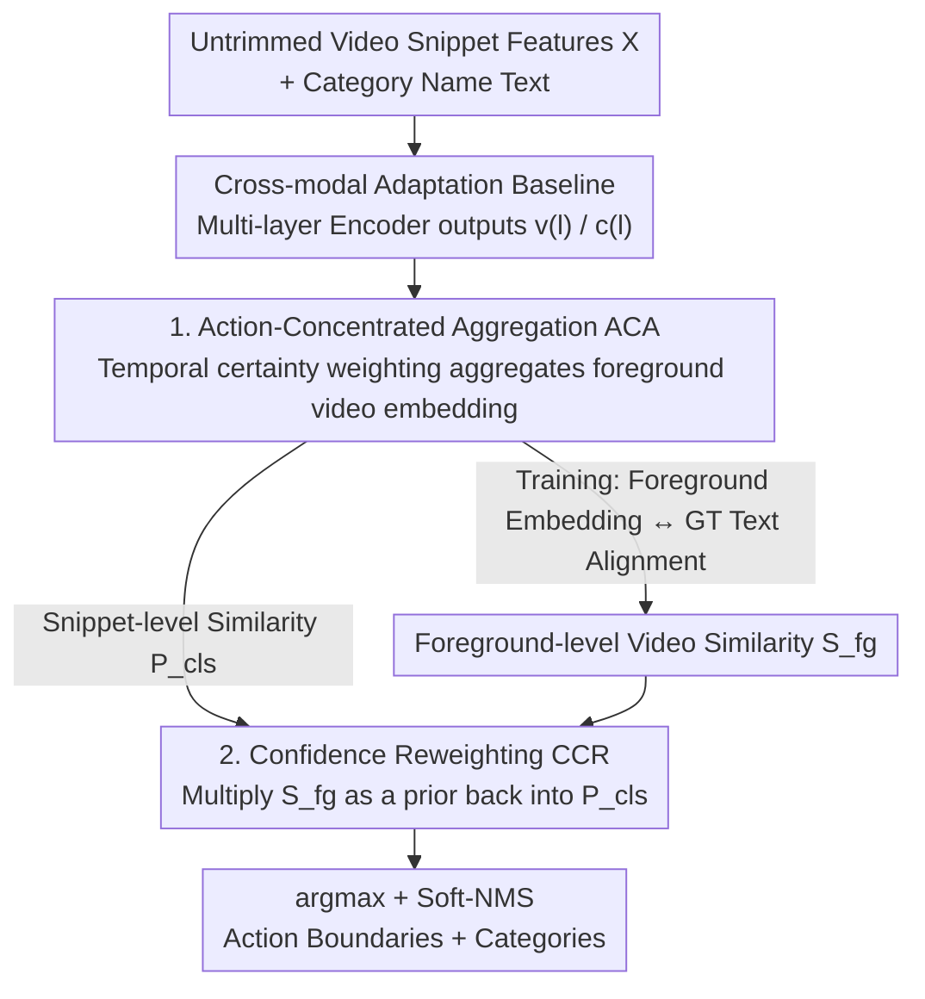

# TF-CADE: Foreground-Concentrated Text-Video Alignment for Zero-Shot Temporal Action Detection

**Conference**: CVPR 2026  
**Paper**: [CVF Open Access](https://openaccess.thecvf.com/content/CVPR2026/html/Lee_TF-CADE_Foreground-Concentrated_Text-Video_Alignment_for_Zero-Shot_Temporal_Action_Detection_CVPR_2026_paper.html)  
**Code**: None  
**Area**: Video Understanding  
**Keywords**: Zero-Shot Temporal Action Detection, Text-Video Alignment, Foreground Aggregation, Confidence Reweighting, ZSTAD

## TL;DR
Addressing the issue where "text does not influence predictions" in zero-shot temporal action detection, this paper introduces an Action-Concentrated Aggregation (ACA) module. ACA aggregates video features into a foreground video embedding based on temporal foreground saliency for explicit alignment with text. Furthermore, a Certainty-based Confidence Reweighting (CCR) mechanism injects video-level priors back into snippet-level classification scores to suppress semantically irrelevant action classes. This approach achieves SOTA performance on THUMOS14/ActivityNet in both in-distribution and cross-dataset zero-shot settings.

## Background & Motivation
**Background**: Zero-Shot Temporal Action Detection (ZSTAD) aims to locate and identify unseen action categories in untrimmed long videos. Leveraging the generalization capabilities of large-scale vision-language models like CLIP/ALIGN, the standard approach involves aligning text (category names) features with relevant temporal regions in the video. Current methods fall into two categories: foreground-based (extracting foreground candidates then aligning with text) and foreground-free (integrating text features directly into video features via bidirectional cross-attention). Ti-FAD is a leading SOTA representative of the foreground-free approach.

**Limitations of Prior Work**: Although foreground-free architectures employ text-video mutual enhancement, their predictions "barely look at the text." The authors conducted a diagnostic test: feeding the detector either the correct action name ("ThrowDiscus") or a nonsensical word ("XYZ"). The output category confidence distributions from Ti-FAD were nearly identical across all timestamps. This indicates that text input fails to provide substantial guidance, with predictions driven primarily by video features, leading to numerous "text-irrelevant predictions."

**Key Challenge**: The authors further investigated why text becomes ineffective. They hypothesized that cross-modal adaptation aligns text with the entire video feature containing both foreground and background. Since background regions often dominate visual representations in untrimmed videos, updated text features drift toward "background-biased visual patterns." A diagnostic experiment verified that when using only ground-truth foreground regions (removing all background), the resulting text features became significantly more discriminative (diagonalized cosine similarity heatmap). Conversely, using all regions resulted in high similarity across different action names. Conclusion: Background information interferes with the alignment between text and action-relevant visual patterns.

**Goal / Key Insight**: Since the problem stems from "text being forced to align with the background," the goal is to **explicitly align text only with action-relevant foreground regions** to avoid background-dominated drift.

**Core Idea**: Use a soft, temporally varying "action certainty" weight to aggregate video features into a foreground-concentrated video embedding for alignment during training. During inference, multiply this foreground-level video prior back into snippet-level classification scores to suppress semantically confused classes.

## Method

### Overall Architecture
TF-CADE is built upon the cross-modal adaptation baseline of Ti-FAD. The input consists of snippet-level features $X=\{x_t\}_{t=1}^{T_0}$ (extracted by backbones like I3D/VideoMAE/CoCa). These are projected into initial video embeddings $v^{(0)}$ via 1D convolution, while category names are processed by a frozen text encoder (CLIP/CoCa) to obtain initial text embeddings $c^{(0)}$. Both are updated layer-by-layer through multiple Encoder layers (self-attention + cross-modal cross-attention + FFN). The video side also undergoes temporal downsampling to form pyramid multi-scale features $v^{(l)}$ ($T_l=T_{l-1}/2$). Built on this backbone, the paper adds two modules: **Action-Concentrated Aggregation (ACA)** during training to produce a foreground-weighted video embedding aligned with ground-truth text, and **Certainty-based Confidence Reweighting (CCR)** during inference to apply the ACA-derived video-level similarity as a prior.

### Key Designs

**1. Action-Concentrated Aggregation (ACA): Soft-aggregating videos into a foreground embedding for text alignment**

This module directly addresses the "text forced to align with background" issue. It operates in two steps. First, it constructs a **Temporal Action Certainty Map**: at each layer $l$, video-text similarity $P_{\text{cls}} = v^{(l)} \cdot {c^{(l)}}^\top \in \mathbb{R}^{T_l \times N_c}$ is calculated. An initial certainty $m_{\text{max}}^{(l)} = \mathrm{softmax}(\max_{N_c}(P_{\text{cls}})) \in \mathbb{R}^{T_l}$ is derived by taking the maximum across categories—this map sharply concentrates on the most salient action frames. To prevent losing temporal context, a Gaussian kernel $G(\sigma)$ is used for 1D temporal smoothing: $m_{\text{filter}}^{(l)} = m_{\text{max}}^{(l)} \circledast G(\sigma)$, which suppresses noise and allows the weights to cover continuous action segments. The final certainty map is $m^{(l)} = m_{\text{max}}^{(l)} + m_{\text{filter}}^{(l)}$, normalized over time.

Second, this certainty map is used to **soft-aggregate** video features into a foreground-weighted embedding $v_{\text{fg}}^{(l)} = \sum_{t=1}^{T_l} m_t^{(l)} \odot v_t^{(l)} \in \mathbb{R}^{D}$. The cosine similarity between this and various text embeddings is averaged across $L$ layers to obtain the foreground-level video similarity:

$$S_{\text{fg}}^{(n)} = \frac{1}{L}\sum_{l=1}^{L} \mathrm{sim}(v_{\text{fg}}^{(l)}, c_n^{(l)}), \quad n=1,\dots,N_c$$

During training, $v_{\text{fg}}^{(l)}$ is aligned with its GT text via a video-level classification loss. This ensures text only aligns with "action-relevant regions selected by certainty weighting," minimizing background interference.

**2. Certainty-based Confidence Reweighting (CCR): Suppressing confused classes using foreground priors**

While ACA handles training alignment, standard inference still uses $P_{\text{cls}}$ for snippet-level classification, which may over-activate classes that are "visually similar but semantically irrelevant." CCR treats the foreground-level video similarity $S_{\text{fg}}$ from ACA as a **video-level prior**. It applies a softmax to $S_{\text{fg}}$ to estimate the likelihood of each class appearing in the video, then performs element-wise multiplication with snippet-level scores followed by a square root:

$$\tilde{P}_{\text{cls}} = \sqrt{\mathrm{sigmoid}(P_{\text{cls}}) \odot \mathrm{softmax}(S_{\text{fg}})} \in \mathbb{R}^{T_l \times N_c}$$

The intuition is that if the video-level prior suggests a class is unlikely to exist, local snippet-level similarities for that class will be suppressed, strengthening action-relevant categories. This is a zero-parameter inference-time reweighting that complements ACA.

### Loss & Training
The classification loss is $\mathcal{L}_{cls} = \mathcal{L}_{snippet} + \mathcal{L}_{video}$: $\mathcal{L}_{snippet}$ supervises snippet-level classification based on $P_{\text{cls}}$, while $\mathcal{L}_{video}$ aligns $S_{\text{fg}}$ with corresponding action categories; both use focal loss. The total objective is $\mathcal{L} = \mathcal{L}_{cls} + \mathcal{L}_{loc} + \mathcal{L}_{an}$, where the localization loss $\mathcal{L}_{loc}$ uses DIoU for boundary regression, and the actionness loss $\mathcal{L}_{an}$ uses focal loss. THUMOS14 is trained for 25 epochs, ActivityNet/HACS for 15 epochs, using Adam with a 5-epoch linear warmup and an initial lr of 0.0001 on a single A100.

## Key Experimental Results

### Main Results (In-distribution ZSTAD, Average mAP)
Strict zero-shot evaluation—comparing only with methods that do not rely on external classifiers (e.g., UntrimmedNet) for post-processing. The table below shows results on THUMOS14 and ActivityNet v1.3 under the "no external information" setting using I3D + CLIP-B features.

| Setting | Dataset | Metric | Ti-FAD | TF-CADE | Gain |
|------|--------|------|--------|---------|------|
| 50%-50% | THUMOS14 | Avg. mAP | 16.0 | **21.1** | +5.1 |
| 50%-50% | ActivityNet v1.3 | Avg. mAP | 7.4 | **10.5** | +3.1 |
| 75%-25% | THUMOS14 | Avg. mAP | 26.9 | **34.5** | +7.6 |
| 75%-25% | ActivityNet v1.3 | Avg. mAP | 13.7 | **17.2** | +3.5 |

Integrating the proposed modules into Ti-FAD (Ti-FAD + Ours) also consistently improves performance, demonstrating that ACA/CCR are transferable increments.

### Cross-dataset Generalization (Train ActivityNet → Test THUMOS14, Average mAP)
This setting better reflects zero-shot capability, where performance gaps widen significantly.

| Evaluation Split | Method | Avg. mAP |
|----------|------|----------|
| 50%-50% | Ti-FAD | 11.7 |
| 50%-50% | **TF-CADE** | **28.2** |
| 75%-25% | Ti-FAD | 13.0 |
| 75%-25% | **TF-CADE** | **26.1** |
| 0%-100% | T3AL | 9.6 |
| 0%-100% | Ti-FAD | 11.1 |
| 0%-100% | **TF-CADE** | **27.4** |

In the most difficult 0%-100% split (no training exposure to test classes), TF-CADE nearly doubles Ti-FAD's 11.1 mAP to 27.4.

### Ablation Study

| Configuration | THUMOS14 Avg. mAP | Note |
|------|-------------------|------|
| Baseline | 16.0 | Ti-FAD cross-modal baseline |
| + $\mathcal{L}_{video}$ (ACA alignment only) | 16.4 | Minimal gain with only foreground alignment |
| + CCR | 19.7 | Significant gain with only inference reweighting |
| + $\mathcal{L}_{video}$ & CCR (Full) | **21.1** | Best performance, showing complementarity |

Ablation on ACA internal design (50%-50% THUMOS14): Certainty-weighted aggregation (21.1) outperforms mean pooling (18.9). For the certainty map, $m_{\text{max}}+m_{\text{filter}}$ (21.1) is superior to using only peaks $m_{\text{max}}$ (20.7) or only smoothing $m_{\text{filter}}$ (19.6). Gaussian smoothing proves particularly beneficial in cross-dataset settings.

### Key Findings
- **CCR contributes more than ACA alignment alone, but they are strongly complementary**: $\mathcal{L}_{video}$ alone adds +0.4, CCR alone adds +3.7, and combined they add +5.1. The $S_{\text{fg}}$ trained via ACA provides a reliable global prior for CCR.
- **Cross-dataset gains are much larger than in-distribution gains**, confirming that effective text utilization is key to generalization. DETAD error analysis shows TF-CADE significantly reduces "wrong-label" tokens.
- Gaussian smoothing $\sigma$ is crucial for cross-dataset performance, suggesting that covering the temporal context of complete action segments is vital for unseen class localization.

## Highlights & Insights
- **Diagnostic experiments using "text-variant prediction invariant" tests** are highly persuasive. By showing the model outputs the same scores for "XYZ" as for correct labels, the authors pinpoint the "text-irrelevant prediction" problem directly.
- **Foreground alignment is achieved via soft certainty weights rather than pre-extracted proposals**: It maintains the end-to-end advantages of foreground-free methods while avoiding background drift.
- **CCR is a zero-parameter, plug-and-play prior**: The formula $\sqrt{\mathrm{sigmoid}(P_{\text{cls}}) \odot \mathrm{softmax}(S_{\text{fg}})}$ effectively uses global judgments to suppress local confusion, a paradigm potentially applicable to other open-vocabulary snippet classification tasks.
- The incremental nature of ACA/CCR on top of Ti-FAD suggests high practical value with low reproduction barriers.

## Limitations & Future Work
- The method remains built on the Ti-FAD cross-modal adaptation baseline. Foreground certainty is bootstrapped from current $v$-$c$ similarities; if the backbone's visual discriminability for unseen classes is weak, ACA may fail to correct it.
- The Gaussian kernel $\sigma$ is a critical hyperparameter. Excessive smoothing may blur boundaries, while insufficient smoothing reverts to peak-only weighting.
- The video-level prior in CCR assumes a limited number of classes per video. In scenarios with dense actions or many co-occurring classes, the softmax prior might over-suppress legitimate secondary classes.

## Related Work & Insights
- **vs Ti-FAD (SOTA foreground-free)**: Ti-FAD aligns text with entire videos, leading to background drift. Ours aligns text specifically with certainty-weighted foreground embeddings and adds CCR.
- **vs STALE (Foreground-based)**: Foreground-based methods extract proposals independently of text. Ours uses soft certainty weights for end-to-end "dynamic foreground aggregation."
- **vs T3AL (Training-free)**: T3AL relies on external captioning models (CoCa). Ours uses only category name prompts without external linguistics models, being lighter and more robust in cross-dataset scenarios.

## Rating
- Novelty: ⭐⭐⭐⭐ Precision in diagnosing "text-irrelevant predictions" and addressing them with soft alignment and video-level reweighting.
- Experimental Thoroughness: ⭐⭐⭐⭐ Extensive cross-dataset testing and detailed internal ablations.
- Writing Quality: ⭐⭐⭐⭐ Clear motivation supported by logical diagnostic experiments.
- Value: ⭐⭐⭐⭐ Significant cross-dataset improvements and modular applicability to existing detectors.

<!-- RELATED:START -->

## Related Papers

- [\[CVPR 2026\] CVA: Context-aware Video-text Alignment for Video Temporal Grounding](cva_context-aware_video-text_alignment_for_video_temporal_grounding.md)
- [\[CVPR 2026\] Decompose and Transfer: CoT-Prompting Enhanced Alignment for Open-Vocabulary Temporal Action Detection](decompose_and_transfer_cot-prompting_enhanced_alignment_for_open-vocabulary_temp.md)
- [\[CVPR 2026\] No Need For Real Anomaly: MLLM Empowered Zero-Shot Video Anomaly Detection](no_need_for_real_anomaly_mllm_empowered_zero-shot_video_anomaly_detection.md)
- [\[CVPR 2026\] Memory Matters: Boosting Training-Free Zero-Shot Temporal Action Localization with a Learnable Lookup Table](memory_matters_boosting_training-free_zero-shot_temporal_action_localization_wit.md)
- [\[CVPR 2026\] SkeletonContext: Skeleton-side Context Prompt Learning for Zero-Shot Skeleton-based Action Recognition](skeletoncontext_skeleton-side_context_prompt_learning_for_zero-shot_skeleton-bas.md)

<!-- RELATED:END -->
