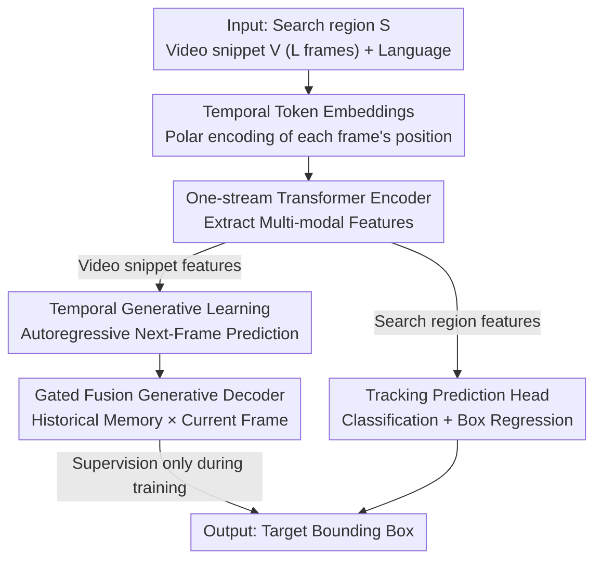

# TGTrack: Temporal Generative Learning for Unified Single Object Tracking

**Conference**: CVPR 2026  
**Paper**: [CVF Open Access](https://openaccess.thecvf.com/content/CVPR2026/html/Geng_TGTrack_Temporal_Generative_Learning_for_Unified_Single_Object_Tracking_CVPR_2026_paper.html)  
**Code**: https://github.com/wtg1/TGTrack  
**Area**: Video Understanding / Single Object Tracking  
**Keywords**: Single Object Tracking, Temporal Modeling, Generative Learning, Autoregressive Prediction, Unified Multi-modal Tracking

## TL;DR
TGTrack introduces a parallel generative supervision task of "predicting the next frame" into a unified single object tracking framework. By utilizing an autoregressive generative decoder with gated fusion and polar temporal tokens, it converts traditional implicit and passive temporal modeling into explicit and active temporal learning, achieving SOTA results across 11 benchmarks in 5 modalities (e.g., 75.3% AUC on LaSOT).

## Background & Motivation

**Background**: Single Object Tracking (SOT) aims to continuously localize a target in a video given an initial bounding box. Recent RGB trackers have leveraged powerful backbones and large-scale training, further expanding to unified tracking (e.g., SUTrack) which incorporates modalities like depth, thermal, event streams, and language descriptions within a single model.

**Limitations of Prior Work**: Most existing works focus on architecture design and multi-modal fusion, treating **temporal modeling as a byproduct**. Current temporal schemes are split into two camps: one relies on manual parameter-based template updates, which are sensitive to settings and generalize poorly; the other propagates a few temporal tokens between frames. Both suffer from the same issue—they only **implicitly** encode temporal information by feeding it into the input, **lacking explicit temporal supervision**. Consequently, models are never truly "taught" how targets and scenes evolve over time.

**Key Challenge**: Supervision in tracking is almost entirely spatial (template matching / current frame localization). There is no loss in the temporal dimension to constrain the model's understanding of frame-to-frame changes. This limits the model's ability to adapt to dynamic changes in target appearance and motion continuity.

**Goal**: To introduce a **temporal-aware learning objective** that explicitly forces the model to understand the temporal evolution of targets and scenes, validated under a unified multi-modal setting.

**Key Insight**: The authors approach this from a generative learning perspective—since generative models learn the evolutionary distribution of data, the tracker is tasked with **predicting future frame representations**. "Generation" is used as a form of temporal supervision (Note: the goal is not high-quality image synthesis, but using generation as a proxy task for temporal dynamics).

**Core Idea**: Aside from the standard tracking head, a parallel **autoregressive next-frame representation prediction** task is added. Combined with temporal tokens that distinguish "when," this shifts temporal modeling from "passive reception" to "active understanding."

## Method

### Overall Architecture

TGTrack follows a one-stream transformer architecture. The input consists of three branches: a search region $S$, a video snippet $V$ ($L$ frames acting as reference templates), and a language description. Following SUTrack, RGB and other modal images for $S$ and $V$ are concatenated along the channel dimension. $S$ and $V$ are processed via stride-16 patch embedding to obtain $P_s$ and $P_v$, while language descriptions pass through a CLIP text encoder and linear projection to get text embeddings $T$. After adding positional embeddings and **temporal token embeddings** to $P_v$, the three branches are flattened and concatenated into a sequence for multi-modal feature extraction via a transformer encoder.

The extracted features **diverge**: search region features are fed into a tracking prediction head for localization (classification + regression); video snippet features are fed into a **generative decoder** to autoregressively predict future frame representations for temporal supervision. Crucially, the generative decoder is only used during **training** and is **disabled during inference**, incurring no extra inference cost.

### Key Designs

**1. Temporal Generative Learning Paradigm: "Predicting the Next Frame" as Explicit Supervision**

This design addresses the lack of supervision in temporal modeling. TGTrack uses encoder features of the video snippet for an **autoregressive generation process**. The snippet contains $L$ frames (sparsely sampled to retain long-range context) processed sequentially: frame 2 is generated from frame 1, frame 3 from frames 1 and 2, and so on. At step $l$, the model predicts the representation of frame $l+1$ given the current and preceding $l-1$ frames. The prediction $\hat{V}_{t+1}$ is aligned with the ground truth representation using MSE: $L_{gen}=\frac{1}{L}\sum_{t=0}^{L}\lVert \hat{V}_{t+1}-V_{t+1}\rVert_2^2$, where the ground truth is obtained via patchification.

This differs from existing generative trackers (e.g., ARTrackV2), which use generation for "reconstructing target appearance and updating templates." TGTrack uses generation as a **temporal learning signal** to model frame-to-frame transitions, focusing on "internalizing temporal evolution" rather than synthesis fidelity.

**2. Gated Fusion Generative Decoder: Dynamic Integration of History and Current Frames**

The decoder solves the semantic decay of early frames (e.g., $t{=}1$) during autoregression. Built on transformer blocks, it introduces **Gated Fusion (GFM)**. It maintains a historical memory $H_0=0$. At each step, the current frame feature $F_t$ and previous memory $H_{t-1}$ are concatenated spatially as $Z_t=\text{concat}(H_{t-1},F_t)$, and a sigmoid gate $G_t=\sigma(W_g Z_t+b_g)$ performs adaptive fusion:

$$\tilde{F}_t = G_t \odot H_{t-1} + (1-G_t)\odot F_t$$

The fused $\tilde{F}_t$ is refined by transformer blocks to produce $F_t^{out}$, which updates the memory $H_t=F_t^{out}$ and is projected back to patch space via LayerNorm and a linear head for the next-frame prediction $\hat{V}_{t+1}=W_p\cdot \text{LN}(F_t^{out})+b_p$. This mechanism preserves early semantics, mitigating feature degradation.

**3. Temporal Token Embedding: Learnable Polar Coordinates for "When" Identity**

Most methods treat frame features as an unordered set. This design injects a unique temporal identity for each frame using a learnable base temporal token $t_0\in\mathbb{R}^C$ and **polar coordinate transformations** based on angles $\theta=\{\theta_1,...,\theta_L\}$:

$$T_t = \cos(\theta_t)\cdot t_0 + \sin(\theta_t)\cdot W(t_0)$$

Where $\theta_t\in[0,\frac{\pi}{2}]$ and $W$ is a learnable linear transformation. Angles are initialized uniformly but can be optimized during training to learn the optimal temporal spacing. $T_t$ is added to the positional and patch embeddings, unifying spatial and temporal order in the same embedding space with minimal overhead.

### Loss & Training

The total objective is a weighted sum: $L_{total}=\lambda_{cls}L_{cls}+\lambda_{\ell1}L_{\ell1}+\lambda_{G}L_{GIoU}+\lambda_{gen}L_{gen}$. Classification uses focal loss, and regression uses $\ell_1$ + GIoU. The generation loss $L_{gen}$ uses MSE. Default weights are $\lambda_{cls}{=}1,\lambda_{\ell1}{=}5,\lambda_{G}{=}2,\lambda_{gen}{=}0.1$. The small weight for generation prevents it from dominating the tracking task. Training uses AdamW for 180 epochs on 4×A100s, with RGB and multi-modal datasets joint-trained for generalization.

## Key Experimental Results

### Main Results (RGB-based, AUC / Key Metrics)

Evaluated across 5 modalities and 11 benchmarks; below is a selection from four large-scale RGB benchmarks.

| Method | Source | LaSOT AUC | LaSOText AUC | TrackingNet AUC | GOT-10k AO |
|------|------|-----------|--------------|-----------------|------------|
| **TGTrack-L384** | Ours | **76.4** | **55.9** | **88.0** | **81.8** |
| TGTrack-B384 | Ours | 75.3 | 54.8 | 87.5 | 79.8 |
| TGTrack-S224 (35M) | Ours | 72.9 | 52.4 | 85.3 | 77.2 |
| SUTrack-L384 | AAAI25 | 75.2 | 53.6 | 87.7 | 81.5 |
| SUTrack-B384 | AAAI25 | 74.4 | 52.9 | 86.5 | 79.3 |
| ARTrackV2-256 | CVPR24 | 71.6 | 50.8 | 84.9 | 75.9 |
| AQATrack-256 | CVPR24 | 71.4 | 51.2 | 83.8 | 73.8 |

TGTrack-L256 achieved 75.8% AUC on LaSOT, surpassing the unified SUTrack-L224 by 2.3%. On DepthTrack, TGTrack-L384 reached 67.5% F-score (outperforming STTrack by 4.2%).

### Ablation Study (TGTrack-B256, AUC; DepthTrack in F-score, Δ is average change)

| # | Configuration | LaSOT | DepthTrack | LasHeR | TNL2K | Δ |
|---|------|-------|-----------|--------|-------|---|
| 1 | Baseline (Full) | 74.6 | 65.5 | 61.7 | 65.4 | – |
| 2 | w/o Gen. Decoder GD | 73.6 | 63.5 | 60.2 | 64.2 | -1.50 |
| 3 | w/o Temporal Token TTE | 74.3 | 65.1 | 61.3 | 64.8 | -0.44 |
| 4 | w/o (GD + TTE) | 73.4 | 61.6 | 59.0 | 63.8 | -2.36 |
| 5 | w/o Gated Fusion GFM | 74.0 | 64.5 | 60.9 | 64.5 | -0.84 |
| 6 | Non-learnable TTE | 74.1 | 64.6 | 61.6 | 65.0 | -0.58 |
| 7 | Predict current frame (not next) | 73.9 | 63.9 | 60.9 | 64.6 | -0.90 |

### Key Findings
- **Generative Decoder is the primary contributor**: Removing it drops performance by 1.50% on average.
- **Direction of prediction matters**: Switching to current-frame prediction (config #7) drops performance by 0.90%, proving that next-frame prediction is essential for capturing temporal dynamics.
- **Zero Inference Overhead**: The generative decoder is discarded after training. TGTrack-T224 runs at 26 FPS on an Intel i9 CPU while outperforming larger lightweight trackers.

## Highlights & Insights
- **Repositioning Generation as a Supervision Signal**: Unlike ARTrackV2 (template update), TGTrack uses generation to force the model to learn frame-to-frame transitions.
- **Training-time Augmentation, Zero-cost Inference**: The "scaffolding" nature of the generative decoder provides robustness during training without slowing down inference.
- **Polar Temporal Tokens**: Using $\cos/\sin$ rotations ensures structural consistency across frames while providing unique encoding, allowing the model to learn temporal intervals.

## Limitations & Future Work
- The additional **VRAM/training time overhead** of the autoregressive generative branch is not fully discussed.
- The use of 5 sparsely sampled frames might not be sufficient for **extremely fast motion** or ultra-long-range appearance changes.
- Since supervision is MSE-based on patch representations, it may favor "smooth/low-frequency" predictions over high-frequency temporal details.

## Related Work & Insights
- **vs SUTrack (Unified Tracking)**: While SUTrack unified 5 modalities, TGTrack adds explicit temporal generative supervision, outperforming it by 1-2% on LaSOT with similar parameters.
- **vs Template Update (Manual)**: Instead of manual parameter-sensitive updates, TGTrack injects temporal knowledge through learnable generative tasks.
- **vs Token Propagation (ODTrack/STTrack)**: TGTrack provides an **explicit supervision signal** via next-frame prediction, significantly outperforming STTrack on DepthTrack.

## Rating
- Novelty: ⭐⭐⭐⭐ Repositioning generation as a temporal supervision signal with polar tokens is a clear and effective insight.
- Experimental Thoroughness: ⭐⭐⭐⭐⭐ Comprehensive evaluation across 5 modalities, 11 benchmarks, and extensive ablation studies.
- Writing Quality: ⭐⭐⭐⭐ Motivations and methodology are well-articulated.
- Value: ⭐⭐⭐⭐ The training-time-only enhancement paradigm is practical and sets a new unified SOT SOTA.

<!-- RELATED:START -->

## Related Papers

- [\[CVPR 2026\] UETrack: A Unified and Efficient Framework for Single Object Tracking](uetrack_a_unified_and_efficient_framework_for_single_object_tracking.md)
- [\[CVPR 2026\] Generative Point Tracking and Forecasting](generative_point_tracking_and_forecasting.md)
- [\[CVPR 2026\] Toward Low-Cost yet Effective Temporal Learning for UAV Tracking](toward_low-cost_yet_effective_temporal_learning_for_uav_tracking.md)
- [\[CVPR 2026\] CaptionFormer: Unified Segmentation, Tracking, and Captioning for Spatio-Temporal Objects](captionformer_unified_segmentation_tracking_and_captioning_for_spatio-temporal_o.md)
- [\[CVPR 2026\] Drift-Resilient Temporal Priors for Visual Tracking](drift-resilient_temporal_priors_for_visual_tracking.md)

<!-- RELATED:END -->
