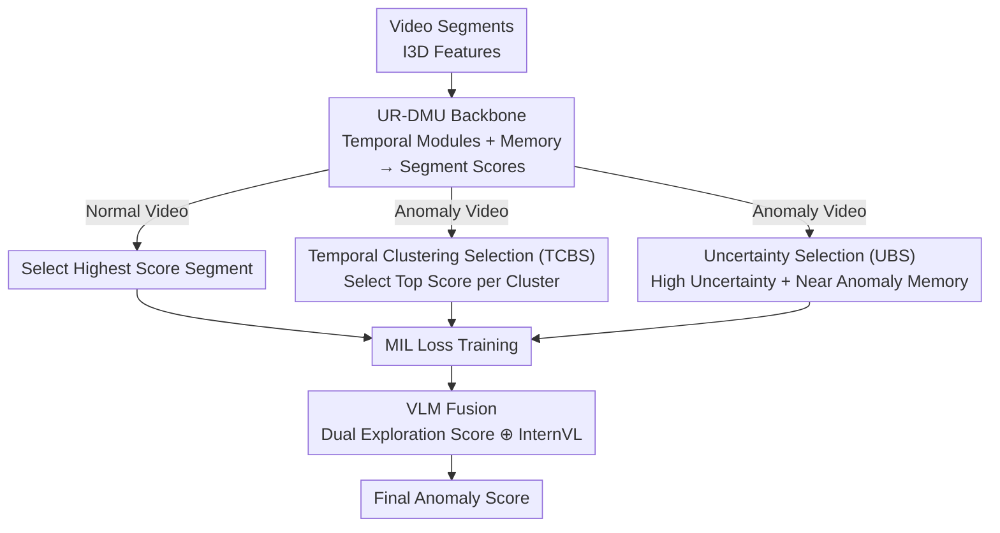

# The Road Less Seen: Segment Exploration for Weakly Supervised Video Anomaly Detection

**Conference**: CVPR 2026  
**Paper**: [CVF Open Access](https://openaccess.thecvf.com/content/CVPR2026/html/Acharya_The_Road_Less_Seen_Segment_Exploration_for_Weakly_Supervised_Video_CVPR_2026_paper.html)  
**Code**: To be confirmed  
**Area**: Video Understanding  
**Keywords**: Weakly Supervised Video Anomaly Detection (WSVAD), Multiple Instance Learning (MIL), Segment-level Exploration, Uncertainty Sampling, VLM Fusion

## TL;DR
Addressing the issue where top-k selection in WSVAD focuses only on the highest-scoring segments and misses dispersed or vague anomalies, this paper proposes a **Temporal Clustering + Uncertainty Dual Exploration** strategy to cover diverse and ambiguous anomaly segments. It advocates using Recall@FPR and AP to replace AUROC, which is heavily "inflated" by class imbalance, improving AP on UCF-Crime from 35.48% to 38.33%.

## Background & Motivation
**Background**: Weakly Supervised Video Anomaly Detection (WSVAD) uses only video-level labels for training. The mainstream framework is Multiple Instance Learning (MIL), treating anomaly videos as "positive bags" containing at least one anomaly segment and normal videos as "negative bags." During training, top-1 or top-k selection picks the highest-scoring segments in positive bags to calculate losses, aiming to widen the anomaly score gap between positive and negative segments. Evaluation predominantly relies on AUROC.

**Limitations of Prior Work**: The authors expose a widely overlooked fact—**High AUROC is an illusion**. In extremely imbalanced scenarios where normal segments far outnumber anomalies, AUROC measures the probability that a model ranks a random positive sample higher than a random negative one. If a large number of normal segments are correctly ordered, the score remains high even if recall collapses. Empirical tests show that UR-DMU achieves an AUROC of 0.8697 on UCF-Crime but misses approximately 15,000 anomaly segments at usable FPR thresholds; conversely, VadCLIP achieves higher recall but generates over 290k false positives, nearly double that of UR-DMU, making both practically unusable.

**Key Challenge**: The root cause of low recall lies in the **bias of the top-k selection strategy itself**. A fixed $k$ is too rigid (actual anomaly segment counts vary by video); high-scoring segments tend to cluster within a narrow time window, causing top-k to miss temporally dispersed events; furthermore, this strategy naturally favors high-motion, easy-to-classify "simple" segments, ignoring subtle or complex anomalies. Even with mitigations like DRO (adaptive $k$) or Unbiased MIL (clustering segments into confident/ambiguous sets), selection still depends on the highest anomaly scores, and Unbiased MIL assumes all anomalies are semantically similar, failing to cover diverse anomaly patterns.

**Goal**: To enable the model to **systematically explore all potential anomaly segments in positive bags during training**, rather than focusing only on the highest-scoring ones—covering temporally dispersed and semantically diverse events while accounting for low-scoring but ambiguous segments.

**Key Insight**: The authors reframe "segment selection" as an **exploration problem**. Since hard exploration (like reinforcement learning) is unfeasible without segment-level supervision, they design a "soft exploration" mechanism—using clustering to ensure diversity and predictive uncertainty to mine ambiguous samples, making the two paths complementary.

**Core Idea**: Replace top-k with a dual exploration of "**Temporal Clustering for diversity + Uncertainty for ambiguity**." This is supplemented by a training-free VLM prediction to safeguard against truly novel/unseen anomalies, while replacing AUROC with Recall@FPR and AP for more practical evaluation.

## Method

### Overall Architecture
The method is built on an MIL training framework: segment-level features are extracted using Kinetics-pretrained I3D, processed through the global-local temporal module and memory units of UR-DMU, and a classifier outputs segment-level anomaly scores. The core modification occurs during segment selection for MIL loss calculation. **Normal videos still select only the highest-scoring segments** (encouraging the suppression of all scores), while **anomaly videos undergo Dual Exploration**: one path is Temporal Clustering Based Selection (TCBS) to pick one high-scoring segment per cluster for event diversity; the other is Uncertainty Based Selection (UBS) to pick low-scoring segments with high predictive uncertainty that are similar to "anomaly memory." Scores from both paths are fused with training-free predictions from a VLM (InternVL3) during inference.

### Key Designs

**1. Temporal Clustering Based Selection (TCBS): Ensuring Diverse Event Coverage**

This component addresses the "concentration bias" of top-k selection. It performs online clustering based on **feature similarity and temporal proximity**: the first segment initializes the first cluster; subsequently, if a segment's cosine similarity $S(\mathbf{x}_i,\mathbf{x}_j)=\frac{\mathbf{x}_i^\top \mathbf{x}_j}{\|\mathbf{x}_i\|\|\mathbf{x}_j\|}$ with the representative feature of the previous cluster exceeds a threshold $\tau_s$, it is merged; otherwise, a new cluster is formed. Each cluster approximates a "scene/event." The threshold $\tau_s$ is **adaptive**, set as the $q$-quantile (e.g., $q=0.03$) of the adjacent segment similarity distribution within each video. Violent scenes (e.g., explosions) have low adjacent similarity and trigger more clusters; subtle anomalies (e.g., theft) have high similarity and fewer clusters. Selection picks the segment with the **highest anomaly score exceeding a dynamic threshold $\tau_a$** from each cluster: $\mathcal{K}=\bigcup_{i=1}^{H}\{k:k=\arg\max_{j\in C_i}p_j,\ f(\mathbf{x}_k^+)\ge\tau_a\}$.

**2. Uncertainty Based Selection (UBS): Mining Ambiguous Segments**

Clustering may still miss anomaly segments whose **scores are too low to pass the threshold**. The authors observe that such segments often exhibit **high predictive uncertainty**. They use an ensemble of $M$ differently initialized models, using the standard deviation of anomaly scores across models as the segment-level uncertainty $u_i$. To filter out normal segments from high-uncertainty ones, they apply an **anomaly memory similarity** filter: the candidate set $\mathcal{U}$ must satisfy (i) $u_i>\tau_u$ and (ii) a mean cosine similarity with anomaly memory $\frac{1}{|AM|}\sum_j S(\mathbf{x}_i^+,\mathbf{x}_j^{AM})>\tau_s^m$. For segments in $\mathcal{U}$, the target score is set to 1 for BCE loss: $\mathcal{L}_{UNC}=\frac{1}{|\mathcal{U}|}\sum_{i\in\mathcal{U}}\text{BCE}(f(\mathbf{x}_k^+),1)$. This mechanism provides an implicit "annealing" effect: early in training, memory is random, so few segments are selected; as the model learns patterns, similarity increases, and the segments are optimized until their uncertainty drops.

**3. VLM Knowledge Fusion: Using Large Models to Catch Novel Anomalies**

UBS relies on anomaly memory, which represents models' priors of seen anomalies. **Truly novel or unseen anomalies** may still be missed. The authors leverage the generalization of InternVL3—**without fine-tuning**. They use structured prompts for zero-shot inference, averaging multiple outputs for a VLM confidence score $y_{VLM}$, which is then fused with the dual exploration score $y_{Dual}$: $y_{combined}=\lambda\,y_{Dual}+(1-\lambda)\,y_{VLM}$, where $\lambda\in[0,1]$. Findings suggest VLMs offer better recall at very low FPR but have poor overall ranking, making them suitable only for fusion.

### Loss & Training
The total loss sums the MIL loss, uncertainty selection loss, and the UR-DMU baseline loss: $\mathcal{L}_{Dual}=\mathcal{L}_{MIL}+\gamma\,\mathcal{L}_{UNC}+\mathcal{L}_{URDMU}$. $\mathcal{L}_{MIL}=\text{BCE}(y, \hat{y})$ is calculated using predictions from TCBS. Uncertainty $u_i$ is updated every epoch, and $\gamma$ controls the weight of $\mathcal{L}_{UNC}$.

## Key Experimental Results

### Main Results
Evaluated on UCF-Crime and XD-Violence using **AP (Area Under PR Curve) and Recall@FPR** (recall at a fixed false positive rate $\alpha$) instead of AUROC to better reflect real-world constraints.

| Dataset | Metric | Ours (Dual+InternVL) | UR-DMU | VadCLIP | InternVL3-14B (Zero-shot) |
|--------|------|------|--------|---------|------|
| UCF-Crime | AP (%) | **38.33** | 35.48 | 33.55 | 29.50 |
| UCF-Crime | Recall@FPR=2% | **0.263** | 0.170 | 0.155 | 0.301 |
| UCF-Crime | Recall@FPR=3% | **0.336** | 0.212 | 0.217 | 0.418 |
| XD-Violence | AP (%) | **84.58** | 79.14 | 84.50 | 69.85 |
| XD-Violence | Recall@FPR=5% | **0.715** | 0.638 | 0.672 | 0.637 |

Ours achieves the highest AP on both datasets. Zero-shot InternVL shows high recall at extremely low FPR (validating its use as a backstop) but low AP due to poor overall ranking.

### Ablation Study
| Baseline | TCBS | UBS | VLM | AP (%) | Recall@FPR=3% |
|:--:|:--:|:--:|:--:|:--:|:--:|
| ✓ | | | | 35.48 | 0.212 |
| ✓ | ✓ | | | 34.25 | 0.207 |
| ✓ | | ✓ | | 34.58 | 0.243 |
| ✓ | ✓ | ✓ | | 36.42 | 0.256 |
| ✓ | ✓ | ✓ | ✓ | **38.33** | **0.336** |

### Key Findings
- **TCBS and UBS individually slightly decrease AP, but their synergy exceeds the baseline (36.42)**: This indicates that diversity exploration and ambiguity exploration are complementary; neither alone covers the anomaly spectrum.
- **VLM fusion provides the largest marginal gain**: Adding InternVL boosts AP from 36.42% to 38.33%, primarily by capturing novel anomalies missed by the memory unit.
- **Performance is highly uneven across event types**: Strong performance on Burglary (AUROC 0.89) but weak on Explosion (0.47), which remains a hurdle.
- **Misleading AUROC**: On UCF-Crime, a 5% FPR translates to over 50,000 false positives (~50 videos), which is unacceptable in practice, necessitating a focus on recall at low FPR.

## Highlights & Insights
- **Metric "Myth-Busting"**: The primary contribution is identifying that AUROC provides overly optimistic illusions in safety-critical, imbalanced scenarios.
- **Reframing Selection as Exploration**: The dual-path design specifically targets two distinct biases of top-k selection.
- **Implicit Annealing**: Using memory similarity dynamics to achieve a "low selection early, high selection late" schedule without an explicit scheduler.
- **Zero-shot VLM backstop**: A lightweight, low-cost way to utilize large model generalization for open-set anomalies.

## Limitations & Future Work
- **Weak on Sudden/Subtle Anomalies**: Performance on "Explosion" remains low; temporal clustering may over-segment violent scenes.
- **Hyperparameter Sensitivity**: Numerous parameters such as $\tau_s, \tau_a, \tau_u, \tau_s^m, q, \gamma, \lambda$ require careful tuning. Robustness across datasets is yet to be fully proven.
- **Computational Cost**: UBS requires $M$ ensemble models, increasing training overhead.

## Related Work & Insights
- **vs RTFM / top-k**: These pick high-scoring segments; Ours uses temporal clustering to ensure event diversity and uncertainty to salvage low-scoring ambiguous segments.
- **vs Unbiased MIL**: Unbiased MIL assumes semantic similarity; Ours utilizes temporal clustering to explicitly ensure cross-event diversity and VLMs for novel anomaly detection.
- **vs VadCLIP**: CLIP-based methods often trigger explosive false positives; Ours uses VLM as a frozen backstop to improve recall without ruining overall ranking.

## Rating
- Novelty: ⭐⭐⭐⭐☆
- Experimental Thoroughness: ⭐⭐⭐⭐☆
- Writing Quality: ⭐⭐⭐⭐☆
- Value: ⭐⭐⭐⭐⭐ (The emphasis on practical recall metrics is highly significant for deployment).

<!-- RELATED:START -->

## Related Papers

- [\[CVPR 2026\] Learning from Noisy Supervision: A Denoising-Debiasing Framework for Weakly Supervised Video Anomaly Detection](learning_from_noisy_supervision_a_denoising-debiasing_framework_for_weakly_super.md)
- [\[CVPR 2026\] Weakly Supervised Video Anomaly Detection with Anomaly-Connected Components and Intention Reasoning](weakly_supervised_video_anomaly_detection_with_anomaly-connected_components_and_.md)
- [\[CVPR 2026\] TLMA: Mitigating the Impact of Weakly Labeled Information for Video Anomaly Detection](tlma_mitigating_the_impact_of_weakly_labeled_information_for_video_anomaly_detec.md)
- [\[CVPR 2026\] Joint Learning of General and Diverse Patterns with Mixture of Memory Experts for Weakly-Supervised Video Anomaly Detection](joint_learning_of_general_and_diverse_patterns_with_mixture_of_memory_experts_fo.md)
- [\[AAAI 2026\] RefineVAD: Semantic-Guided Feature Recalibration for Weakly Supervised Video Anomaly Detection](../../AAAI2026/video_understanding/refinevad_semantic-guided_feature_recalibration_for_weakly_supervised_video_anom.md)

<!-- RELATED:END -->
