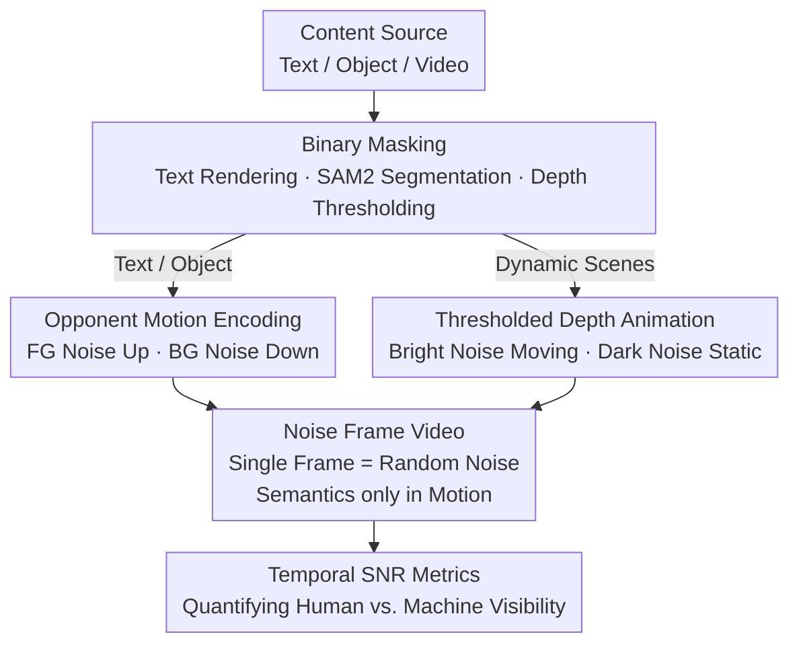

# Time Blindness: Why Video-Language Models Can't See What Humans Can?

**Conference**: CVPR 2026  
**Paper**: [CVF Open Access](https://openaccess.thecvf.com/content/CVPR2026/html/Upadhyay_Time_Blindness_Why_Video-Language_Models_Cant_See_What_Humans_Can_CVPR_2026_paper.html)  
**Code**: https://timeblindness.github.io/ (Project page containing dataset and generator)  
**Area**: Video Understanding  
**Keywords**: Temporal Reasoning, Video-Language Models, Diagnostic Benchmark, Motion Perception, SpookyBench

## TL;DR
Authors constructed SpookyBench, a synthetic benchmark where information exists "purely in inter-frame temporal dynamics while single frames are total noise." While humans can read text or identify objects with 98% accuracy using motion grouping, 15 state-of-the-art Video-VLMs (including GPT-4o, Gemini 2.5 Pro, and Qwen2.5-VL-72B) all achieved 0% accuracy. This clearly exposes a "time blindness" in current video models—they rely on per-frame spatial features and lack mechanisms for processing pure temporal information.

## Background & Motivation
**Background**: Mainstream Video-VLMs follow a "layered" paradigm: extracting spatial features for each frame using a ViT, integrating these features along the temporal dimension, and finally aligning with language for tasks like action recognition, video QA, and temporal localization. This approach achieves high scores on conventional video understanding benchmarks.

**Limitations of Prior Work**: The issue is that many tasks labeled as "temporal" can be solved using strong spatial cues from a single frame—identifying "a person playing basketball" often requires only one frame. Existing benchmarks **entangle** spatial and temporal cues, allowing models to achieve high scores via spatial shortcuts, making it impossible to judge actual temporal reasoning capability.

**Key Challenge**: When information exists **purely** in the temporal dimension and single frames provide no reliable spatial features, this "spatial-first, temporal-auxiliary" architecture fails completely. However, no existing benchmark has isolated and tested such pure temporal scenarios.

**Goal**: To create a test set that completely removes spatial cues, where information can only be extracted from "how things change between frames," thereby independently measuring the pure temporal perception of models and verifying the human-machine gap and its architectural roots.

**Key Insight**: Drawing from the Gestalt principle of "common fate" in cognitive neuroscience—where the human brain automatically groups pixels moving in the same direction—humans can achieve figure-ground segregation through motion alone. If foreground and background noise move in opposite directions, humans "see" the content, whereas models inspecting frames individually see only random noise.

**Core Idea**: Encode text/objects into video using "opponent motion binary noise," where single frames are noise and content only emerges during playback. This constructs the first **purely temporal** benchmark to diagnose time blindness in Video-VLMs.

## Method
As a diagnostic benchmark and analysis paper, the "Method" refers to **how SpookyBench was constructed** and the metrics used to **prove failure stems from architecture rather than data**. Overall: Take source content (text / object / video) → convert to binary mask → apply temporal encoding with noise (two motion configurations) → output a noise-frame video where content only emerges in the sequence; accompanied by temporal SNR metrics to quantify visibility.

### Overall Architecture
SpookyBench consists of 451 videos across three categories: Text (210 videos, 46.6%), Objects (184 videos, 40.8%), and Dynamic Scenes (57 videos, 12.6%). All videos are 960×540, averaging 7.11 seconds and 333.5 frames. Content follows two encoding paths into the same "noise-frame video" format, ensuring: **any single frame is structured noise, with semantics residing only in inter-frame motion.**

### Key Designs

**1. Opponent Motion Encoding: Making text/objects emerge only during playback**

To satisfy the constraint that "single frames must not leak spatial information," authors use **reciprocal motion** for text and objects (Algorithm 1). Content is converted to a binary mask $M$, where $M(x,y)=1$ is foreground and $=0$ is background. Two independent binary noises $N_{fg}$ and $N_{bg}$ are generated. During animation, foreground pixels are sampled with a positive temporal offset $F_t(x,y)=N_{fg}(x,\, y+vt \bmod h)$, while background pixels use a negative offset $F_t(x,y)=N_{bg}(x,\, y-vt \bmod h)$. The human brain groups pixels moving in the same direction ("common fate"), making content "grow" out of the noise. If the video is paused, both regions appear as static random noise, and content disappears. This purposefully defeats any encoder relying purely on per-frame spatial features.

**2. Thresholded Depth Map Animation: Turning real videos into pure temporal stimuli**

Authors also cover dynamic scenes from real videos using a second configuration (Algorithm 2). Using Video Depth Anything, depth maps $D$ are extracted from LaSOT and OTB2015 tracking datasets. Pixels with brightness within a threshold $t_l \le d \le t_u$ (usually the foreground object) are given a time-varying offset $N(x,\,y+vt \bmod h)$, while pixels outside (background) remain static noise $N(x,y)$. The foreground moves through noise over time while the background stays still, again ensuringsemantics are only visible through motion. Noise granularity (1×1 to 3×3 blocks) and density (10%–90%) were varied to study perception.

**3. Temporal SNR Metric System: Quantifying human vs. machine visibility**

To define the strength of temporal content, five SNR metrics were introduced (Table 2). **Base SNR** measures the energy of motion boundaries relative to static frame variance:

$$SNR_B = 10\log_{10}\!\left(\frac{P_S}{P_N}\right),\quad P_S = \mathbb{E}[\lVert\nabla F\rVert^2],\ P_N = \mathrm{Var}(I_0)$$

where $F$ is the optical flow field and $I_0$ is a static frame. **Perceptual SNR** ($SNR_P$) weights the Fourier domain with contrast sensitivity $W(f)=f\,e^{-f/f_0}$ (peak $f_0\approx0.1$ cycles/pixel) to mimic human eye frequency response. **Temporal Consistency SNR** ($SNR_T$) uses a directional consistency map $C=e^{-\mathrm{Var}_\theta(F)}\cdot\mathbb{1}(\lVert F\rVert>\tau)$ to quantify motion stability. **Motion Contrast SNR** ($SNR_M$) measures the difference in average optical flow vectors between foreground and background. These metrics reveal that while dynamic scenes have high consistency (21.91 dB), their motion contrast is low (-3.18 dB), explaining human perception difficulties—information that models cannot utilize.

### Example: A "BASKETBALL" Text Video
The word "basketball" is rendered as a binary mask. Foreground noise moves up, background noise moves down. **Per-frame screenshots**: Every frame is 960×540 black-and-white snow; neither humans nor models see anything. **Continuous playback**: Within 1 second, the human brain groups the "upward moving pixels," and "BASKETBALL" emerges. Annotators gave it 4.8/5 recognizability and ~98% accuracy. GPT-4o, whether given direct prompts or Chain-of-Thought, produces output consistent with single-frame noise—0% accuracy.

## Key Experimental Results

### Main Results
Accuracy of 15 SOTA Video-VLMs on SpookyBench compared to human baseline (Abridged Table 1):

| Model | Direct Prompt Acc | CoT Acc | Scale |
|------|------|------|------|
| Humans | **98.0% ± 0.6** | N/A | N/A |
| Qwen2.5-VL-72B-Instruct | 0% ± 0.0 | 0% ± 0.0 | 72B |
| InternVL2.5-78B | 0% ± 0.0 | 0% ± 0.0 | 78B |
| InternVideo2.5-Chat-8B | 0% ± 0.0 | 0% ± 0.0 | 8B |
| Gemini 2.5 Pro | 0% ± 0.0 | 0% ± 0.0 | N/A |
| Gemini 2.0 Flash | 0% ± 0.0 | 0% ± 0.0 | N/A |
| GPT-4o | 0% ± 0.0 | 0% ± 0.0 | N/A |

Accuracy is calculated via exact match, with object/dynamic categories allowing a set of acceptable labels $Y_i$:

$$\text{Accuracy} = \frac{1}{N}\sum_{i=1}^{N}\mathbb{1}(r_i \in L_i)$$

Even with LLM-as-judge and human verification, all models scored 0%—a complete failure across architectures, parameter scales (2B to 78B), and pre-training strategies.

### Ablation Study
Control experiments were used to rule out non-architectural explanations (Abridged Tables 4 and 5):

| Configuration | Key Result | Description |
|------|---------|------|
| 1→30 FPS | Humans 95%+ (20-30FPS), VLM 0% | Sampling rate is not the bottleneck |
| Finetuning on 400 samples (InternVL2.5-8B/Qwen2-VL-7B) | Still 0% | Rules out "out-of-distribution" hypothesis |
| VJEPA-2 / DINOv3 Binary Classification | Loss stuck at 0.7, Acc ~50% | Single frame features cannot learn discriminative reps |
| Qwen2-VL-7B + Motion Boundary Enhancement | 0% → **51.54%** | Solvable when temporal is turned into spatial |
| GPT-4o + Motion Boundary Enhancement | 0% → **59.10%** | Text sub-category rose to 56.19% |

### Key Findings
- **Failure is architectural, not data/sampling related**: Changing FPS or finetuning for 30 epochs failed to improve results from 0%. Self-supervised models like VJEPA-2/DINOv3 could not even overfit to a binary "is there a foreground" task, proving the information is absent in individual frames.
- **Motion boundary enhancement is the "smoking gun"**: By pre-calculating motion boundaries using classical optical flow and overlaying them on noise frames—turning implicit temporal info into explicit spatial cues—performance jumped from 0% to ~50-60%. This proves the task is solvable and models can process the content once it is provided spatially; the missing link is the **inter-frame differentiation/motion extraction** mechanism.
- **Binary Threshold Phenomenon**: Text detection accuracy remains near 0% when SNR is below 2.5 dB but jumps to 85.7% once the threshold is crossed. This step-function behavior is a safety concern for autonomous systems (e.g., slight noise could make a road sign completely unreadable).
- **Dynamic scenes benefit less from enhancement** (only 1.75%–3.51%), indicating that pure temporal decoding of real-world motion is significantly harder than static text.

## Highlights & Insights
- **Clearing spatial cues via opponent motion noise** provides a clean experimental control. It isolates "whether the model understands time" from entangled benchmarks, showing a stark 0% vs 98% contrast with no room for ambiguous interpretations.
- **The "0% to 59% enhancement" jump is a masterstroke**: Whereas many benchmarks simply report that models fail, this paper proves the information is computationally extractable and usable by the model—the failure lies precisely in the lack of an integrated temporal extraction mechanism.
- **Applying "common fate" from neuroscience** turns a cognitive hypothesis into a quantifiable engineering benchmark, a cross-disciplinary approach that could be reused to diagnose other "human-easy, machine-hard" capabilities.

## Limitations & Future Work
- **Diagnosis without prescription**: The paper identifies the lack of inter-frame differentiation/motion integration but does not propose a new architecture to solve it.
- **Synthetic and narrow tasks**: The content is limited to text/objects/tracking scenes. Identifying 1-5 words is a narrow task compared to complex real-world temporal reasoning (interaction, long-term causality).
- **Human baseline scale**: The human study used a small sample (6 annotators), and human performance also drops to 0% at 1 FPS—the conclusion holds only at sufficient temporal resolution.
- **Future Directions**: Explicitly injecting motion boundaries or designing dedicated distributed temporal channels rather than relying on spatial integration.

## Related Work & Insights
- **vs TemporalBench / TVBench / VITATECS**: These also aim to test temporal reasoning but allow spatial shortcuts. SpookyBench is the first **purely temporal** benchmark by completely erasing spatial information.
- **vs ARC-AGI**: Shares the philosophy of using synthetic, controlled stimuli to isolate a core capability (abstraction for ARC, temporal extraction for this work) rather than indirect evaluation on messy natural data.
- **vs Temporal Modeling Improvements (TimeChat / Segment Reasoning / Temporal Tokens)**: These are mostly "patches" on the spatial-first paradigm; this paper proves such patches fail when single frames lack reliable spatial features.

## Rating
- Novelty: ⭐⭐⭐⭐⭐ Extremely clean exposure of "time blindness" via opponent motion noise.
- Experimental Thoroughness: ⭐⭐⭐⭐⭐ 15 models plus extensive controls (FPS, finetuning, probes, enhancement).
- Writing Quality: ⭐⭐⭐⭐ Clear logical chain and solid neuroscience motivation.
- Value: ⭐⭐⭐⭐⭐ Pointed out a significant flaw in video understanding that mainstream benchmarks have long obscured.

<!-- RELATED:START -->

## Related Papers

- [\[CVPR 2026\] Do You See What I Am Pointing At? Gesture-Based Egocentric Video Question Answering](do_you_see_what_i_am_pointing_at_gesture-based_egocentric_video_question_answeri.md)
- [\[CVPR 2025\] Video Streaming Thinking: VideoLLMs Can Watch and Think Simultaneously](../../CVPR2025/video_understanding/video_streaming_thinking_videollms_can_watch_and_think_simultaneously.md)
- [\[CVPR 2026\] StreamReady: Learning What to Answer and When in Long Streaming Videos](streamready_learning_what_to_answer_and_when_in_long_streaming_videos.md)
- [\[CVPR 2026\] Understanding Temporal Logic Consistency in Video-Language Models through Cross-Modal Attention Discriminability](understanding_temporal_logic_consistency_in_video-language_models_through_cross-.md)
- [\[CVPR 2026\] LensWalk: Agentic Video Understanding by Planning How You See in Videos](lenswalk_agentic_video_understanding_by_planning_how_you_see_in_videos.md)

<!-- RELATED:END -->
