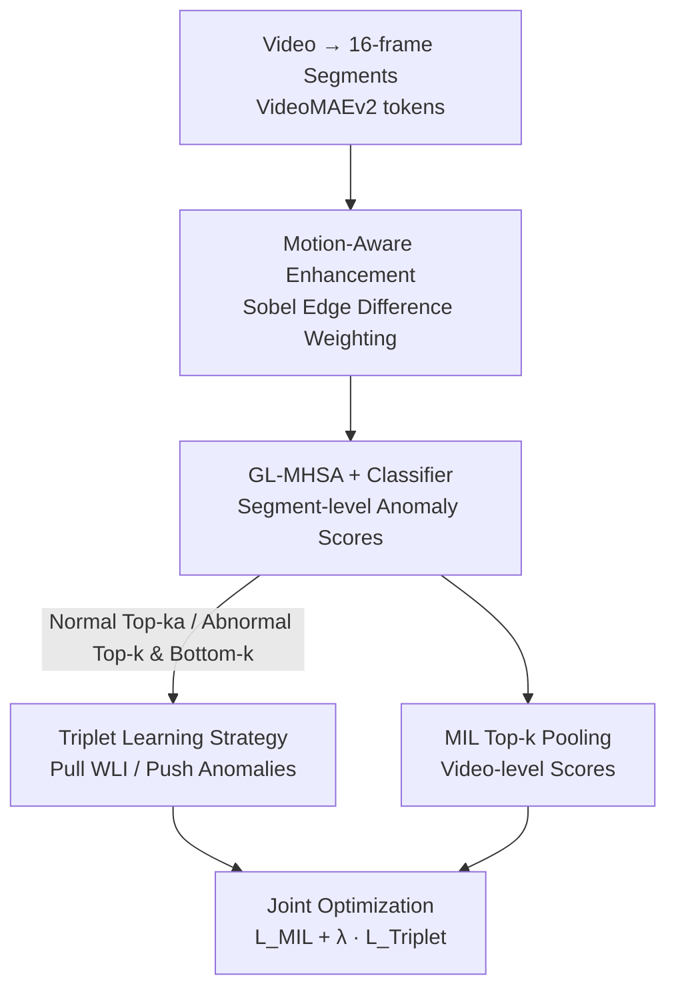

# TLMA: Mitigating the Impact of Weakly Labeled Information for Video Anomaly Detection

**Conference**: CVPR 2026  
**Paper**: [CVF Open Access](https://openaccess.thecvf.com/content/CVPR2026/html/Xu_TLMA_Mitigating_the_Impact_of_Weakly_Labeled_Information_for_Video_CVPR_2026_paper.html)  
**Area**: Video Understanding  
**Keywords**: Weakly Supervised Video Anomaly Detection (WSVAD), Triplet Learning, Multiple Instance Learning, Motion-aware, Weakly Labeled Information

## TL;DR
To mitigate the interference of "Weakly Labeled Information (WLI)" arising from video-level labels in WSVAD, TLMA utilizes a triplet learning strategy dynamically constructed from model predictions to push WLI away from true anomalies in the feature space. Combined with a motion-aware feature enhancement module based on frame-wise Sobel edge differences to highlight foreground dynamics, the method achieves SOTA performance on UCF-Crime, XD-Violence, and MSAD benchmarks while significantly reducing false alarm rates.

## Background & Motivation

**Background**: The goal of WSVAD is to localize anomalous segments during testing using only video-level labels ("abnormal" or "normal") for training, thereby avoiding expensive frame-level or pixel-level annotations. The mainstream approach is Multiple Instance Learning (MIL): treating a video as a "bag" containing several segments. An abnormal video contains at least one anomalous segment, while a normal video contains only normal segments. A ranking loss is used to maximize the gap between the highest anomaly scores in abnormal and normal videos for segment-level detection.

**Limitations of Prior Work**: Video-level labels are too coarse to precisely describe the entire video, leading to the inclusion of substantial "Weakly Labeled Information (WLI)" during training—segments where the label does not match the actual content. The paper categorizes WLI into two types: (1) Actually normal segments in abnormal videos (e.g., normal transition shots or background areas before an explosion, yet labeled "explosion"); (2) Atypical segments in normal videos (e.g., intense movement or rare patterns which, despite being labeled normal, deviate from typical normal features in the embedding space and are easily misjudged as anomalies). Normal videos account for nearly half of the training data, and a single "normal" label cannot cover their diversity.

**Key Challenge**: WLI prevents the model from learning a clear boundary between normal and abnormal events, causing systematic misjudgments in score curves (e.g., UR-DMU misidentifying normal refueling at a gas station as anomalous). Increasing annotation granularity is prohibitively expensive, so the impact of WLI must be suppressed **without additional fine-grained labels**.

**Key Insight**: The authors observe that misjudgments almost exclusively occur on WLI segments, which lack precise supervision due to blurred boundaries. A critical difficulty is that "normal segments in abnormal videos" cannot be directly identified without reliable labels. However, "atypical segments in normal videos" are both obtainable (identified by high anomaly scores from the model) and naturally representative of WLI. These are used as the primary lever.

**Core Idea**: A dynamically constructed triplet (anchor/positive/negative) is used to explicitly pull WLI together and push it away from true anomalies in the feature space. Motion-aware enhancement is further applied to focus features on foreground dynamics, enabling cleaner learning for the MIL ranking loss.

## Method

### Overall Architecture
TLMA (**T**riplet **L**earning with **M**otion-**A**ware enhancement) is a unified framework. The input is a video divided into 16-frame segments, and the output is an anomaly score for each segment. It layers two components onto the standard MIL pipeline: First, the **Motion-Aware Feature Enhancement (MA)** module aggregates token features for each segment based on motion saliency to produce foreground-focused segment features. These features undergo temporal modeling via GL-MHSA and classification to generate anomaly scores. Then, based on these predictions, **triplets** are dynamically selected (anchors from high-score normal videos, positives from low-score abnormal videos, and negatives from high-score abnormal videos). A triplet loss pulls the first two (both WLI) together and pushes them away from the third (true anomalies). The entire model is trained via joint optimization of MIL and triplet losses.

### Key Designs

**1. MIL Baseline & Top-k Pooling: Aggregating Segment Predictions for Video-level Supervision**

As WSVAD only provides video-level labels $Y \in \{0, 1\}$, a bridge is needed for segment-level predictions. TLMA follows Top-k pooling: a video is divided into $L$ non-overlapping segments. Each segment is encoded to produce an anomaly score $s_j \in [0,1]$. The video-level score $S_V$ is the mean of the Top-k segment scores: $S_V = \text{mean}(\text{Top-}k(s_1, \dots, s_L))$, where $k = \lfloor L/16 \rfloor + 1$. The video-level classification loss is:

$$\mathcal{L}_{\text{MIL}} = -\mathbb{E}\left[ Y \log S_V + (1-Y)\log(1-S_V) \right].$$.

This forces at least some segments in abnormal videos to have high scores while suppressing all segments in normal videos. This serves as the supervisory backbone and naturally pushes down the scores of anchors/positives (atypical normal and normal segments in abnormal videos), complementing the triplet loss.

**2. Triplet Learning Strategy: Using "Anomalous-looking Normal Segments" to Separate WLI**

This is the core of the paper. The difficulty lies in WLI lacking precise supervision and being entangled with true anomalies. Triplets must be dynamically constructed from model predictions. The key is selecting an anchor that represents WLI. While WLI consists of two parts, "atypical segments in normal videos" are obtainable and represent the most likely misjudgments. The triplet is defined as:

- **Anchor $F_a$**: Mean feature of Top-$k_a$ high-score segments in normal videos (labeled normal but "looks like anomaly"; a WLI representative).
- **Positive $F_p$**: Mean feature of the lowest $k$ segments in abnormal videos (highly likely to be normal segments within an abnormal video; also WLI).
- **Negative $F_n$**: Mean feature of the highest $k$ segments in abnormal videos (most likely true anomalies).

A margin triplet loss is used ($m=1$):

$$\mathcal{L}_{\text{Triplet}} = \sum_{(a,p,n)} \max\left( \|F_a - F_p\|_2 - \|F_a - F_n\|_2 + m,\ 0 \right).$$

This pulls the anchor and positive (likely WLI) together and pushes them away from the negative (true anomaly), learning a structured feature space. The synergy with MIL is crucial: MIL operates on scores, while triplet loss operates on feature geometry, reinforcing each other for precise localization.

**3. Motion-Aware Feature Enhancement (MA): Focusing on Foreground Dynamics via Sobel Edge Differences**

Existing WSVAD methods often extract features from entire frames. Redundant backgrounds degrade anomaly scoring and contaminate contrastive samples. Anomlies usually occur in dynamic foreground areas. MA adds a motion-aware token attention layer over ViT tokens without additional training. VideoMAEv2 (ViT-G/14) partitions each 16-frame segment into $2\times14\times14$ spatio-temporal cubes, projected into tokens $\tilde{Z} \in \mathbb{R}^{N\times D}$. Motion cues are calculated by applying Sobel kernels $S_x, S_y$ on frame $f_t$ to get edge magnitude $E_t(x,y) = \sqrt{(S_x * f_t)^2 + (S_y * f_t)^2 + \epsilon}$. Inter-frame differences are then computed: $M_k(x,y) = |E_{2k}(x,y) - E_{2k-1}(x,y)|$. This 2-frame window aligns with the ViT tokenization. The normalized importance for token $i$ is $\tilde{a}_i = a_i / (\max_j a_j + \epsilon)$, where $a_i$ is the sum over the spatial region $\Omega_i$. The enhanced feature $F_{\text{enhanced}}$ is a motion-weighted sum of tokens: $\sum_{i=1}^N \tilde{a}_i \cdot \tilde{z}_i$. This adaptively amplifies high-motion tokens and suppresses background.

### Loss & Training
The total loss is a weighted sum:

$$\mathcal{L}_{\text{Total}} = \mathcal{L}_{\text{MIL}} + \lambda \cdot \mathcal{L}_{\text{Triplet}},$$

where $\lambda = 0.1$ across datasets. The backbone is VideoMAEv2 (ViT-G/14), trained with AdamW at a learning rate of $1\times10^{-3}$ for 3000 iterations. Batch sizes are 64 for UCF-Crime/XD-Violence and 32 for MSAD. $k_a$ is dataset-dependent (UCF-Crime $k_a=3$, XD-Violence $k_a=11$, MSAD $k_a=1$).

## Key Experimental Results

### Main Results
Evaluation on three benchmarks: UCF-Crime (1900 videos), XD-Violence (4754 videos), and MSAD (720 videos). Metrics include AUC, AP, AUCA/APA (anomaly-only metrics), and FAR (False Alarm Rate).

| Dataset | Metric | Ours (TLMA) | Prev. SOTA | Gain |
| :--- | :--- | :--- | :--- | :--- |
| UCF-Crime | AUC | **89.47** | VadCLIP 88.02 | +1.45 |
| UCF-Crime | AUCA | **76.16** | UR-DMU 70.81 | +5.35 |
| XD-Violence | AP | **86.78** | PEL4VAD 85.59 | +1.19 |
| XD-Violence | APA | **86.23** | UR-DMU 83.94 | +2.29 |
| MSAD | AUC | **93.68** | PI-VAD 88.68 | +5.00 |

TLMA leads across all benchmarks, particularly in anomaly-specific metrics (AUCA/APA) and the new MSAD dataset, demonstrating superior localization capabilities.

### Ablation Study

Module Contributions (FAR: lower is better):

| Config | UCF AUC | UCF FAR↓ | XD AP | XD FAR↓ |
| :--- | :--- | :--- | :--- | :--- |
| Baseline (MIL only) | 85.69 | 3.30 | 83.61 | 1.07 |
| + MA | 86.84 | 2.62 | 85.35 | 1.11 |
| + Triplet | 88.37 | 1.93 | 84.64 | 0.96 |
| + MA + Triplet (Full) | **89.47** | **1.56** | **86.78** | **0.43** |

### Key Findings
- **Synergy of Modules**: Adding MA alone improves XD AP from 83.61 to 85.35. Adding Triplet alone improves UCF AUC from 85.69 to 88.37. The combination yields the best results and a steady decline in FAR, proving effective suppression of WLI-induced false positives.
- **Anchor Strategy**: Using random or low-score normal segments as anchors results in negligible gains. High-score segments ("anomalous-looking normal segments") are essential WLI representatives.
- **Sobel Preference**: MA is sensitive to edge extraction; Sobel outperformed Scharr and DoG in capturing discriminative motion cues.

## Highlights & Insights
- **Surrogate for Latent WLI**: Since "normal segments in abnormal videos" are unlabeled, using "high-score atypical normal segments" as an anchor for WLI is a pragmatic and effective surrogate.
- **Score-Feature Synergy**: MIL handles score distribution while triplet loss handles geometric separation. This dual approach ensures the model suppresses WLI at multiple levels.
- **Zero-cost Motion Prior**: MA utilizes Sobel differences without extra parameters or training. The deliberate temporal alignment between motion windows and ViT tokenization is a clever design detail.

## Limitations & Future Work
- **$k_a$ Sensitivity**: The hyperparameter $k_a$ must be tuned per dataset (1 to 11), suggesting WLI distribution varies significantly by scene complexity.
- **Positive Purity**: The positive sample is taken from low-score segments of abnormal videos; if anomalies are widespread, the positive sample could be contaminated.
- **Unaddressed WLI**: Half of WLI (normal in abnormal videos) is only indirectly handled via MIL rather than direct triplet anchoring.
- **Backbone Dependency**: The performance relies on heavy encoders like VideoMAEv2 ViT-G/14; the effectiveness on lightweight backbones remains unverified.

## Related Work & Insights
- **Contrast with UR-DMU**: While both use triplet loss, UR-DMU relies on memory banks. TLMA avoids extra structures by dynamically constructing triplets based on score-guided WLI surrogates, significantly outperforming it in AUCA/APA.
- **Contrast with VadCLIP / PI-VAD**: These rely on multi-modal (CLIP) or additional scene priors. TLMA demonstrates that addressing the fundamental "label noise" (WLI) problem in a single modality can outperform multi-modal stacks.

## Rating
- **Novelty**: ⭐⭐⭐⭐ Explicitly modeling WLI separation via score-guided proxies is a clever treatment of WSVAD label noise.
- **Experimental Thoroughness**: ⭐⭐⭐⭐ Strong gains across three benchmarks and specialized metrics; comprehensive ablations on filters and loss weights.
- **Writing Quality**: ⭐⭐⭐⭐ Clear motivation regarding the two types of WLI and consistent methodology.
- **Value**: ⭐⭐⭐⭐ Directly addresses high false alarm rates in practical deployments without increasing annotation costs.

<!-- RELATED:START -->

<!-- RELATED:END -->

## Related Papers

- [\[CVPR 2026\] The Road Less Seen: Segment Exploration for Weakly Supervised Video Anomaly Detection](the_road_less_seen_segment_exploration_for_weakly_supervised_video_anomaly_detec.md)
- [\[CVPR 2026\] Learning from Noisy Supervision: A Denoising-Debiasing Framework for Weakly Supervised Video Anomaly Detection](learning_from_noisy_supervision_a_denoising-debiasing_framework_for_weakly_super.md)
- [\[CVPR 2026\] Weakly Supervised Video Anomaly Detection with Anomaly-Connected Components and Intention Reasoning](weakly_supervised_video_anomaly_detection_with_anomaly-connected_components_and_.md)
- [\[CVPR 2026\] Joint Learning of General and Diverse Patterns with Mixture of Memory Experts for Weakly-Supervised Video Anomaly Detection](joint_learning_of_general_and_diverse_patterns_with_mixture_of_memory_experts_fo.md)
- [\[AAAI 2026\] RefineVAD: Semantic-Guided Feature Recalibration for Weakly Supervised Video Anomaly Detection](../../AAAI2026/video_understanding/refinevad_semantic-guided_feature_recalibration_for_weakly_supervised_video_anom.md)

<!-- RELATED:END -->
