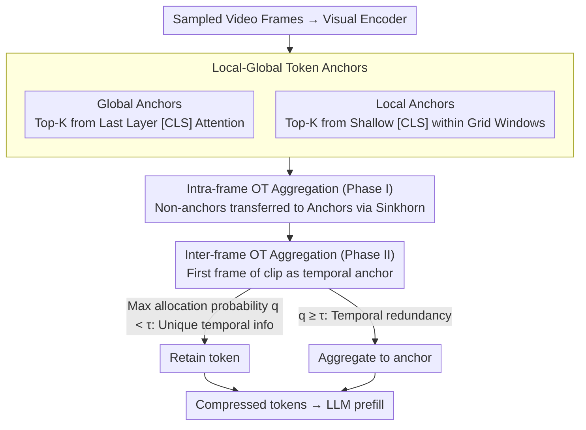

# Token Reduction via Local and Global Contexts Optimization for Efficient Video Large Language Models

**Conference**: CVPR2026  
**arXiv**: [2603.01400](https://arxiv.org/abs/2603.01400)  
**Code**: [AOT Project](https://github.com/) (To be confirmed)  
**Area**: Video Understanding  
**Keywords**: Video LLM, Token Reduction, optimal transport, training-free, Spatiotemporal Compression

## TL;DR

The AOT framework is proposed to achieve training-free video token compression by establishing local-global token anchors and utilizing Optimal Transport (OT) to aggregate the semantic information of pruned/merged tokens at both intra-frame and inter-frame levels. It retains 97.6% of the original performance even when 90% of tokens are pruned.

## Background & Motivation

**Computational bottleneck of Video LLMs**: When Video LLMs process video, the visual encoder converts sampled frames into a massive number of tokens (up to millions for long videos). The prefilling stage accounts for the vast majority of FLOPs (approximately 98%), leading to extremely high inference costs.

**Limitations of training-based compression**: Some methods compress tokens via trainable modules, but these require significant training resources and GPU overhead, making them difficult to deploy widely.

**Spatial compression ignores temporal dependencies**: Methods like VisionZip and LLaVA-PruMerge primarily remove intra-frame spatial redundancy. Their performance drops sharply at low retention rates (e.g., an 8.4% drop at 10% retention) because they fail to exploit inter-frame temporal redundancy.

**Limited efficiency of internal LLM pruning**: FastV, PDrop, and others perform token pruning within LLM layers, but the overhead of shallow layers remains, and it is difficult to effectively utilize the compressibility of long contexts.

**Simple merging/discarding loses key information**: Existing methods either directly discard low-importance tokens or simply merge similar tokens, ignoring the subtle but useful semantic and contextual information contained within them.

**Lack of a global optimal information aggregation perspective**: Existing methods lack a systematic framework to measure the relationship between pruned tokens and retained tokens and to optimally aggregate useful information onto the retained tokens.

## Method

### Overall Architecture

AOT (Anchors + Optimal Transport) aims to solve the problem where prefilling accounts for ~98% of FLOPs in Video LLMs, and existing compression either drops information or requires training. The core idea is "aggregation instead of discarding": first, select semantically important and spatially diverse tokens as anchors (Local-Global Token Anchors) in each frame, then use Optimal Transport to aggregate information from pruned tokens in two stages—Intra-frame OT Aggregation (Phase I) and Inter-frame OT Aggregation (Phase II)—onto the anchors in an optimal manner. The entire process is training-free.

### Key Designs

**1. Local-Global Token Anchors: Selecting anchors via global + local dual quotas**

Simple discarding loses key information; to aggregate information, a high-quality set of retention points must first be identified. AOT selects two types of anchors simultaneously: global anchors $\mathbf{x}_V^g$ are the Top-K tokens based on multi-head attention scores from the [CLS] token in the final layer of the visual encoder; local anchors $\mathbf{x}_V^l$ are selected by dividing image features into $W$ non-overlapping grid windows and taking $K_w = K/W$ tokens per window based on early-layer [CLS] attention. The final anchors are $\mathbf{X}_V^{\text{anchors}} = \mathbf{x}_V^g \cup \mathbf{x}_V^l$, with equal quotas for global and local anchors to balance "importance" and "coverage."

**2. Intra-frame OT Aggregation: Optimally transferring pruned token semantics to anchors**

To address "spatial redundancy without information loss," anchors $\mathbf{X}_V^a$ and non-anchors $\mathbf{X}_V^u$ are treated as two discrete distributions. A cost matrix $\bm{C} = \bm{1} - (\mathbf{X}_V^a)^\top \mathbf{X}_V^u$ is constructed using inverse cosine similarity. The Sinkhorn-Knopp iteration is used to find the optimal transport plan $\bm{T}^*_{intra}$, and information is aggregated via weighted summation: $\tilde{\mathbf{x}}_j^a = \frac{\mathbf{x}_j^a + \lambda_{intra} \sum_i T^*_{ij} \mathbf{x}_i^u}{1 + \lambda_{intra} m_j}$. Thus, pruned tokens do not simply disappear but "transport" their context to the retained points.

**3. Inter-frame OT Aggregation: Eliminating temporal redundancy without erasing changing frames**

To address the performance drop at low retention rates caused by ignoring inter-frame redundancy, the frame sequence is divided into clips. The tokens of the first frame in each clip serve as temporal anchors. The OT plan is calculated frame-by-frame for subsequent frames. Based on row-normalized maximum allocation probability $q_i^{(\ell)} = \max_j p_{ij}^{(\ell)}$, if $q_i < \tau$, the token contains unique temporal information and is retained; otherwise, it is aggregated into the anchors based on OT weights. This strategy eliminates temporal redundancy while preserving dynamic information.

### Loss & Training

- Completely training-free, involving no training loss.
- The core optimization objective is to minimize the OT distance $d_{\text{OT}}(\bm{u}, \bm{v} | \bm{C})$.
- Rapidly solved via Sinkhorn-Knopp iteration (default 100 iterations), with entropic regularization coefficient $\lambda$ controlling smoothness.
- Weight coefficients $\lambda_{intra}$ and $\lambda_{inter}$ are set to 1.0 by default to control aggregation strength.

## Main Results

Comparison on LLaVA-OneVision-7B (32-frame input, 4 video understanding benchmarks):

| Method | FLOPs (T) | Retention | MVBench | EgoSchema | LongVideoBench | VideoMME | Avg. | Score% |
|------|-----------|--------|---------|-----------|---------------|----------|------|--------|
| LLaVA-OV-7B (vanilla) | 40.8 | 100% | 58.3 | 60.4 | 56.4 | 58.6 | 58.4 | 100 |
| VisionZip | 3.4 | 10% | 53.5 | 58.0 | 49.3 | 53.4 | 53.5 | 91.6 |
| PruneVid | 3.4 | 10% | 56.2 | 59.8 | 54.5 | 56.0 | 56.6 | 96.9 |
| FastVID | 3.4 | 10% | 55.9 | - | 56.3 | 57.3 | - | - |
| **AOT** | **3.4** | **10%** | **57.2** | **60.3** | **53.8** | **56.6** | **57.0** | **97.6** |

On LLaVA-Video-7B (64-frame input, 25% retention rate):

| Method | FLOPs (T) | Retention | MVBench | EgoSchema | LongVideoBench | VideoMME | Avg. | Score% |
|------|-----------|--------|---------|-----------|---------------|----------|------|--------|
| LLaVA-Video-7B (vanilla) | 80.2 | 100% | 60.4 | 57.2 | 58.9 | 64.3 | 60.2 | 100 |
| VisionZip | 9.3 | 25% | 56.7 | 54.7 | 54.7 | 60.7 | 56.7 | 94.2 |
| **AOT** | **9.3** | **25%** | **59.2** | **55.6** | **55.9** | **62.4** | **58.3** | **96.8** |

## Ablation Study

Contribution of Token Anchors components (10% retention rate):

| Configuration | MVBench | EgoSchema | LongVideoBench | VideoMME | Avg. | Score% |
|------|---------|-----------|---------------|----------|------|--------|
| w/o Local Anchors | 56.5 | 60.1 | 54.0 | 55.7 | 56.6 | 96.9 |
| w/o Global Anchors | 55.5 | 59.4 | 53.4 | 53.1 | 55.4 | 94.9 |
| w/o OT | 56.1 | 60.2 | 53.5 | 55.8 | 56.4 | 96.6 |
| OT w/o Intra-frame | 57.1 | 60.2 | 53.6 | 54.6 | 56.3 | 96.6 |
| OT w/o Inter-frame | 56.1 | 60.0 | 53.6 | 55.9 | 56.4 | 96.6 |
| **AOT (Full)** | **57.2** | **60.3** | **53.8** | **56.6** | **57.0** | **97.6** |

Aggregation strategy comparison: No Merging (56.4) vs Cosine Merging (52.4) vs **AOT (57.0)**, verifying that OT aggregation is significantly superior to simple cosine merging.

## Key Findings

- **Extremely low Sinkhorn overhead**: Intra-frame and inter-frame OT for 100 iterations take only 2.11ms, less than 1% of total inference time.
- **Surpassing vanilla models**: On some benchmarks, AOT performance after compression is actually better than the original model, suggesting that massive redundant/irrelevant tokens act as noise that interferes with the LLM's focus on key information.
- **Frame scaling advantage**: From 16 to 128 frames, AOT consistently outperforms other compression methods; at 128 frames, vanilla models are limited by context length while AOT continues to function normally.
- **Global Anchors are more critical than Local Anchors**: The performance drop after removing global anchors (-3.0 Avg) is larger than that after removing local anchors (-0.4 Avg).

## Highlights

- **New Perspective**: The first systematic study on how to "optimally" aggregate information from pruned/merged tokens back to retained tokens instead of simple discarding.
- **Ingenious Application of OT**: Token compression is modeled as a discrete optimal transport problem where suppliers (pruned tokens) pass context to consumers (anchors), solved efficiently via Sinkhorn.
- **Two-layer Optimization**: Intra-frame spatial redundancy elimination + inter-frame temporal redundancy elimination; the two OT levels complement each other to cover full spatiotemporal compression needs.
- **Completely Training-free**: Can be applied as a plug-and-play module to various Video LLMs without fine-tuning.
- **Outstanding Performance under Extreme Compression**: Maintains 97.6% of original performance at 10% retention, significantly leading VisionZip’s 91.6%.

## Limitations & Future Work

- Validated only on LLaVA series 7B models; lacks generalization verification on larger models (e.g., 72B) or other architectures (e.g., Qwen-VL, InternVL).
- Inter-frame clip segmentation uses uniform sampling or simple clustering; adaptive frame-level importance-aware grouping has not been explored.
- Threshold $\tau$ and weight $\lambda$ require manual setting; different video scenes may require different hyperparameters.
- Although OT solving is fast, it still introduces additional memory overhead (cost matrix $M \times N$); scalability for ultra-high frame rate or resolution scenarios remains to be verified.
- Current evaluation is limited to multiple-choice benchmarks; evaluations on open-ended generation tasks (e.g., video captioning, video grounding) are lacking.

## Related Work & Insights

- **Intra-frame Spatial Compression**: VisionZip (CLS attention selection + token merging), LLaVA-PruMerge (adaptive spatial redundancy detection and token pruning), ToMe (bipartite matching token merging).
- **Internal LLM Pruning**: FastV (prefilling attention-guided token selection), PDrop (hierarchical progressive pruning), SparseVLM (text-guided visual token ranking).
- **Video-specific Compression**: DyCoke (cross-frame merging + dynamic KV cache pruning), PruneVid (joint spatial-temporal clustering and pruning), FastVID (temporal segmentation + spatiotemporal token merging), TempMe (progressive spatial pruning + adjacent clip merging), FrameFusion (shallow cross-merging + pruning).
- **Optimal Transport Foundations**: Wide application of Sinkhorn distance and Wasserstein distance in distribution comparison.

## Rating

- Novelty: ⭐⭐⭐⭐ — Introducing OT to video token compression is a novel perspective; the "aggregate instead of discard" idea is insightful.
- Experimental Thoroughness: ⭐⭐⭐⭐ — 4 benchmarks, 2 models, multiple retention rate comparisons, and thorough ablation, but lacks validation on large scales and open-ended tasks.
- Writing Quality: ⭐⭐⭐⭐ — Clear framework, standardized formulas, and intuitive diagrams, though some paragraphs are slightly lengthy.
- Value: ⭐⭐⭐⭐ — Training-free with excellent results; high practical value for immediate acceleration of Video LLM inference.

<!-- RELATED:START -->

## Related Papers

- [\[CVPR 2026\] StreamingTOM: Streaming Token Compression for Efficient Video Understanding](streamingtom_streaming_token_compression_for_efficient_video_understanding.md)
- [\[ICLR 2026\] FlashVID: Efficient Video Large Language Models via Training-free Tree-Based Spatiotemporal Token Merging](../../ICLR2026/video_understanding/flashvid_efficient_video_large_language_models_via_training-free_tree-based_spat.md)
- [\[NeurIPS 2025\] Self-alignment of Large Video Language Models with Refined Regularized Preference Optimization](../../NeurIPS2025/video_understanding/self-alignment_of_large_video_language_models_with_refined_regularized_preferenc.md)
- [\[ICML 2026\] OmniSIFT: Modality-Asymmetric Token Compression for Efficient Omni-modal Large Language Models](../../ICML2026/video_understanding/omnisift_modality-asymmetric_token_compression_for_efficient_omni-modal_large_la.md)
- [\[CVPR 2026\] UFVideo: Towards Unified Fine-Grained Video Cooperative Understanding with Large Language Models](ufvideo_towards_unified_fine-grained_video_cooperative_understanding_with_large_.md)

<!-- RELATED:END -->
