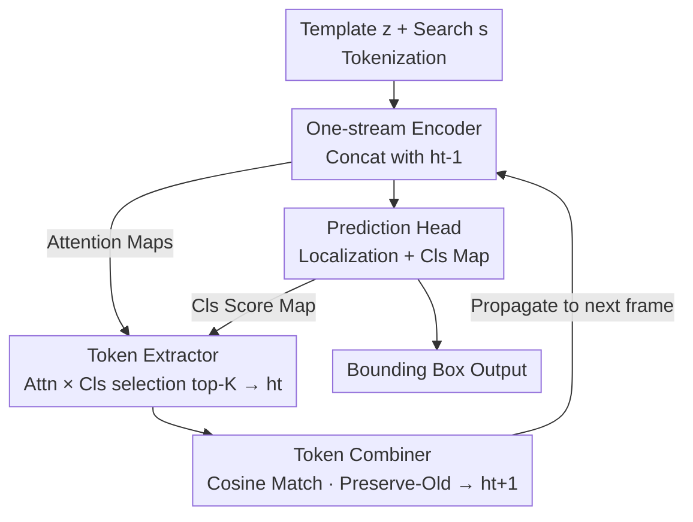

# Toward Low-Cost yet Effective Temporal Learning for UAV Tracking

**Conference**: CVPR 2026  
**Paper**: [CVF Open Access](https://openaccess.thecvf.com/content/CVPR2026/html/Xue_Toward_Low-Cost_yet_Effective_Temporal_Learning_for_UAV_Tracking_CVPR_2026_paper.html)  
**Code**: https://github.com/GXNU-ZhongLab/LETrack (Available)  
**Area**: Video Understanding / Single Object Tracking  
**Keywords**: UAV tracking, temporal modeling, token propagation, efficiency evaluation, PPF

## TL;DR
Addressing single object tracking for Unmanned Aerial Vehicles (UAVs), this paper first proposes an evaluation metric, Precision per FLOP (PPF), which couples accuracy gain with computational overhead. This metric reveals that existing temporal modules generally possess low "cost-effectiveness." Consequently, a lightweight temporal module (LETL) is designed that propagates and merges only a small number of representative appearance tokens. Integrated into a one-stream framework, the resulting LETrack achieves SOTA performance across six aerial datasets with negligible additional computational cost.

## Background & Motivation
**Background**: In generic visual object tracking (VOT), leveraging temporal information (how target appearance changes over time) is a recognized method for improving performance. Predominant approaches follow two categories: multi-template matching (e.g., MixFormer, STARK, ODTrack, and MCITrack, which increase dynamic templates from 1 to 3 or even 5) and trajectory tokens (e.g., ODTrack, AQATrack, and TemTrack, which compress per-frame information into learnable query tokens for cross-frame propagation). Recently, the UAV tracking subfield has shifted towards "extreme efficiency" (e.g., Aba-ViTrack, AVTrack, SGLATrack) to fit resource-constrained onboard chips, often prioritizing token pruning and distillation over specific aerial challenges like camera shake and cluttered backgrounds.

**Limitations of Prior Work**: Both existing temporal strategies are suboptimal for UAVs. Multi-template approaches suffer from high memory consumption or exploding FLOPs, making onboard deployment difficult. While trajectory tokens are lightweight, they compress the "entire search area" into a few global tokens. In UAV top-down views, the background dominates the frame, leading to target features being diluted and providing limited performance gains.

**Key Challenge**: A deeper issue lies in evaluation; current benchmarks compare "overall accuracy" but fail to distinguish whether gains come from the temporal module itself or simply from using a larger backbone or more inputs. For instance, EVPTrack shows higher overall accuracy than HIPTrack, yet the actual gain $\Delta\text{prec}$ from its temporal module is smaller, implying its superiority stems from its HiViT backbone. The community lacks a metric to isolate and quantify the "true capability" of temporal modules.

**Goal**: (1) Propose a fair, compute-aware metric to quantify the real contribution of temporal modules; (2) Guided by this metric, design a low-cost, high-gain temporal module optimized for UAVs.

**Key Insight**: Given the limited compute of UAVs, an ideal temporal strategy should exchange minimal computation for significant accuracy gain. Thus, evaluation should focus on "accuracy gained per unit of computation" rather than absolute values. The authors introduce the ratio of precision per FLOP (PPF), which effectively decouples backbone contributions from temporal module gains.

**Core Idea**: Redefine "good temporal modules" via PPF and design LETL accordingly. Instead of global compression or template stacking, LETL selects a small set of the most informative local appearance tokens per frame to propagate and merge, capturing appearance variations at an extremely low computational cost.

## Method

### Overall Architecture
The backbone of LETrack is a standard one-stream tracker: the template image $z\in\mathbb{R}^{3\times H_z\times W_z}$ and search image $s\in\mathbb{R}^{3\times H_s\times W_s}$ are tokenized into sequences $Z\in\mathbb{R}^{N_z\times D}$ and $S\in\mathbb{R}^{N_s\times D}$. These are concatenated with the temporal token set $h_{t-1}$ from the previous frame and fed into a DeiT-Tiny encoder for unified feature extraction and interaction. Encoded search features are then passed to a center-based prediction head. The LETL module acts as the "temporal brain": after the current frame prediction, it utilizes the attention maps from the encoder and classification score maps from the head. A token extractor selects new representative tokens $h_t$ from the current frame, and a token combiner merges $h_t$ with $h_{t-1}$ to form $h_{t+1}$ for the next frame. The entire temporal loop operates only at the lightweight token level, adding minimal FLOPs.

### Key Designs

**1. PPF Metric: Dividing precision gain by extra computational cost**

Existing evaluations fail to isolate gains or account for compute constraints. The authors define "pure trackers" and "temporal trackers": a pure tracker $\Psi(z,s)=\{G(z,s),P(s)\}$ uses only the initial template $z$ and current search frame $s$, where $G$ is the backbone and $P$ is the head. Adding a temporal module $T(h)$ yields $\Psi(z,s,h)=\{G(z,s),P(s),T(h)\}$. By keeping the backbone and head **identical** and varying only the temporal module, differences can be attributed solely to the latter. PPF is defined as:

$$\text{PPF}=\frac{\Delta\text{prec}}{\Delta\text{flop}}=\frac{\text{prec}(\Psi_{z,s,h})-\text{prec}(\Psi_{z,s})}{\text{flop}(\Psi_{z,s,h})-\text{flop}(\Psi_{z,s})}$$

For trackers with very high FLOPs (>10G), a log form is used: $\text{PPF}=\Delta\text{prec}/\log(\Delta\text{flop})$. This metric exposes the low efficiency of input-stacking; for instance, ODTrack has a high $\Delta\text{prec}$ but consumes massive FLOPs for triple templates, leading to a lower PPF than EVPTrack.

**2. Token Extractor: Dual signals from attention similarity and classification scores to select the top-$K$ representative tokens per frame**

To avoid target feature dilution in background-heavy UAV scenes, LETL selects a few "truly on-target" local tokens. Two complementary signals are used. The first is from the one-stream attention: in the attention matrix, the search-to-template sub-block $A_{s2z}\in\mathbb{R}^{N_s\times N_z}$ represents the similarity of each search token to the template. Averaging across the template tokens gives $\bar A_{s2z}\in\mathbb{R}^{N_s}$. The second signal is the flattened classification map $C\in\mathbb{R}^{N_s}$ from the prediction head, reflecting spatial distribution. These are element-wise multiplied and averaged across $M$ attention heads to determine importance:

$$S=\frac{1}{M}\sum_{m=1}^{M}\{\bar A_{s2z}\}_m\odot C$$

The top-$K$ tokens based on $S$ form the set $h_t\in\mathbb{R}^{K\times D}$. This design is effective because attention captures "appearance similarity" while the classification score captures "spatial likelihood."

**3. Token Combiner: Cosine matching followed by "Keep Old, Replace with New" merge strategy**

To prevent the token set from growing indefinitely, the combiner calculates pairwise cosine similarity between $h_t$ and $h_{t-1}$. Only the top-$r$ most similar pairs are merged. Two key choices are made: (1) **"Preserve the old, complement with the new"**: Since late-stage tokens in a video can be noisy, early tokens are prioritized. (2) **"Replacement over averaging"**: Instead of averaging matched tokens, the value is replaced by the most recent frame's token ($h_t$). Averaging tends to blur fine-grained target features and accumulate errors in cluttered scenes. In ablations, Replace (68.2 AUC) outperformed Average (67.1). The optimal merge ratio $P=r/K$ was found to be 37.5%.

### Loss & Training
The prediction head is center-based, outputting local offset, box size, and classification maps. The total loss is:

$$L=L_{cls}+\lambda_{iou}L_{iou}+\lambda_{L1}L_{L1}$$

Using focal loss for classification and L1 + GIoU for regression ($\lambda_{iou}=2, \lambda_{L1}=5$). The DeiT-Tiny backbone is trained on LaSOT/COCO/TrackingNet/GOT-10k for 300 epochs with AdamW. Learning rates: $4\times10^{-4}$ for the head, $4\times10^{-5}$ for the backbone. Inference uses $K=16, P=37.5\%$.

## Key Experimental Results

### Main Results
LETrack achieves SOTA across six aerial datasets. Representative results:

| Dataset | Metric | LETrack | SGLATrack(CVPR'25) | ORTrack(CVPR'25) | AVTrack(ICML'24) |
|--------|------|---------|--------------------|------------------|------------------|
| UAVTrack112 | AUC / P | **69.6 / 85.8** | 67.5 / 82.8 | 66.6 / 82.1 | 65.4 / 80.3 |
| UAVTrack112_L | AUC / P | **68.2 / 84.8** | 64.0 / 79.2 | 65.3 / 82.3 | 62.7 / 78.2 |
| UAV123 | AUC / P | **68.0 / 87.0** | 66.9 / 84.9 | 66.1 / 84.0 | 66.8 / 84.8 |
| VisDrone2018 | AUC / P | **66.1 / 87.2** | — | — | — |

On VisDrone2018, LETrack (66.1 AUC) exceeds SeqTrack (63.5) and MCITrack-T224 (62.5), suggesting that MCITrack's temporal strategy may degrade in challenging aerial scenarios.

Efficiency (UAVTrack112_L, A100):

| Tracker | AUC | FLOPs (G) | Params (M) | FPS |
|--------|-----|----------|---------|-----|
| LETrack | **68.2** | 2.48 | 7.98 | 204 |
| SGLATrack | 64.0 | 1.54~1.68 | 5.81 | 242 |
| SeqTrack | 67.1 | 65.86 | 89.11 | 43 |
| ARTrack | 66.9 | 40.33 | 173.12 | 29 |

LETrack uses approx. 1/20 of the FLOPs of SeqTrack while providing higher accuracy. It runs at 26 FPS on Jetson TX2 (standard 4GB, no TensorRT), meeting real-time requirements.

### Ablation Study
PPF cross-comparison of temporal strategies (Baseline: DeiT-Tiny one-stream):

| Temporal Strategy | $\Delta$prec | $\Delta$flop(G) | PPF |
|----------|------|------|-----|
| Baseline | (79.8) | (2.39) | — |
| + Dynamic Template (MixFormer) | +3.8 | +0.40 | 9.5 |
| + Dense Sampling (ODTrack) | +5.9 | +0.68 | 8.7 |
| **+ LETL** | +5.0 | **+0.09** | **55** |

LETL’s PPF (55) is over 6x higher than alternatives. While dense sampling provides the highest raw gain (+5.9), it consumes significant FLOPs.

Internal Ablations:

| Module | Configuration | AUC | Prec |
|------|------|-----|------|
| Token Extractor | Attn only | 67.8 | 83.9 |
| | Cls only | 67.4 | 83.3 |
| | **Attn + Cls** | **68.2** | **84.8** |
| Token Combiner | Average | 67.1 | 83.2 |
| | **Replace** | **68.2** | **84.8** |

### Key Findings
- **Quality Over Quantity**: Efficiency depends on "what is propagated" rather than just "propagation." Propagating fine-grained local appearance tokens is more effective for UAVs than global query compression.
- **Dual Signal Complementarity**: Multiplying attention similarity and classification scores works better than using either alone.
- **Replace > Average**: Using the most recent token values prevents feature blurring and error accumulation in cluttered scenes.
- **K and P Trade-off**: $K=16$ provides the best PPF, while $P=37.5\%$ balances tracking stability with adaptation to appearance changes.

## Highlights & Insights
- **Metric as Contribution**: PPF decouples backbone performance from temporal logic, debunking the assumption that stacking inputs inherently equals better temporal learning.
- **Non-Compressive Propagation**: Contrary to the "compress-then-propagate" trend, this paper demonstrates that local token propagation is superior in background-dominant scenes.
- **Zero-Cost Signal Mining**: By reusing intrinsic attention and classification signals, the module introduces virtually no extra parameters or FLOPs.

## Limitations & Future Work
- **PPF Portability**: PPF assumes controlled variables; cross-paper comparisons with different backbones/heads require caution.
- **Drastic Appearance Changes**: The "preserve early tokens" strategy might struggle with extreme scale or pose changes in long-term scenarios.
- **Hyperparameter Sensitivity**: $K$ and $P$ were tuned on specific datasets; their robustness across more diverse platforms or tiny backbones remains to be fully explored.
- **Backbone Dependency**: The method relies on attention maps from one-stream ViTs, making it less portable to CNN-based or two-stream trackers.

## Related Work & Insights
- **vs. Multi-Template**: Methods like MixFormer/ODTrack capture variations by stacking templates but explode in compute/memory. LETL propagates tokens instead, achieving superior PPF.
- **vs. Trajectory Tokens**: Approaches like AQATrack use global queries which are diluted by UAV backgrounds. LETL's local tokens provide higher precision gain.
- **vs. Efficient UAV Trackers**: While prior work focused on pruning tokens to save compute, LETrack focuses on restoring robustness with a "low-cost yet high-gain" temporal module.

## Rating
- Novelty: ⭐⭐⭐⭐ Introducing the PPF metric to decouple temporal gains is a fresh perspective; non-compressive token propagation is a distinct departure from global query methods.
- Experimental Thoroughness: ⭐⭐⭐⭐⭐ Comprehensive coverage across six datasets, efficiency benchmarks, onboard testing, and exhaustive PPF comparisons.
- Writing Quality: ⭐⭐⭐⭐ Logical flow from questioning current evaluations to proposing a metric and then a solution.
- Value: ⭐⭐⭐⭐ Provides a practical, high-performance temporal module for resource-constrained tracking and a reusable evaluation framework.

<!-- RELATED:START -->

## Related Papers

- [\[CVPR 2026\] Rethinking Occlusion Modeling for UAV Tracking](rethinking_occlusion_modeling_for_uav_tracking.md)
- [\[CVPR 2026\] TGTrack: Temporal Generative Learning for Unified Single Object Tracking](tgtrack_temporal_generative_learning_for_unified_single_object_tracking.md)
- [\[CVPR 2026\] LongVideo-R1: Smart Navigation for Low-cost Long Video Understanding](longvideo-r1_smart_navigation_for_low-cost_long_video_understanding.md)
- [\[CVPR 2026\] Drift-Resilient Temporal Priors for Visual Tracking](drift-resilient_temporal_priors_for_visual_tracking.md)
- [\[CVPR 2026\] Breaking Smooth-Motion Assumptions: A UAV Benchmark for Multi-Object Tracking in Complex and Adverse Conditions](breaking_smooth-motion_assumptions_a_uav_benchmark_for_multi-object_tracking_in_.md)

<!-- RELATED:END -->
## Related Papers

- [\[CVPR 2026\] Rethinking Occlusion Modeling for UAV Tracking](rethinking_occlusion_modeling_for_uav_tracking.md)
- [\[CVPR 2026\] TGTrack: Temporal Generative Learning for Unified Single Object Tracking](tgtrack_temporal_generative_learning_for_unified_single_object_tracking.md)
- [\[CVPR 2026\] LongVideo-R1: Smart Navigation for Low-cost Long Video Understanding](longvideo-r1_smart_navigation_for_low-cost_long_video_understanding.md)
- [\[CVPR 2026\] Drift-Resilient Temporal Priors for Visual Tracking](drift-resilient_temporal_priors_for_visual_tracking.md)
- [\[CVPR 2026\] Breaking Smooth-Motion Assumptions: A UAV Benchmark for Multi-Object Tracking in Complex and Adverse Conditions](breaking_smooth-motion_assumptions_a_uav_benchmark_for_multi-object_tracking_in_.md)

<!-- RELATED:END -->
