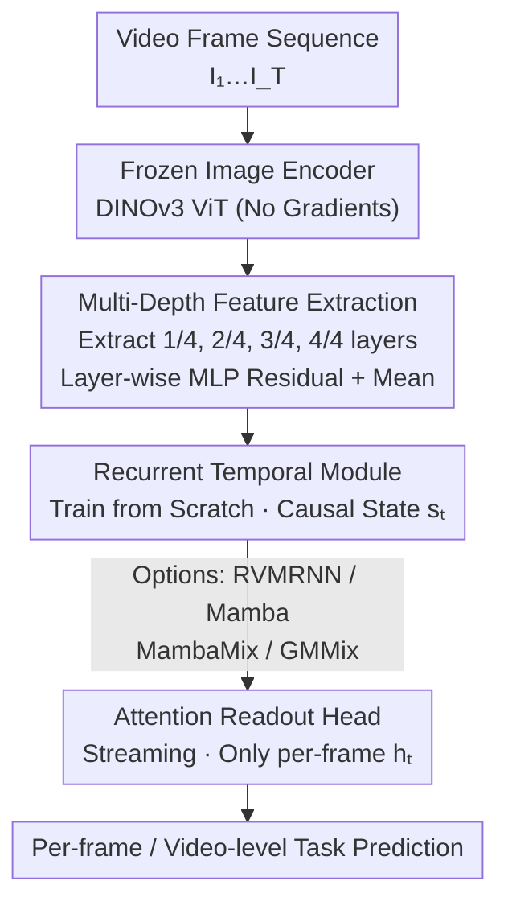

# Towards Data-Efficient Video Pre-training with Frozen Image Foundation Models

**Conference**: CVPR 2026  
**arXiv**: [2605.19137](https://arxiv.org/abs/2605.19137)  
**Code**: https://github.com/tue-mps/towards-video-image-frozen (Available)  
**Area**: Video Understanding / Self-supervised Representation Learning  
**Keywords**: Video foundation models, frozen image encoders, recurrent temporal modules, data-efficient pre-training, DINOv3

## TL;DR
This paper proposes a decoupled paradigm that freezes a pre-trained image foundation model (DINOv3) as a spatial encoder and trains only a lightweight recurrent temporal module from scratch. Experiments across five video understanding tasks demonstrate that this approach matches or exceeds RVM, which was pre-trained end-to-end on 8.4 million video clips, illustrating that large-scale video pre-training is not essential for spatial representations.

## Background & Motivation

**Background**: Current state-of-the-art video foundation models (e.g., VideoMAE, V-JEPA, 4DS, RVM) predominantly follow an end-to-end approach, jointly learning spatio-temporal representations on millions to billions of video clips. RVM is unique in its structural decomposition into a frame-wise ViT spatial encoder and a GRU-gated recurrent temporal kernel, yet it still undergoes joint end-to-end pre-training on ~8.4 million clips.

**Limitations of Prior Work**: End-to-end video pre-training is extremely costly in terms of data collection, storage, and computation. Concurrently, image foundation models (DINOv2/v3, SigLIP2, etc.) have already learned powerful spatial representations from billions of images, which can be transferred to tasks like classification, segmentation, and depth estimation as **frozen** feature extractors.

**Key Challenge**: Given that strong spatial representations are "readily available," how much compute in large-scale video pre-training is spent re-learning spatial features versus learning temporal dynamics? If spatial capabilities can be inherited from image models, video pre-training might only need to address "temporal reasoning," potentially resulting in a drastic reduction in data and compute requirements.

**Goal**: To validate the feasibility of this approach before committing to expensive video pre-training. Specifically, the paper investigates: (1) whether a spatial encoder pre-trained on images can compete with one pre-trained on video, and (2) whether the temporal module truly requires large-scale video pre-training.

**Key Insight**: The authors leverage RVM's naturally decoupled "spatial-temporal" recurrent architecture by replacing the RVM spatial encoder with a frozen DINOv3 while training the temporal module from scratch. This allows for a clean separation between "spatial representation quality" and "temporal module training."

**Core Idea**: Freeze an image foundation model to serve as a spatial encoder and train only a lightweight recurrent temporal head (processing frames in a streaming fashion) from scratch. This replaces "end-to-end video pre-training" with "image pre-training + sparse temporal training."

## Method

### Overall Architecture
The framework investigates whether spatial and temporal learning can be completely decoupled for video understanding. A video $V=\{I_1,\ldots,I_T\}$ is processed through a three-stage pipeline: a **frozen image encoder** extracts frame-wise spatial features → a **recurrent temporal module** causally accumulates temporal states along the frame dimension → an **attention readout head** generates task predictions. Key constraints include: the encoder remains frozen without gradient backpropagation; the temporal module and readout head are trained from scratch; and the readout head follows a **streaming protocol**—it only accesses the current frame's temporal output $\mathbf{h}_t$, forcing all temporal context into the recurrent state $\mathbf{s}_t$.

To isolate the variables of "spatial representation quality" and "temporal training," the framework conducts controlled experiments across two axes: varying the pre-training paradigm of the frozen encoder (image vs. video) and varying temporal architectures or using RVM pre-trained weights for initialization.

### Key Designs

**1. Decoupled "Frozen Image Encoder + Scratch Temporal Module" Paradigm**

To address the inefficiency of end-to-end pre-training, spatial and temporal learning are completely decoupled. Each frame $I_t$ independently passes through a **completely frozen** pre-trained image encoder $\mathcal{E}$ (primarily DINOv3). The temporal module $\mathcal{S}$ maintains a cross-frame hidden state $\mathbf{h}_t, \mathbf{s}_t = \mathcal{S}(\mathbf{X}_t, \mathbf{s}_{t-1})$, with states initialized to zero and processed **causally** (no future access). Since the majority of parameters and compute reside in the frozen encoder, this design supports an efficient serving paradigm: a shared frozen encoder with multiple task-specific temporal heads.

**2. Multi-Depth Feature Extraction**

This design addresses the issue where frozen encoders cannot concentrate task-relevant information into the final layer as fine-tuned models do. In frozen encoders, useful spatial information is **distributed across depths** (low-level structures in shallow layers, high-level semantics in deep layers). Patch tokens $\mathbf{F}_{t,j}$ are extracted from four equidistant ViT depths (relative depths $1/4, 1/2, 3/4, 1$ Each layer is adapted with a trainable layer-wise MLP and residual, followed by an average across depths:

$$\hat{\mathbf{F}}_{t,j}=\mathbf{F}_{t,j}+\mathrm{MLP}_j(\mathrm{BN}(\mathbf{F}_{t,j})),\qquad \mathbf{X}_t=\frac{1}{4}\sum_{j=1}^{4}\hat{\mathbf{F}}_{t,j}$$

The CLS and register tokens from the final layer are concatenated to $\mathbf{X}_t$ before entering the temporal module. This provides richer multi-scale spatial information than using only the last layer, yielding consistent gains across tasks (e.g., 89.8 to 94.9 mIoU on Waymo for the RVMRNN variant).

**3. Four Interchangeable Recurrent Temporal Architectures**

To verify whether performance is dominated by spatial or temporal components, four modules sharing a unified recurrent interface are provided:
- **RVMRNN**: Adopts the RVM gated kernel, featuring GRU-style update/reset gates, cross-attention, and self-attention within a single module.
- **Mamba**: Independently runs a selective SSM along the time dimension for each spatial token (pre-norm residual $\mathbf{x}^{k+1}=\mathbf{x}^k+\mathrm{Mamba}(\mathrm{LN}(\mathbf{x}^k))$), lacking spatial interaction between patches.
- **MambaMix**: Inserts a SpatialBlock (self-attention + MLP) before Mamba to allow patch interaction within a frame.
- **GMMix (GatedMambaMix)**: Adds a learnable gate $\mathbf{g}^k=\sigma(\mathrm{Gate}([\mathbf{z}^k;\tilde{\mathbf{z}}^k]))$ to MambaMix to interpolate between "pre-temporal" and "post-temporal" representations: $\mathbf{x}^{k+1}=(1-\mathbf{g}^k)\odot\mathbf{z}^k+\mathbf{g}^k\odot\tilde{\mathbf{z}}^k$. This explicitly controls temporal information absorption, serving as a Mamba-based analogue to RVMRNN.

Experimental results indicate that all four architectures significantly outperform frozen RVM when paired with DINOv3, suggesting that **spatial encoder quality, rather than specific temporal design, is the dominant factor**.

**4. Video Pre-training Transfer for Temporal Modules**

To address whether temporal modules require video pre-training without incurring its full cost, the authors use pre-trained weights from RVM’s temporal kernel. Comparison between "training from scratch" and "initializing with RVM weights" shows that even when transferred to a **different** encoder (DINOv3), pre-trained initialization provides stable gains (+1.3 SSv2, +4.9 PT). This suggests that learned temporal dynamics are **partially encoder-agnostic**.

### Loss & Training
No new pre-training objectives are introduced. The encoder remains frozen, while the temporal module and readout head are trained via supervised learning on downstream datasets. A **streaming protocol** is the default (readout per frame: $\hat{y}_t=\mathcal{R}_{\mathrm{stream}}(\mathbf{h}_t)$). For video-level tasks (SSv2), the final frame prediction $\hat{y}_T$ is used.

## Key Experimental Results

Tasks include: Action Recognition (SSv2, top-1 Acc), Object Tracking (Waymo, mIoU), Point Tracking (Perception Test, AJ), Depth Estimation (ScanNet, AbsRel↓), and Pose Estimation (NuScenes, RPEtr↓).

### Main Results

Four temporal modules paired with frozen DINOv3-L (streaming protocol, RVM as frozen baseline):

| Model | Params(M) | SSv2 Acc↑ | Waymo mIoU↑ | PT AJ↑ | ScanNet AbsRel↓ | NuScenes RPEtr↓ | Norm.Avg↑ |
|------|---------|-----------|-------------|--------|-----------------|----------------------|-----------|
| RVM-L (Baseline) | 375 | 46.9 | 72.7 | 61.3 | 0.1293 | 36.00 | 77.7 |
| DINOv3-L + RVMRNN | 375 | **67.1** | **85.7** | 63.7 | 0.0900 | 29.37 | 96.8 |
| DINOv3-L + Mamba | 347 | 63.3 | 84.8 | 65.4 | 0.0963 | 28.48 | 95.3 |
| DINOv3-L + MambaMix | 397 | 66.4 | 85.0 | 66.7 | **0.0870** | 28.13 | 98.8 |
| DINOv3-L + GMMix | 405 | 66.9 | 85.0 | **69.4** | 0.0885 | **28.09** | **99.4** |

Comparison with video foundation models (All encoders frozen, only training heads/temporal modules):

| Model | Pre-training | SSv2↑ | Waymo↑ | PT↑ | Norm.Avg↑ |
|------|--------|-------|--------|-----|-----------|
| VideoMAE-L | Video | 62.7 | 74.9 | 70.5 | 88.9 |
| V-JEPA-L | Video | 66.0 | 73.3 | 67.1 | 88.5 |
| RVM-L | Video | 66.7 | 73.2 | 68.1 | 89.3 |
| **Ours (DINOv3-L)** | **Image** | 66.4 | **94.9** | **73.3** | **99.1** |

### Ablation Study

| Configuration | Key Metric | Mechanism |
|------|---------|------|
| Multi-depth vs. Last-layer | +5.1 mIoU (Waymo) | Aggregates spatial info across ViT layers |
| Scratch vs. RVM Initialization | +1.3 SSv2 / +4.9 PT | Confirms gains from cross-encoder temporal transfer |
| Frozen Image Encoder Only | Waymo 78.8 / SSv2 55.9 | Confirms temporal modeling is essential for dense tasks |

### Key Findings
- **Spatial Quality Dominates**: All four temporal architectures outperform frozen RVM when paired with DINOv3, suggesting spatial representation quality is more impactful than temporal architectural nuances.
- **Data Efficiency**: DINOv3 + GMMix using 25% of SSv2 training data (56.5) outperforms frozen RVM using 100% data (46.9).
- **Temporal Dynamics are Encoder-Agnostic**: RVM temporal kernels provide positive transfer when applied to DINOv3.

## Highlights & Insights
- **Clever Experimental Design**: By leveraging the decoupled structure of RVM, the authors isolate spatial and temporal variables without requiring the compute for full end-to-end video pre-training.
- **Multi-depth Feature Aggregation**: This is a low-cost, high-yield trick for using frozen ViTs as feature extractors, as it captures information distributed across depths.
- **GMMix Design**: Integrating GRU-style gating into Mamba provides a clean example of applying classical RNN inductive biases to modern SSMs.

## Limitations & Future Work
- **The Core Limitation**: The study does not perform large-scale video pre-training of the temporal module itself, relying instead on RVM weights for transfer evidence.
- Model scaling is limited to Base/Large; coverage of varied encoder families remains restricted.
- Discrepancies may exist in the replication of evaluation pipelines for baseline models without public implementations.

## Related Work & Insights
- **vs. RVM**: Unlike RVM which pre-trains both stages end-to-end on millions of videos, this work proves spatial features can be "borrowed" from image models, drastically reducing costs.
- **vs. VideoMAE/V-JEPA**: These models use non-causal Video ViTs. The proposed causal recurrent approach with frozen image encoders achieves superior normalized averages.
- **Insight**: For sequence modeling tasks where single-frame features are already "solved" by other paradigms (e.g., image models), research should focus on the incremental value of temporal modeling.

## Rating
- **Novelty**: ⭐⭐⭐⭐
- **Experimental Thoroughness**: ⭐⭐⭐⭐
- **Writing Quality**: ⭐⭐⭐⭐⭐
- **Value**: ⭐⭐⭐⭐

<!-- RELATED:START -->

## Related Papers

- [\[CVPR 2026\] UniVBench: Towards Unified Evaluation for Video Foundation Models](univbench_towards_unified_evaluation_for_video_foundation_models.md)
- [\[CVPR 2026\] VAST: Video Ability-Stratified Taxonomy for Data-Efficient Video Reasoning](vast_video_ability-stratified_taxonomy_for_data-efficient_video_reasoning.md)
- [\[CVPR 2026\] Incentivizing Versatile Video Reasoning in MLLMs via Data-Efficient Reinforcement Learning](incentivizing_versatile_video_reasoning_in_mllms_via_data-efficient_reinforcemen.md)
- [\[ICML 2025\] MoMa: Modulating Mamba for Adapting Image Foundation Models to Video Recognition](../../ICML2025/video_understanding/moma_modulating_mamba_for_adapting_image_foundation_models_to_video_recognition.md)
- [\[CVPR 2025\] Efficient Transfer Learning for Video-language Foundation Models](../../CVPR2025/video_understanding/efficient_transfer_learning_for_video-language_foundation_models.md)

<!-- RELATED:END -->
