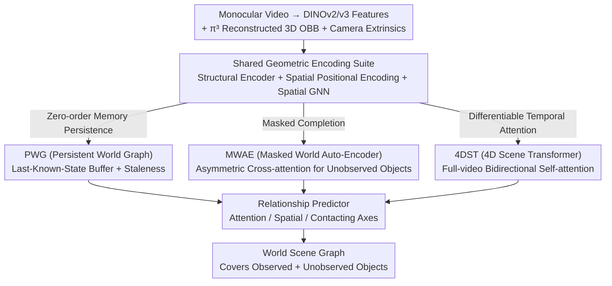

# Towards Spatio-Temporal World Scene Graph Generation from Monocular Videos

**Conference**: CVPR 2026  
**arXiv**: [2603.13185](https://arxiv.org/abs/2603.13185)  
**Code**: [Yes](https://github.com/rohithpeddi/WorldSGG)  
**Area**: Video Understanding  
**Keywords**: Scene Graph Generation, Object Permanence, 3D Scene Understanding, Spatio-Temporal Reasoning, Vision-Language Models

## TL;DR

This paper proposes the World Scene Graph Generation (WSGG) task to construct spatio-temporally persistent, world-coordinate-anchored scene graphs from monocular videos, including all objects (even those occluded or out-of-frame). It introduces the ActionGenome4D dataset and three complementary methods (PWG, MWAE, and 4DST).

## Background & Motivation

### 1. Background
Scene Graph Generation (SGG) has evolved from static images to videos (VidSGG), 3D point clouds (3D SGG), and 4D scenes. However, mainstream methods remain "frame-centric," reasoning about currently visible objects per frame and generating scene graphs in a 2D plane.

### 2. Limitations of Prior Work
- **View Dependency**: All object positions are based on 2D image coordinates, lacking a unified spatial reference frame.
- **Observation Gating**: Objects disappear from the graph once they move out of frame or are occluded, lacking persistent memory.
- **Temporal Fragmentation**: Even with temporal modeling (e.g., STTran, Tempura), only frames within a sliding window are processed, failing to maintain a globally consistent world model.

### 3. Key Challenge
Agents in real-world scenarios must maintain a world model with "object permanence"—the understanding that objects exist even when invisible. Frame-centric SGG designs cannot satisfy the requirements of downstream tasks like robotic manipulation, embodied navigation, and long-term activity understanding for persistent world-state reasoning.

### 4. Goal
The objective is to construct a **temporally persistent, world-coordinate-anchored scene graph representation covering all objects (including invisible ones)**. This includes predicting relationships across three categories: observed-observed, observed-unobserved, and unobserved-unobserved object pairs.

### 5. Key Insight
The principle of "object permanence" from cognitive science is introduced into scene graph generation. The world state $\mathcal{W}^t$ is divided into an observable set $\mathcal{O}^t$ and an unobserved set $\mathcal{U}^t$, requiring the model to map the complete world state at every timestamp.

### 6. Core Idea
- **New Dataset (ActionGenome4D)**: Action Genome is upgraded to a 4D representation, providing world-coordinate OBBs and dense relationship annotations for invisible objects.
- **New Task (WSGG)**: Requires outputting a world scene graph covering all objects in $\mathcal{W}^t$ at each timestamp.
- **Methodological Exploration**: Three methods are explored with different inductive biases for unobserved object reasoning.

## Method

### Overall Architecture

All methods share a unified input and a set of geometric encoding components: pre-extracted DINOv2/v3 visual features, 3D OBB corner coordinates reconstructed via π³, and camera extrinsic matrices. These are fed into a shared suite before entering one of three unobserved object reasoning branches. Finally, a unified relationship predictor outputs the world scene graph. Shared components include:

- **Global Structural Encoder**: Encodes 8 corner points of OBBs into 27-dimensional inputs, generating structural tokens via an MLP.
- **Spatial Positional Encoding**: Calculates 5D features such as Euclidean distance, direction vectors, and volume ratios between object pairs.
- **Spatial GNN**: Uses intra-frame Transformer Encoders + Spatial Positional Encoding to model object interactions.
- **Relationship Predictor**: Fuses human/object tokens, union RoI features, and CLIP text embeddings to predict attention (3 types), spatial (6 types), and contacting (17 types) relationships.
- **Camera Pose / Motion Encoder**: Encodes camera motion and object 3D velocity/acceleration.

The three methods (PWG, MWAE, 4DST) are inserted between the "Shared Geometric Encoding" and the "Relationship Predictor," differing only in how they generate representations for currently invisible objects.

### Key Designs

The three methods share the geometric encoding components but differ in their inductive biases for handling invisible objects: direct memory, masked reconstruction, or differentiable temporal attention.

**1. PWG (Persistent World Graph): Mechanism using a "Last-Known-State" buffer.**
PWG maintains a Last-Known-State (LKS) memory buffer for each object to perform zero-order feature persistence. If an object is visible, current frame features are used; if invisible, it reverts to its most recent visible features. To account for "staleness," PWG records $\Delta_n^{(t)} = |t - \tau^*|$ (the interval since the last visible timestamp $\tau^*$) and feeds it into the fusion. This implements "object permanence" as an engineering rule: invisibility does not imply non-existence.

**2. MWAE (Masked World Auto-Encoder): Mechanism treating unobserved reasoning as masked completion.**
MWAE views occlusion and camera motion as natural "masks." Visible objects are observed patches, while invisible objects are masked patches. Borrowing from the MAE paradigm, the model reconstructs representations of unobserved objects from visible ones. During training, visible objects are randomly masked to force the model to learn completion rather than just memory. It uses asymmetric cross-attention where the query contains all object tokens, but keys/values are restricted to visible tokens.

**3. 4DST (4D Scene Transformer): Mechanism using differentiable temporal attention over the full video.**
4DST makes temporal context differentiable. It constructs a token sequence for each object along the time axis (fusing vision, structure, camera pose, and motion) and uses a bidirectional Transformer for self-attention across the entire video. This allows an object's current representation to absorb evidence from its past and future. It includes sinusoidal positional encoding and a learnable visibility embedding.

### Loss & Training

All methods share a unified multi-axis BCE loss structure. Object pairs are divided into visible pairs (clean GT) and unobserved pairs (VLM pseudo-labels, weighted by $\lambda_{\text{vlm}}$). Losses are calculated for attention, spatial, and contacting axes, alongside node classification. MWAE adds reconstruction terms:

$$\mathcal{L}_{\text{MWAE}} = \mathcal{L}_{\text{SG}} + \lambda_{\text{recon}} \cdot \lambda_{\text{dom}} \cdot \mathcal{L}_{\text{recon}} + \mathcal{L}_{\text{sim}}$$

where $\mathcal{L}_{\text{SG}}$ is the scene graph loss, $\mathcal{L}_{\text{recon}}$ is the MSE for masked object features, and $\mathcal{L}_{\text{sim}}$ is the relationship re-prediction (similarity) loss for masked visible objects.

## Key Experimental Results

### Main Results

**Table 2: Recall (R@K) — PredCls & SGDet on ActionGenome4D**

| Method | Backbone | PredCls R@10 | PredCls R@20 | SGDet R@10 | SGDet R@50 |
|------|----------|-------------|-------------|-----------|-----------|
| PWG | DINOv2-L | 65.07 | 67.99 | 41.69 | 69.63 |
| MWAE | DINOv2-L | 65.33 | 68.30 | 41.69 | 69.50 |
| 4DST | DINOv2-L | 64.31 | 67.26 | **42.64** | 70.32 |
| PWG | DINOv3-L | 65.58 | 68.57 | 39.96 | 70.93 |
| MWAE | DINOv3-L | 65.57 | 68.58 | 39.67 | 70.90 |
| 4DST | DINOv3-L | **66.11** | **69.11** | 40.84 | **71.95** |

**Table 4: VLM Relationship Prediction — micro-averaged F1**

| Pipeline | Model | Mode | Attn F1 | Contact F1 | Spatial F1 | Micro F1 |
|----------|-------|------|---------|-----------|-----------|----------|
| Graph RAG | Qwen 2.5-VL | PredCls | 61.4 | 56.9 | 42.5 | **53.3** |
| Graph RAG | InternVL 2.5 | PredCls | 53.8 | 42.7 | 27.2 | 40.8 |
| Subtitle-Only | Qwen 2.5-VL | PredCls | 61.8 | 53.0 | 39.8 | 51.2 |

### Ablation Study

- **Method Comparisons**: **4DST** most consistently leads in the SGDet setting (R@50=71.95 with DINOv3-L), as its differentiable temporal transformer improves end-to-end propagation. **MWAE** performs best in the multi-label (No Constraint) setting, where reconstruction and simulated occlusion losses act as complementary regularizers. **PWG** lags behind the best methods by only 1–2 points in most PredCls settings, validating that 3D geometric priors are strong structural priors.
- **VLM Ablation**: Graph RAG consistently outperforms Subtitle-Only, though the gap narrows for stronger VLMs like Qwen (+2.1 vs. InternVL's +3.8). Recall for SGDet is approximately half of PredCls, identifying world-level object detection as the primary bottleneck.

### Key Findings

1. Persistent 3D geometric priors (PWG's zero-order persistence) alone achieve highly competitive world scene graph generation.
2. Unobserved object reasoning is further improved by differentiable temporal modeling (4DST), especially in end-to-end SGDet settings.
3. While VLMs provide useful pseudo-labels, they still have significant room for improvement in fine-grained spatial/contacting reasoning (micro F1 53.3 vs. macro F1 26.6, indicating severe long-tail issues).
4. Predicate difficulty follows the order: Attention > Contacting > Spatial.

## Highlights & Insights

1. **Novelty**: WSGG captures the critical shift from frame-centric to world-centric perception, clearly defining $\mathcal{W}^t = \mathcal{O}^t \cup \mathcal{U}^t$.
2. **Experimental Thoroughness**: The pipeline from π³ 3D reconstruction to VLM pseudo-labeling and manual correction (ActionGenome4D) is systematic and reproducible.
3. **Design Motivation**: The three methods (PWG, MWAE, 4DST) represent distinct and complementary inductive biases: memory buffers, auto-encoding completion, and full temporal attention.
4. **Value**: World scene graphs provide a vital intermediate representation connecting visual perception to embodied action.
5. **Key Insight**: Incorporating "object permanence" into the technical design, such as PWG's staleness awareness, is naturally aligned with cognitive principles.

## Limitations & Future Work

1. **End-to-End Gap**: The multi-stage pipeline (reconstruction → detection → extraction → prediction) allows error propagation.
2. **VLM Pseudo-label Quality**: Reasoning for invisible objects relies on VLM labels; noise is mitigated by weights ($\lambda_{\text{vlm}}$) but not fully resolved.
3. **Long-tail Distribution**: Macro F1 is significantly lower than micro F1, highlighting predicate class imbalance.
4. **Limited Scope**: Currently restricted to human-object interactions rather than general object-object pairs.
5. **Offline Processing**: 4DST requires bidirectional attention over the full video, making it unsuitable for online streaming inference.

## Related Work & Insights

- **Relation to VidSGG**: WSGG is a superset of VidSGG, extending from frame-level to world-level and adding 3D localization and unobserved reasoning.
- **Relation to 3D/4D SGG**: Existing 3D SGG deals with static scans; 4D SGG often requires RGB-D. WSGG operates on monocular video and covers invisible objects.
- **MAE to Object-level MAE**: MWAE generalizes masked auto-encoders from patches to objects/relationships, using natural occlusion as a substitute for manual masking.
- **VLM as Labelers**: The Graph RAG pipeline (Event Graph → Retrieval → Frame Prediction → Discriminative Verification) is a practical paradigm for using VLMs to generate structured labels.

## Rating

⭐⭐⭐⭐ The task definition is visionary, the dataset construction is solid, and the method design is systematic. Experimental coverage is comprehensive. However, the end-to-end integration and long-tail issues remain areas for improvement.

<!-- RELATED:START -->

## Related Papers

- [\[CVPR 2026\] OmniGround: A Comprehensive Spatio-Temporal Grounding Benchmark for Real-World Complex Scenarios](omniground_a_comprehensive_spatio-temporal_grounding_benchmark_for_real-world_co.md)
- [\[CVPR 2026\] Streaming Video Crime Anticipation with Spatio-Temporal Causal Reasoning](streaming_video_crime_anticipation_with_spatio-temporal_causal_reasoning.md)
- [\[CVPR 2025\] HyperGLM: HyperGraph for Video Scene Graph Generation and Anticipation](../../CVPR2025/video_understanding/hyperglm_hypergraph_for_video_scene_graph_generation_and_anticipation.md)
- [\[CVPR 2026\] VISTA: Video Interaction Spatio-Temporal Analysis Benchmark](vista_video_interaction_spatio-temporal_analysis_benchmark.md)
- [\[CVPR 2026\] Cluster-Wise Spatio-Temporal Masking for Efficient Video-Language Pretraining](cluster-wise_spatio-temporal_masking_for_efficient_video-language_pretraining.md)

<!-- RELATED:END -->
