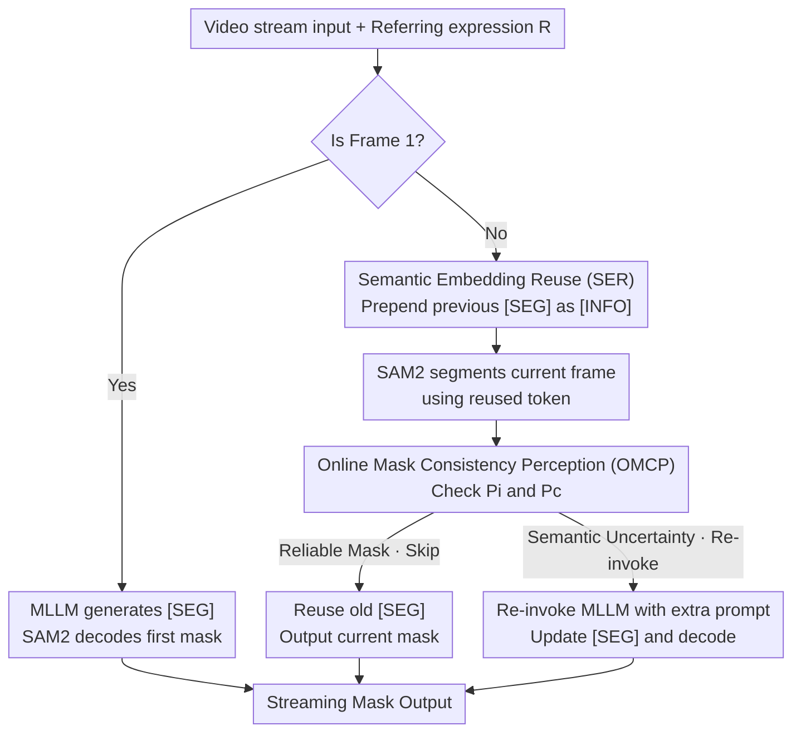

# Towards Streaming Referring Video Segmentation via Large Language Model

**Conference**: CVPR 2026  
**Paper**: [CVF Open Access](https://openaccess.thecvf.com/content/CVPR2026/html/Zhang_Towards_Streaming_Referring_Video_Segmentation_via_Large_Language_Model_CVPR_2026_paper.html)  
**Code**: https://github.com/wkzhang636/StreamingRVOS  
**Area**: Video Understanding / Referring Segmentation / Multi-modal VLM  
**Keywords**: Referring Video Segmentation, Streaming Inference, MLLM, Semantic Embedding Reuse, Adaptive Invocation

## TL;DR
StreamingRVOS transforms MLLM-based referring image segmentation into a "frame-by-frame streaming" referring video segmentation paradigm. It utilizes **Semantic Embedding Reuse (SER)** to feed the previous frame's `[SEG]` token back into the MLLM as temporal context, and employs **Online Mask Consistency Perception (OMCP)** to determine whether to re-invoke the MLLM for the current frame. Without adding any parameters, the 1B variant achieves a 19.2% improvement over Sa2VA on MeViS, while streaming inference reaches 7 FPS on a single A800 GPU.

## Background & Motivation

**Background**: Referring Video Object Segmentation (RVOS) requires segmenting and tracking a target throughout a video based on a natural language description (e.g., "a person wearing black pants"). Current mainstream MLLM-based approaches (such as VISA, VideoLISA, Sa2VA, VRS-HQ, GLUS, etc.) almost exclusively follow an "offline three-stage" pipeline: first, a sampling strategy selects sparse keyframes from the video; then, the MLLM performs image-level referring segmentation on these frames to output `[SEG]` tokens; finally, the resulting sparse masks serve as prompts for a segmentation assistant (like SAM2) to propagate the masks to the remaining frames.

**Limitations of Prior Work**: This offline pipeline suffers from three persistent issues. First is the **pre-processing burden**, as it relies on carefully designed frame sampling strategies that introduce extra overhead and isolate workflow steps. Second is the **optimization difficulty**, where the lack of close coupling between sampling, image segmentation, and mask propagation prevents end-to-end joint optimization. Third is **restricted applicability**, as the inherent offline mode requires the entire video beforehand, making it unable to handle real-world video streams, while the few existing online methods lack sufficient real-time performance.

**Key Challenge**: Developing a true streaming paradigm (frame-by-frame input and output) faces a dilemma. Discarding all prior frame information when processing the current frame leads to **temporal forgetting**, manifesting as mask jumping and semantic inconsistency. Conversely, feeding all video frames sequentially without compression causes a continuous accumulation of redundant visual information, leading to a surge in memory and computational costs, which collapses training and inference efficiency. Furthermore, independently invoking the MLLM for every frame leads to redundant computation due to high similarity between adjacent frames, making throughput a bottleneck.

**Goal**: The objective is to "upgrade" image-level referring segmentation to a video-level online paradigm that consumes video streams and outputs mask streams without damaging existing frameworks or adding new modules and parameters. This is decomposed into two sub-problems: (1) how to propagate semantics efficiently between frames without forgetting or memory overflow, and (2) when it is necessary to re-invoke the expensive MLLM.

**Key Insight**: The authors observe that the `[SEG]` token, which connects the MLLM and the segmentation assistant, is effectively a "condensed representation" of the current frame's foreground semantics. Since it encodes semantics, it can naturally be recycled as a temporal prompt for the next frame. This transforms the "temporal memory" problem into a "token reuse" problem, requiring no additional memory banks or attention modules.

**Core Idea**: Replace the "sampling + propagation" offline pipeline with "reusing the previous frame's segmentation token as a temporal prompt + using mask quality signals to decide whether to re-invoke the MLLM," achieving sampling-free streaming referring video segmentation.

## Method

### Overall Architecture
StreamingRVOS is built upon a LISA-style image-level framework where the MLLM generates a `[SEG]` token and a segmentation assistant (SAM2) decodes the mask. This is modified for frame-by-frame streaming. The video enters the model as an image sequence: **Frame 1** is treated as pure image-level referring segmentation, with "image + expression $R$" as input, leading to a `[SEG]` token and the initial mask. **From Frame 2 onwards**, the model prepends the semantic embedding condensed from the previous frame (denoted as `[INFO]`) into the MLLM input as temporal context (SER). However, the MLLM is not invoked for every frame. Instead, the assistant first performs segmentation using the reused token, and then OMCP evaluates the quality and continuity of this mask. Only when OMCP determines that "semantics may have changed / the mask is unreliable" is the MLLM re-invoked to correct semantics and regenerate the `[SEG]` token; otherwise, the token is reused directly to save computation.

### Key Designs

**1. Semantic Embedding Reuse (SER): Recycling Segmentation Tokens as Temporal Memory**

Processing frames independently breaks video context, potentially causing the MLLM to misjudge whether a referred action is currently occurring, leading to inconsistent masks. SER treats the `[SEG]` token generated by the MLLM as the condensed foreground information of the previous frame, denoted as `[INFO]`. It is fed back into the MLLM along with the current frame and referring expression, marked by `[context]` and `[/context]` tokens. Formally, the MLLM input is defined as:

$$\text{Input} = \begin{cases} I_i + R, & i = 1 \\ I_i + R + [\text{INFO}], & i > 1 \end{cases}$$

where $i$ is the frame index. For single images or the first frame of a video, `[INFO]` is a non-semantic placeholder. The brilliance of this design lies in **zero additional parameters**—it does not require memory banks or memory attention like SAM2, but instead reuses the token that already must pass between the MLLM and the assistant, essentially providing a temporal information channel for free.

**2. Online Mask Consistency Perception (OMCP): Adaptive MLLM Invocation via Mask Quality**

To avoid redundant calculation from high similarity between adjacent frames, OMCP allows the mask to "report" its own reliability rather than blindly invoking the MLLM. It uses two parameter-free metrics: the **current mask confidence** $P_i$, which reuses the predicted IoU from the assistant (SAM2), and the **inter-frame mask consistency** $P_c$, measured by the IoU between the current and previous masks:

$$P_c = \frac{|M_i \cap M_{i-1}|}{|M_i \cup M_{i-1}|}$$

The trigger condition is defined as:

$$\text{OMCP} = (P_i > \tau_1) \,\&\, (P_c > \tau_2)$$

When both are satisfied, the mask is considered reliable and consistent, and the old `[SEG]` is reused. If either falls below the threshold, the MLLM is re-invoked with an explicit instruction (e.g., "target might have changed, focus on context") to update the semantics.

**3. Streaming Training Pipeline + End-to-End Joint Optimization**

To bridge the gap between training and streaming inference, the authors employ a two-stage training strategy. **Stage 1: Joint Optimization** focuses on image-level segmentation on mixed image-text datasets to solidify the foundation. **Stage 2: Video Semantic Fine-tuning** specifically fine-tunes the model under "semantic ambiguity and temporal discontinuity" conditions (simulated via OMCP) to teach the model when to skip and when to re-judge. The model is optimized end-to-end with a mask loss combining Binary Cross-Entropy and DICE:

$$L_{mask} = \lambda_{bce} L_{bce}(X_M^s, \hat{X}_M^s) + \lambda_{dice} L_{dice}(X_M^s, \hat{X}_M^s)$$

The total loss includes the text auto-regressive cross-entropy $L_{txt}$:

$$L_{total} = \lambda_{txt} L_{txt}(y_{txt}, \hat{y}_{txt}) + \lambda_{mask} L_{mask}$$

All $\lambda$ values are set to 1. Training with the OMCP trigger condition in Stage 2 aligns the training distribution with inference behavior.

### Loss & Training
The MLLM uses InternVL2.5-1B / 4B as the backbone, trained with XTuner. The perception model is frozen while the LLM is fine-tuned using LoRA. The max sequence length is 8192, with an initial learning rate of $4\times10^{-5}$ on 8×A800 GPUs. OMCP thresholds are $\tau_1=0.7, \tau_2=0.1$ for the 1B variant and $\tau_1=0.8, \tau_2=0.2$ for the 4B variant. Video clips are segmented into 5 frames for streaming processing during training.

## Key Experimental Results

### Main Results
Comparison with SOTA on four RVOS benchmarks (J&F metric):

| Method | Params/Source | Ref-DAVIS17 | Ref-YT-VOS | MeViS | ReVOS |
|------|-----------|-------------|------------|-------|-------|
| GLUS [CVPR'25] | 7B | - | 67.3 | 51.3 | 58.3 |
| VRS-HQ [CVPR'25] | 7B | 76.0 | 70.4 | 50.6 | 62.1 |
| ViLLa [ICCV'25] | 6B | 74.3 | 67.5 | 49.4 | - |
| Sa2VA-1B [Arxiv'25] | 1B | 72.3 | 65.3 | 41.7 | 39.0* |
| Sa2VA-4B [Arxiv'25] | 4B | 73.8 | 70.0 | 46.2 | 59.8* |
| **StreamingRVOS-1B** | 1B | 76.4 | 69.1 | 49.7 | 59.7 |
| **StreamingRVOS-4B** | 4B | **76.6** | 70.5 | 50.9 | **63.0** |

The 1B variant approaches the performance of the 7B VRS-HQ, and the 4B variant achieves SOTA on Ref-DAVIS and ReVOS.

### Ablation Study
Breakdown of SER and OMCP (compared to Sa2VA retrained on the same data):

| Configuration | SER | OMCP | Ref-DAVIS | MeViS(valu) | ReVOS |
|------|-----|------|-----------|-------------|-------|
| Sa2VA-1B-Stream† | | | 74.4 | 57.1 | 58.0 |
| Ours-1B | ✓ | | 75.0 | 58.5 (↑6.1) | 58.9 |
| Ours-1B | ✓ | ✓ | 76.4 | 59.5 (↑7.1) | 59.7 |

### Key Findings
- **SER benefits dynamic scenes most**: Removing semantic reuse drops MeViS by 6.1 points, proving its role in maintaining temporal coherence during motion.
- **OMCP is both faster and more accurate**: Compared to per-frame updates, OMCP doubles the FPS (3.4 to 6.7) and improves accuracy due to the alignment of training and inference triggers.
- **High dependency on the first frame**: In a streaming paradigm, the quality of the first frame significantly affects subsequent frames, although OMCP provides a mechanism for online correction.

## Highlights & Insights
- **Tokens as Temporal Memory**: Using the existing `[SEG]` token as a semantic carrier turns a complex memory problem into a zero-parameter token reuse task.
- **Adaptive Scheduling with Zero Modules**: OMCP utilizes existing signals (predicted IoU) to schedule the expensive MLLM, providing a general paradigm for "expensive model + cheap quality signal" cascading systems.
- **Efficiency through Alignment**: Aligning the adaptive trigger logic between the training and inference phases is the primary driver of performance gains.

## Limitations & Future Work
- **Global Reasoning**: Performance is limited on Video Reasoning Segmentation (VRS) tasks that require global offline inference, as the streaming paradigm is inherently causal and cannot look into the future.
- **Simple Memory Mechanism**: The FIFO queue for `[INFO]` tokens is relatively basic; future work could explore tree-based memories or gated aggregation.
- **Threshold Tuning**: OMCP thresholds currently require manual tuning based on the model scale and dataset.

## Related Work & Insights
- **vs Sa2VA**: While Sa2VA handles multiple images offline, StreamingRVOS introduces online frame-by-frame processing with SER and OMCP, showing significant gains in dynamic scenes.
- **vs VRS-HQ**: StreamingRVOS matches or exceeds the 7B VRS-HQ using fewer parameters (1B/4B) and a sampling-free online approach.
- **vs SAM2 Memory**: Unlike SAM2-based methods that modify internal memory banks, this work operates at the MLLM level, making the two approaches complementary.

## Rating
- Novelty: ⭐⭐⭐⭐
- Experimental Thoroughness: ⭐⭐⭐⭐
- Writing Quality: ⭐⭐⭐⭐
- Value: ⭐⭐⭐⭐

<!-- RELATED:START -->

## Related Papers

- [\[CVPR 2026\] InterRVOS: Interaction-Aware Referring Video Object Segmentation](interrvos_interaction-aware_referring_video_object_segmentation.md)
- [\[CVPR 2026\] Long-RVOS: A Comprehensive Benchmark for Long-term Referring Video Object Segmentation](long-rvos_a_comprehensive_benchmark_for_long-term_referring_video_object_segment.md)
- [\[CVPR 2026\] DeRVOS: Decoupling Consistent Trajectory Generation and Multimodal Understanding for Referring Video Object Segmentation](dervos_decoupling_consistent_trajectory_generation_and_multimodal_understanding_.md)
- [\[CVPR 2026\] Bootstrapping Video Semantic Segmentation Model via Distillation-assisted Test-Time Adaptation](bootstrapping_video_semantic_segmentation_model_via_distillation-assisted_test-t.md)
- [\[CVPR 2026\] Enhancing Video Vision Language Model with Hippocampal Sensing](enhancing_video_vision_language_model_with_hippocampal_sensing.md)

<!-- RELATED:END -->
