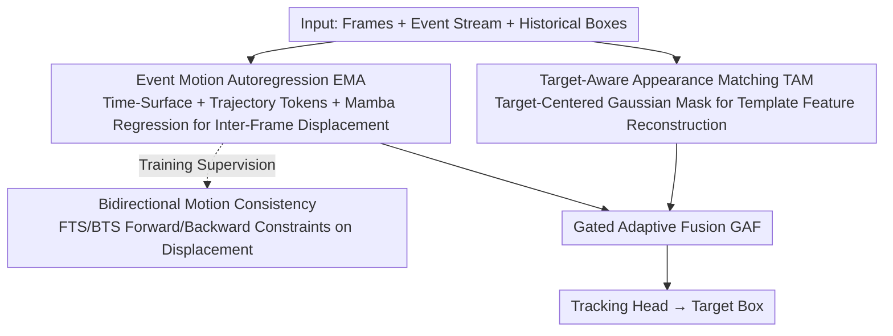

# Tracking through Severe Occlusion via Event-Derived Transient Cues

**Conference**: CVPR 2026  
**Paper**: [CVF Open Access](https://openaccess.thecvf.com/content/CVPR2026/html/Dong_Tracking_through_Severe_Occlusion_via_Event-Derived_Transient_Cues_CVPR_2026_paper.html)  
**Code**: To be confirmed  
**Area**: Video Understanding / Object Tracking / Event Camera  
**Keywords**: Visual Object Tracking, Severe Occlusion, Event Camera, Motion Autoregression, Time-Surface

## TL;DR
To address tracking failures caused by "severe target occlusion + non-linear motion", the authors propose EvoTrack: leveraging microsecond-level transient motion cues from event cameras to perform "motion autoregression" for predicting target positions during occlusion, while reinforcing appearance matching with target-aware Gaussian masks. These two paths are dynamically fused via an adaptive gate. The paper also releases FEOT, a high-resolution frame-event tracking dataset with graded occlusion annotations. EvoTrack achieves state-of-the-art performance on FE108, VisEvent, COESOT, and FEOT.

## Background & Motivation
**Background**: Visual Object Tracking (VOT) aims to locate a target in subsequent frames given the initial bounding box. Current mainstream methods are divided into two paradigms: first, **appearance matching** (e.g., MixFormer), which frames tracking as a similarity matching problem between the template and search regions, maintaining similarity by dynamically updating templates or maintaining a template library; second, **trajectory autoregression** (e.g., SeqTrack, ARTrack), which treats tracking as a sequence prediction problem, inferring the current position from historical trajectories.

**Limitations of Prior Work**: Both paradigms break down under **severe occlusion**. For appearance matching, once the target is occluded and its appearance is destroyed, template-search similarity collapses immediately; dynamic template updating is also prone to "template contamination" by absorbing occluding objects or background. While trajectory autoregression is more robust to occlusion, it is highly sensitive to motion patterns and **cannot handle non-linear motions**. Conventional cameras have limited frame rates and cannot capture inter-frame dynamics. Occlusion further fragments sparse trajectories, resulting in cumulative prediction drift, potentially pushing the target out of the search region and preventing recovery after occlusion.

**Key Challenge**: Occlusion simultaneously introduces two coupled degradations: **spatial appearance deprivation** (which ruins template-search similarity) and **temporal trajectory fragmentation** (which hinders the modeling of motion dynamics). The natural degradation of spatial matching mechanisms under occlusion highlights the critical importance of **temporal cues**. However, the frame rate of conventional cameras is insufficient to capture the inter-frame dynamics required to model non-linear motions.

**Key Insight**: Event cameras possess microsecond-level temporal resolution, enabling them to capture **transient motion details** lost by conventional cameras. The precise timestamps in the event stream inherently encode the direction and speed of target motion, making them ideal for modeling non-linear motion. Although existing event trackers perform well in high-speed, highly dynamic scenarios, they generally overlook the long-standing challenge of occlusion.

**Core Idea**: Compensate for **spatial appearance degradation** using **temporal motion prediction**. This upgrades "trajectory autoregression" to "motion autoregression", capturing inter-frame transient dynamics through the event stream to predict positions accurately during occlusion and rectify them quickly afterward ("predict under occlusion, rectify afterward").

## Method

### Overall Architecture
EvoTrack is an occlusion-robust tracking framework that utilizes a dual "motion-appearance" branch. The input consists of co-axially aligned **frames + event stream + historical bounding boxes**, and the output is the current target bounding box. The two branches run in parallel: the **Event Motion Autoregression (EMA)** branch constructs time-surfaces from events, combines them with historical trajectory tokens, and uses Mamba to regress inter-frame displacement, enabling target localization even under severe appearance degradation. The **Target-Aware Appearance Matching (TAM)** branch reconstructs template features using Gaussian masks during unoccluded or lightly occluded phases to learn invariant representations and ensure high precision. In the EMA branch, **bidirectional motion consistency** is introduced as a physical constraint during training to improve motion prediction accuracy. Finally, a **Gated Adaptive Fusion (GAF)** module dynamically weights the features from both branches according to the severity of occlusion before passing them to the tracking head to generate the bounding box. The overall philosophy is: appearance is reliable under light occlusion, while motion dominates under heavy occlusion, creating a strong complementarity.

### Key Designs

**1. Event Motion Autoregression EMA: Upgrading "Trajectory Autoregression" to "Motion Autoregression" to Regress Positions Even During Occlusion**

To address the drift of trajectory autoregression under occlusion and non-linear motion, EMA introduces transient cues from event streams to directly regress inter-frame displacement. The core representation is the **Forward Time-Surface (FTS)**. Within the interval $[s_t, e_t]$, the event set $\xi=\{e=(p_k,t_k,x_k,y_k)\}_{k=1}^N$ (coordinates, polarity, timestamp) is collected, and timestamps are normalized to $[0,255]$ to obtain $\xi^*$. Each pixel takes the timestamp of the latest event at that location to form a time map:

$$I_f(i,j)=\max\{t_e \mid e\in\xi^*,\ x_e=i,\ y_e=j\}$$

Pixels without events are set to 0. Histogram equalization is then applied: $\mathrm{FTS}(i,j)=H(I_f(i,j))$ to counteract the uneven distribution of event triggers, ensuring the time-surface accurately reflects the target motion. In the FTS, temporal increments indicate motion **direction**, and event trails indicate motion **speed**. Its gradient map is computed to emphasize the leading motion edges, and it is concatenated with FTS along the channel dimension to form a "motion map". On the autoregression side, the original trajectory autoregression formulation is $P(Y^t \mid Y^{t-1-N:t-1},(C,Z,X^t))$ (inferring the current position from the last $N$ historical positions, where $Z$ is the template, $X^t$ is the search image, and $C$ is the command token). EvoTrack extends this to motion autoregression by introducing the motion map $M$:

$$P(Y^t \mid (Y^{t-1-N:t-1},\ M^{t-1:t},\ C),\ (Z,X^t))$$

Specifically, historical target boxes are projected into a unified global coordinate system to construct trajectory representations, which are converted into trajectory tokens and concatenated with command tokens. The motion map is patched and concatenated with the trajectory tokens to form token embeddings, which are then fed into the **Mamba** module to extract motion features for position regression. This allows the position to be regressed through transient motion even when appearance cues are heavily corrupted.

**2. Bidirectional Motion Consistency: Using Forward and Backward Time-Surfaces to Exert Physical Constraints on Non-Linear Motion**

Using only the forward time-surface acts as a single "old-to-new" perspective. The authors construct a complementary "new-to-old" view, the **Backward Time-Surface (BTS)**: each pixel takes the **earliest** event timestamp $I_b(i,j)=\min\{t_e\mid\cdot\}$ (pixels without events are set to 255), and $\mathrm{BTS}(i,j)=H(255-I_b(i,j))$ is computed. FTS and BTS represent forward and time-reversed views of the same event segment and the same physical motion. They share the **same speed but opposite directions**, thus naturally providing an intrinsic motion consistency signal. During training, the motion maps of FTS and BTS are concatenated with trajectory tokens and fed into Mamba. A **shared-weight MLP** is used to predict the forward and backward displacements $\delta_{\text{forward}}$ and $\delta_{\text{backward}}$, which should share the same magnitude but opposite directions. Consequently, a **bidirectional motion consistency supervision** is enforced as an explicit physical constraint. Ablation studies show that this constraint yields a gain of +2.5% PR and +1.5% SR, validating its effectiveness in modeling non-linear motion.

**3. Target-Aware Appearance Matching TAM: Mimicking Occlusion via Target-Centered Gaussian Masks to Learn Invariant Representations Without Background Interference**

Integrating a motion branch does not mean abandoning appearance; appearance remains critical for high-precision localization when there is no occlusion or light occlusion. Existing works (such as ORTrack) reconstruct template features using **random masks** to learn invariant features, but random masks cover the entire template including the background, which can lead the model to learn background distractors and trigger false matching responses during occlusion. TAM replaces this with a **target-aware Gaussian mask**. Utilizing the known target box prior in the template, it constructs a Gaussian distribution centered on the target to guide the mask to fall primarily on the target region:

$$f_g(x,y)=\frac{1}{2\pi\sigma_x\sigma_y}\exp\!\Big(-\big[\tfrac{(x-c_x)^2}{\sigma_x^2}+\tfrac{(y-c_y)^2}{\sigma_y^2}\big]\Big)$$

Here, $(c_x,c_y)$ denotes the center of the target box in the template, and the standard deviation $[\sigma_x,\sigma_y]$ is set to 1/4 of the width and height of the target box. This target-centered Gaussian masking essentially "simulates occlusion on the target," forcing the model to focus on discriminative target parts and enhance feature invariance during training. Simultaneously, the mask probability of the background region is suppressed, significantly mitigating background interference. In practice, cross-attention is first used to extract appearance features from the template and search regions to generate the Gaussian mask, followed by a shared self-attention module to reconstruct template features.

**4. Gated Adaptive Fusion GAF: Dynamically Weighting Motion and Appearance Based on Occlusion Severity**

The severity of occlusion in real-world scenarios varies. Appearance is highly reliable under light occlusion, while motion dominates under severe occlusion; static fusion strategies (such as direct summation or concatenation) fail to handle this. GAF dynamically combines both cues via a gating mechanism. The overall training loss jointly optimizes classification, regression, reconstruction, and motion prediction:

$$L=\lambda_1 L_{ce}+\lambda_2 L_{giou}+\lambda_3 L_{l1}+\lambda_4 L_{app.}+\lambda_5 L_{mot.}$$

Here, classification uses cross-entropy $L_{ce}$, bounding box regression uses GIoU + L1 ($L_{giou}, L_{l1}$), $L_{app.}$ is the MSE of appearance reconstruction, $L_{mot.}$ is the MSE of inter-frame displacement prediction, and $\lambda_i$ are balancing weights. In ablation studies, gated fusion outperforms summation and concatenation, demonstrating that dynamic weighting improves robustness by integrating complementary information under varying occlusion levels.

### Loss & Training
Implemented in PyTorch using 8× NVIDIA RTX 3090, with a batch size of 8. The optimizer is AdamW with a weight decay of $5\times10^{-4}$ and a learning rate of $8\times10^{-5}$. The motion branch uses a pretrained **Mamba** module, and the appearance branch uses **ViT-B + DINOv2** pretrained weights. Search regions are sized at $224\times224$, and templates at $112\times112$. The model is fine-tuned for 200 epochs on the training set. Note: The FEOT dataset is **only used for evaluating occlusion robustness and is not included in training**.

## Key Experimental Results

### Main Results
The proposed method is compared against three types of SOTA trackers (frame-only, event-only, frame-event) on three public benchmarks (FE108, VisEvent, COESOT) and the self-built FEOT (PR: Precision Rate, SR: Success Rate, in %):

| Method | Type | FE108 PR/SR | VisEvent PR/SR | COESOT PR/SR | FEOT PR/SR |
|------|------|-------------|----------------|--------------|------------|
| SeqTrack | Frame | 80.5 / 55.4 | 76.9 / 60.7 | 82.2 / 71.8 | 50.1 / 38.2 |
| ARTrack | Frame | 74.1 / 49.9 | 70.0 / 54.3 | 75.1 / 64.6 | 39.1 / 30.6 |
| HDETrack | Event | 92.2 / 59.8 | 54.6 / 37.3 | 64.1 / 53.1 | 53.1 / 40.1 |
| ViPT | Frame+Event | 93.8 / 65.8 | 75.8 / 59.2 | 84.9 / 75.4 | 55.4 / 43.4 |
| SDSTrack | Frame+Event | 92.0 / 64.6 | 76.7 / 59.7 | 84.5 / 74.9 | 58.0 / 45.1 |
| SeqTrack v2 | Frame+Event | 92.8 / 65.5 | **79.4 / 63.0** | 85.0 / 75.9 | 56.1 / 43.1 |
| **EvoTrack** | Frame+Event | **94.6 / 68.4** | **80.1** / 62.1 | **85.4 / 76.2** | **62.7 / 45.2** |

- On the indoor **FE108** benchmark focusing on high-speed/non-linear motion, the method achieves 68.4% SR / 94.6% PR, demonstrating competitiveness in complex motion scenarios.
- On the occlusion-specific high-resolution **FEOT** dataset, it outperforms competing methods by a wide margin (62.7/45.2, creating a substantial PR gap compared to the second-best SDSTrack 58.0/45.1 and SeqTrack v2 56.1/43.1), demonstrating the utility of motion cues under appearance degradation.
- On **VisEvent**, the PR outperforms the prior best by 0.7%, though the SR (62.1) is second to SeqTrack v2 (63.0). The authors attribute this to some videos lacking raw event files, which affected training. ⚠️ Please refer to the original paper.

### Ablation Study
Component ablation (EMAbase = only forward time-surface; EMAbmc = forward + backward time-surfaces + motion consistency supervision):

| TAM | EMAbase | EMAbmc | PR(%) | SR(%) | Note |
|-----|---------|--------|-------|-------|------|
| ✓ | | | 91.4 | 62.8 | Appearance matching only |
| | ✓ | | 84.1 | 50.2 | Basic motion branch only |
| | | ✓ | 87.3 | 56.4 | Motion branch with bidirectional consistency only |
| ✓ | ✓ | | 92.1 | 66.9 | Appearance + Basic motion |
| ✓ | | ✓ | **94.6** | **68.4** | Full model |

Mask strategy ablation (VisEvent) and fusion strategy ablation (VisEvent):

| Mask Strategy | PR/SR(%) | | Fusion Strategy | PR/SR(%) |
|----------|----------|---|----------|----------|
| No Mask | 75.7 / 59.6 | | Add | 77.5 / 61.8 |
| Random Mask | 79.7 / 60.2 | | Concat | 78.9 / 62.0 |
| **Gaussian Mask** | **80.1 / 62.1** | | **Gated Adaptive** | **80.1 / 62.1** |

### Key Findings
- **Strong Complementarity of Motion and Appearance**: Removing EMA drops performance due to spatial discrepancies between search and template regions. Removing TAM leaves only the motion branch, which lacks appearance guidance to refine localization. Motion compensates for short-term position drift when appearance is degraded, while appearance refines localization errors when motion deviates.
- **Effectiveness of Bidirectional Time-Surfaces**: Replacing TAM+EMAbase (92.1/66.9) with EMAbmc (94.6/68.4) yields +2.5% PR / +1.5% SR, proving that bidirectional motion consistency regularizer helps capture complex non-linear motions.
- **Occlusion Degradation Analysis**: Performance declines gradually with increased occlusion ratios and durations. The success rate drops significantly when the occlusion ratio exceeds 60%, yet EvoTrack consistently maintains a higher SR across all occlusion levels.
- **Attention Visualization**: When occlusion worsens, the appearance response attenuates rapidly while motion activation remains stable. The fused representation leans heavily toward motion. This matches the trend of the IoU curve, validating that motion prediction effectively mitigates occlusion-induced failures.

## Highlights & Insights
- **Using Event Stream Timestamps Directly as Motion Signals**: FTS/BTS creates maps using maximum/minimum timestamps, where temporal increments encode direction and trails encode speed. This elegant representation maps the microsecond-level resolution of event cameras to regressible motion quantities, yielding cleaner boundaries than exponential-decay time-surfaces.
- **Bidirectional Time-Surfaces = Free Physical Constraints**: The forward and backward views of the same physical motion possess "identical speed but opposite directions." This allows the formulation of self-supervised consistency constraints without extra annotations, a motif that can be adapted to any event- or optical-flow-based motion prediction tasks.
- **Target-Aware Gaussian Masking**: Shifting from "masking the entire template randomly" to "applying a target-centered Gaussian mask" simulates occlusion while avoiding background contamination. This serves as a targeted modification of MAE-style random masking for tracking scenarios.
- **Paradigm Shift**: Transitioning from "trajectory autoregression" to "motion autoregression" inherently acknowledges the inevitable failure of spatial matching under occlusion, relying instead on temporal motion cues. This reframing offers greater conceptual insight than simply stacking modules.

## Limitations & Future Work
- **Sensitivity to Event Data Quality**: The sub-optimal SR on VisEvent is attributed to the lack of raw event files in certain videos, indicating that the framework is sensitive to the completeness of the event stream.
- **Degradation Under Extreme Occlusion**: Performance drops significantly when the occlusion ratio exceeds 60%. Under long-term total occlusion (spanning hundreds of frames), motion extrapolation errors still accumulate.
- **Hardware Barriers**: The method requires a coaxial setup of a frame camera and an event camera via a beamsplitter, which incurs higher deployment costs and calibration complexity compared to frame-only solutions.
- **FEOT Used Only for Evaluation**: The FEOT benchmark is not used during training; hence, cross-domain generalization and the potential gains from targeted training on occluded data remain unexplored.

## Related Work & Insights
- **vs. Appearance Matching (e.g., MixFormer / ORTrack)**: These methods rely completely on template-search similarity, which collapses under severe occlusion. EvoTrack uses motion autoregression to localize targets when appearance fails, and TAM prevents background contamination using target-aware Gaussian masks instead of ORTrack's random masking.
- **vs. Trajectory Autoregression (e.g., SeqTrack / ARTrack)**: These approaches utilize only historical trajectories without explicit motion modeling, rendering them prone to drift under non-linear motions. EvoTrack introduces temporal motion maps to transition from "trajectory autoregression" to "motion autoregression," leading to more accurate predictions during occlusion and faster correction afterward.
- **vs. Existing Event Trackers (e.g., STNet / HDETrack)**: Existing event-based trackers excel at high-speed/highly dynamic tracking but ignore occlusion. EvoTrack is tailored for occlusion, using frame-event modal fusion instead of pure events to balance appearance texture and dynamic range.
- **vs. Occlusion-Aware Tracking (e.g., LTOP / DOCPF / MTOA)**: These methods often propagate appearance via RNNs or maintain template pools, remaining reliant on spatial appearance cues. EvoTrack bypasses the limitation of "unusable appearance under severe occlusion" by transitioning to temporal motion prediction.

## Rating
- Novelty: ⭐⭐⭐⭐⭐ Formulating a "motion autoregression" paradigm using event time-surfaces and bidirectional consistency features strong originality in both paradigm and representation.
- Experimental Thoroughness: ⭐⭐⭐⭐ Compares across four datasets, with comprehensive ablation and occlusion degradation analyses, though some ablations are not unified across all datasets.
- Writing Quality: ⭐⭐⭐⭐ Clear logical progression from motivation to methodology and experiments, supplemented by rich illustrations.
- Value: ⭐⭐⭐⭐⭐ Provides both methodological contributions and a high-resolution FEOT benchmark containing graded occlusion annotations, offering long-term value to the tracking community.

<!-- RELATED:START -->

## Related Papers

- [\[CVPR 2026\] Seeing Motion Through Polarity for Event-based Action Recognition](seeing_motion_through_polarity_for_event-based_action_recognition.md)
- [\[CVPR 2026\] Occlusion-Aware SORT: Observing Occlusion for Robust Multi-Object Tracking](occlusion-aware_sort_observing_occlusion_for_robust_multi-object_tracking.md)
- [\[CVPR 2026\] Rethinking Occlusion Modeling for UAV Tracking](rethinking_occlusion_modeling_for_uav_tracking.md)
- [\[CVPR 2026\] TAPFormer: Robust Arbitrary Point Tracking via Transient Asynchronous Fusion of Frames and Events](ttapformer_robust_arbitrary_point_tracking_via_transient_asynchronous_fusion_of_.md)
- [\[CVPR 2026\] Event6D: Event-based Novel Object 6D Pose Tracking](event6d_event-based_novel_object_6d_pose_tracking.md)

<!-- RELATED:END -->
