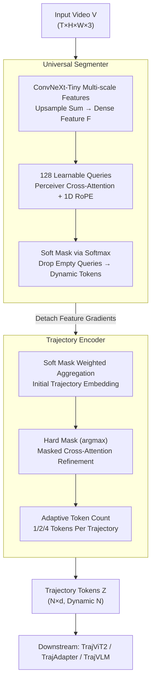

# TrajTok: Learning Trajectory Tokens Enhances Video Understanding

**Conference**: CVPR2026  
**arXiv**: [2602.22779](https://arxiv.org/abs/2602.22779)  
**Code**: To be confirmed  
**Area**: Video Segmentation / Video Understanding  
**Keywords**: Video tokenization, trajectory tokens, end-to-end segmentation, Video CLIP, VLM connector, token compression, object trajectories

## TL;DR

Ours proposes TrajTok—an end-to-end differentiable trajectory tokenizer that implicitly clusters video pixels into object trajectory tokens, replacing external segmentation+tracking pipelines. It achieves significant improvements across three scenarios: training from scratch (TrajViT2), feature adaptation (TrajAdapter), and Vision-Language Model connectors (TrajVLM), notably outperforming patch pooling in long-video QA.

## Background & Motivation

1.  **Explosion of video token count**: Current video Transformers use spatiotemporal patches for tokenization, where the number of tokens grows linearly or quadratically with resolution and frame count, leading to severe memory bottlenecks.
2.  **Limitations of prior token reduction methods**: Token pruning/merging methods (e.g., TokenLearner, RLT) either require a pre-set number of tokens, failing to adapt to input complexity, or are sensitive to scene motion and lack robustness.
3.  **Limitations of TrajViT**: Preceding work TrajViT proposed a trajectory-based tokenization paradigm, proving for the first time that grouped tokens outperform raw patch tokens across all tasks. However, it relies on external SAM+SAM2 pipelines—resulting in slow speeds, non-trainability, and fixed semantic granularity.
4.  **Task-agnostic semantic granularity**: Trajectory granularity produced by general segmentation models may not be optimal for downstream tasks (e.g., dance analysis requires fine-grained body parts vs. formation recognition requires holistic tokens), and cannot be adaptively adjusted.
5.  **Pixel-perfect segmentation is non-essential**: Traditional segmentation models invest heavy computation into pixel-accurate masks, but high-level understanding tasks rely more on the correctness of semantic grouping rather than boundary precision.
6.  **Scalability bottleneck**: TrajViT's performance gain dropped sharply when scaling data from 1M to 8M, indicating that a fixed segmentation pipeline limits model scalability.

## Method

### Overall Architecture

TrajTok consists of two differentiable modules trained jointly:

*   **Universal Segmenter**: Performs implicit clustering on input videos to produce object trajectory masks in a single forward pass.
*   **Trajectory Encoder**: Aggregates pixels/features according to masks to generate compact trajectory tokens.

Input $\mathbf{V} \in \mathbb{R}^{T \times H \times W \times 3}$, output $\mathbf{Z} \in \mathbb{R}^{N \times d}$, where $N$ dynamically varies with the semantic complexity of the scene.

### Key Designs

**1. Universal Segmenter: Implicitly clusters videos into trajectory masks in a single pass**

*   **Frame-wise feature extraction**: Uses a lightweight ConvNeXt-Tiny to extract multi-scale feature maps, upsampled to 1/4 resolution and summed to obtain dense features $\mathbf{F} \in \mathbb{R}^{T \times h \times w \times d}$.
*   **Learnable query clustering**: Introduces $N_q=128$ learnable queries $\mathbf{Q}$ interacting with features via Perceiver layers, applying 1D RoPE to encode spatiotemporal positions.
*   **Soft segmentation**: A softmax follows the dot product of queries and features to obtain soft masks $\mathbf{M}^{\text{soft}} \in [0,1]^{N_q \times T \times h \times w}$; queries with empty masks are discarded to achieve dynamic token counts.
*   **Gradient truncation**: Gradients of feature $\mathbf{F}$ are detached before entering the Perceiver to prevent unstable co-adaptation between patch features and queries.

**2. Trajectory Encoder: Aggregates pixels by mask to output adaptive numbers of tokens**

*   **Soft aggregation initialization**: Weighted summation of features via soft masks yields initial trajectory embeddings $\mathbf{z}_k^{\text{init}}$, ensuring gradient backpropagation.
*   **Hard mask refinement**: Taking argmax of $\mathbf{M}^{\text{soft}}$ yields hard masks $\mathbf{M}^{\text{hard}}$, which refine token representations through masked cross-attention to ensure disentanglement.
*   **Adaptive token count**: Inspired by Matryoshka representations, each trajectory can emit $n \in \{1,2,4\}$ tokens; multiple tokens are initialized with Fourier positional embeddings to encourage diversity. $n$ is randomly sampled during training and adjusted based on computational budget during inference.

### Loss & Training

*   **Segmentation Loss**: Dice loss + Focal loss (Cross-entropy is not used); Dice loss ensures all target regions are discovered, while Focal loss handles class imbalance.
*   **Downstream Loss**: CLIP contrastive loss (TrajViT2), classification loss (TrajAdapter), or VLM autoregressive loss (TrajVLM).
*   Segmentation and downstream losses are optimized jointly (TrajViT2 setup) or the segmenter is frozen after pre-training (TrajAdapter/TrajVLM setups).

## Key Experimental Results

### Scenario 1: TrajViT2 (Training Video Encoder from Scratch, CLIP Target)

A ViT-Large scale encoder trained on 4M videos + 15M images:

| Model | K400 (Top-1) | SSv2 (Top-1) | ActivityNet txt2vid R@5 | VATEX vid2txt R@5 |
| :--- | :--- | :--- | :--- | :--- |
| ViT3D | 54.2 | 46.3 | 37.1 | 60.2 |
| TokenLearner | 52.9 | 42.4 | 36.4 | 58.8 |
| TrajViT | 55.3 | 45.7 | 38.4 | 61.1 |
| **TrajViT2** | **59.1** | **48.7** | **40.1** | **65.0** |

*   Outperforms ViT3D by **+4.9%** and TrajViT by **+3.8%** on K400.
*   ActivityNet vid2txt R@5 is **+4.1%** higher than TrajViT.
*   Inference FLOPs are close to the efficient ViViT and far lower than TrajViT's external pipeline overhead.

### Scenario 2: TrajAdapter (Feature Adapter)

TrajTok inserted into frozen features of VideoMAE-v2-Huge and V-JEPA2-Huge:

| Method | V-JEPA2 K400 | V-JEPA2 SSv2 |
| :--- | :--- | :--- |
| Linear probing | 84.5 | 73.7 |
| Attentive probing | 85.1 | 74.2 |
| **TrajAdapter (4 tok/traj)** | **88.0** | **75.1** |

TrajAdapter improves V-JEPA2 K400 accuracy from 85.1% to **88.0%** (+2.9%).

### Ablation Study

**Segmenter Design Ablation** (Table 4):

| Variant | VEQ (%) | STQ (%) | Retrieval R@5 |
| :--- | :--- | :--- | :--- |
| Default | 42.3 | 70.1 | 22.1 |
| w/o Dice loss | 39.0 (↓3.3) | 68.9 (↓1.2) | 16.7 (↓5.4) |
| w/o Gradient detach | 34.1 (↓8.2) | 59.3 (↓10.8) | 18.3 (↓3.8) |
| w/o Hierarchical features | 39.3 (↓3.0) | 66.2 (↓3.9) | 19.2 (↓2.9) |

**Encoder Design Ablation** (Table 5): Removing the hard attention mask leads to a 4.7-5.1% drop in R@5, proving that trajectory disentanglement is critical.

## Highlights & Insights

*   **End-to-end differentiable**: First work to unify trajectory segmentation and video tokenization into an end-to-end trainable module, allowing downstream tasks to adjust segmentation granularity via backpropagation.
*   **Universal across three scenarios**: The same module acts as a tokenizer (TrajViT2), feature adapter (TrajAdapter), or VLM connector (TrajVLM), demonstrating extreme versatility.
*   **Adaptive semantic granularity**: Post CLIP-target training, segmentation granularity adjusts automatically—foreground objects are segmented more finely while background regions are merged (as shown in Figure 3).
*   **Strong advantage in long video**: TrajVLM outperforms PatchVLM by **+8.8%** on LongVideoBench and **+5.4%** on LVBench, as trajectory tokens are naturally suited for long-range reasoning.
*   **Superior parameters and efficiency**: The entire tokenizer has only 46M parameters (1/7 of ViT-Large), with inference FLOPs comparable to optimal token merging methods.

## Limitations & Future Work

1.  **Suboptimal pixel-level precision**: Lightweight design and low-resolution output lead to missing small objects, over-merged backgrounds, and imprecise boundaries, making it unsuitable for tasks requiring exact masks (e.g., instance segmentation evaluation).
2.  **Slightly lower ImageNet performance**: In simple single-object scenes, the segmenter produces too few tokens, limiting fine-grained discriminative power.
3.  **Inconsistent performance in short videos**: For some short-video QA, TrajVLM underperforms patch pooling, suggesting trajectory tokens may be less direct than patches for simple short clips.
4.  **Pseudo-label dependence**: Segmenter pre-training still relies on pseudo-labels generated by the TrajViT external pipeline, not fully eliminating reliance on SAM/SAM2 models.
5.  **Limited TrajVLM scale**: Validated only on Qwen3-4B; performance has not been scaled to 70B+ models.

## Related Work & Insights

| Dimension | TrajViT (Prior Work) | TrajTok (Ours) |
| :--- | :--- | :--- |
| Trajectory Generation | External SAM+SAM2 pipeline | End-to-end lightweight segmenter |
| Segmentation Precision | Pixel-level accurate | Coarse-grained semantic grouping |
| Trainability | Non-differentiable, frozen | Fully differentiable, joint training |
| Task Adaptation | Fixed granularity | Adaptive adjustment for downstream targets |
| Scalability | Diminishing returns with data growth | Sustained scaling |
| Parameter Overhead | SAM2 alone 304M+ | Tokenizer only 46M |
| Efficiency | High pipeline latency | Single forward pass |

Compared to token merging methods like TokenLearner and RLT: TrajTok leads significantly in retrieval and classification with comparable inference efficiency.

## Rating

*   Novelty: ⭐⭐⭐⭐ — Successfully advances trajectory tokenization from external pipelines to an end-to-end differentiable framework.
*   Experimental Thoroughness: ⭐⭐⭐⭐⭐ — Comprehensive validation across three scenarios (pre-training/adapter/VLM) with thorough ablations and scalability analysis.
*   Writing Quality: ⭐⭐⭐⭐ — Clear structure, logical motivation, and informative visualizations.
*   Value: ⭐⭐⭐⭐⭐ — The trajectory tokenizer is highly versatile and significantly drives video understanding efficiency and long-video reasoning.

<!-- RELATED:START -->

## Related Papers

- [\[CVPR 2026\] META: Meta Evolution of Tool Trajectory Adaptation for Long-Video Understanding](meta_meta_evolution_of_tool_trajectory_adaptation_for_long-video_understanding.md)
- [\[ICCV 2025\] Trokens: Semantic-Aware Relational Trajectory Tokens for Few-Shot Action Recognition](../../ICCV2025/video_understanding/trokens_semantic-aware_relational_trajectory_tokens_for_few-shot_action_recognit.md)
- [\[CVPR 2026\] DeRVOS: Decoupling Consistent Trajectory Generation and Multimodal Understanding for Referring Video Object Segmentation](dervos_decoupling_consistent_trajectory_generation_and_multimodal_understanding_.md)
- [\[CVPR 2026\] FlashMotion: Few-Step Controllable Video Generation with Trajectory Guidance](flashmotion_fewstep_controllable_video_generation.md)
- [\[CVPR 2026\] Affordance-First Decomposition for Continual Learning in Video–Language Understanding](affordance-first_decomposition_for_continual_learning_in_video-language_understa.md)

<!-- RELATED:END -->
