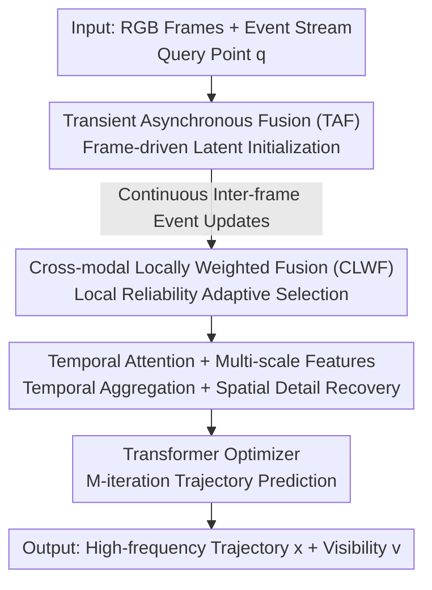

# TAPFormer: Robust Arbitrary Point Tracking via Transient Asynchronous Fusion of Frames and Events

**Conference**: CVPR 2026  
**Area**: Video Understanding  
**Keywords**: Arbitrary Point Tracking, Frame-Event Fusion, Event Camera, Asynchronous Fusion, Transformer

## TL;DR
TAPFormer utilizes a "Transient Asynchronous Fusion" mechanism to integrate low-frame-rate RGB frames with high-frequency event streams into a continuous latent representation that updates alongside events. This enables stable, high-frequency arbitrary point tracking in motion-blurred, low-light, and high-speed scenarios, improving average pixel error within thresholds by 28.2% on a self-built real-world frame-event dataset.

## Background & Motivation

**Background**: Tracking Any Point (TAP) aims to estimate the motion trajectory and visibility of any query point throughout a video, serving as a fundamental capability for AR and autonomous driving systems. Prevailing methods (CoTracker, TAPTR, PIPs++, etc.) are built on standard RGB frames, iteratively optimizing trajectories via Transformers within temporal windows.

**Limitations of Prior Work**: Standard cameras suffer from two primary issues: fixed frame rates (20–30 Hz) that fail to capture rapid motion, and limited dynamic range resulting in detail loss under overexposure or low-light conditions, leading to motion blur and trajectory drift. Event cameras are inherently complementary, recording brightness changes asynchronously with microsecond precision and an extremely high dynamic range. However, event streams are tightly coupled with motion—the same scene produces different event patterns under varying motions—and events are sparse and lack texture when the camera is static or moving slowly. Using events in isolation results in inferior tracking accuracy.

**Key Challenge**: While the two modalities are complementary, most existing fusion methods perform "synchronous fusion"—either downsampling events to the frame rate or concatenating asynchronous events to the "nearest frame." The former sacrifices the temporal resolution of events, while the latter causes severe spatial misalignment due to the time lag between frames and events. Furthermore, non-adaptive fusion degrades when one modality fails (e.g., frame blur).

**Goal**: Construct a unified fusion framework that bridges the frequency gap between "low-frame-rate frames vs. high-frequency events" and adaptively selects reliable modalities, achieving high-frequency, long-term consistent, and pixel-level accurate tracking.

**Key Insight**: The authors draw an analogy to the biological "dual-path" visual system—the ventral stream handles static properties like color and texture, while the dorsal stream encodes motion and spatial relations. RGB frames represent the ventral stream (spatial structure), and events represent the dorsal stream (temporal dynamics). The key observation is to treat the scene as a **time-continuous latent representation** rather than aligning events to discrete frames. Frames "reset/anchor" this representation upon arrival, while events continuously "push" its evolution between frames.

**Core Idea**: Replace synchronous fusion with Transient Asynchronous Fusion (TAF) featuring "frame initialization + event continuous update." Utilize a Cross-modal Locally Weighted Fusion (CLWF) module for modality adaptation, elevating the feature update frequency to the event rate, which is far higher than the frame rate.

## Method

### Overall Architecture
The input consists of a synchronized RGB frame sequence $\mathcal{I}=\{I_t\}$, an event stream $\mathcal{E}$, and an initial query point $\mathbf{q}=(t_q, x, y)$. The output is the trajectory $\boldsymbol{x}_{\tau_t}$ and visibility $v_{\tau_t}$ at each discrete query time $\tau_t$ (frequency $f_e\approx100\text{–}200$ Hz). Events are partitioned into temporal bins and encoded into event frames $I^{ev}_t=\mathcal{F}(E_t)\in\mathbb{R}^{H\times W\times B}$ using timestamp-based SBT (Stacked Binary Representation).

The pipeline operates as follows: For every frame arrival, TAF uses CLWF to fuse the frame with events within its exposure window, **initializing** a transient representation $\mathcal{R}_t$. Between frames, subsequent events continuously refresh $\mathcal{R}_t$ via a lightweight cross-attention updater. These transient tokens are aggregated through a temporal self-attention block and upsampled to produce multi-scale fused features. Finally, these features and the query point are fed into a Transformer-based optimizer for $M$ iterations to predict trajectories and occlusion states.

### Key Designs

**1. Transient Asynchronous Fusion (TAF): Scene as Continuous Latent Representation**

To address the "frequency mismatch and spatial misalignment" issue, TAF maintains a time-continuous transient representation $\mathcal{R}_t$. It is theoretically grounded in the Event Double Integral (EDI) model, where a blurred image $\tilde{\mathbf{B}}$ is the integral of latent sharp images $\tilde{\mathbf{L}}(t')$:

$$\tilde{\mathbf{L}}(t') = \tilde{\mathbf{B}} - \log\!\left(\frac{1}{T}\!\int_{t'-T/2}^{t'+T/2}\!\exp(c\,\mathbf{E}(t))\,dt\right)$$

This suggests that a single frame encodes the integrated continuous brightness changes within its exposure interval $\mathcal{W}_t=(t-\delta, t]$. The combination of a frame and its corresponding events allows for the recovery of a transient state. Inter-frame updates utilize "event-driven residual refinement" via a cross-attention updater $\mathcal{U}$: $\mathcal{R}_{t+\Delta}\leftarrow\mathcal{U}\big(\mathcal{R}_{t+\Delta-1},\,\Phi_E(\mathcal{F}(E_{t+\Delta}))\big)$. This injects fine-grained event cues while maintaining spatial consistency from the most recent frame.

**2. Cross-modal Locally Weighted Fusion (CLWF): Adaptive Selection of Reliable Modalities**

CLWF performs modality-adaptive local cross-attention. Given image tokens $\Phi_I(I_t)\in\mathbb{R}^{N\times d}$ and event tokens $\Phi_E(\cdot)\in\mathbb{R}^{M\times d}$, each event token serves as a query to aggregate information from image tokens within its spatial neighborhood $\mathcal{N}(j)$:

$$A_{j,i}=\frac{\exp\big(\langle q_j, k_i\rangle/\sqrt{d}+\mathcal{M}_{j,i}\big)}{\sum_{i'\in\mathcal{N}(j)}\exp\big(\langle q_j, k_{i'}\rangle/\sqrt{d}+\mathcal{M}_{j,i'}\big)}$$

where $\mathcal{M}_{j,i}$ is a learnable local bias. This allows the model to assign higher weights to the more reliable modality in a specific spatial region (e.g., favoring RGB in sharp static areas and events in blurred fast-motion areas).

**3. Temporal Attention + Multi-scale Semantic Features: Spatiotemporal Consistency**

Fused transient tokens $\mathcal{R}_t$ are augmented with spatiotemporal positional embeddings and processed by a Temporal Attention Module (TAM) to enhance consistency. During decoding, skip connections are used for multi-scale upsampling to produce Multi-scale Semantic Fused Features (MSSF), combining temporal details with global context.

**4. FE-FastKub Synthetic Dataset + Real-world Frame-Event TAP Benchmark**

Training utilizes the high-frame-rate synthetic dataset FE-FastKub (rendered via Kubric). The evaluation introduces the first real-world frame-event TAP benchmarks: InivTAP (DAVIS346, 20 FPS) and DrivTAP (Prophesee EVK4 + AR0231, 10 Hz input, 20 Hz GT), totaling 13 sequences and 20,450 annotated points.

### Loss & Training
The model is trained on four RTX 4090 GPUs with a batch size of 1 using AdamW ($5\times10^{-4}$). Sequences of 24 steps are sampled from 96-step trajectories, with higher sampling probabilities for longer trajectories to encourage long-term consistency.

## Key Experimental Results

### Main Results (Task 1: TAP on Real Datasets)
$\delta$vis_avg: average tracking length of visible points; AJ: Average Jaccard; OA: Occlusion Accuracy.

| Method | Input | InivTAP AJ↑ | InivTAP δvis↑ | InivTAP OA↑ | DrivTAP AJ↑ | DrivTAP δvis↑ | DrivTAP OA↑ |
|------|------|------|------|------|------|------|------|
| CoTracker3 | Frame | 41.8 | 53.2 | 72.8 | 37.1 | 46.5 | 95.4 |
| TAPFormer-F (Ours) | Frame | 44.6 | 54.5 | 74.7 | 36.6 | 46.7 | 93.8 |
| ETAP | Event | 12.8 | 22.3 | 86.3 | 13.5 | 27.8 | 68.1 |
| FETAP (Retrained) | F+E | 42.2 | 54.9 | 83.9 | 36.8 | 46.4 | 95.2 |
| **TAPFormer (Ours)** | F+E | **57.0** | **69.9** | **95.2** | **48.8** | **60.1** | **97.8** |

On InivTAP, AJ is 36.4% higher than the frame-based CoTracker3. On DrivTAP, AJ outperforms the event-based ETAP by 261.5% and CoTracker3 by 31.5%.

### Ablation Study (EDS Dataset, Incremental, Metrics: FA / EFA)

| Configuration | FA↑ | EFA↑ | Description |
|------|------|------|------|
| Baseline | 0.646 | 0.535 | Channel concatenation |
| + FE-FastKub | 0.701 | 0.585 | High-frame-rate training set |
| + CLWF | 0.763 | 0.647 | Cross-modal local weighting |
| + TAF | 0.803 | 0.685 | Transient asynchronous fusion |
| **Full** | **0.823** | **0.704** | Complete model |

### Key Findings
- **Frame Rate Sensitivity**: As the input frame rate drops from 75 FPS to 9.375 FPS, CoTracker3's performance collapses (FA 83.9 → 13.2), whereas TAPFormer remains stable (85.1 → 75.8), dropping only ~6.5%.
- **Feature Consistency**: PCA visualizations show that fused features form tighter clusters for the same point and wider margins between different points compared to single-modality features.

## Highlights & Insights
- **Continuous Latent Representation**: Moving from "alignment to frames" to "continuous evolution between frames" avoids spatial misalignment and unlocks event-rate update frequencies.
- **Physical Prior Integration**: Using the EDI model to ground the fusion instead of a pure black-box approach, implemented via residual refinement in feature space.
- **Local Adaptive Selection**: CLWF provides a fine-grained solution to modality failure, selecting reliable information at a pixel-neighborhood level rather than via global gating.

## Limitations & Future Work
- The exposure window $\delta$ is treated as a constant hyperparameter, which may be inaccurate for cameras with varying exposure times.
- Real-world benchmark size remains relatively small (13 sequences), and annotation costs are high.
- Computational overhead at extremely high event densities during rapid motion needs further optimization.

## Related Work & Insights
- **vs. CoTracker3 (Frame-based)**: Frames fail at low frequencies/fast motion; TAPFormer bridges inter-frame intervals using events.
- **vs. ETAP (Event-based)**: Events lack texture; TAPFormer injects spatial details via RGB to improve accuracy.
- **vs. FETAP (Fusion-based)**: FETAP uses synchronous aggregation and lacks occlusion modeling; TAPFormer's asynchronous modeling provides a ~30% lead in AJ.

## Rating
- Novelty: ⭐⭐⭐⭐⭐ 
- Experimental Thoroughness: ⭐⭐⭐⭐ 
- Writing Quality: ⭐⭐⭐⭐⭐ 
- Value: ⭐⭐⭐⭐⭐

<!-- RELATED:START -->

## Related Papers

- [\[CVPR 2026\] MV-TAP: Tracking Any Point in Multi-View Videos](mv-tap_tracking_any_point_in_multi-view_videos.md)
- [\[CVPR 2025\] ETAP: Event-based Tracking of Any Point](../../CVPR2025/video_understanding/etap_event-based_tracking_of_any_point.md)
- [\[CVPR 2026\] Real-World Point Tracking with Verifier-Guided Pseudo-Labeling](realworld_point_tracking_with_verifierguided_pseud.md)
- [\[CVPR 2026\] Matching Every Pair to Track Every Point: PairFormer for All-Pairs Tracking and Video Trajectory Fields](matching_every_pair_to_track_every_point_pairformer_for_all-pairs_tracking_and_v.md)
- [\[CVPR 2026\] MER-Tracker: Towards High-Speed 3D Point Tracking via Multi-View Event-RGB Hybrid Cameras](mer-tracker_towards_high-speed_3d_point_tracking_via_multi-view_event-rgb_hybrid.md)

<!-- RELATED:END -->
