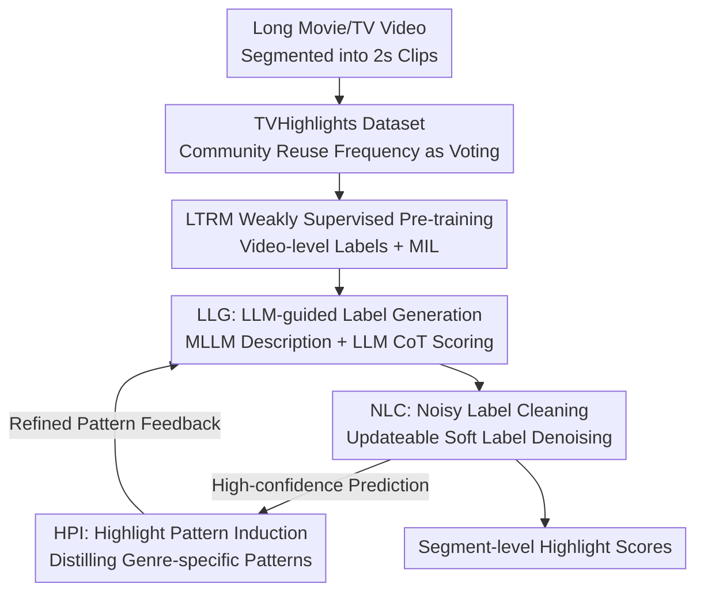

# TVHighlights: LLM-Guided Human-Free Collaborative Training for Video Highlight Detection in Movies and TV Dramas

**Conference**: CVPR 2026  
**Paper**: [CVF Open Access](https://openaccess.thecvf.com/content/CVPR2026/html/Qiu_TVHighlights_LLM-Guided_Human-Free_Collaborative_Training_for_Video_Highlight_Detection_in_CVPR_2026_paper.html)  
**Area**: Video Understanding  
**Keywords**: Video Highlight Detection, Movies and TV Dramas, Weakly Supervised, LLM Pseudo-labels, Noisy Label Learning

## TL;DR
To address the challenge where highlight segments in movies and TV dramas lack a unified definition and manual annotation is both expensive and subjective, the authors first automatically construct the human-free TVHighlights dataset by repurposing community derivative works. Subsequently, LTV-HD is proposed: a lightweight multimodal network is pre-trained with video-level weak labels, followed by a self-improving closed loop involving an LLM for mutual error correction. Ultimately, this achieves SOTA performance of 92.74% AUC / 71.20% AP without any human annotation.

## Background & Motivation
**Background**: Video Highlight Detection (VHD) aims to identify the most attractive segments within long videos. Existing methods have performed well in scenarios with "structured highlight patterns" such as sports (goals, stunts) and vlogs, where actions follow regular routines and annotations are relatively easy to unify.

**Limitations of Prior Work**: Movies and TV dramas present a fundamentally different challenge. A highlight in a martial arts drama might be an "intense fight," while in a romance it is a "romantic kiss," and in sci-fi it consists of "CGI spectacles." There is no unified definition across genres (Figure 1). This leads to two systemic issues: the impossibility of designing a one-size-fits-all model, and the fact that manual segment-wise annotation is expensive, slow, and heavily biased due to subjectivity. Consequently, the field lacks a large-scale, diverse, and reliable highlight benchmark for movies and dramas.

**Key Challenge**: Training an effective detector requires fine-grained (segment-level) supervision, but manual segment-level annotation for movies is neither scalable nor reliable. A seemingly easy shortcut is to directly employ LLMs/MLLMs for labeling; however, LLMs suffer from hallucinations and inconsistent reasoning, which introduces significant noise. The challenge thus converges to: **How to leverage the semantic reasoning capability of LLMs while suppressing their output noise to achieve entirely human-free training?**

**Key Insight**: The authors observed an overlooked "implicit annotation source"—derivative short clips frequently repurposed by users on social platforms. When a segment is repeatedly reused, it indicates a collective "vote" by the public identifying it as a highlight. This serves as a natural, zero-cost community annotation signal.

**Core Idea**: Construct a dataset using "community reuse frequency" as a substitute for manual annotation, and then form a self-improving loop between a lightweight model and an LLM. The LLM generates noisy pseudo-labels, the lightweight model learns under a denoising strategy, and high-confidence predictions from the model in turn assist the LLM in refining genre-specific highlight "patterns," cleaning the noisy labels iteratively.

## Method

### Overall Architecture
The input to LTV-HD is a long movie/TV video, which is first segmented into $T$ non-overlapping 2-second clips $\{c_t\}_{t=1}^T$. Visual and audio features $\{v_t\}, \{a_t\}$ are extracted, and the output is a highlight score for each clip $\{s_t\}_{t=1}^T \in [0,1]$. The pipeline consists of two stages: **Stage 1 involves weakly supervised pre-training** of a lightweight multimodal network (LTRM) using video-level labels to establish a robust baseline. **Stage 2 involves iterative refinement** through a collaborative loop between LTRM and the LLM. Within this loop, three components are linked for self-improvement: LLG generates fine-grained but noisy pseudo-labels, NLC enables robust learning under noise, and HPI distills high-confidence model predictions into genre-specific highlight patterns to guide the next round of LLG. This process requires zero human annotation, with label quality improving each round.

### Key Designs

**1. TVHighlights: Replacing Manual Annotation with Community Reuse for Movie Highlight Benchmarking**

To bypass the issues of absent reliable segment-level labels and biased manual annotations, the authors treat user-repurposed clips on short-video platforms as "implicit votes." Approximately 5,000 highly interactive videos originating from movies and TV dramas were collected. LLMs were used to filter irrelevant segments based on titles, followed by segmentation into 2-second clips. The key step involves **video fingerprinting**: mapping popular derivative clips back to the original movies and calculating reuse frequency as a "voting score" for each segment. Segments with high scores are considered publicly recognized highlights. The training set (1,368 videos) consists of these group-verified segments, **requiring no manual segment-level labeling**. Conversely, the test set (353 videos) was annotated by multiple humans at 2-second granularity, with majority voting providing the ground truth across five categories: Action, Destruction, CGI, Emotional, and Others. Covering over 15 genres, this is the first large-scale, human-free highlight benchmark for movies.

**2. LTRM + MIL: Lightweight Multimodal Network and Video-level Weak Supervision**

Stage 1 addresses training a segment detector when only video-level labels are available. The LTRM (Local Temporal Relation Multimodal Network) consists of single-modal encoders, a cross-modal encoder, a local temporal relation Transformer layer, and detection heads. The cross-modal encoder uses bottleneck tokens $\{z_i\}$ as bridges; information is first aggregated into the bottlenecks:

$$z'_i = z_i + w_z \sum_{t=1}^{T} \frac{\exp(w_q z_i \cdot w_k x_t)}{\sum_{n=1}^{T}\exp(w_q z_i \cdot w_k x_n)}\, w_v x_t,\quad x\in\{v,a\}$$

The aggregated $z'_i$ then functions as key/value to broadcast information back to each modality. To account for the fact that highlights are influenced by local context but distant segments act as interference, the authors introduce a **Local Self-Attention Window**, restricting attention to a local temporal range. Without segment labels, the model is trained via Multiple Instance Learning (MIL), where the average score of the top-$K$ scoring segments represents the video prediction:

$$\hat{y} = \frac{1}{K}\sum_{i\in\text{top-}K(s)} s_i$$

Binary cross-entropy is calculated with the video-level label $y\in\{0,1\}$. This step yields a robust initialization where the AP already exceeds general MLLMs like Qwen and Gemini.

**3. LLG + NLC: Robust Learning and Self-denoising via Updateable Soft Labels**

This mechanism safely introduces LLM reasoning into training. **LLG (LLM-guided Label Generation)** first feeds video clips to an MLLM to generate text descriptions $\{d_t\}$, then uses LLM Chain-of-Thought (CoT) to: infer genre $\to$ evaluate highlight intensity with reasoning $\to$ output soft scores $s_n$ at 0.1 granularity. This produces noisy soft labels $Y_{llm}$, which are augmented with high-confidence pseudo-labels from Stage 1 to produce $Y_n$. To avoid overfitting noise, **NLC (Noisy Label Cleaning)** adopts "label refurbishment" from noisy label learning: $Y_n$ is converted into an updateable probability distribution $Y_a^p$ ($p=2$). The classification loss uses KL divergence between model output and soft labels:

$$L_{cls} = \frac{1}{n}\sum_{i=1}^{n} D_{KL}\big(f(x_i;\theta)\,\|\,y_a^p\big)$$

During backpropagation, **gradients are also computed for $Y_a^p$**, which is updated with a higher learning rate to "clean" the labels while the model learns reliable representations. To prevent excessive label drift, a compatibility loss pulls $Y_a^p$ toward $Y_n$: $L_{cp} = -\frac{1}{n}\sum_i y_{n,i}\log y^p_{a,i}$. A sharpness loss $L_s$ is also added to force outputs toward 0/1 values: $L_s = -\frac{1}{n}\sum_i f(x;\theta)\log f(x;\theta)$. Total loss is:

$$L_{total} = L_{cls} + \lambda_{cp}L_{cp} + \lambda_s L_s$$

**4. HPI: Distilling High-confidence Predictions into Genre-specific Patterns**

**HPI (Highlight Pattern Induction)** extracts high-confidence pseudo-label segments along with MLLM descriptions and video genres to distill structured knowledge in three steps: ① **Pattern Generation**: LLM summarizes highlight and non-highlight patterns for specific genres (e.g., "intense combat" for historical dramas); ② **Pattern Aggregation**: Semantically similar patterns are merged, and redundant ones are removed; ③ **Pattern Correction**: Patterns are filtered for logical consistency and common sense. These refined patterns are fed back into LLG, ensuring more accurate and consistent labeling in the next cycle.

### Loss & Training
Stage 1 uses top-$K = 6$, a learning rate of 0.001, and early stopping. Stage 2 uses NLC weights $\lambda_{cp}=0.1$ and $\lambda_s=0.4$ with 2 rounds of refinement, 100 epochs, batch size 32, and Adam optimizer with a 0.0001 learning rate. Features for TVHighlights include CLIP(ViT-L-14) + SlowFast(R-50) for visual, and Imagebind for audio. MLLM utilizes MiniCPM-V 2.6, and LLM utilizes DeepSeek-R1-Distill-Qwen. A **single unified detector** is trained across all genres.

## Key Experimental Results

### Main Results
Comparison on TVHighlights against VHD baselines and MLLMs (using Moment Retrieval MR and Clip Scoring CS prompts):

| Method | AUC (%) | AP (%) |
|------|---------|--------|
| UMT | 60.50 | 45.13 |
| UniVTG | 55.20 | 31.71 |
| Qwen-vl-max (CS) | 88.40 | 47.42 |
| Gemini-2.5-flash (CS) | 87.52 | 46.10 |
| **Ours (Stage 1)** | 87.34 | 62.39 |
| **Ours (Stage 2)** | **92.74** | **71.20** |

Stage 2 achieves SOTA across all metrics, with AUC/AP exceeding the strongest baseline (Qwen-vl-max CS) by +4.34 / +23.78 points. Furthermore, the AP of Stage 1 (62.39) alone surpasses all baselines.

### Ablation Study
Breakdown of training stages and modules (s: stage, r: refinement round):

| Configuration | AUC (%) | AP (%) | Explanation |
|------|---------|--------|------|
| Baseline | 89.12 | 63.45 | No Weak Sup., no NLC/HPI |
| Weak Sup. Only | 90.20 | 67.69 | Stage 1 only, +4.24 AP |
| NLC(r1) Only | 90.36 | 66.72 | Skips Weak Sup., lower AP |
| NLC+HPI (No Weak Sup.) | 91.85 | 70.01 | Lacks Stage 1 starting point |
| **Full Model** | **92.74** | **71.20** | All components active |

### Key Findings
- **Weak supervision is crucial**: Skipping Stage 1 leads to degradation even with later components, as it provides an anti-noise initialization for the loop.
- **HPI pattern refinement is the core**: Training with unrefined pseudo-labels causes significant regression, proving that "re-feeding refined patterns to the LLM" is the engine for continuous improvement.
- **Superior anti-noise capability**: On YouTube Highlights with MTurk noise, UMT drops by 1.54%, whereas this method drops only 0.32%, showcasing NLC's ability to extract reliable signals from noise.
- **Label quality evolution**: Cohen's Kappa increases from 52.41 (s1) to 60.54 (s2-r2), demonstrating that the loop effectively denoises labels.

## Highlights & Insights
- **Turning community reuse into zero-cost annotation**: By using video fingerprinting to treat reuse frequency as "community voting," the method circumvents the subjective and expensive nature of manual movie highlight annotation.
- **Model-LLM mutual teaching loop**: Rather than unidirectional distillation, the LLM teaches the model (LLG $\to$ NLC) and the model teaches the LLM (High-confidence predictions $\to$ HPI $\to$ LLG), refining noise into structured knowledge.
- **Synchronized label and model updates**: The NLC mechanism, which treats noisy labels as updateable distributions with constraint losses, provides a clean, reusable template for handling LLM-generated pseudo-labels.

## Limitations & Future Work
- **Reliance on derivative data**: Training signals depend on popular reuse behavior on short-video platforms, which may introduce genre or popularity bias.
- **Loop cost**: Running MLLM descriptions and LLM reasoning iteratively is computationally intensive; the trade-off between refinement rounds and cost requires further study.
- **Fixed 2s granularity**: Detecting highlights at a fixed segment level may lack flexibility for varyingly-timed events or long takes.
- **Small test set**: The 353 test samples are relatively few compared to the training set, limiting the depth of genre-specific conclusions.

## Related Work & Insights
- **vs. UMT / UniVTG**: These methods rely on fixed queries or manual labels. Ours is human-free and more robust to label noise.
- **vs. TimeChat**: While TimeChat fine-tunes MLLMs via LoRA, its performance is often inferior to dedicated detectors. This work uses the LLM as a "noisy annotator" and "pattern seeker" rather than the primary detector.
- **vs. LNL (Noisy Label Learning)**: This work adapts LNL concepts like label refurbishment but innovates by making the "noise source" the LLM and closes the loop by using model predictions to refine label generation.

## Rating
- Novelty: ⭐⭐⭐⭐⭐ "Community reuse as annotation + bidirectional self-improvement loop" effectively addresses a real-world gap.
- Experimental Thoroughness: ⭐⭐⭐⭐ Extensive experiments, cross-domain tests, and noise analysis, though the test set is somewhat limited.
- Writing Quality: ⭐⭐⭐⭐ Clear motivation, well-explained components, and good integration of formulas and figures.
- Value: ⭐⭐⭐⭐⭐ Provides the first movie highlight benchmark and a reusable human-free training paradigm.

<!-- RELATED:START -->

## Related Papers

- [\[CVPR 2026\] MoVie: Broaden Your Views with Human Motion for Action Detection](movie_broaden_your_views_with_human_motion_for_action_detection.md)
- [\[NeurIPS 2025\] VADTree: Explainable Training-Free Video Anomaly Detection via Hierarchical Granularity](../../NeurIPS2025/video_understanding/vadtree_explainable_training-free_video_anomaly_detection_via_hierarchical_granu.md)
- [\[CVPR 2026\] Memory Matters: Boosting Training-Free Zero-Shot Temporal Action Localization with a Learnable Lookup Table](memory_matters_boosting_training-free_zero-shot_temporal_action_localization_wit.md)
- [\[CVPR 2026\] Hypergraph-State Collaborative Reasoning for Multi-Object Tracking](hypergraph-state_collaborative_reasoning_for_multi-object_tracking.md)
- [\[CVPR 2026\] VideoChat-M1: Collaborative Policy Planning for Video Understanding via Multi-Agent Reinforcement Learning](videochatm1_collaborative_policy_planning_for_vide.md)

<!-- RELATED:END -->
