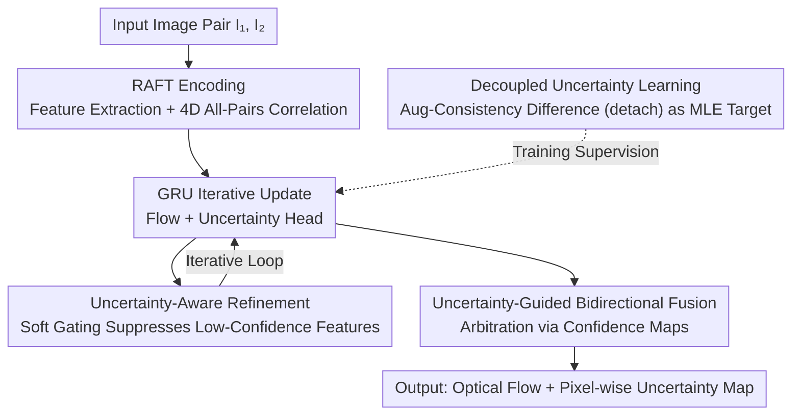

# U2Flow: Uncertainty-Aware Unsupervised Optical Flow Estimation

**Conference**: CVPR 2026 Oral  
**arXiv**: [2604.10056](https://arxiv.org/abs/2604.10056)  
**Code**: [https://github.com/sunzunyi/U2FLOW](https://github.com/sunzunyi/U2FLOW)  
**Area**: Video Understanding/Optical Flow Estimation  
**Keywords**: Optical Flow Estimation, Uncertainty Estimation, Unsupervised Learning, Recurrent Networks, Augmentation Consistency

## TL;DR

U2Flow is the first recurrent unsupervised framework for joint estimation of optical flow and pixel-wise uncertainty. By leveraging decoupled uncertainty learning based on augmentation consistency and uncertainty-guided bidirectional flow fusion, it achieves unsupervised SOTA on KITTI and Sintel.

## Background & Motivation

**Background**: Deep recurrent models based on all-pairs correlation (such as RAFT) have reached SOTA under full supervision. However, the high cost of obtaining large-scale accurate optical flow annotations drives unsupervised research.

**Limitations of Prior Work**: (1) Unsupervised models produce inaccurate estimates in occluded, textureless regions and under large displacements, which are catastrophic for downstream tasks; (2) Uncertainty estimation is severely under-explored in unsupervised settings—lacking direct supervision signals and clarity on how to effectively utilize uncertainty to improve flow.

**Key Challenge**: The model needs to not only predict the motion but also quantify confidence in the prediction—but how to teach the model to evaluate its own reliability without ground truth?

**Goal**: To achieve joint estimation of optical flow and uncertainty within a purely self-supervised framework and use uncertainty feedback to improve flow.

**Key Insight**: Utilize the prediction inconsistency of the model under data augmentation as a self-supervised signal for uncertainty.

**Core Idea**: When a model yields inconsistent predictions under different perturbations, it exposes low-confidence regions—this inconsistency itself is a strong signal of uncertainty.

## Method

### Overall Architecture

U2Flow addresses two pain points of unsupervised optical flow: the model errs in occlusions, textureless regions, and large displacements without a mechanism to inform downstream tasks "not to trust the motion of this pixel." Built on the RAFT backbone (feature extraction → 4D all-pairs correlation volume → GRU recurrent iterative updates), it adds an uncertainty estimation head. The network outputs a pixel-wise confidence map alongside the motion of each pixel. This map is used self-consistently throughout the pipeline: during training, augmentation consistency provides supervision for uncertainty; during iterative refinement, it suppresses unreliable features; and during inference, it arbitrates between forward and backward flow to fuse the more credible side. No ground truth is used; supervision stems from photometric reconstruction, smoothness constraints, and augmentation consistency.

### Key Designs

**1. Decoupled Uncertainty Learning: Transforming "Uncertainty without Ground Truth" into a Supervised Target**

The most difficult aspect of unsupervised settings is that uncertainty lacks labels. U2Flow makes the model "compete with itself" under perturbations. First, the model estimates flow $\mathbf{F}_{1\to 2}$ on the original image. Then, strong appearance/spatial augmentation is applied to get $(\hat{I}_1, \hat{I}_2)$ for a second estimate $\hat{\mathbf{F}}'_{1\to 2}$. The difference between the two predictions at the same pixel, $\hat{D}^{(k)} = \|\hat{\mathbf{F}} - \hat{\mathbf{F}}'^{(k)}\|_1$, is used as the regression target for uncertainty. Regions where the model is sensitive to augmentation naturally define low-confidence areas. The network fits this difference using an MLE target with a Laplace likelihood:

$$\tilde{\ell}_{unc} = \sqrt{2}\exp\!\left(-\tfrac{1}{2}\alpha^{(k)}\right)\hat{D}^{(k)} + \tfrac{1}{2}\alpha^{(k)}, \qquad \alpha = \log\sigma^2$$

The crucial "decoupling" aspect involves detaching $\hat{D}$ from the computational graph. Traditional supervised methods often optimize flow and uncertainty within a single MLE target, causing uncertainty loss gradients to contaminate the flow branch and destabilize training. U2Flow treats the difference target as a constant without gradient backpropagation. The uncertainty head only fits this target without pulling the flow estimation, ensuring both branches do not interfere.

**2. Uncertainty-Aware Refinement: Training the Network to Avoid Low-Confidence Regions During Iteration**

Optical flow is refined through GRU iterations. However, features in each round contain noise from unreliable regions. U2Flow uses the newly learned uncertainty as a soft gate: weights $\mathbf{s}^{(k)} = \phi(-\alpha^{(k)})$ (higher uncertainty, lower weight) are computed and element-wise multiplied with flow features to produce scaled features $\tilde{\mathbf{f}}^{(k)} = \mathbf{f}^{(k)} \odot \mathbf{s}^{(k)*}$. These are then concatenated with original features and the uncertainty map to predict the flow residual. This ensures the refinement relies more on high-confidence evidence.

**3. Uncertainty-Guided Bidirectional Fusion: Replacing Binary Occlusion Masks with Continuous Confidence**

Forward flow is often incorrect in occluded regions. Traditional unsupervised methods rely on a binary occlusion mask based on forward-backward consistency. U2Flow replaces this hard 0/1 threshold with an arbitration mechanism using forward and backward uncertainty maps. It compares the confidence of both directions at each pixel and selects the more credible flow. Since uncertainty is continuous, it handles not only classic occlusions but also textureless or large displacement regions that binary masks mission.

### Loss & Training

Total Loss = Photometric Loss (census + SSIM + L1) + Edge-Aware Smoothness Loss + Uncertainty-Guided Regional Smoothness Loss + Augmentation Consistency Uncertainty Loss. For KITTI, an additional uncertainty-guided homography smoothness loss is used.

## Key Experimental Results

### Main Results

| Dataset | Metric | U2Flow | Prev. SOTA | Gain |
|--------|------|--------|---------------|------|
| KITTI 2015 | Fl-all | SOTA | - | Significant |
| Sintel Clean | EPE | SOTA | - | Significant |
| Sintel Final | EPE | SOTA | - | Significant |

### Ablation Study

| Configuration | Key Metric | Description |
|------|---------|------|
| Without Uncertainty Estimation | Accuracy drop | RAFT baseline |
| Without Decoupled Design | Unstable training | Gradient leakage |
| Without Uncertainty Refinement | Accuracy drop | Underutilization of uncertainty |
| Without Bidirectional Fusion | Poor occlusions | Traditional masks inferior to uncertainty |
| Full U2Flow | Optimal | All components synergistic |

### Key Findings

- The decoupled design is vital for training stability—the detach operation prevents uncertainty loss from interfering with the flow branch.
- Uncertainty maps identify high-error regions more accurately than traditional forward-backward consistency masks.
- Uncertainty-guided regional smoothness shows significant effects on KITTI (planar rigid motion scenes).

## Highlights & Insights

- **"Model Self-Evaluation" Paradigm**: Cleverly exposing uncertain regions via augmentation consistency without ground truth labels.
- **Importance of Decoupling**: Explicitly separating uncertainty learning from flow regression avoids the instability of coupled objectives.
- **Uncertainty as a Universal Signal**: It is used not just for final output but also to dynamically adjust loss weights and refinement processes during training.

## Limitations & Future Work

- The augmentation consistency strategy assumes reasonable augmentations; extreme perturbations may yield noisy supervision.
- Homography smoothness on KITTI relies on planar rigid motion assumptions, limiting generalization.
- Absolute calibration accuracy of uncertainty has not been verified against ground truth.

## Related Work & Insights

- **vs ARFlow**: ARFlow use augmentation for knowledge distillation but does not estimate uncertainty. U2Flow applies augmentation consistency to uncertainty learning.
- **vs ProbFlow**: ProbFlow uses variational inference for joint estimation but requires supervision. U2Flow achieves unsupervised joint estimation.

## Rating

- Novelty: ⭐⭐⭐⭐ First realization of unsupervised joint flow-uncertainty estimation.
- Experimental Thoroughness: ⭐⭐⭐⭐ KITTI + Sintel dual benchmarks + detailed ablations.
- Writing Quality: ⭐⭐⭐⭐ Method is described clearly.
- Value: ⭐⭐⭐⭐ Uncertainty estimation is significant for safety-critical applications.

<!-- RELATED:START -->

## Related Papers

- [\[CVPR 2026\] FlowFM: Advancing Dark Optical Flow Estimation with Flow Matching](flowfm_advancing_dark_optical_flow_estimation_with_flow_matching.md)
- [\[ICCV 2025\] Unsupervised Joint Learning of Optical Flow and Intensity with Event Cameras](../../ICCV2025/video_understanding/unsupervised_joint_learning_of_optical_flow_and_intensity_with_event_cameras.md)
- [\[CVPR 2026\] Efficient All-Pairs Correlation Volume Sampling for Optical Flow Estimation](efficient_all-pairs_correlation_volume_sampling_for_optical_flow_estimation.md)
- [\[CVPR 2026\] From Contrast to Consistency: Rethinking Event-based Continuous-Time Optical Flow Estimation](from_contrast_to_consistency_rethinking_event-based_continuous-time_optical_flow.md)
- [\[CVPR 2026\] Enhancing Accuracy of Uncertainty Estimation in Appearance-based Gaze Tracking with Probabilistic Evaluation and Calibration](enhancing_accuracy_of_uncertainty_estimation_in_appearance-based_gaze_tracking_w.md)

<!-- RELATED:END -->
