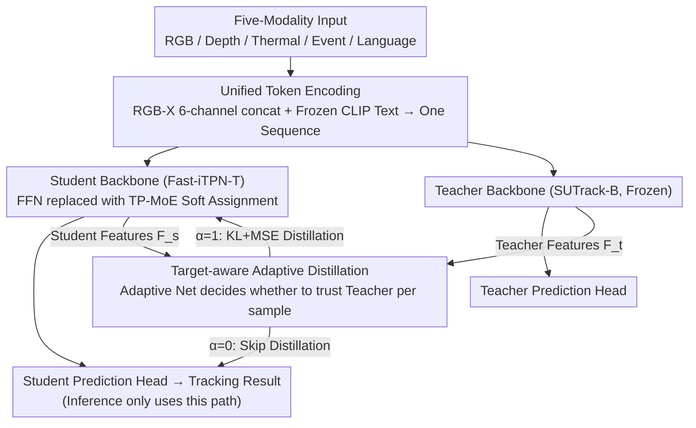

# UETrack: A Unified and Efficient Framework for Single Object Tracking

**Conference**: CVPR 2026  
**arXiv**: [2603.01412](https://arxiv.org/abs/2603.01412)  
**Code**: [https://github.com/kangben258/UETrack](https://github.com/kangben258/UETrack)  
**Area**: Video Understanding  
**Keywords**: single object tracking, multi-modal tracking, mixture of experts, knowledge distillation, efficient inference

## TL;DR

This paper proposes UETrack, a unified and efficient single object tracking framework capable of processing five modalities: RGB, Depth, Thermal, Event, and Language. UETrack addresses the gap in efficient multi-modal tracking: existing efficient trackers are limited to RGB, while multi-modal trackers are often too slow due to complex designs. Core innovations include: (1) Token-Pooling-based Mixture-of-Experts (TP-MoE), which replaces traditional gating mechanisms with similarity-based soft assignment for efficient expert collaboration and specialization; (2) Target-aware Adaptive Distillation (TAD), which adaptively determines whether each sample is suitable for distillation to filter unreliable teacher signals. Across 12 benchmarks and 3 hardware platforms, UETrack achieves an optimal balance between speed and accuracy. For instance, UETrack-B achieves 69.2% AUC on LaSOT and runs at 163/56/60 FPS on GPU/CPU/AGX, respectively.

## Background & Motivation

1.  **Efficient trackers are limited to RGB**: Existing efficient tracking methods (e.g., HiT, MixFormerV2-S) are almost exclusively designed for RGB scenarios, lacking sufficient single-modality information in complex environments (e.g., occlusion, illumination changes).
2.  **Multi-modal trackers have high computational overhead**: Multi-modal methods like SDSTrack, OneTracker, and ViPT rely on complex fusion modules and large models, with inference speeds failing to meet real-time deployment requirements.
3.  **Difficulty in modeling modal heterogeneity**: Efficient models with limited parameters struggle to capture complementary information and shared representations across multiple modalities, requiring new architectural designs to enhance modeling capability.
4.  **Traditional MoE gating mechanisms introduce latency**: MoE methods in tracking (e.g., MoETrack, eMoE-Tracker) use discrete gating routing, introducing extra overhead from token sorting and inter-expert communication.
5.  **Negative transfer in knowledge distillation**: On difficult samples with occlusion, interference, or deformation, teacher model predictions may be unreliable. Direct distillation transfers erroneous information to the student model.
6.  **High speed requirements for practical deployment**: Edge devices (e.g., Jetson AGX Xavier) are resource-constrained, necessitating tracking solutions that can run in real-time across various hardware platforms.

## Method

### Overall Architecture

UETrack aims to fill the gap where "efficient trackers only handle RGB and multi-modal trackers are too slow" by creating a single object tracking framework that runs in real-time and unifies RGB, Depth, Thermal, Event, and Language modalities. It is based on the lightweight Fast-iTPN-T backbone and adopts the unified token encoding from SUTrack: Depth/Thermal/Event are concatenated with RGB along the channel dimension to form a 6-channel composite image, while Language is processed through a frozen CLIP text encoder. All tokens are concatenated into a single sequence for the Transformer. During training, a teacher (frozen SUTrack-B), a student, and an Adaptive Net collaborate. During inference, only the student model remains. The student backbone uses **TP-MoE** to strengthen multi-modal modeling, and **TAD** determines sample-by-sample whether to learn from the teacher during training.

### Key Designs

**1. Token-Pooling-based MoE (TP-MoE): Replacing Latency-Inducing Discrete Gating with Similarity-based Soft Assignment**

To address the latency caused by token sorting and inter-expert communication in traditional MoE gating, TP-MoE employs an attention-style soft assignment. The input tokens $\mathbf{T}_{in} \in \mathbb{R}^{L_1 \times D}$ are first split into $L_1/E$ subspaces (where $E$ is the number of experts) and average-pooled for local aggregation. These are then processed via linear projection and reshaped to generate compact expert tokens $\mathbf{T}_e \in \mathbb{R}^{L_2 \times D}$. A similarity matrix $\mathbf{S} \in \mathbb{R}^{L_1 \times L_2}$ is calculated between input and expert tokens, followed by a softmax to produce continuous routing weights. Input tokens are distributed to experts based on these weights, processed independently, and then merged back into the original token space using the similarity matrix. This process involves only differentiable matrix operations without sorting or cross-expert communication, enabling full parallelism and stable gradients, making it ideal for real-time tracking.

**2. Target-aware Adaptive Distillation (TAD): Per-sample Judgment to Avoid Negative Transfer**

To prevent the transfer of errors from unreliable teacher predictions on difficult samples (occlusion/interference/deformation), TAD utilizes an Adaptive Net that takes search area features from both the student and teacher. These features are globally average-pooled, concatenated into a fusion vector, and reduced to 2D via an MLP. A Gumbel-Softmax then outputs a binary decision $\alpha \in \{0, 1\}$. Distillation (KL divergence + MSE) is performed only if $\alpha=1$; otherwise, it is skipped. The Adaptive Net is trained using a proxy prediction strategy, where teacher or student prediction losses relative to the ground truth serve as proxy targets, allowing the network to automatically learn the reliability of distillation for each sample.

### Loss & Training

The student loss includes classification (Focal), regression (GIoU + L1), task loss, and adaptive distillation loss. The Adaptive Net and student model are updated separately to avoid gradient conflicts.

## Key Experimental Results

### Main Results: Comparison on RGB Benchmarks (Real-time Methods)

| Method | LaSOT AUC | TrackingNet AUC | GOT-10k AO | GPU FPS | CPU FPS | AGX FPS | Params (M) |
|------|:---------:|:---------------:|:----------:|:-------:|:-------:|:-------:|:---------:|
| **UETrack-B** | **69.2** | **82.7** | **72.6** | 163 | 56 | 60 | 13 |
| **UETrack-S** | 66.9 | 81.4 | 71.1 | 183 | 68 | 67 | 9 |
| **UETrack-T** | 63.4 | 78.9 | 65.3 | **221** | **83** | **77** | 6 |
| AsymTrack-B | 64.7 | 80.0 | 67.7 | 197 | 38 | 64 | – |
| HiT-Base | 64.6 | 80.0 | 64.0 | 175 | 33 | 61 | – |
| MixFormerV2-S | 60.6 | 75.8 | 61.9 | 299 | 47 | 70 | – |
| OSTrack-256* | 69.1 | 83.1 | 71.0 | 105 | 11 | 19 | – |

*OSTrack is a non-real-time method included for reference. UETrack-B improves over AsymTrack-B by 4.5%/2.7%/4.9% on LaSOT/TrackingNet/GOT-10k, respectively.

### Main Results: Multi-modal Tracking Performance

| Modality | Benchmark | Metric | UETrack-B | SUTrack-T | ViPT(-Tiny) | SDSTrack | AGX FPS Comparison |
|------|------|------|:---------:|:---------:|:-----------:|:--------:|:------------:|
| RGB-D | VOT-RGBD22 | EAO | 68.3 | 68.1 | 68.5 | 72.8 | 60 vs 34/20/7 |
| RGB-D | DepthTrack | F-score | 60.6 | 61.7 | 53.9 | 61.9 | 60 vs 34/20/7 |
| RGB-T | LasHeR | AUC | **55.5** | 53.9 | 47.5 | 53.1 | 60 vs 34/20/7 |
| RGB-T | RGBT234 | MSR | **64.2** | 63.8 | 58.8 | 62.5 | 60 vs 34/20/7 |

UETrack-B outperforms most non-real-time methods in the Thermal modality while maintaining real-time speed (60 FPS on AGX). While a gap remains compared to non-real-time SOTA on RGB-Depth, it is 4-8 times faster.

## Highlights & Insights

- **First Efficient Multi-modal Tracking Framework**: Fills the gap between efficient tracking (real-time + lightweight) and multi-modal tracking, unifying 5 modalities without extra modality-specific modules.
-  **Elegant TP-MoE Design**: Replaces discrete gating with similarity-based continuous soft assignment, eliminating token sorting overhead and supporting full parallelism. This enhances multi-modal modeling while controlling latency.
-  **Effective TAD Strategy**: Implements sample-level adaptive distillation via Gumbel-Softmax, automatically filtering unreliable teacher signals on difficult samples and solving the negative transfer problem in distillation.
-  **Thorough Cross-platform Validation**: Speed tests across GPU (2080Ti), CPU (i9-14900KF), and edge devices (Jetson AGX Xavier) demonstrate significant deployment value.

## Limitations & Future Work

- **Multi-modal Performance Gap**: In RGB-Depth (VOT-RGBD22) and RGB-Thermal, UETrack-B has not yet surpassed some non-real-time methods (e.g., SeqTrackv2, BAT), suggesting room for improvement in accuracy-speed trade-offs for high-precision scenarios.
- **Language Modality Dependency**: The language branch relies on a frozen CLIP encoder, which cannot be optimized end-to-end, potentially limiting language-based tracking performance.
- **Fixed TP-MoE Expert Counts**: The number of experts is fixed (2/4/8); dynamic expert allocation or modality-adaptive expert selection was not explored.
- **Single Teacher Model**: Only SUTrack-B was used as a teacher; the impact of different teacher models or teacher ensembles on distillation was not studied.
- **Lack of Long-video and Online Update Evaluation**: Experiments focused on standard benchmarks; robustness in ultra-long videos or highly dynamic scenes (drastic target appearance changes) was not tested.

## Related Work & Insights

- **Efficient Trackers**: HiT, MixFormerV2, and AsymTrack pursue speed-accuracy balance in RGB scenarios. UETrack extends this to multi-modality and leads in both accuracy and speed.
- **Multi-modal Tracking**: SUTrack processes multi-modal data with unified tokens but lacks speed. ViPT, SDSTrack, and OneTracker add modality-adaptation modules but have high computational costs. UETrack balances unified modeling with efficient inference.
- **Knowledge Distillation**: Traditional methods apply distillation uniformly to all samples. TAD adopts sample-level adaptive selection, which is better suited for tracking scenarios with high variance in sample difficulty.
- **Mixture of Experts**: MoETrack and SPMTrack use MoE in tracking but introduce gating latency. The gate-free soft assignment of TP-MoE is better suited for real-time visual tracking.

## Rating

| Dimension | Score (1-10) |
|------|:-----------:|
| Novelty | 7 |
| Theoretical Depth | 5 |
| Experimental Thoroughness | 9 |
| Writing Quality | 8 |
| Value | 9 |
| **Total Score** | **7.6** |

<!-- RELATED:START -->

## Related Papers

- [\[CVPR 2026\] TGTrack: Temporal Generative Learning for Unified Single Object Tracking](tgtrack_temporal_generative_learning_for_unified_single_object_tracking.md)
- [\[CVPR 2026\] An Efficient Token Compression Framework for Visual Object Tracking](an_efficient_token_compression_framework_for_visual_object_tracking.md)
- [\[ICCV 2025\] General Compression Framework for Efficient Transformer Object Tracking](../../ICCV2025/video_understanding/general_compression_framework_for_efficient_transformer_object_tracking.md)
- [\[CVPR 2026\] SpikeTrack: High-performance and Energy-efficient Event-Based Object Tracking with Spiking Neural Network](spiketrack_high-performance_and_energy-efficient_event-based_object_tracking_wit.md)
- [\[CVPR 2026\] SpikeTrack: A Spike-driven Framework for Efficient Visual Tracking](spiketrack_a_spike-driven_framework_for_efficient_visual_tracking.md)

<!-- RELATED:END -->
