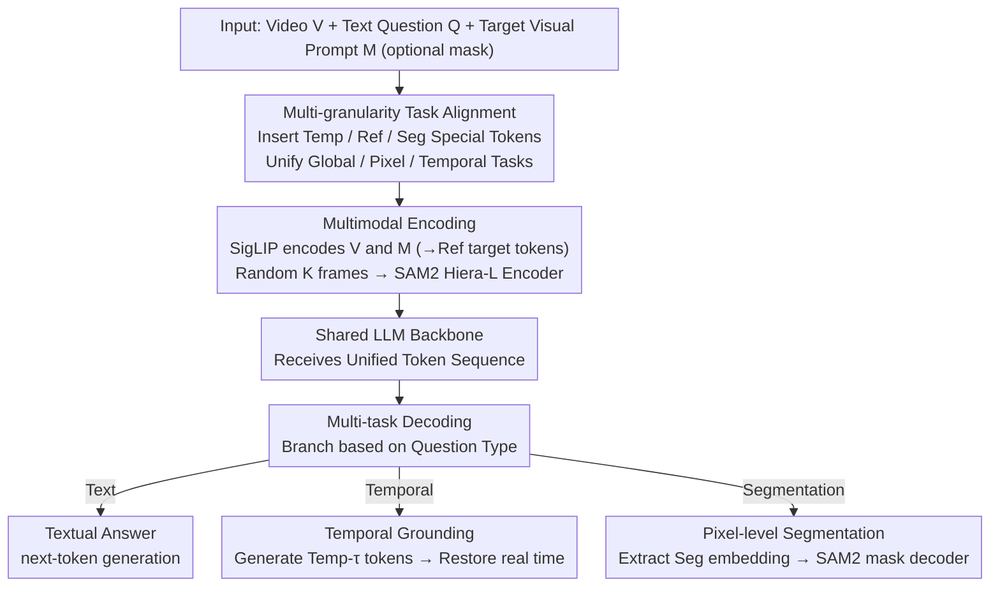

# UFVideo: Towards Unified Fine-Grained Video Cooperative Understanding with Large Language Models

**Conference**: CVPR 2026  
**arXiv**: [2512.11336](https://arxiv.org/abs/2512.11336)  
**Code**: [https://github.com/Heven-Pan/UFVideo](https://github.com/Heven-Pan/UFVideo)  
**Area**: Video Understanding / Multimodal VLM  
**Keywords**: Unified Video Understanding, Multi-granularity Collaboration, Pixel-level Segmentation, Temporal Grounding, Video LLM

## TL;DR
UFVideo is the first Video LLM to unify global, pixel-level, and temporal-level video understanding capabilities. Through a vision-language guided alignment strategy and a SAM2 mask decoder, it simultaneously supports video QA, object referring, video segmentation, and temporal grounding within a single model. Furthermore, the multi-granularity cooperative understanding benchmark, UFVideo-Bench, is introduced.

## Background & Motivation

1. **Background**: Current Video LLMs have expanded from general video QA to various fine-grained understanding tasks, including video object referring, video segmentation, and temporal grounding. These tasks correspond to pixel-level and temporal-level video understanding, respectively.

2. **Limitations of Prior Work**: Existing methods focus on single-granularity understanding tasks, with training and inference conducted independently. Consequently, they fail to effectively integrate and mutually enhance perception and reasoning across different granularities. For instance, models proficient in object referring cannot handle temporal event grounding, while those focused on grounding lack pixel-level segmentation capabilities.

3. **Key Challenge**: Knowledge from different video granularities is inherently complementary—fine-grained temporal knowledge can enhance the understanding of referred objects, while global video knowledge provides semantic support for fine-grained tasks. However, in existing models, these granularities are isolated during generation without explicit association.

4. **Goal**: To unify global, pixel-level, and temporal-level video understanding within a single model and enable them to work cooperatively.

5. **Key Insight**: Designing a unified vision-language guided alignment strategy that utilizes special tokens to distinguish input and output for different tasks while sharing an LLM backbone for joint multi-task training.

6. **Core Idea**: Employ a unified token design (`<Ref>` / `<Seg>` / `<Temp>`) to consolidate global QA, pixel-level segmentation, and temporal grounding into the same Video LLM, achieving multi-granularity cooperative video understanding.

## Method

### Overall Architecture
Ours aims to address the integration of global QA, pixel-level segmentation, and temporal grounding within a single Video LLM, allowing them to leverage each other during a single generation pass. The pipeline uses an LLM as the backbone—a vision encoder compresses the video into discrete tokens, which are concatenated with text tokens into a single sequence for the LLM. The model receives a video $V$, a textual question $Q$, and an optional target visual prompt $M$ (mask). Based on the question type, it branches from the hidden state to three output types: textual answers $A$ via standard next-token generation, temporal grounding $T$ encoded as generative temporal tokens, and segmentation masks $S$ where specific token embeddings are passed to the SAM2 mask decoder. All tasks share the same LLM parameters, with granularity switching handled by special tokens rather than independent model branches.

### Key Designs

**1. Multi-granularity Task Alignment: Unifying various granularities into a single sequence using three types of special tokens**

The Limitations of Prior Work involve models operating on isolated granularities—referring models lack temporal awareness, and grounding models lack segmentation capabilities, resulting in isolated knowledge. Ours avoids creating separate modules for each task by adding three types of special tokens to the vocabulary to serve as "task routers": `<Temp-τ>` represents relative timestamps, where video duration is normalized to a fixed length $N_t$ and encoded as $\tau = \frac{t}{T_n} \times N_t$, allowing time for videos of different lengths to be mapped to the same scale and generated like text; `<Ref>` serves as a placeholder for target visual prompts in referring tasks; and `<Seg>` marks "segmentation output required," used to extract segmentation-related language embeddings from the LLM output. Text instructions are tokenized as $\mathcal{T}_i$, temporal tokens as $\mathcal{T}_t$, and combined with visual tokens into a unified input. Since task differentiation relies on tokens rather than architectural branching, knowledge from all three granularities is consolidated within shared parameters, facilitating mutual enhancement during training—the source of "cooperative understanding."

**2. Multimodal Encoding: Integrating video content and target-level prompts into the token space**

Since the LLM processes only tokens, both the video and target visual prompts must be converted into tokens. Video $V$ and target prompt $M$ are processed by a pre-trained vision encoder $\Phi_v$ (SigLIP-so400m) to obtain $F_V$ and $F_M$, respectively. Following the approach of VideoRefer, target spatial features $S_M$ are extracted from $F_M$ and projected into target visual tokens $\mathcal{T}_r$ at the `<Ref>` positions. This allows the LLM to perceive the entire video while identifying the specific object of interest. For segmentation, pixel-level details are required; thus, $K$ frames are randomly selected and encoded by the SAM2 Hiera-L encoder, serving as visual input for the mask decoder. The vision encoder handles semantics while the SAM2 encoder handles pixels, with both sets of features serving distinct roles.

**3. Multi-task Decoding: Branching text, temporal, and segmentation results from the same hidden state**

The challenge is that while text and time can be directly generated as tokens, pixel-level masks cannot be included in the vocabulary. UFVideo processes the three outputs through two paths. Textual answers and temporal grounding follow the text-form token path—temporal outputs are restored to actual time using $\mathcal{Y}_m = p_\theta(H) \times \frac{T_n}{N_t}$. Pixel-level segmentation is handled via a bridge: the hidden state $H$ at the `<Seg>` token position is extracted using a mask $\rho_s$, passed through a projection layer $\theta$, and element-wise multiplied with the position mask to produce a language embedding carrying segmentation intent. This is then fed into the SAM2 mask decoder. Since the number of objects to be segmented varies per sample, the number of `<Seg>` tokens and corresponding embeddings is dynamic, requiring dynamic training based on the target count. This maintains the convenience of LLM text/time generation while utilizing SAM2 to fulfill pixel-level output requirements that LLMs cannot naturally perform.

### A Complete Example

Consider a cooperative task: Input a street view video and a visual prompt $M$ circling a red car. The question is "When does this car start turning, and segment it." During encoding, the video is processed by SigLIP to get $F_V$, and the circled red car area is processed via $F_M$ to extract target features, projected as $\mathcal{T}_r$ into the `<Ref>` position. Simultaneously, $K$ frames are sent to the SAM2 encoder. The LLM receives this mixed sequence and begins generation: it first produces text describing the car's action, followed by a sequence of `<Temp-τ>` tokens. The decoder restores $\tau$ to real time (e.g., "turning at 4.2 seconds") using $\frac{T_n}{N_t}$. When the sequence reaches the mask output position, it generates `<Seg>`. The system extracts the embedding at that position via $\rho_s$, projects it into the SAM2 decoder, and draws pixel masks for the red car frame-by-frame. In one forward pass, text, temporal, and pixel results are produced sequentially, sharing an understanding of the "red car"—this is the concrete form of single-model collaboration.

### Loss & Training

The total loss is $\mathcal{L} = \gamma \cdot \mathcal{L}_{text} + \mathcal{L}_{mask}$. Here, $\mathcal{L}_{text}$ is the standard negative log-likelihood loss for next-token prediction; $\mathcal{L}_{mask} = \alpha \cdot \text{BCE}(S_p, S_t) + \beta \cdot \text{DICE}(S_p, S_t)$ includes binary cross-entropy and DICE loss. Hyperparameters are set to $\alpha=2.0, \beta=0.5, \gamma=1.0$. Training is conducted in two stages: Stage 1 utilizes a global batch size of 512 for 2 epochs, and Stage 2 utilizes a batch size of 256 for 1 epoch. The hardware consists of 32 A800 GPUs. The vision encoder is SigLIP-so400m-patch14-384, and the pre-trained model is VideoRefer 7B.

## Key Experimental Results

### Main Results

**General Video Understanding (MVBench)**:

| Model | Parameters | Avg Score |
|-------|------------|-----------|
| GPT-4V | - | 43.5 |
| Qwen2-VL | 7B | 67.0 |
| LLaVA-ST | 7B | 64.2 |
| UniPixel | 3B | 62.5 |
| **UFVideo** | **7B** | **67.3** |

**Video Referring Description (VideoRefer-Bench-D)**:

| Model | Single-Frame Avg | Multi-Frame Avg |
|-------|-----------------|-----------------|
| GPT-4o | 2.95 | 3.25 |
| VideoRefer | 3.42 | 3.46 |
| UniPixel | 3.47 | 3.48 |
| **UFVideo** | **3.59** | **3.61** |

**Video Referring QA (VideoRefer-Bench-Q)**:

| Model | Avg Score |
|-------|-----------|
| GPT-4o | 71.3 |
| RGA3 | 74.0 |
| UniPixel | 73.8 |
| **UFVideo** | **77.9** (Multi-Frame) |

### Ablation Study

| Configuration | MVBench Avg | VideoRefer-D (MF) | VideoRefer-Q (MF) |
|---------------|------------|-------------------|-------------------|
| Full model (UFVideo) | 67.3 | 3.61 | 77.9 |
| w/o Temporal tasks | Drop | - | - |
| w/o Pixel tasks | - | Drop | Drop |

### Key Findings
- UFVideo achieves SOTA on 9 public benchmarks, surpassing Qwen2-VL (67.0%) with 67.3% on MVBench.
- Multi-granularity joint training yields significant mutual enhancement—it significantly outperforms the referring-only VideoRefer on referring tasks.
- It also exceeds specialized segmentation models on video segmentation tasks (MeViS, Ref-YouTube-VOS, etc.).
- The three cooperative tasks in UFVideo-Bench (PixRQA/PixHQA/PixTRQA) demonstrate the model's comprehensive ability to simultaneously output text, time, and masks.

## Highlights & Insights
- **Unified special token design is a key trick**: Using `<Ref>`, `<Seg>`, and `<Temp>` for task differentiation instead of independent modules is elegant and efficient, allowing a 7B model to cover 4+ video understanding tasks.
- **SAM2 decoder as a segmentation bridge**: Directly generating masks with an LLM is impractical. By extracting embeddings at `<Seg>` positions and feeding them into the SAM2 decoder, a mapping is cleverly established between language space and pixel space.
- **Relative temporal token design**: Normalizing video duration to a fixed length before encoding allows the model to handle temporal grounding for varying video lengths and unifies it with text token generation.

## Limitations & Future Work
- Current performance on UFVideo-Bench suggests significant room for improvement in multi-granularity cooperation, especially for PixTRQA tasks requiring simultaneous temporal retrieval, segmentation, and QA.
- Video frame count and resolution are limited by GPU memory, restricting performance on ultra-long videos.
- Segmentation quality is bounded by the SAM2 decoder's upper limit.
- Experiments were conducted only at the 7B scale; scaling laws have not been verified.

## Related Work & Insights
- **vs RGA3/UniPixel**: These works unify pixel-level referring and segmentation but lack temporal understanding. UFVideo adds temporal granularity to achieve true three-granularity unification.
- **vs LLaVA-ST**: LLaVA-ST handles spatial-temporal understanding but uses bounding boxes instead of masks, resulting in coarser granularity. Ours uses pixel-level masks for finer understanding.
- **vs VideoRefer**: Ours is based on VideoRefer 7B but extends it with segmentation and temporal capabilities.

## Rating
- Novelty: ⭐⭐⭐⭐ First Video LLM to unify three granularities, though technical components combine existing methods.
- Experimental Thoroughness: ⭐⭐⭐⭐⭐ Covers 9 public benchmarks + self-built benchmark with comprehensive comparisons.
- Writing Quality: ⭐⭐⭐⭐ Clear structure, though notation systems are complex.
- Value: ⭐⭐⭐⭐ Sets a direction for multi-granularity unified video understanding; UFVideo-Bench provides community value.

<!-- RELATED:START -->

## Related Papers

- [\[CVPR 2026\] Mistake Attribution: Fine-Grained Mistake Understanding in Egocentric Videos](mistake_attribution_fine-grained_mistake_understanding_in_egocentric_videos.md)
- [\[CVPR 2026\] Text-guided Fine-Grained Video Anomaly Understanding](text-guided_fine-grained_video_anomaly_understanding.md)
- [\[CVPR 2026\] Frame2Freq: Spectral Adapters for Fine-Grained Video Understanding](frame2freq_spectral_adapters_for_fine-grained_video_understanding.md)
- [\[CVPR 2026\] Fine-VAD: Towards Fine-Grained Video Anomaly Detection via Progressive Cross-Granularity Learning](fine-vad_towards_fine-grained_video_anomaly_detection_via_progressive_cross-gran.md)
- [\[CVPR 2026\] UniVBench: Towards Unified Evaluation for Video Foundation Models](univbench_towards_unified_evaluation_for_video_foundation_models.md)

<!-- RELATED:END -->
