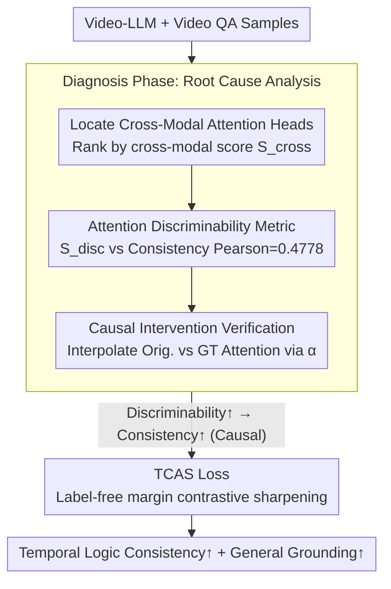

# Understanding Temporal Logic Consistency in Video-Language Models through Cross-Modal Attention Discriminability

**Conference**: CVPR 2026  
**arXiv**: [2510.08138](https://arxiv.org/abs/2510.08138)  
**Code**: None  
**Area**: Video Understanding  
**Keywords**: Temporal Logic Consistency, Video-Language Models, Attention Interpretability, Cross-Modal Attention, Video Temporal Grounding

## TL;DR
This paper analyzes the root cause of temporal logic inconsistency in Video-LLMs from an interpretability perspective—specifically the inability of cross-modal attention heads to effectively distinguish video tokens at different timestamps—and proposes TCAS (Temporally Conditioned Attention Sharpening) to significantly improve temporal logic consistency and general temporal grounding performance by optimizing attention distribution.

## Background & Motivation
1. **Background**: Video-LLMs excel in tasks like video QA and description generation. Many works incorporate additional temporal modules to enhance temporal understanding (e.g., TimeChat, VTG-LLM).
2. **Limitations of Prior Work**: Jung et al. (2024) observed that Video-LLMs fail to provide logically consistent answers to rephrased questions—models may ground an event correctly but provide contradictory answers when the same event is questioned differently. This suggests a lack of true temporal relationship comprehension.
3. **Key Challenge**: While numerous modular methods have been proposed to enhance temporal understanding, the underlying reason for logical inconsistency remains unexplored. Previous work identified the phenomenon without diagnosing the mechanism.
4. **Goal**: (a) Identify the internal factors affecting temporal consistency. (b) Design improvement methods based on diagnostic results.
5. **Key Insight**: Starting from the interpretability of attention mechanisms, this work focuses on cross-modal attention heads—a small subset of heads responsible for mapping event text tokens to corresponding video tokens in specific time segments.
6. **Core Idea**: The discriminability of cross-modal attention heads across different timestamps is the critical factor for temporal logic consistency. Enhancing this discriminability through contrastive learning losses can significantly improve consistency.

## Method

### Overall Architecture
The work consists of two phases: (1) Diagnosis Phase—revealing the causal relationship between cross-modal attention discriminability and temporal consistency through head detection, attention visualization, statistical analysis, and causal intervention. (2) Method Phase—proposing the TCAS loss to optimize attention distribution via contrastive learning, sharpening the model's temporal resolution.

### Key Designs

**1. Locating cross-modal attention heads responsible for vision-text alignment**

Out of thousands of attention heads, only a few are responsible for aligning event text to video segments. The authors calculate a cross-modal score $S_{cross}^{h,v}$ for each head—defined as the average attention from text tokens to video tokens. Ranking by this score identifies a small group of cross-modal heads (mostly in middle layers). Visualization reveals a clear pattern: in logically consistent samples, these heads focus text tokens firmly on the correct video segments; in inconsistent samples, attention is scattered or shifted. This step establishes the foundation: temporal discriminability resides in these specific heads.

**2. Quantifying discriminability: The Attention Discriminability Metric**

To link behavior to performance, the authors define a discriminability metric $S_{disc}^{h,v}$ for head $h$ and sample $v$. It represents the ratio of attention directed at video tokens within the ground-truth time range relative to total attention. The average discriminability of top-$t$ cross-modal heads shows a Pearson correlation of 0.4778 ($p$-value $\ll 0.05$) with consistency performance, quantitatively linking internal attention behavior to logical consistency for the first time.

**3. From correlation to causality: Verification via attention intervention**

To confirm causality, the authors perform "surgery" during inference: they linearly interpolate the original attention of cross-modal heads with an ideal (ground-truth) attention distribution using a coefficient $\alpha$:

$$A_{q,V} = (1-\alpha)\,A_{q,V}^{orig} + \alpha\,A_{q,V}^{gt}$$

Minor interventions ($\alpha=0.2\text{–}0.4$) improve consistency, while excessive intervention degrades performance. This curve proves that "improving discriminability $\to$ improving consistency" is indeed the causal direction, justifying the training strategy.

**4. TCAS Loss: Sharpening model preferences without temporal labels**

The goal is to inherently improve the discriminability of cross-modal heads. Since per-frame temporal labels are often unavailable during fine-tuning, TCAS ingeniously sidesteps labels. For each cross-modal head, it identifies text tokens showing a clear temporal preference (max attention $> thr$). It aggregates their attention across timestamps and uses the mean of this distribution as a boundary—timestamps above the mean are treated as positive samples $P_q^h$ and those below as negative $N_q^h$. A margin contrastive loss then separates them:

$$\mathcal{L}_q^h = \max\big(m + \max(N_q^h) - \min(P_q^h),\, 0\big)$$

Intuitively, TCAS sharpens the blurred signals that the model already partially perceives. Since it relies on the model's own distribution rather than ground-truth labels, it is universally applicable across various video-language tasks.

### Loss & Training
Total training loss = Standard SFT loss + $w_{ae}$ × TCAS loss. Key hyperparameters: top heads $t=32$, margin $m=0.2$, threshold $thr=0.1$, and loss weight $w_{ae}=0.5$. Training was conducted for approximately 3 days on a single A100 80GB GPU using the Adam optimizer ($lr=10^{-5}$, $batch=4$).

## Key Experimental Results

### Main Results (Charades-CON Consistency Evaluation)

| Method | Data | Tuning | Grounding | R-Ground | S-Ground | H-Verify | C-Verify |
|------|------|------|-----------|----------|----------|----------|----------|
| TimeChat | VTune | SFT | 76.2 | 69.2 (90.8%) | 36.2 (47.5%) | 44.8 (58.8%) | 42.4 (55.7%) |
| TimeChat | VTune | **TCAS** | **83.3** | **75.0 (90.1%)** | **39.5 (47.4%)** | **52.9 (63.5%)** | **50.8 (61.0%)** |
| Qwen2.5-VL | VTune | SFT | 28.3 | 17.5 (62.0%) | 6.0 (21.1%) | 15.1 (53.3%) | 14.8 (52.1%) |
| Qwen2.5-VL | VTune | **TCAS** | **34.0** | **23.0 (67.5%)** | **8.1 (23.7%)** | **19.6 (57.6%)** | **18.5 (54.3%)** |

### Ablation Study (Hyperparameter Sensitivity)

| Hyperparameter | Value | Grounding | R-Grounding | S-Grounding |
|--------|---|-----------|-------------|-------------|
| $t$ (Heads) = 16 | Small Range | 80.91 | 72.14 | 36.77 |
| $t$ = 32 (Opt) | Default | **83.31** | **75.02** | **39.52** |
| $t$ = 48 | Large Range | 77.37 | 69.66 | 39.04 |
| $thr$ = 0.05 | Low Threshold | 81.90 | 74.95 | **41.45** |
| $thr$ = 0.1 | Balanced | 83.31 | 75.02 | 39.52 |

### Key Findings
- **TCAS improves both consistency and grounding**: On Charades-STA, TimeChat's R@1,0.5 improved from 58.4% to 60.2%, suggesting inconsistency is a latent bottleneck for general temporal understanding.
- **Robustness across video lengths**: On long videos (>40s), TCAS achieved a $+17.7$ Grounding and $+14.8$ R-Grounding gain, demonstrating greater advantages in complex scenarios.
- **Range parameters are more sensitive than intensity**: Head count $t$ and threshold $thr$ have the largest impact, while margin $m$ and weight $w_{ae}$ are relatively robust. Excessive heads or low thresholds introduce noise.
- **Visual verification of discriminability**: Post-TCAS training, the attention discriminability distribution significantly shifts rightward, confirming that consistency gains stem from enhanced attention resolution.

## Highlights & Insights
- **Interpretability-to-Method Loop**: The paper follows a rigorous "diagnosis (detection + visualization + statistics + intervention) $\to$ treatment (TCAS) $\to$ verification" paradigm.
- **Label-free Attention Sharpening**: By leveraging the model's own coarse preferences as self-supervision, TCAS avoids dependence on ground-truth timestamps, making it highly versatile.
- **Inconsistency as a Bottleneck**: The discovery that TCAS boosts general grounding suggests that logical inconsistency is not an isolated issue but a reflection of core temporal reasoning capabilities.

## Limitations & Future Work
- Focus on logical inconsistency might not encompass all facets of temporal understanding.
- Improvements on ActivityNet-CON are relatively smaller due to long, noisy event descriptions.
- Analysis focused primarily on TimeChat and Qwen2.5-VL; generalization across more architectures requires further study.
- TCAS is a training-time intervention; it is not yet a training-free enhancement for inference.

## Related Work & Insights
- **vs TimeChat/VTG-LLM**: These methods add modules without analyzing why the base models fail. This work finds the root cause and provides a lightweight solution.
- **vs Jung et al.**: While previous work established the benchmarks, this paper explores the "why" and "how to fix" aspects.
- **vs LLM Interpretability**: This work extends established interpretability methods (like modality-specific circuits) to the temporal domain in Video-LLMs.

## Rating
- Novelty: ⭐⭐⭐⭐ (First analysis of temporal consistency through the lens of attention discriminability)
- Experimental Thoroughness: ⭐⭐⭐⭐ (Causal interventions and multi-dataset validation)
- Writing Quality: ⭐⭐⭐⭐⭐ (Logical and well-structured argument)
- Value: ⭐⭐⭐⭐ (Provides a simple, effective, and universal improvement strategy)

<!-- RELATED:START -->

## Related Papers

- [\[CVPR 2025\] On the Consistency of Video Large Language Models in Temporal Comprehension](../../CVPR2025/video_understanding/on_the_consistency_of_video_large_language_models_in_temporal_comprehension.md)
- [\[CVPR 2026\] SVAgent: Storyline-Guided Long Video Understanding via Cross-Modal Multi-Agent Collaboration](svagent_storyline_guided_long_video_understanding_via_cross_modal_multi_agent_collaboration.md)
- [\[CVPR 2026\] Time Blindness: Why Video-Language Models Can't See What Humans Can?](time_blindness_why_video-language_models_cant_see_what_humans_can.md)
- [\[CVPR 2026\] Progressive Cross-Modal Causal Intervention for Long-Term Action Recognition](progressive_cross-modal_causal_intervention_for_long-term_action_recognition.md)
- [\[NeurIPS 2025\] Enhancing Temporal Understanding in Video-LLMs through Stacked Temporal Attention in Vision Encoders](../../NeurIPS2025/video_understanding/enhancing_temporal_understanding_in_videollms_through_stacke.md)

<!-- RELATED:END -->
