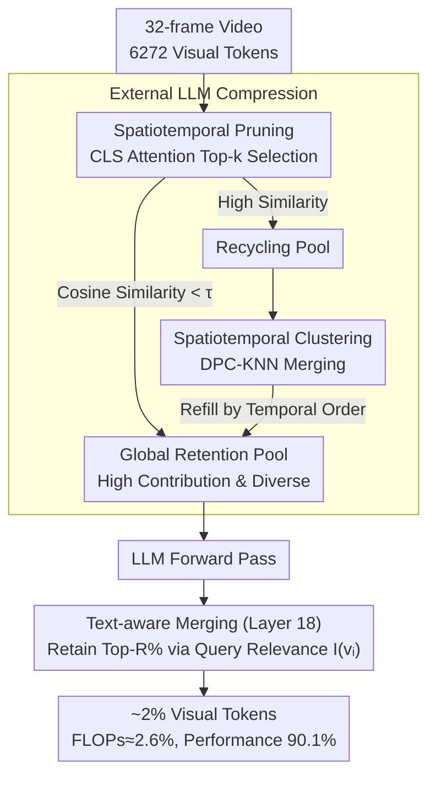

# Unified Spatiotemporal Token Compression for Video-LLMs at Ultra-Low Retention

**Conference**: CVPR 2026  
**arXiv**: [2603.21957](https://arxiv.org/abs/2603.21957)  
**Code**: None  
**Area**: Video Understanding / Multimodal VLM / LLM Efficiency  
**Keywords**: Visual token compression, Video large language models, Unified spatiotemporal compression, Inference acceleration, Training-free  

## TL;DR
This paper proposes a unified spatiotemporal token compression method that jointly evaluates token contribution and semantic redundancy via a global retention pool. By introducing text-aware merging within the LLM, the method maintains 90.1% of baseline performance at an extreme 2% visual token retention rate, while reducing FLOPs to approximately 2.6%.

## Background & Motivation

1.  **Background**: Video-LLMs (e.g., LLaVA-OneVision-7B) excel in complex video understanding tasks. However, generating 196 visual tokens per frame leads to 6,272 tokens for a 32-frame video. The resulting redundancy causes significant inference latency and memory consumption.
2.  **Limitations of Prior Work**: Existing training-free video token compression methods are categorized into spatial pruning (VisionZip, PruMerge), temporal pruning (DyCoke, TempMe), and phased spatiotemporal methods (FastVid, HoliTom). These typically adopt two-stage (temporal-then-spatial or spatial-then-temporal) independent scoring strategies, assuming spatiotemporal redundancy is separable.
3.  **Key Challenge**: At ultra-low retention rates (≤5%), the assumption of spatiotemporal separability fails. Phased decision-making leads to unbalanced resource allocation—retaining non-critical tokens while discarding essential ones. For instance, FastVid retains only 83.3% performance at a 2% retention rate. Furthermore, intra-LLM pruning (e.g., FastV, PDrop) relies on the attention weight of the last token, introducing positional bias and weakening the influence of key query words.
4.  **Goal**: (a) Uniformly allocate spatiotemporal tokens under global constraints to maximize contribution and minimize redundancy. (b) Further compress tokens within the LLM based on query relevance.
5.  **Key Insight**: Token compression is redefined as a global spatiotemporal allocation problem rather than phased independent processing, utilizing attention weights and semantic similarity for joint evaluation.
6.  **Core Idea**: A unified global retention pool replaces two-stage compression. Combining contribution and redundancy metrics for selection, paired with cluster-based merging in a recycling pool and intra-LLM text-aware merging, enables efficient compression at extreme ratios.

## Method

### Overall Architecture
The proposed method addresses the expansion of 32-frame videos into thousands of visual tokens in Video-LLMs. At extreme compression (≤5%), phased methods misallocate spatiotemporal budgets. The mechanism splits compression into two layers: **Externally**, all visual tokens enter a global retention pool where tokens are selected based on "attention contribution + cosine redundancy." Unselected tokens are clustered and merged in a recycling pool to fill the budget. **Internally**, a text-aware merging occurs at an intermediate LLM layer to filter visual tokens relevant to the specific query semantics.

### Key Designs

**1. Spatiotemporal Pruning: Global Token Selection via Contribution and Redundancy**
Two-stage methods treat temporal and spatial redundancy as separable, leading to imbalanced budgets at low retention. This design performs joint evaluation across all visual tokens. Contribution is quantified via CLS token attention scores $A_h = \text{Softmax}(Q_h K_h^\top / \sqrt{d})$. For encoders without CLS tokens (e.g., SigLIP), average attention is used. To ensure diversity, candidates must satisfy a maximum cosine similarity check $S = \max_{p \in \mathcal{P}} \frac{c \cdot p}{\|c\|\|p\|} < \tau$ relative to the existing pool; otherwise, they are moved to the recycling pool.

**2. Spatiotemporal Cluster Merging: Clustering in the Recycling Pool**
Low-attention tokens are not discarded but compressed via DPC-KNN clustering. By calculating local density $\rho_i$ and distance $\delta_i$ to higher-density tokens, cluster centers are selected via decision scores $\gamma_i = \rho_i \times \delta_i$. Remaining tokens are averaged into these centers, and the resulting representative tokens refill the retention pool.

**3. Text-aware Merging: Query-Relevant Selection inside the LLM**
Unlike methods using only the last token's attention, this design uses cross-attention from all text tokens to visual tokens $A_{qv}$. A decision score $I(v_i)$ is formulated using normalized maximum cross-attention $A_m^{\text{norm}}$ and maximum cosine similarity $S_m^{\text{norm}}$:
$$I(v_i) = (1-\lambda) \cdot A_m^{\text{norm}} + \lambda \cdot S_m^{\text{norm}}$$
The top-R% visual tokens are retained, while others are merged into the nearest retained token. This mitigates positional bias and aligns compression with the specific query.

### Loss & Training
The method is entirely training-free and serves as a plug-and-play module for existing Video-LLMs. Hyperparameters include similarity threshold $\tau=0.7$, clustering ratio 0.3, LLM internal activation at layer 18, retention of top 50% visual tokens, and $\lambda=0.5$.

## Key Experimental Results

### Main Results
Comparison on LLaVA-OneVision-7B (Average across 5 benchmarks):

| Retention | Method | FLOPs(T) | MVBench | EgoSchema | MLVU | LVBench | VideoMME | Avg | Score% |
| :--- | :--- | :--- | :--- | :--- | :--- | :--- | :--- | :--- | :--- |
| 100% | Original | 41.4 | 58.3 | 60.4 | 47.7 | 56.4 | 58.6 | 56.3 | 100% |
| 2% | FastVID | 1.2 | 48.0 | 52.3 | 37.6 | 47.3 | 49.2 | 46.9 | 83.3% |
| 2% | HoliTom | 1.1 | 52.6 | 57.2 | 37.4 | 48.5 | 51.1 | 49.4 | 87.7% |
| 2% | **Ours** | **1.1** | **52.8** | **57.6** | **40.3** | **50.8** | **51.8** | **50.7** | **90.1%** |

Cross-backbone performance (LLaVA-Video-7B, 2% Retention):

| Method | FLOPs Ratio | MVBench | MLVU | VideoMME | Avg | Score% |
| :--- | :--- | :--- | :--- | :--- | :--- | :--- |
| HoliTom | 1.7% | 50.2 | 39.9 | 55.3 | 48.5 | 82.5% |
| **Ours** | **1.7%** | **50.1** | **40.8** | **56.2** | **48.8** | **83.0%** |

### Ablation Study

| Configuration | 5% Avg | 2% Avg | Description |
| :--- | :--- | :--- | :--- |
| Full model | 53.7 | 50.7 | Complete method |
| w/o Internal Merging | 53.4 | 50.4 | Removed text-aware merging (-0.3) |
| HoliTom (2-stage) | 52.9 | 49.4 | Baseline; gap widens at lower retention |

### Key Findings
- At 2% retention (approx. 4 tokens/frame), the method outperforms the two-stage HoliTom by 2.4% (87.7% → 90.1%), validating unified allocation.
- Effectiveness across various backbones (LLaVA-Video, Qwen2.5-VL) proves generalization.
- Text-aware merging is more impactful at lower retention rates, indicating query-guided secondary compression is crucial when tokens are scarce.
- FLOPs are reduced to ~2.6% of the original, significantly lowering inference latency.

## Highlights & Insights
- **Global Retention Pool**: Shifts token compression from phased optimization to global joint optimization, upgrading from "local greedy" to a "global perspective."
- **Recycling Pool Clustering**: Avoids simple discarding of low-score tokens by merging them into representative tokens, preserving structural semantic information.
- **Training-free Deployment**: Compatibility with multiple Video-LLMs without weight fine-tuning lowers deployment barriers.

## Limitations & Future Work
- Dependency on the quality of visual encoder attention scores; performance may drop if the encoder's attention distribution is poor.
- Manual tuning required for hyperparameters such as $\tau$ and clustering ratios.
- Primarily evaluated on multiple-choice benchmarks; lacks extensive evaluation on open-ended generation tasks.
- Text-aware merging requires internal LLM access, limiting application to closed-source API models.

## Related Work & Insights
- **vs HoliTom**: HoliTom uses dynamic programming for temporal segmenting + two-stage pruning. Ours uses a global pool for unified processing, showing better stability at extreme compression.
- **vs FastV**: FastV prunes inside the LLM using only the last token attention and lacks external compression. Ours uses dual-layer compression with multi-token cross-attention to avoid bias.

## Rating
- Novelty: ⭐⭐⭐⭐
- Experimental Thoroughness: ⭐⭐⭐⭐⭐
- Writing Quality: ⭐⭐⭐⭐
- Value: ⭐⭐⭐⭐

<!-- RELATED:START -->

## Related Papers

- [\[CVPR 2026\] EarlyTom: Early Token Compression Completes Fast Video Understanding](earlytom_early_token_compression_completes_fast_video_understanding.md)
- [\[CVPR 2026\] StreamingTOM: Streaming Token Compression for Efficient Video Understanding](streamingtom_streaming_token_compression_for_efficient_video_understanding.md)
- [\[CVPR 2026\] An Efficient Token Compression Framework for Visual Object Tracking](an_efficient_token_compression_framework_for_visual_object_tracking.md)
- [\[ICLR 2026\] FlashVID: Efficient Video Large Language Models via Training-free Tree-Based Spatiotemporal Token Merging](../../ICLR2026/video_understanding/flashvid_efficient_video_large_language_models_via_training-free_tree-based_spat.md)
- [\[CVPR 2026\] UTPTrack: Towards Simple and Unified Token Pruning for Visual Tracking](utptrack_towards_simple_and_unified_token_pruning_for_visual_tracking.md)

<!-- RELATED:END -->
## Related Papers

- [\[CVPR 2026\] EarlyTom: Early Token Compression Completes Fast Video Understanding](earlytom_early_token_compression_completes_fast_video_understanding.md)
- [\[CVPR 2026\] An Efficient Token Compression Framework for Visual Object Tracking](an_efficient_token_compression_framework_for_visual_object_tracking.md)
- [\[CVPR 2026\] StreamingTOM: Streaming Token Compression for Efficient Video Understanding](streamingtom_streaming_token_compression_for_efficient_video_understanding.md)
- [\[ICLR 2026\] FlashVID: Efficient Video Large Language Models via Training-free Tree-Based Spatiotemporal Token Merging](../../ICLR2026/video_understanding/flashvid_efficient_video_large_language_models_via_training-free_tree-based_spat.md)
- [\[CVPR 2026\] UTPTrack: Towards Simple and Unified Token Pruning for Visual Tracking](utptrack_towards_simple_and_unified_token_pruning_for_visual_tracking.md)

<!-- RELATED:END -->
