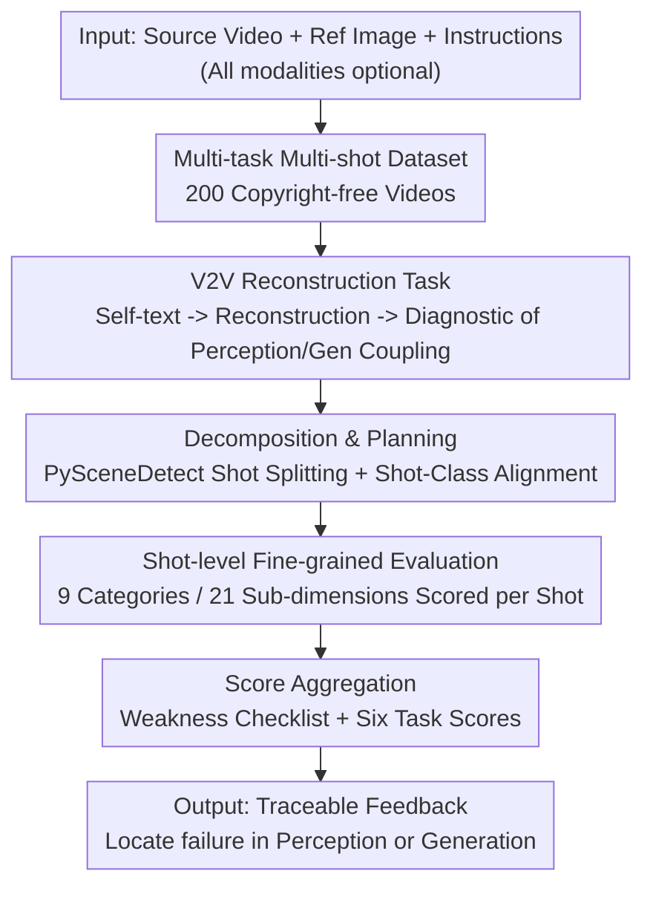

# UniVBench: Towards Unified Evaluation for Video Foundation Models

**Conference**: CVPR 2026  
**Paper**: [CVF Open Access](https://openaccess.thecvf.com/content/CVPR2026/html/Wei_UniVBench_Towards_Unified_Evaluation_for_Video_Foundation_Models_CVPR_2026_paper.html)  
**Code**: https://github.com/JianhuiWei7/UniVBench  
**Area**: Video Understanding / Video Foundation Model Evaluation  
**Keywords**: Unified Video Models, Evaluation Benchmark, Agentic Evaluation, Video Reconstruction, Multi-shot

## TL;DR
UniVBench utilizes 200 human-crafted, copyright-free multi-shot videos and an agentic evaluation system, UniV-Eval, to evaluate video understanding, generation, editing, and the newly proposed "video reconstruction" within a single framework. It is the first to provide a unified answer to whether unified video models truly excel in both perception and generation.

## Background & Motivation

**Background**: Video foundation models aim to integrate video understanding, generation, editing, and instruction-following into a single architecture, which is considered the primary direction for next-generation multimodal systems. Representative works such as Chameleon, Show-o, Emu3, BAGEL, and Janus-Pro combine LLMs, visual tokenizers, and video decoders, claiming the ability to both perceive and generate video under a single instruction.

**Limitations of Prior Work**: While architectures are advancing, **objective evidence regarding the benefits of "unification" remains elusive**. This stems from the fragmented nature of existing benchmarks: video understanding benchmarks (AuroraCap, ShotBench) focus solely on captioning and rely heavily on crawled copyrighted videos, risking data contamination; generation benchmarks (VBench, AIGVE-60K) evaluate only text-to-video and exclude understanding or editing; editing benchmarks (TGVE, VACE-Bench) only cover single-shot scenarios. Each benchmark uses disparate metrics (e.g., BLEU/CIDEr for understanding, FVD/CLIPScore for generation), making **cross-task comparisons impossible**.

**Key Challenge**: The selling point of unified models is "one model for everything," yet evaluation remains "one benchmark for one task." This misalignment between capability definitions and measurement methods leaves a critical question unanswered: **Does unification yield genuine performance gains, or is it merely a stitching of multiple incomplete components?** Worse, traditional scalar metrics mask the trade-offs between different dimensions, failing to provide actionable feedback for training.

**Goal**: To create a unified benchmark capable of simultaneously evaluating understanding, generation, editing, and reconstruction under the same data and protocol, while attributing failures to either "perception" or "generation."

**Key Insight**: The authors focus on two neglected dimensions: **multi-shot** narrative content and **cinematic fine-grained dimensions** (style, subject, motion, background, camera, lighting, color, and spatial relationships). Real-world videos are multi-shot and narrative-driven; static scalar metrics fail to capture this complexity.

**Core Idea**: Unify six sub-tasks through "instruction-driven multi-shot video tasks" paired with an **agentic evaluation system that performs dynamic planning, shot-level scoring, and outputs traceable weakness checklists**, decomposing "overall generation quality" into an interpretable multidimensional checklist rather than a single number.

## Method

### Overall Architecture

UniVBench consists of a **dataset** and an **evaluation system, UniV-Eval**. The dataset provides 200 copyright-free multi-shot videos, each with detailed captions, multi-format editing instructions, and reference images, covering 8 cinematic categories and 21 sub-dimensions. UniV-Eval integrates any input (source video, reference image, reference text) and output (video or text) into a unified scoring workflow.

The benchmark decomposes unified video model capabilities into **six tasks**: Video Captioning (V2T), Text-to-Video (T2V), Reference Image-to-Video (R2V), Text-instructed Video Editing (TV2V), Reference Image-based Editing (RV2V), and the newly proposed Video Reconstruction (V2V). V2V is the diagnostic key: it requires the model to understand the source video to generate text, then reconstruct the video solely from that self-generated text, thereby exposing the coupling loss between perception and generation.

During evaluation, UniV-Eval performs planning and decomposition, evaluates shot-by-shot, and aggregates results into a checklist with scores and weakness feedback. The workflow is as follows:

### Key Designs

**1. Multi-task, Multi-shot, Copyright-free Dataset Construction**

Existing benchmarks use web-crawled videos that may overlap with training sets and possess copyright issues. UniVBench is **entirely human-crafted and copyright-clean**. The authors expanded 8 basic dimensions into 21 fine-grained sub-dimensions (style, subject quality/appearance, motion, camera movement/angle, lighting brightness/effect, color saturation, spatial relations, etc.), with predefined categories for each. 

Experts with video production backgrounds wrote shot-by-shot scripts, which were generated using commercial APIs (Hailuo, Kling, Veo3) and subjected to a three-level human-in-the-loop filter: ① VLM-based removal of watermarks and IP content; ② Independent verification by three reviewers against all eight dimensions; ③ Artifact and temporal consistency checks by quality experts. On average, each video required 2.3 attempts to pass. Captions were synthesize-extracted via Gemini 2.5 Pro and cross-validated by GPT-4o. This rigorous process ensures the reliability of the evaluation data.

**2. V2V Video Reconstruction Task: Exposing Perception-Generation Coupling Loss**

Unified models benefit from shared representations, but traditional tasks fail to measure **losses at the interface of understanding and generation**. The V2V task requires the model to first understand a source video and generate a detailed caption, then **reconstruct the video using only its own generated text**. This reconstruction is compared against the original. Logic implies a superior unified model must pass both stages: high-quality perception (captioning) and high-quality generation (reconstruction). **Failure in either stage results in significant deviation from the original video**. 

Comparing V2V (using self-generated text) with T2V (using ground-truth text) allows for the quantification of information loss in the V2T → T2V pipeline. Experiments show that V2V inconsistency is significantly higher than T2V, indicating systematic losses at the perception-generation junction in current unified models.

**3. UniV-Eval Agentic Evaluation System: Decomposing Scalars into Traceable Checklists**

UniV-Eval addresses the limitations of scalar metrics using a **dynamic adaptive agent workflow**:

**Decomposition & Planning**: Long videos are split using PySceneDetect into shot-level units $V=\{v_1,\dots,v_n\}$. A Shot Classification Agent aligns reference images $I$ and instructions $T$ to corresponding shots, forming triplets $(v,i,t)$.

**Shot-level Fine-grained Evaluation**: The Shot Evaluation Agent compares the output $o$ against the input triplet $(v,i,t)$ across 9 categories and 21 sub-dimensions. It generates a structured **weakness checklist** identifying specific timestamps, error types, descriptions, and suggestions for improvement. A Scoring Agent aggregates these signals into final scores for the six tasks. This unified prompt and standard across all tasks ensures that score variances reflect model capability rather than evaluation noise.

## Key Experimental Results

### Main Results

Evaluations were performed on 8 H100 GPUs. Commercial models were accessed via APIs (GPT-5, Gemini 2.5 Pro, etc.), and open-source models used official checkpoints. Scores are percentages (max 100%):

| Task | Representative Model | Average | Remarks |
|------|---------|---------|------|
| Understanding V2T | Gemini 2.5 Pro (Comm.) | 54.1% | Strongest understanding |
| Understanding V2T | Showo-2 (Unified) | 16.3% | Weak perception in unified models |
| Generation T2V | Seedance-1.0-Pro (Comm.) | 77.9% | Strongest T2V |
| Generation T2V | Wan2.2-14B (Open) | 74.9% | Close to commercial |
| Generation R2V | Seedance-1.0-Lite | 66.7% | Image-to-Video |
| Editing TV2V | Wan2.1-VACE-14B | 65.1% | Text-instructed edit |
| Editing RV2V | Wan2.1-VACE-14B | 66.4% | Reference-based edit |
| Reconstruction V2V | Wan2.1-VACE-14B | 62.7% | Strongest reconstruction |
| Reconstruction V2V | CogVideoX-1.5-5B | 20.7% | Weakest reconstruction |

### Comparison

UniVBench dominance relative to existing benchmarks:

| Benchmark | Applicable Tasks | Multi-shot | Copyright-free | Cinematic Dimensions |
|------|---------|--------|--------|------------|
| AuroraCap (Under.) | V2T | ✗ | Questionable | Subject/Camera only |
| VBench (Gen.) | T2V | ✗ | NA | Lacks Lighting/Space |
| TGVE (Edit.) | TV2V | ✗ | Yes | Subject/BG only |
| VACE-Bench (Edit.) | R2V/TV2V/RV2V | ✗ | Questionable | Partial |
| **UniVBench** | **All 6 Tasks** | **✓** | **Yes** | **All 8 Dimensions** |

### Key Findings

- **No single model dominates the entire spectrum**: Gemini 2.5 Pro leads in V2T (54.1%), while Showo-2 only reaches 16.3% in the same task. In generation, specialized models like Seedance and Wan lead. This quantitatively confirms that "unification" is currently architectural rather than functional.
- **"Motion" is a universal weakness**: Across all tasks, the Action dimension received the lowest scores, indicating that interpreting and synthesizing complex temporal dynamics remains a major challenge. In contrast, static attributes like Color and Style are well-controlled.
- **Reconstruction exposes perception-generation loss**: The higher inconsistency in V2V compared to T2V (using GT text) highlights information loss in the V2T → T2V transition.
- **UniV-Eval achieves ~85% human alignment**: Random cross-verification showed an 85% agreement rate with human judgment, proving the reliability of agentic scoring compared to metrics like BLEU, which are distorted by caption length.

## Highlights & Insights

- **V2V reconstruction is a brilliant diagnostic tool**: By using "self-generated text for reconstruction," the authors quantify the interface loss of unified models that is otherwise difficult to isolate. This methodology is transferable to any multimodal system with shared encoder-decoder representations.
- **Evaluating as a "planned agentic task"**: Shot-splitting and shot-level checklists provide structured feedback with timestamps and suggestions, which is far more actionable for model refinement than scalar scores.
- **Addressing data contamination at the source**: The use of human-crafted videos and multi-level filtering ensures the evaluation data does not exist in the training set, a critical prerequisite for fair evaluation.

## Limitations & Future Work

- **Small Scale**: With 200 videos, the dataset is high-quality but limited in volume. Expanding the dataset is a priority to ensure statistical significance and long-tail coverage.
- **Dependency on Commercial APIs**: UniV-Eval relies on Seed-1.6 for evaluation and commercial APIs for generation. Changes in API versions may lead to baseline drift.
- **Incomparability of Absolute Scores across Tasks**: Task difficulty varies naturally (e.g., understanding scores are generally lower than generation scores), so cross-task score comparisons should be interpreted with caution.
- **Future Directions**: Introducing more open-source video generation pipelines and integrating the weakness checklist into the training loop to verify if diagnostic feedback can directly improve model performance.

## Related Work & Insights

- **Vs. VBench/AIGVE-60K**: These established systematic generation metrics but focus only on text-to-video. UniVBench unifies six tasks under one protocol, enabling cross-task comparison at the cost of scale.
- **Vs. AuroraCap/ShotBench**: These improved captioning quality but are limited to understanding tasks and use potentially contaminated web videos.
- **Vs. VACE-Bench**: While VACE-Bench attempts to unify editing modalities, it remains restricted to single shots, whereas UniVBench's multi-shot focus is closer to real cinematic scenarios.

## Rating
- Novelty: ⭐⭐⭐⭐ The first unified benchmark for six tasks; V2V reconstruction and the agentic system are valuable designs.
- Experimental Thoroughness: ⭐⭐⭐⭐ Coverage of multiple tasks and models with human alignment; slight deduction for the small dataset size (200 videos).
- Writing Quality: ⭐⭐⭐⭐ Clear motivation and intuitive comparison tables.
- Value: ⭐⭐⭐⭐ Provides the first "unified ruler" for unified video models, offering practical guidance for model training and assessment.

<!-- RELATED:START -->

## Related Papers

- [\[CVPR 2026\] UFVideo: Towards Unified Fine-Grained Video Cooperative Understanding with Large Language Models](ufvideo_towards_unified_fine-grained_video_cooperative_understanding_with_large_.md)
- [\[CVPR 2026\] Enhancing Accuracy of Uncertainty Estimation in Appearance-based Gaze Tracking with Probabilistic Evaluation and Calibration](enhancing_accuracy_of_uncertainty_estimation_in_appearance-based_gaze_tracking_w.md)
- [\[CVPR 2025\] Efficient Transfer Learning for Video-language Foundation Models](../../CVPR2025/video_understanding/efficient_transfer_learning_for_video-language_foundation_models.md)
- [\[NeurIPS 2025\] MimeQA: Towards Socially-Intelligent Nonverbal Foundation Models](../../NeurIPS2025/video_understanding/mimeqa_towards_socially-intelligent_nonverbal_foundation_models.md)
- [\[CVPR 2026\] Unified Spatiotemporal Token Compression for Video-LLMs at Ultra-Low Retention](unified_spatiotemporal_token_compression_for_video-llms_at_ultra-low_retention.md)

<!-- RELATED:END -->
