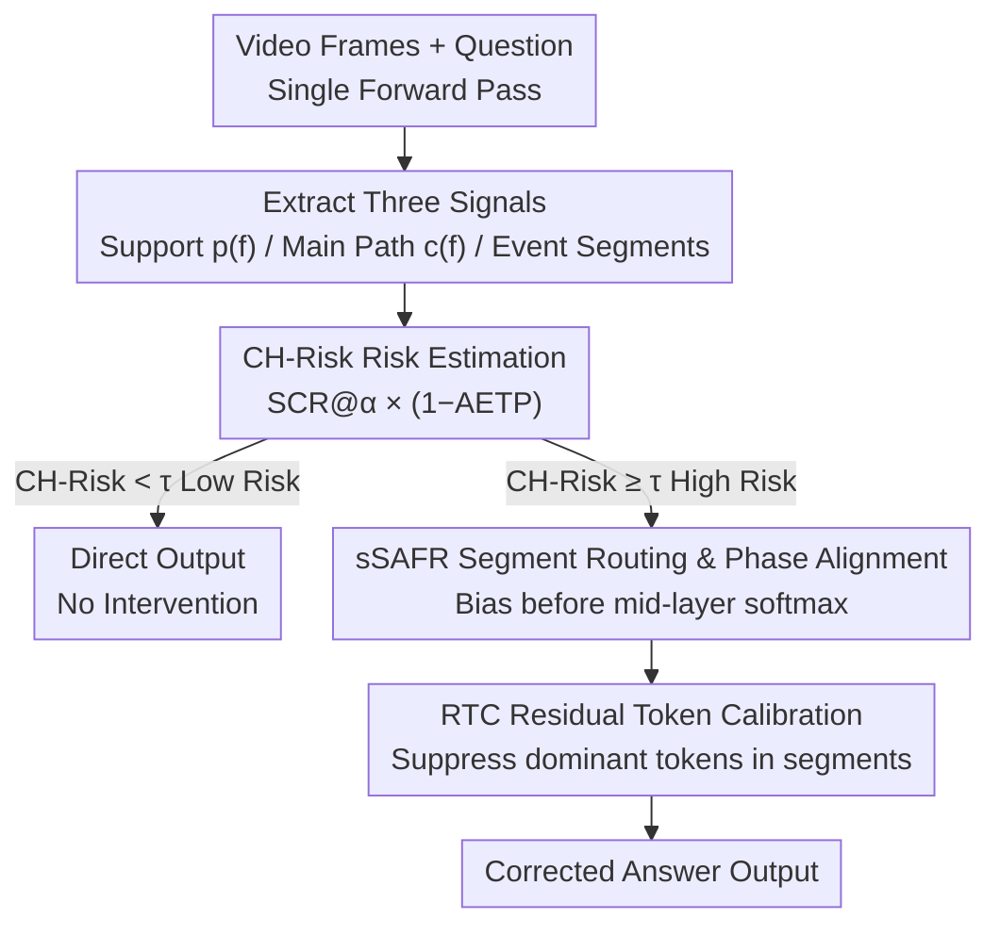

# Unstitching the Chimera: Frame-Level Risk and Train-Free Mitigation for Video Hallucination

**Conference**: CVPR 2026  
**Paper**: [CVF Open Access](https://openaccess.thecvf.com/content/CVPR2026/html/Yang_Unstitching_the_Chimera_Frame-Level_Risk_and_Train-Free_Mitigation_for_Video_CVPR_2026_paper.html)  
**Area**: Video Understanding / Multimodal VLM / Hallucination Mitigation  
**Keywords**: Video Hallucination, Chimera Hallucination, Training-free Intervention, Attention Routing, Risk Estimation

## TL;DR
This paper characterizes a neglected type of video hallucination from the perspective of "frames" rather than "tokens"—**Chimera Hallucination**: where the model stitches together fragments that actually exist in the video but do not belong to the same event chain into a false continuous narrative. To address this, the authors propose CH-Risk, a single-forward-pass, reference-free risk metric to quantify this risk, and CH-M, a training-free two-stage intervention (segment routing sSAFR + residual token calibration RTC), to correct high-risk samples. This approach consistently reduces hallucinations and improves accuracy across 9 benchmarks and 6 VideoLLMs with <5% latency, <2.5% VRAM, and ≈1% FLOPs overhead.

## Background & Motivation
**Background**: Research on hallucination in Multimodal Large Language Models (MLLM) is highly "image-centric." Mainstream taxonomies revolve around **object hallucination** (seeing non-existent entities), relationship hallucination, and decoding-related hallucination. Mitigation methods follow two paths: retraining methods based on extra supervision/alignment, and training-free methods that intervene at inference time and are deployment-friendly. However, these diagnostics and methods are built on a "single frame + token-level" perspective.

**Limitations of Prior Work**: Videos are not simple stacks of images. Errors in video often manifest as **narrative distortion**, which is more subtle and harmful than single-frame errors. Many VideoLLMs inherited from image-text pre-training suffer from a "static-to-dynamic" distribution mismatch, weakening their modeling of true frame order and cross-frame causal structures. Existing token-level, object-centric diagnostic tools fail to capture this "cross-frame mismatch."

**Key Challenge**: There exists a class of hallucinations where the model **does not fabricate any entities from thin air** (causing all object hallucination detectors to fail). Every piece of evidence it cites actually exists in the video, but it **forcibly stitches** evidence from different event chains into a seemingly coherent but actually incorrect story. Through a large-scale audit of 600 failure cases from three representative VideoLLMs, the authors found that this "Chimera Hallucination" accounts for **34%** of bad cases, second only to object hallucination (52%)—making it a widespread yet formally uncharacterized failure mode.

**Goal**: (1) Define Chimera Hallucination **clearly, measurably, and reproducibly**; (2) Design a risk metric that can be calculated in a single forward pass without reference answers; (3) Convert risk signals into **training-free** inference-time corrections.

**Key Insight**: Recent research has found that VideoLLMs contain **staged temporal information flows**: shallow-to-middle layers aggregate cross-frame temporal relations to form a "Temporal Main Path," middle layers fuse with temporal words, and middle-to-late layers synthesize the answer. A correct answer should seek evidence along the early-formed temporal main path rather than sampling distant anchors during decoding. The authors derive two operational rules: **(R1) Event Consistency**—the main evidence for an answer should not be scattered across a large number of event segments semantically unrelated to the question; **(R2) Phase Alignment**—frame-level evidence at the decoding moment should align with the temporal main path formed in the shallow-to-middle layers.

**Core Idea**: Combine two complementary signals—"how scattered the evidence is (segment coverage)" × "how much the evidence deviates from the main path (phase mismatch)"—to synthesize a risk score. Based on this, perform minimally invasive attention re-routing and token calibration **only on high-risk samples**.

## Method

### Overall Architecture
The method simultaneously extracts three components during **a single forward pass**: the mid-layer "text-to-frame" support distribution $p(f)$, the shallow-mid layer temporal main path centrality $c(f)$, and event segments $\{S_m\}_{m=1}^{M}$ partitioned by unsupervised boundaries (derived from a fusion signal of sudden drops in adjacent frame feature similarity and cross-frame attention disruption). Based on these, the risk score is calculated as $\text{CH-Risk}=\text{SCR}@\alpha\cdot(1-\text{AETP})$. If $\text{CH-Risk}\ge\tau$, the training-free two-stage intervention CH-M is triggered: first, sSAFR adds a bias to frame-level logits **before** the mid-layer softmax to re-route attention to a few key segments aligned with the main path; second, RTC clips and renormalizes overly dominant tokens within these segments. Low-risk samples bypass these steps with almost no cost.

### Key Designs

**1. Formal Definition and Audit of Chimera Hallucinations: Making "Stitched Narrative Errors" Tagable**

The most difficult part of Chimera Hallucination is that "fabrication" detectors are ineffective because the evidence cited is real. The authors provide a strict criterion: given video $V=\{f_t\}_{t=1}^{T}$ and answer $y$, divide the timeline into event segments $\mathcal{S}=\{S_m\}$, define the **Minimum Evidence Coverage** $\mathcal{E}(y)$ supporting $y$ (manually verified per question semantics), and use a relationship matrix $R\in\{0,1\}^{M\times M}$ to encode whether segments belong to the same event chain. A case is judged as Chimera if and only if: (i) No object fabrication—all entities/actions in $y$ appear in $V$; (ii) Mismatch—there exist $i\neq j\in\mathcal{E}(y)$ such that $R_{ij}=0$, but $y$ asserts a continuous/causal link between $S_i$ and $S_j$; (iii) Narrative Necessity—this asserted link is necessary for the correctness of $y$. Based on this, a dual-annotated audit of 600 errors across 3 benchmarks and 3 VideoLLMs yielded a Cohen's $\kappa=0.76$ and a distribution of OH 52% / CH 34% / Others 14%, proving this is a real and high-frequency failure mode.

**2. CH-Risk: A Single-Forward, Reference-Free Chimera Risk Score**

To measure risk without annotated answers or extra forward passes, the authors combine two **complementary** signals. The first is **Segment Coverage Ratio** $\text{SCR}@\alpha$: sort the text-to-frame support $q_m=\sum_{f\in S_m}p(f)$ for each segment in descending order; if cumulative mass is $S_k=\sum_{i=1}^{k}q_{(i)}$, then

$$\text{SCR}@\alpha=\frac{1}{M}\min\{k\in[M]:S_k\ge\alpha\},\quad\alpha\in(0,1).$$

This measures "how many segments are needed to cover $\alpha$ proportion of evidence"—higher values indicate more scattered evidence and a stronger tendency for long-range stitching. The second is **Alignment with Early Temporal Path** $\text{AETP}$: accumulate "cross-frame inflow/centrality" $c(f)$ in shallow-mid layers for each frame, and use rank correlation to measure its consistency with the support distribution:

$$\text{AETP}=\frac{1+\text{Spearman}\big(p(f),c(f)\big)}{2}\in[0,1].$$

Lower values indicate evidence deviates more from the main path and suffers from more severe phase mismatch. The final risk score is the product: $\text{CH-Risk}=\text{SCR}@\alpha\cdot(1-\text{AETP})\in[0,1]$, meaning high risk requires being "both scattered and mismatched." Audit statistics verify that Chimera cases shift significantly right on SCR@α and left on AETP; 81% of Chimera errors are concentrated in the "high SCR / low AETP" quadrant. The authors conservatively set a global threshold $\tau=0.28$ (70–75th percentile of the development set), emphasizing it as a **calibrated risk signal** rather than a hard judgment.

**3. sSAFR: Segment-level Routing + Phase Alignment**

To address "scattered evidence + phase mismatch," the first stage adds a small bias to the frame-level logits $z_f$ **before** the mid-layer softmax. First, solve for the minimum coverage $\mathcal{S}^\star=\arg\min_{\mathcal{A}\subseteq\mathcal{S}}|\mathcal{A}|\ \text{s.t.}\ \sum_{S\in\mathcal{A}}\sum_{f\in S}p(f)\ge\alpha$, then:

$$\tilde z_f=z_f+\lambda\,\hat c(f)+\gamma\,\mathbf{1}\Big\{f\in\textstyle\bigcup_{k=1}^{K_\alpha}S_{m_k}\Big\},$$

where $\hat c(f)$ is the zero-mean unit-variance normalization of main path centrality, $\lambda=0.3, \gamma=0.4$. The first term $\lambda\hat c(f)$ pulls attention **towards the temporal main path** (increasing AETP), while the second term $\gamma\mathbf{1}\{\cdot\}$ concentrates probability mass on the **few semantically coherent segments in the minimum coverage** (decreasing SCR@α). The authors prove that when $\lambda, \gamma$ are sufficiently small, the first-order changes satisfy $\Delta\text{AETP}\ge0$ and $\Delta\text{SCR}@\alpha\le0$, and the softmax ensures conservation of total mass—correcting the bias without destroying normalization. It acts on a single mid-layer without changing any parameters.

**4. RTC: Intra-segment Residual Token Calibration**

After concentrating attention on the correct segments, individual tokens **inside** a segment might still absorb too much weight, creating fragile single-point anchors. RTC performs clipping and renormalization within selected segments $S\in\mathcal{S}^\star$: if the intra-frame token share is $u_{f,i}=w_{f,i}/p(f)$ ($\sum_i u_{f,i}=1$), set an upper bound $s_f=\rho\cdot\frac{1}{N_f}$ ($\rho\ge1$, default 3) for each frame, then:

$$\bar u_{f,i}=\frac{\min(u_{f,i},s_f)}{\sum_j\min(u_{f,j},s_f)},\quad w'_{f,i}=p(f)\,\bar u_{f,i}.$$

Crucially, it **keeps the frame-level mass $p(f)$ unchanged**, only shaving off intra-frame peaks. Viewed from a residual perspective: $w'_{f,i}=w_{f,i}-\eta[w_{f,i}-p(f)s_f]_+ +\xi_f$, where $[x]_+=\max(x,0)$ and $\xi_f$ is a per-frame scalar ensuring $\sum_i w'_{f,i}=p(f)$. The sequence sSAFR→RTC is mandatory: coherent temporal support must be established at the segment level before intra-frame calibration becomes effective without destroying structure.

### Loss & Training
The proposed method is **entirely training-free, requires no changes to parameters or architecture, and no additional forward passes**. All signals required for CH-Risk and CH-M (event boundaries, mid-layer support, shallow-mid layer path centrality) are extracted from a single forward pass. Segment coverage (greedy) and rank alignment (Spearman) are approximately linear relative to the number of frames; RTC is linear relative to the number of tokens in selected segments. CH-Risk acts as a gate, activating CH-M only when $\text{CH-Risk}\ge\tau$. For tasks like counting, navigation, or repetition that naturally require multiple segments, a small prior $K_{\text{prior}}\in\{2,3\}$ is added to SCR@α during development for baseline correction using $\max(K_\alpha,K_{\text{prior}})$.

## Key Experimental Results

### Main Results
Evaluation was conducted on 9 video benchmarks and 6 7B-level VideoLLMs. Accuracy (%) is reported except for MLVU, which uses the official M-Avg. CH-M provided consistent gains across **all models and benchmarks**, with the most significant improvements on the hallucination-oriented VidHalluc.

| Model | NExT-QA | TempCompass | ActivityNet-QA | VidHalluc | MVBench | Video-MME |
|------|---------|-------------|----------------|-----------|---------|-----------|
| Video-LLaVA-7B | 61.3 | 49.9 | 45.3 | 40.3 | 42.5 | 39.9 |
| + CH-M | 63.9 (+2.6) | 52.5 (+2.6) | 47.7 (+2.4) | 45.9 (+5.6) | 45.2 (+2.7) | 42.0 (+2.1) |
| Qwen2.5-VL-7B | 73.5 | 71.7 | 59.4 | 64.2 | 68.4 | 65.1 |
| + CH-M | 75.1 (+1.6) | 73.5 (+1.8) | 60.9 (+1.5) | 67.4 (+3.2) | 70.1 (+1.7) | 66.4 (+1.3) |
| VideoLLaMA3-7B | 79.5 | 68.1 | 61.3 | 78.1 | 69.7 | 66.2 |
| + CH-M | 80.8 (+1.3) | 69.9 (+1.8) | 62.4 (+1.1) | 81.0 (+2.9) | 71.1 (+1.4) | 67.3 (+1.1) |

Risk diagnosis (average of 9 benchmarks, $\alpha=0.8, \tau=0.28$) shows that CH-M simultaneously suppresses SCR@0.8 and raises AETP, significantly reducing the proportion of high-risk samples:

| Model | CH-Risk↓ | SCR@0.8↓ | AETP↑ | HighRisk@τ(%)↓ |
|------|----------|----------|-------|----------------|
| Video-LLaVA-7B | 0.33 | 0.52 | 0.42 | 38 |
| + CH-M | 0.23 (−0.10) | 0.43 (−0.09) | 0.53 (+0.11) | 24 (−14) |
| Qwen2.5-VL-7B | 0.27 | 0.47 | 0.47 | 28 |
| + CH-M | 0.20 (−0.07) | 0.41 (−0.06) | 0.54 (+0.07) | 18 (−10) |
| VideoLLaMA3-7B | 0.26 | 0.46 | 0.48 | 25 |
| + CH-M | 0.19 (−0.07) | 0.40 (−0.06) | 0.55 (+0.07) | 16 (−9) |

Notably, weaker models with baseline AETP ≤ 0.43 (Video-LLaVA, VideoChat2) naturally trigger the gate more frequently (36–38%), while stronger models like Qwen2.5-VL and VideoLLaMA3 have high-risk proportions closer to 25–28%—confirming the calibration of $\tau=0.28$.

### Ablation Study
Ablation of components and sequence on LLaVA-Video-7B (Accuracy on NExT-QA / VidHalluc + average risk delta):

| Configuration | NExT-QA | VidHalluc | ΔCH-Risk↓ | ΔSCR@0.8↓ | ΔAETP↑ |
|------|---------|-----------|-----------|-----------|--------|
| Baseline (No intervention) | 73.2 | 76.6 | 0.00 | 0.00 | 0.00 |
| sSAFR-only (Full λ,γ) | 74.7 | 79.3 | −0.05 | −0.05 | +0.03 |
| sSAFR w/o alignment (λ=0) | 74.2 | 78.6 | −0.03 | −0.04 | +0.00 |
| sSAFR w/o segment prior (γ=0) | 73.9 | 78.0 | −0.02 | −0.02 | +0.02 |
| sSAFR uniform window prior | 73.5 | 77.4 | −0.01 | −0.01 | +0.01 |
| RTC-only (Hard bound ρ=3) | 73.6 | 77.5 | −0.02 | −0.01 | +0.02 |
| RTC→sSAFR (Reverse order) | 74.7 | 79.7 | −0.06 | −0.05 | +0.03 |
| **sSAFR→RTC (Ours)** | **75.1** | **80.2** | **−0.07** | **−0.06** | **+0.05** |

### Key Findings
- **sSAFR is the primary source of gain**: It contributes most of the accuracy improvement and the largest decrease in SCR@0.8, showing that "routing evidence to a few semantically coherent segments" is critical for temporal questions and hallucination suppression. Removing the alignment term (λ=0) weakens the AETP improvement; removing the segment prior (γ=0) weakens segment concentration.
- **Uniform window priors are significantly worse**, proving that **learned event segments** must be used rather than fixed windows to avoid long-range stitching.
- **Sequence matters**: sSAFR→RTC outperforms the reverse order on both datasets—coherent temporal support must be established at the segment level first for intra-frame calibration to be effective and non-destructive.
- **CH-Risk is an effective failure predictor**: AUROC ≈ 0.74, allowing for single-threshold gating. Accuracy decreases monotonically with the risk score bin, while ΔAccuracy increases monotonically with risk; interventions concentrate where they are most needed, leaving low-risk bins nearly untouched. The gate shows a clear elbow at τ ≈ 0.28 (Recall > 0.7 while precision is significantly higher than baseline error rate).
- **Hyperparameter robustness**: (λ,γ) has a broad plateau around [0.3,0.4]×0.4; α=0.8 and ρ=3 are "sweet spots," results show low tuning burden.
- **Negligible overhead**: Under gating, latency is ≈3–5%, peak VRAM is ≈1.7–2.4%, and FLOPs ≤ 1.2%, as operations are element-wise and reuse existing attention maps. Low-risk samples incur near-zero cost.

## Highlights & Insights
- **The naming and characterization of "Chimera Hallucination" is the greatest contribution**: It precisely identifies a class of failures—"real evidence, fake stitching"—where traditional object hallucination detectors completely fail yet account for 1/3 of video bad cases. It effectively maps out a previously unmapped territory.
- **Elegant risk decomposition**: Abstract "narrative stitching" is decomposed into two physical quantities measurable in a single forward pass—how scattered the evidence is (SCR@α) vs. how mismatched it is (1-AETP). This "scattered × mismatched" multiplication structure has transfer value for any diagnostic regarding "internal information flow vs. external evidence distribution."
- **Risk-as-gating with minimal intervention**: CH-Risk acts as both a diagnostic and a switch, allowing the training-free intervention to act only on the 34% of samples that require it. This avoids harming normal samples—the root cause of the near-zero overhead.
- **The idea of correcting along the "internal temporal main path" is transferable**: sSAFR's approach of "adding bias before softmax to pull attention back to the main path" is a general attention re-routing method with provable first-order monotonic improvement. It serves as a reference for other training-free interventions that need to respect internal information flows (e.g., long text, long-range reasoning).

## Limitations & Future Work
- **Reliance on manual annotation for definition validation**: The formal determination of Chimera (minimum evidence coverage $\mathcal{E}(y)$, relationship matrix $R$) relied on manual verification during the audit phase; large-scale automatic detection remains an open problem.
- **Threshold τ and hyperparameters require calibration by model/task**: The authors state τ=0.28 is a statistical finding from dev set percentiles, not a universal constant; cross-domain deployment requires re-calibration. The need for $K_{\text{prior}}$ patches for certain tasks indicates systematic bias in SCR@α.
- **Intervention at a single mid-layer**: sSAFR/RTC is applied at "some mid-layer." The strategy for layer selection is not fully elaborated, and optimal layers may vary across architectures.
- **First-order monotonicity is a local approximation**: $\Delta\text{AETP}\ge0, \Delta\text{SCR}@\alpha\le0$ holds only when λ, γ are sufficiently small; behavior under large biases lacks theoretical guarantees.
- Future directions: Joint learning of event boundary detection and risk estimation, using CH-Risk as a training-time signal for lightweight alignment, and extending two-stage interventions to multi-layer coordination.

## Related Work & Insights
- **vs Image Hallucination (Object/Relation/Decoding-related)**: These characterize "seeing things that aren't there" or single-frame token biases. This paper characterizes cross-frame narrative mismatch where "everything is real but stitched wrongly," representing a shift from token-level, object-centric views to frame-level, narrative structures.
- **vs Training-free Decoding Interventions (e.g., Contrastive Decoding)**: These are also inference-time and deployment-friendly but mostly perform general contrast on logits/distributions. This paper performs **targeted** segment routing and intra-segment calibration specifically for video temporal paths, using risk gating for selective activation.
- **vs Retraining/Alignment for Video Hallucinations**: Those require extra supervision or fine-tuning. This paper is training-free, parameter-invariant, single-forward-pass, and can be deployed with <5% latency overhead.
- **Mechanism Research Inspiration**: Built upon the latest discovery that "VideoLLM shallow-mid layers form a temporal main path where frame order is vital," this paper converts that internal mechanism into an operational alignment constraint (AETP) and intervention method (the $\lambda\hat c(f)$ term in sSAFR).

## Rating
- Novelty: ⭐⭐⭐⭐⭐ First to formally define and quantify "real evidence, fake stitching" Chimera hallucinations, filling a void in video hallucination characterization.
- Experimental Thoroughness: ⭐⭐⭐⭐⭐ Full evidence chain with 9 benchmarks × 6 VideoLLM main experiments + risk diagnosis + multi-dimensional ablation of components/order/hyperparams/overhead/calibration.
- Writing Quality: ⭐⭐⭐⭐ Rigorous formal definitions; formulas and figures are well-coordinated, though some symbols (e.g., solving for $\mathcal{S}^\star$, $K_\alpha$) are best understood alongside the diagrams.
- Value: ⭐⭐⭐⭐⭐ Provides both a reusable diagnostic framework (scattered × mismatched decomposition) and a near-zero cost, plug-and-play training-free mitigation with high deployment value.

<!-- RELATED:START -->

## Related Papers

- [\[CVPR 2026\] SEASON: Mitigating Temporal Hallucination in Video Large Language Models via Self-Diagnostic Contrastive Decoding](season_mitigating_temporal_hallucination_in_video_large_language_models_via_self.md)
- [\[CVPR 2026\] One-Shot Flow, Any-Time Frame: A Bidirectional Warping Framework for Event-Based Video Frame Interpolation](one-shot_flow_any-time_frame_a_bidirectional_warping_framework_for_event-based_v.md)
- [\[CVPR 2026\] First Frame Is the Place to Go for Video Content Customization](first_frame_is_the_place_to_go_for_video_content_customization.md)
- [\[CVPR 2026\] CLCR: Cross-Level Semantic Collaborative Representation for Multimodal Learning](clcr_cross-level_semantic_collaborative_representation_for_multimodal_learning.md)
- [\[CVPR 2026\] SAM2Text: Towards Prompt-Free and Multi-Resolution Video Scene Text Segmentation](sam2text_towards_prompt-free_and_multi-resolution_video_scene_text_segmentation.md)

<!-- RELATED:END -->
